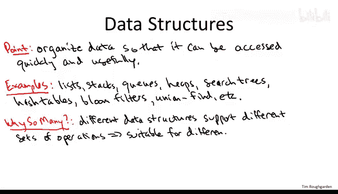
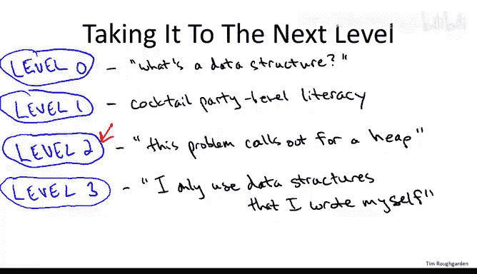

# 058：数据结构概述 📚

在本节课中，我们将学习数据结构的基本概念、重要性以及如何根据应用需求选择合适的数据结构。我们将探讨不同数据结构支持的操作，并理解为什么掌握这些知识对程序员至关重要。

## 数据结构的目的与重要性

数据结构的主要任务是**以能够快速且有效地访问数据的方式组织数据**。这是软件中几乎所有主要部分都会用到的核心技能。

以下是数据结构的一些常见例子：
*   **简单结构**：列表、栈、队列。
*   **复杂结构**：堆、搜索树、哈希表。
*   **其他相关结构**：布隆过滤器、并查集等。

## 为什么存在多种数据结构？🔍

上一节我们介绍了数据结构的基本目的，本节中我们来看看为什么会有如此多样的数据结构。原因在于，**不同的数据结构支持不同的操作集合，因此各自适合不同类型的任务**。

让我用一个具体的例子来提醒你，这个例子在我们讨论图搜索（特别是广度优先搜索和深度优先搜索）时出现过。

*   实现**广度优先搜索**时，正确的数据结构是**队列**。因为它支持从**后端**的快速（常数时间）插入和从**前端**的快速（常数时间）删除。
*   相比之下，**深度优先搜索**是一种具有不同需求的算法。由于其递归性质，**栈**更适合深度优先搜索。因为它支持从**前端**的常数时间删除和从**前端**的常数时间插入。

因此，栈的**后进先出**特性适合深度优先搜索，而队列的**先进先出**操作适合广度优先搜索。

## 选择合适的数据结构

因为不同的数据结构适合不同类型的任务，所以你应该了解基本数据结构的优缺点。一般来说，**一个数据结构支持的操作越少，其操作速度就越快，所需的空间开销也越小**。

因此，作为程序员，仔细思考应用程序的需求至关重要。你需要明确数据结构必须提供哪些操作，然后选择**正确的数据结构**——即支持你所需的所有操作，但理想情况下不包含多余操作的那个。

## 数据结构知识的四个层次 📊

以下是关于数据结构知识水平的四个层次划分：

*   **第0层：无知层**。处于此层的人从未听说过数据结构，也不知道组织数据可以产生本质上更好的软件（例如，本质上更快的算法）。
*   **第1层：鸡尾酒会认知层**。这里显然指的是最极客的鸡尾酒会。处于此层的人至少能就基本数据结构进行对话。他们听说过堆、二叉搜索树等概念，可能也知道一些基本操作，但在自己的程序中使用或在技术面试场景中会显得生疏。
*   **第2层：扎实掌握层**。处于此层的人对数据结构有扎实的了解。他们能自如地在自己的程序中作为客户端使用数据结构，并且很清楚哪种数据结构适合哪种类型的任务。
*   **第3层：硬核程序员/计算机科学家层**。处于此层的人不满足于仅仅作为数据结构的客户端在程序中使用它们，他们实际上理解这些数据结构的内部原理、如何编码以及如何实现，而不仅仅是如何使用。

## 本课程的教学重点 🎯

我猜测你们中很大一部分人最终会在自己的程序中使用数据结构。因此，学习不同数据结构的操作及其适用场景，将成为你们作为程序员的一项非常强大的技能。另一方面，我敢打赌，你们中很少有人需要从头开始实现自己的数据结构，而不是仅仅作为客户端使用各种标准编程库中已有的数据结构。

考虑到这一点，我的教学将重点放在将你们提升到**第2层**。我的讨论将聚焦于各种数据结构支持的操作和一些典型应用。希望通过这些内容，能培养你们对于何种数据结构适合何种任务的直觉。

如果时间允许，我也会为那些希望更上一层楼、想了解这些数据结构内部原理和典型实现方式的同学，提供一些可选材料。

## 总结

本节课中我们一起学习了数据结构的基本概念。我们了解到，数据结构的核心目的是高效组织数据，而多种数据结构的存在是为了满足不同任务对操作集合的不同需求。作为程序员，关键在于根据应用需求，选择支持必要操作且没有冗余的数据结构。本课程旨在帮助大家达到能够扎实掌握并正确应用常见数据结构的水平。