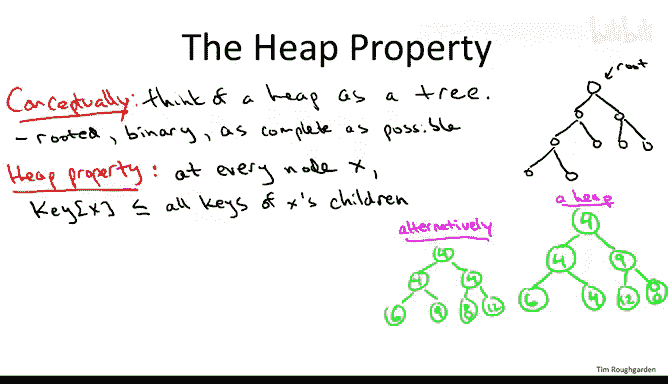
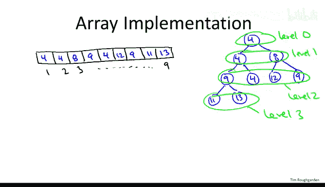
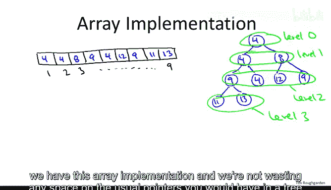
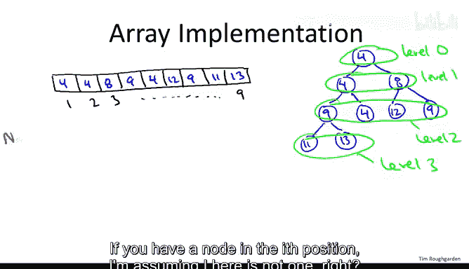
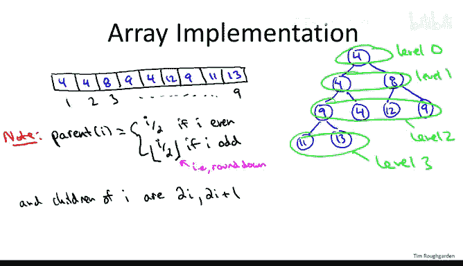
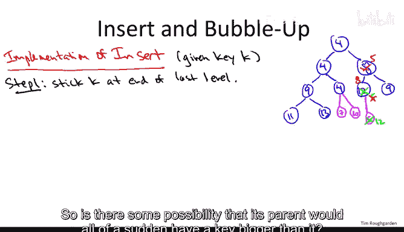
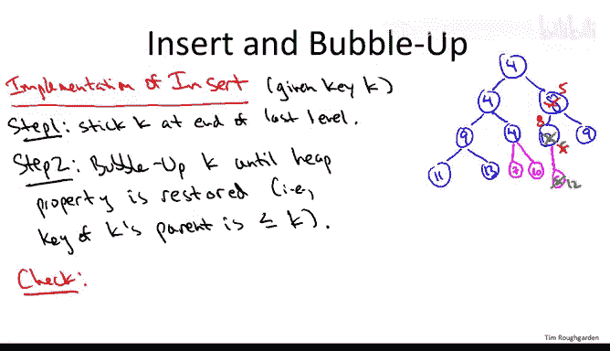
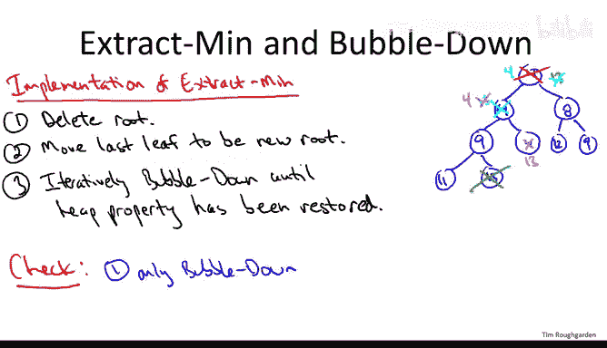

# 060：堆的实现细节-进阶选学 📚

在本节课中，我们将深入探讨堆（Heap）数据结构的实现细节。我们将学习如何从零开始编写一个堆，重点关注其核心操作——插入和提取最小值——的实现原理。通过理解堆的树形逻辑视图和底层数组实现，你将掌握构建高效堆结构的关键。

---

## 堆的概念回顾 🧠

堆是一种容器，用于存储对象。每个对象除了可能包含其他数据外，还必须有一个可比较的键（Key），例如社会保险号、网络边的权重或事件的时间戳等。

对于任何数据结构，首要的是记住它支持的操作及其时间复杂度。堆主要支持两个操作：
1.  **插入（Insert）**：向堆中插入一个对象，时间复杂度为 **O(log n)**，其中 n 是堆中对象的数量。
2.  **提取最小值（Extract Min）**：从堆中取出并返回具有最小键值的对象。如果存在多个具有相同最小键值的对象，堆将返回其中一个（具体是哪一个未指定）。该操作的时间复杂度也为 **O(log n)**。

堆还支持其他高级操作，如批量插入（线性时间）和从堆中间删除，但本课将聚焦于插入和提取最小值这两个核心操作的实现。

---

## 堆的两种视图：树与数组 🌳➡️📊

要理解堆的工作原理，必须同时掌握它的两种视图：逻辑上的树形结构和物理上的数组实现。

### 树形视图（逻辑结构）

在概念上，我们将堆视为一棵满足特定条件的二叉树：
*   **有根（Rooted）**：有一个根节点。
*   **二叉树（Binary）**：每个节点最多有两个子节点（0个、1个或2个）。
*   **完全（Complete）**：树的结构尽可能“满”。这意味着除了最底层，其他层都被完全填满，而最底层的节点从左到右依次填充。

下图展示了一个包含9个节点的“尽可能完全”的二叉树示例：

#### 堆属性（Heap Property）

堆属性规定了对象在树结构中的排列顺序：
> 对于树中的**每一个**节点 X（无论是根节点、叶节点还是内部节点），存储在 X 处的对象的键值必须**不大于**其所有子节点的键值。

节点 X 可能有 0个、1个 或 2个子节点。无论哪种情况，所有子节点的键值都应至少等于 X 的键值。

下图展示了一个包含7个节点、允许重复键值的堆示例：

堆属性虽然对对象排列施加了有用的结构，但**并未唯一确定**排列方式。同一组键值可以有不同的堆组织形式。关键在于，在任何堆中，**根节点必须具有最小的键值**。这正好符合我们快速提取最小值的需求。

---

### 数组视图（物理实现）

虽然我们在脑海中将堆组织成树形，但在实际编码中，我们并不真正使用指针来构建树。相反，堆通常被更高效地实现为一个数组。

让我们看看如何将上一节中的树自然地映射到数组表示。我们按层级顺序将节点放入数组。

以下是一个包含9个元素的堆及其数组表示：

**映射规则**：
1.  根节点（层级0）放入数组第一个位置（索引1）。
2.  接着放入层级1的所有节点。
3.  然后放入层级2的所有节点，依此类推。

你可能会好奇，我们如何在不使用指针的情况下，在树形结构和数组实现之间自由转换？秘诀在于，由于我们保持了二叉树的完全平衡，我们可以直接从数组索引计算出父子关系，而无需显式指针。

---

## 数组索引与树节点的关系 🔗

在数组实现中（假设索引从1开始），父子节点关系可以通过简单的算术运算确定：

*   **寻找父节点**：
    *   对于索引为 **i** 的节点（i > 1），其父节点的索引为 **`parent(i) = floor(i / 2)`**。
    *   例如，索引2和3的节点的父节点是索引1；索引4和5的节点的父节点是索引2。

*   **寻找子节点**：
    *   对于索引为 **i** 的节点，其左子节点的索引为 **`left_child(i) = 2 * i`**，右子节点的索引为 **`right_child(i) = 2 * i + 1`**。
    *   当然，如果计算出的索引超出了数组范围，则表示该子节点不存在（例如，叶节点）。

这种实现方式带来了显著优势：
1.  **存储高效**：无需为指针分配额外空间，所有对象直接存储在数组中。
2.  **计算快速**：通过简单的除以2或乘以2操作（甚至可以利用位运算加速）即可遍历树结构，比指针跳转更快。

在接下来的两节中，我们将基于这种数组实现，探讨如何以 **O(log n)** 的时间复杂度实现插入和提取最小值操作。

---

## 操作实现：插入（Insert）操作 ⬆️

我们将通过示例来说明插入操作的工作原理，而不提供具体的伪代码。相信通过讨论，你将能够自己编写出插入和提取最小值的代码。

假设我们有一个现有的堆（如下图中蓝色部分所示），现在需要插入一个键值为 K 的新对象。

**步骤 1：放置新元素**
为了维持树的完全平衡性，新元素**只能**被放置在最后一个位置，即成为最底层最右侧的新叶节点。在数组实现中，这对应于将新元素追加到数组末尾。这是一个常数时间操作。

**步骤 2：恢复堆属性（Bubble Up）**
放置新元素后，堆属性可能被破坏。我们需要通过一种称为 **“上浮”（Bubble Up）** 或“上滤”（Sift Up）的过程来修复。

*   **情况 A：幸运插入**。如果新键值 K（例如7或10）大于或等于其父节点的键值，那么堆属性依然保持，插入操作立即完成（仅需常数时间）。
*   **情况 B：需要修复**。如果新键值 K（例如5）**小于**其父节点的键值，则违反了堆属性。

修复过程是一个循环：
1.  将新节点与其父节点进行比较。
2.  如果新节点的键值更小，则交换它们的位置。
3.  交换后，以新节点（现在处于父节点的位置）为起点，重复步骤1和2，继续与其新的父节点比较。
4.  这个过程一直持续到以下两种情况之一发生：
    *   新节点的键值不再小于其父节点的键值。
    *   新节点已到达根节点（索引1）。

在我们的例子中，插入5后，它先与12交换，再与8交换，最后停在键值为4的根节点之下，因为 `5 > 4`，堆属性得以恢复。

**关键点验证**：
1.  **正确性**：上浮过程最终会停止，并确保堆属性在整个树中得到恢复。
2.  **时间复杂度**：由于堆是完全二叉树，其高度约为 **log₂(n)**。在最坏情况下，新元素可能需要从最底层一直上浮到根节点，每层进行常数次比较和交换。因此，插入操作的最坏情况时间复杂度为 **O(log n)**。

---

## 操作实现：提取最小值（Extract Min）操作 ⬇️

提取最小值操作负责从堆中移除具有最小键值的对象并将其返回。同样，我们通过示例和 **“下沉”（Bubble Down）** 过程来说明。

**步骤 1：移除根节点**
最小值保证在根节点。因此，我们首先移除根节点（例如下图中键值为4的节点）并将其返回给调用者。

**步骤 2：填充空缺**
移除根节点后，树结构出现空缺。为了维持树的完全平衡结构，我们选择**最后一个节点**（即数组的最后一个元素，图中键值为13的节点）来填充这个空缺。我们将其移动到根节点的位置。

**步骤 3：恢复堆属性（Bubble Down）**
将最后一个节点提升到根位置后，堆属性几乎必然被破坏（根节点的键值13大于其子节点）。我们需要通过 **“下沉”** 过程来修复。

下沉过程的决策比上浮稍复杂，因为一个节点有两个可能的子节点可以交换。

1.  从根节点开始，将其与它的两个子节点比较。
2.  如果当前节点的键值大于**任何一个**子节点，则它应该与**键值较小的那个子节点**交换。**（关键：必须与较小的子节点交换，否则无法修复堆属性）**
3.  交换后，当前节点下沉到子节点位置。
4.  以这个新位置为起点，重复步骤1-3，继续与其新的子节点比较。
5.  这个过程一直持续到以下两种情况之一发生：
    *   当前节点的键值不大于其任何子节点。
    *   当前节点已成为叶节点（没有子节点）。

在我们的例子中：
*   根节点13的子节点是4和8。较小的子节点是4。
*   **错误尝试**：如果与较大的子节点8交换，会引入新的违规（8 > 4），问题没有解决。
*   **正确操作**：与较小的子节点4交换。交换后，13位于之前4的位置，其子节点变为9和4（原12的位置）。堆属性在13和4之间仍然被破坏。
*   继续下沉：13与较小的子节点4交换。交换后，13到达叶节点位置，堆属性完全恢复。

**关键点验证**：
1.  **正确性**：下沉过程最终会停止（到达叶节点或找到正确位置），并确保堆属性在整个树中得到恢复。
2.  **时间复杂度**：与插入操作类似，在最坏情况下，节点可能需要从根节点一直下沉到叶节点。堆的高度为 **O(log n)**，每层进行常数次比较和交换。因此，提取最小值操作的时间复杂度也为 **O(log n)**。

---

## 总结 🎯

本节课我们一起深入学习了堆数据结构的实现细节：

1.  **双重视图**：我们理解了堆同时具备**逻辑上的树形结构**（完全二叉树）和**物理上的数组实现**。数组实现通过索引计算（`parent(i) = i/2`, `child(i) = 2*i, 2*i+1`）来模拟指针，实现了存储和计算的高效性。
2.  **核心操作原理**：
    *   **插入（Insert）**：将新元素放在数组末尾（树的最底层最右侧），然后通过 **“上浮”（Bubble Up）** 操作，不断与父节点比较并交换，直到恢复堆属性。
    *   **提取最小值（Extract Min）**：移除并返回根节点（最小值），将数组最后一个元素移到根位置，然后通过 **“下沉”（Bubble Down）** 操作，不断与较小的子节点比较并交换，直到恢复堆属性。
3.  **时间复杂度**：由于堆是完全二叉树，其高度为 **O(log n)**。插入和提取最小值操作在最坏情况下都只需遍历树的高度，因此它们的时间复杂度都是 **O(log n)**。

通过窥探堆的内部实现机制，希望你不仅加深了对这一重要数据结构的理解，也感受到了底层算法设计的巧妙与严谨。现在，你已经具备了从零开始实现一个高效堆数据结构的知识基础。