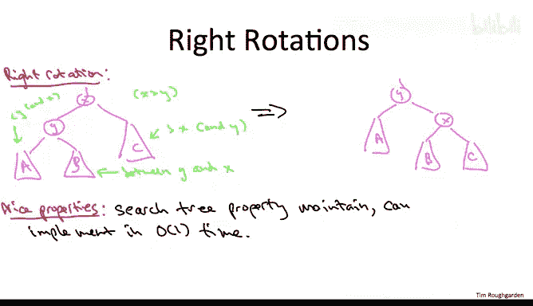

# 065：旋转操作进阶选学 🔄

在本节课中，我们将深入探讨平衡二叉搜索树实现中的核心操作——旋转。我们将了解旋转操作的基本原理、两种类型（左旋与右旋），以及它们如何在不破坏二叉搜索树性质的前提下，通过常数时间的指针重连实现局部平衡。

## 旋转操作概述

上一节我们介绍了平衡二叉搜索树的基本概念。本节中，我们来看看实现这些数据结构的一个关键基础操作：旋转。所有平衡二叉搜索树的实现，无论是红黑树、AVL树还是B树，都依赖于旋转操作来维持平衡。

旋转操作的目标非常明确：通过重连少数几个指针（即进行常数量的工作），在局部范围内重新平衡搜索树，同时确保不违反二叉搜索树的性质。

## 旋转的两种类型

旋转操作分为两种：左旋转和右旋转。执行旋转时，总是针对搜索树中的一对父子节点进行操作。

*   如果子节点是父节点的**右孩子**，则使用**左旋转**。
*   如果子节点是父节点的**左孩子**，则使用**右旋转**。右旋转在某种意义上可以看作是左旋转的逆操作。

## 左旋转详解

让我们通过一个具体场景来理解左旋转。假设在搜索树中有一个节点 **X**，它有一个右孩子 **Y**。

在这个结构中：
*   **X** 可能有一个父节点 **P**。
*   **X** 有一个左子树，我们称之为 **A**（可能为空）。
*   **Y** 有两个子树：左子树 **B** 和右子树 **C**。

为了理解旋转如何保持搜索树性质，我们需要明确图中各元素的大小关系：
1.  **Y** 是 **X** 的右孩子，所以 **Y > X**。
2.  子树 **A** 中的所有键值都小于 **X**。
3.  子树 **C** 中的所有键值都大于 **Y**。
4.  子树 **B** 中的所有键值严格介于 **X** 和 **Y** 之间（即 **X < B < Y**）。

左旋转的根本目的是**反转节点 X 和 Y 的父子关系**。目前，X 是父节点，Y 是子节点。我们希望重连指针，使得 Y 成为新的父节点，而 X 成为其子节点。

为了实现这个目标，几乎只有一种方式能将所有部分重新组装起来：
1.  **处理父子关系**：由于 **X < Y**，当 X 成为 Y 的孩子时，它必须是**左孩子**。Y 将继承 X 原来的父节点 **P**。
2.  **重新分配子树**：
    *   子树 **A**（所有值小于 X 和 Y）自然地成为 **X 的左孩子**（保持不变）。
    *   子树 **C**（所有值大于 X 和 Y）自然地成为 **Y 的右孩子**（保持不变）。
    *   子树 **B**（所有值介于 X 和 Y 之间）需要被放置到唯一剩余的空位：**X 的右孩子**。这完美地保持了搜索树的性质，因为 B 中的节点既在 X 的右子树中（大于 X），也在 Y 的左子树中（小于 Y）。

通过以上步骤，我们仅通过重连常数个指针，就完成了结构的转换。

## 右旋转：左旋转的逆操作

如果你理解了左旋转，那么理解右旋转就很简单了。右旋转是左旋转的逆操作。

当面对一对父子节点，其中子节点是父节点的**左孩子**时，如果你想反转它们的父子关系（使旧的子节点成为新的父节点，旧的父节点成为新的子节点），就需要使用右旋转。

同样，给定这个目标，也只有一种独特的方式来重新组装图中的各个部分（父节点、子节点及其三个相关子树），以实现目标，使 **Y** 成为 **X** 的父节点。其原理与左旋转完全对称。

## 旋转操作的优良特性

以下是旋转操作值得称道的特性：
*   **常数时间复杂度**：旋转操作只涉及重连固定数量的指针，因此可以在 **O(1)** 时间内完成。
*   **保持搜索树性质**：正如我们详细讨论的，旋转操作精心设计了指针的重连方式，确保了二叉搜索树的性质（左子树所有节点小于根节点，右子树所有节点大于根节点）在操作后依然成立。

正是这些优良特性，使得旋转操作成为所有平衡搜索树实现中无处不在的基础原语。

## 总结与后续

本节课中，我们一起学习了平衡二叉搜索树的核心操作——旋转。我们详细探讨了左旋转和右旋转的原理，并了解了它们如何通过常数时间的指针操作来局部调整树结构，同时保持搜索树的性质。

当然，这还不是平衡搜索树实现的全貌。一个完整的实现还需要精确规定**何时**以及**如何**部署这些旋转操作。在接下来的视频中，你将对此有一个初步的了解。但如果你希望更深入地理解，我再次鼓励你去查阅全面的数据结构教科书、浏览网络上丰富的平衡搜索树演示资料，或者研究这些数据结构的开源实现代码。