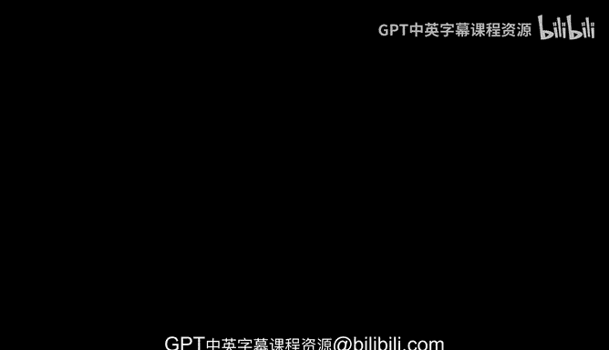
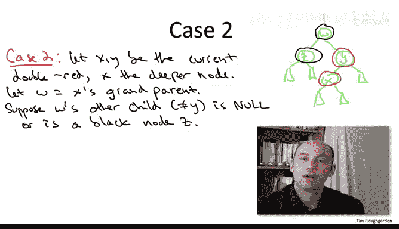

# 066：红黑树插入操作详解 🧠

在本节课中，我们将深入探讨红黑树数据结构中插入操作的实现细节。红黑树通过维护四个不变性来保证其对数高度，从而支持对数时间复杂度的操作。插入操作可能会破坏这些不变性，因此我们需要通过重新着色和旋转来修复它们。本节将重点介绍插入操作的核心思想和关键步骤，确保初学者能够理解并掌握这一重要概念。

---

## 红黑树不变性回顾

上一节我们介绍了红黑树的基本概念和旋转操作，本节中我们来看看插入操作如何维护这些不变性。红黑树必须满足以下四个不变性：

1.  每个节点要么是红色，要么是黑色。
2.  根节点必须是黑色。
3.  红色节点不能有红色的子节点（即不能出现连续的红色节点）。
4.  从根节点到任意空指针的每条路径上，黑色节点的数量必须相同。

其中，第三和第四个不变性共同确保了红黑树的高度始终是对数级别的。

---

## 插入操作的基本思路

插入操作的基本策略是：首先像普通二叉搜索树一样插入新节点，然后检查并修复可能被破坏的不变性。我们有两种修复工具：**重新着色**和**旋转**。

以下是插入操作的基本流程：

1.  按照二叉搜索树的规则插入新节点 `X`，使其成为一个叶子节点。
2.  将新节点 `X` 暂时着为**红色**。
3.  如果 `X` 的父节点 `Y` 是黑色，则插入完成，所有不变性均满足。
4.  如果 `X` 的父节点 `Y` 是红色，则违反了不变性3，出现“双红”问题，需要进一步处理。

---

## 处理“双红”问题：情况1

当新节点 `X` 和其父节点 `Y` 都是红色时，我们进入“双红”处理流程。情况1处理的是当 `X` 的叔父节点 `Z`（即 `Y` 的兄弟节点）存在且为红色的情形。

以下是情况1的处理步骤：

1.  将父节点 `Y` 和叔父节点 `Z` 重新着为**黑色**。
2.  将祖父节点 `W` 重新着为**红色**。
3.  此时，`X` 和 `Y` 之间的“双红”问题被消除。
4.  但是，将 `W` 变为红色后，可能会在 `W` 与其父节点之间产生新的“双红”问题。
5.  将 `W` 视为新的“红色节点”，递归向上检查并处理，直到不再出现“双红”或到达根节点。

如果递归过程中将根节点染成了红色，只需最后将其重新着为黑色即可。这不会破坏不变性4，因为根节点出现在所有路径上。

---

## 处理“双红”问题：情况2

情况2处理的是当 `X` 的叔父节点 `Z` 不存在或为黑色的情形。这种情况可以通过常数次数的重新着色和旋转来彻底修复所有不变性。

以下是情况2的核心思路：

1.  通过一次或两次旋转（左旋或右旋）来调整树的结构。
2.  配合一次或多次重新着色，确保消除“双红”问题。
3.  经过这些操作后，所有四个不变性都将得到恢复，且树的高度保持平衡。

由于具体旋转和着色步骤取决于 `X`、`Y`、`W` 之间的相对位置关系（例如，`X` 是 `Y` 的左孩子还是右孩子），这里不展开所有子情况。关键在于知道，通过 `O(1)` 次操作即可完成修复。

---

## 插入操作总结

本节课中我们一起学习了红黑树插入操作的完整流程。让我们总结一下关键步骤：

1.  **标准插入**：将新节点 `X` 作为红色叶子节点插入。
2.  **检查父节点**：若父节点为黑，则完成。
3.  **处理双红**：若父节点为红，则根据叔父节点的颜色进入不同情况。
    *   **情况1（叔父为红）**：重新着色并将问题向上传播。
    *   **情况2（叔父为黑或不存在）**：通过常数次旋转和重新着色彻底修复。
4.  **保证复杂度**：整个插入过程最多进行 `O(log n)` 次向上传播（情况1），因此总时间复杂度为 `O(log n)`。

通过这种方法，红黑树在每次插入后都能高效地恢复平衡，维持其强大的性能保证。