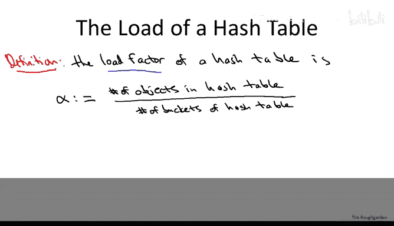
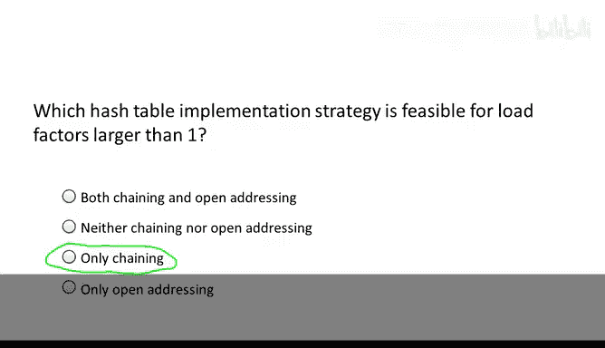
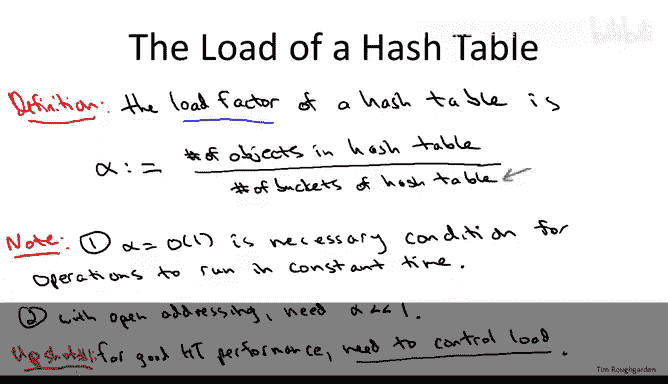
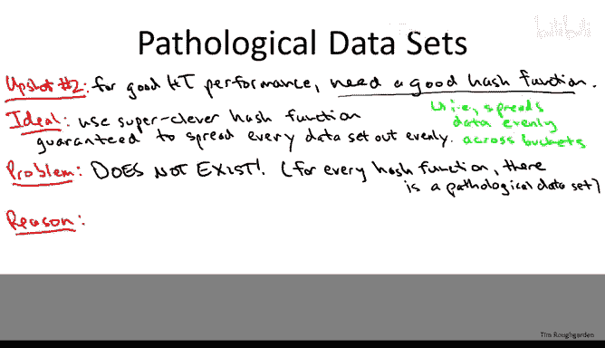
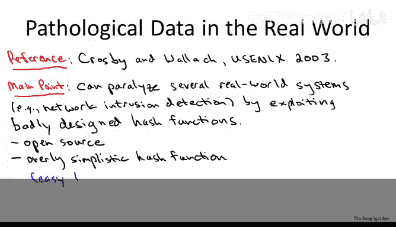
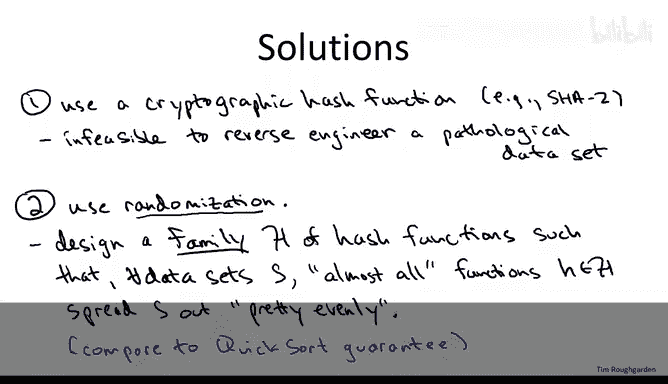
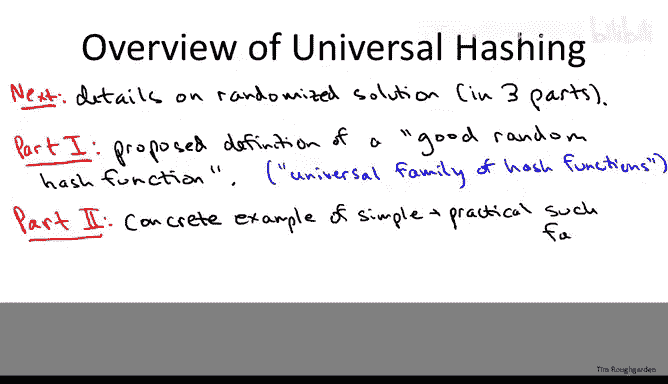

# 070：病态数据集与全域哈希动机

在本节课中，我们将深入探讨哈希表，理解其表现出优异性能（实际上是常数时间性能）的条件。本视频的核心要点是解释一个概念：**每一个哈希函数都有其自身的“氪石”——一个能使其性能急剧下降的病态数据集**。这将为后续视频中需要谨慎处理的数学问题提供动机。

## 哈希表快速回顾

哈希表的根本目的是实现极快的查找，理想情况下是常数时间查找。当然，为了有东西可查，必须允许插入操作，所以所有哈希表都支持这两种操作。有时哈希表也允许删除元素，这取决于底层的具体实现。在使用链地址法（每个桶一个链表）时，删除操作很容易实现；而在开放寻址法中，删除可能比较复杂，有时甚至会被忽略。

当我们最初讨论哈希表时，我鼓励你像看待数组一样从逻辑上思考它。区别在于，哈希表不是通过数组位置索引，而是通过存储的键来索引。就像数组通过随机访问支持常数时间查找一样，哈希表也是如此。

然而，哈希表有一些“细则”。首先，哈希表必须被正确实现。这意味着两件事：一是桶的数量应与存储的元素数量相匹配（我们稍后会详细讨论）；二是必须使用一个足够好的哈希函数。我们在之前的视频中讨论过糟糕哈希函数的危害，在接下来的视频中，我们将对哈希函数提出更严格的要求。第二个“细则”是，你最好没有遇到病态数据。在某种意义上，每个哈希表都有其“氪石”，即一个会使其性能变得相当糟糕的病态数据集。

## 冲突处理方法

在关于实现细节的视频中，我们也讨论了哈希表如何不可避免地处理冲突。在哈希表填满之前很久，你就会开始遇到冲突。因此，你需要某种方法来处理映射到同一个桶的两个不同键。以下是两种流行的方法：

*   **链地址法**：这是一个非常自然的想法，你只需将所有哈希到同一个桶的元素都保存在该桶中。你通过一个链表来跟踪它们。例如，在第17号桶中，你会找到所有哈希到桶17的元素。
*   **开放寻址法**：这种方法要求每个桶只存储一个键。如果两个元素都映射到桶17，你必须为其中一个找到另一个位置。处理方式是，你要求哈希函数不仅提供一个桶，而是提供一个完整的探测序列。如果你尝试插入桶17但17已被占用，你就转到探测序列中的下一个桶尝试插入，如果再次失败，就转到第三个桶，依此类推。我们简要提过两种指定探测序列的方法：一种是**线性探测**（失败后尝试18、19、20...直到找到空桶）；另一种是**双重哈希**（使用两个哈希函数的组合，第一个指定初始探测桶，第二个指定后续每次探测的偏移量）。

在本课程中，我们通常会更多地讨论链地址法，这并不意味着它更重要，而是因为链地址法在数学上更容易分析，我们可以给出完整的证明。而开放寻址法的完整证明超出了本课程的范围。

## 负载因子

有一个非常重要的参数在决定哈希表性能方面起着重要作用，那就是**负载因子**，通常用 α 表示。

**公式：α = (已插入且未删除的元素数量) / (哈希表中的桶数量)**

正如你所料，向哈希表中插入的元素越多，负载因子就越大。保持元素数量不变而增加桶的数量，负载因子就会减小。

为了确保负载因子的概念清晰，并且你清楚不同的冲突解决策略，下一个测验将询问关于链地址法和开放寻址法哈希表中相关 α 值的范围。

---

**测验：对于使用链地址法和开放寻址法实现的哈希表，以下关于负载因子 α 的陈述哪一项是正确的？**

1.  α > 1 对两者都有意义。
2.  α > 1 对两者都没有意义。
3.  α > 1 对链地址法有意义，但对开放寻址法没有意义。
4.  α > 1 对开放寻址法有意义，但对链地址法没有意义。

---

正确答案是第三个选项：**负载因子大于1对链地址法有意义，但对开放寻址法没有意义**。原因很简单：在开放寻址法中，每个桶只能存储一个对象。一旦对象数量超过桶的数量，就没有地方放置剩余的对象，哈希表会在负载因子大于1时崩溃。另一方面，在链地址法中，负载因子大于1没有明显问题。例如，负载因子等于2意味着你向一个有1000个桶的哈希表中插入了2000个对象，理想情况下每个桶的链表里只有两个对象。

## 良好性能的必要条件

现在，让我们做一个简单但非常重要的观察，这是哈希表获得良好性能的必要条件。这涉及到第一个“细则”：如果你期望获得良好性能，就必须正确实现哈希表。

**要点：只有保持负载因子为常数，你才能获得常数时间的查找。**

对于开放寻址法的哈希表，这一点非常明显，因为你需要 α 不仅为 O(1)，而且必须小于1（小于100%），否则哈希表甚至没有空间存放所有项目。即使对于使用链地址法实现的哈希表（负载因子大于1至少是有意义的），如果你想要常数时间的操作，也必须保持负载因子不要比1大太多。例如，如果你有一个有 n 个桶的哈希表，并哈希了 n log n 个对象，那么每个桶的平均对象数将是对数级的。记住，当你进行查找时，在哈希到桶之后，你必须遍历该桶中的链表进行穷举搜索。因此，如果你有 n log n 个对象和 n 个桶，你预期的查找时间更像是 O(log n)，而不是常数时间。

对于开放寻址法，我们不仅需要 α = O(1)，而且需要 α < 1。实际上，α 最好远低于1，你不希望开放寻址哈希表的负载接近90%或类似的值。

我希望这一页的要点是清晰的：如果你想要良好的哈希表性能，你需要负责的事情之一就是控制负载因子。对于链地址法，保持它最多是一个小常数；对于开放寻址法，保持它远低于100%。

你可能会想，如何控制负载因子？毕竟，你编写这个哈希表时，并不知道客户端会用它做什么，他们可以随意插入或删除。你能控制的是桶的数量，即 α 的分母。实际的哈希表实现会跟踪哈希表中存储的元素数量（分子）。随着分子增长，实现会确保分母以相同的速率增长，即增加桶的数量。如果 α 超过了某个目标值（比如0.75或0.5），你可以将桶的数量翻倍。定义一个新的哈希表，使用一个范围加倍的新哈希函数，这样分母加倍，负载因子就下降了一半。这就是控制它的方法。如果空间非常宝贵，你也可以在发生大量删除时（例如在链地址法中）缩小哈希表。

## 每个哈希函数都有其“氪石”

上一节我们讨论了为了获得期望的哈希表性能保证，必须在底层正确控制负载因子。接下来，我们必须做对的第二件事是使用足够好的哈希函数。一个好的哈希函数能将数据均匀地分散到各个桶中。最理想的情况是，一个哈希函数能独立于数据而表现良好——这也是本课程迄今为止的主题：无论输入是什么，算法都能保证（例如）运行得非常快。你可能会期望从这样的课程中学到“秘密的”总能表现良好的哈希函数。

不幸的是，这样的哈希函数并不存在。**对于每一个哈希函数，它都有自己的“氪石”——一个病态数据集，会使其性能变得和你见过的最糟糕的常数哈希函数一样差。**

原因很简单，这是哈希函数从巨大的宇宙（键空间）压缩到相对较少数量的桶这一过程的必然结果。让我详细说明。

**固定任何一个你能想象到的最聪明的哈希函数 h**。这个哈希函数将某个宇宙 U 映射到索引为 0 到 n-1 的桶。在所有有趣的情况下，宇宙的大小是巨大的，U 的基数远大于 n。

根据鸽巢原理的变体，**至少有一个桶必须包含至少宇宙中 1/n 比例的键**。也就是说，存在一个桶 i (0 ≤ i ≤ n-1)，使得至少有 |U|/n 个键在哈希函数 h 下被映射到 i。

理解这一点的方法是记住哈希函数的映射图景：原则上，宇宙中的每个键都被映射到这些桶中的一个。哈希函数必须把每个键放到 n 个桶中的某一个里，所以其中一个桶必须至少包含所有可能键的 1/n。一个更具体的思考方式是：想象一个用链地址法实现的哈希表，并在脑海中想象你将宇宙中的每一个键都哈希进这个表。这个表会极度拥挤（你永远无法在计算机上存储它，因为它包含了 U 的全部元素），但它只有 n 个桶，所以其中一个桶必须至少包含总元素数的 1/n。

这里的要点是：**无论哈希函数是什么，无论你把它设计得多聪明，总会存在某个桶（比如31号桶），它获得了至少其“公平份额”（宇宙的 1/n）的映射**。现在，要构造我们的病态数据集，我们只需从这些映射到31号桶的元素中挑选。我们可以让这个数据集尽可能大，因为 |U|/n 是难以想象的大（因为 U 本身难以想象的大）。

对于这样的数据集，**所有元素都会发生冲突**，哈希函数将每个元素都映射到31号桶。这将导致糟糕的哈希表性能，与朴素的链表解决方案没有区别。例如，在链地址法中，31号桶里会有一个包含所有已插入元素的链表。对于开放寻址法，可能稍微复杂一些，但如果所有元素都冲突，你最终基本上也会得到线性时间的性能，与常数时间性能相去甚远。

对于那些认为这似乎只是无意义的抽象数学的人，我想指出两点：
1.  至少，这些病态数据集表明，我们将不得不以不同于以往讨论算法的方式来讨论哈希函数。当我们讨论归并排序时，我们说它无论输入是什么都在 O(n log n) 时间内运行。对于哈希函数，我们将无法说哈希表无论输入是什么都有良好的性能，本页幻灯片证明了这是错误的。
2.  虽然这些病态数据集不太可能随机出现，但有时你会担心有人为你的哈希函数构造病态数据，例如在拒绝服务攻击中。

Crosby 和 Wallach 在2003年的一篇研究论文中给出了一个非常聪明的例证。他们的主要观点是，存在许多现实世界的系统（他们最有趣的应用是一个网络入侵检测系统），你可以通过利用设计不良的哈希函数使其瘫痪。这些系统都关键性地使用了哈希表，其可行性完全依赖于从哈希表获得常数时间性能。如果你能为这些哈希表展示一个病态数据集，使其性能退化到线性（即退化为简单的链表解决方案），这些系统就会被破坏。Crosby 和 Wallach 研究的系统通常表现出两个特性：一是它们是开源的，你可以检查代码看到它们使用的哈希函数；二是哈希函数通常非常简单，主要是为速度而设计，因此很容易通过检查代码逆向工程出一个真正破坏哈希表（使其性能退化为线性）的数据集。

## 解决方案：随机化与全域哈希族

那么，我们该如何应对“每个哈希函数都有病态数据集”这一事实呢？这个问题既有实际意义（如果我们担心有人构造病态数据集进行拒绝服务攻击，应该使用什么哈希函数？），也有数学意义（如果我们不能给出像之前那样的数据无关保证，如何从数学上说明哈希函数具有良好的性能？）。

让我提出两种解决方案。

第一种方案更侧重于实际层面，即如果你担心有人构造病态数据集，应该实现什么样的哈希函数。答案是使用**加密哈希函数**，例如 SHA-2（一个针对不同桶数的哈希函数族）。这些内容超出了本课程的范围，你会在密码学课程中学到更多。我想指出的一点是，像 SHA-2 这样的加密哈希函数本身也有其病态数据（它们自己的“氪石”）。它们在实践中表现良好的原因是，**找出这个病态数据集是不可行的**。与 Crosby 和 Wallach 在应用程序源代码中找到的、易于逆向工程出坏数据集的简单哈希函数不同，对于 SHA-2 这样的函数，没人知道如何逆向工程出坏数据集。这里的“不可行”是密码学意义上的，类似于说如果正确实现 RSA 加密，破解它是不可行的，或者分解大数在一般情况下是不可行的。

我想提到的第二种解决方案是使用**随机化**，这在实际应用和数学分析上都是合理的。具体来说，我们不会设计一个单一的聪明哈希函数（因为我们已经知道单一的哈希函数必然有病态数据集），而是设计一个非常聪明的**哈希函数族**，然后在运行时随机选择其中一个函数使用。

现在，我们希望（并且能够）为哈希函数族证明的保证，其精神非常类似于快速排序。回想一下，在快速排序算法中，对于几乎任何固定的枢轴选择序列，都存在一个病态输入会使快速排序退化为 O(n²) 运行时间。我们的解决方案是随机化快速排序：不是在运行时预先承诺任何特定的选择枢轴方法，而是随机选择枢轴。我们证明了关于快速排序的什么？我们证明了对于任何可能的输入数组，快速排序的**平均**运行时间是 O(n log n)，其中平均是对快速排序运行时随机选择求取的。

在这里，我们将做同样的事情。我们现在可以说：**对于任何数据集，平均而言（关于我们运行时选择的哈希函数），哈希函数将表现良好，即它会将数据均匀地分散开**。我们颠倒了上一节幻灯片中的量词顺序。上一节说：如果我们预先承诺一个单一的哈希函数（固定一个 h），那么就存在一个能破坏该函数的数据集。这里我们把它颠倒过来：**对于每个固定的数据集，随机选择的哈希函数平均而言将在该数据集上表现良好**，就像在快速排序中一样。

请注意，这并不意味着我们不能让程序开源。我们仍然可以发布代码，说明“这是我们的哈希函数族，代码中将从这个集合中随机选择一个哈希函数”。关键在于，通过检查代码，你无法知道算法在运行时做出了什么随机选择，因此你对实际的哈希函数一无所知，也就无法为运行时选择的哈希函数逆向工程出病态数据集。

接下来的几个视频将详细阐述这第二种解决方案：使用运行时随机选择的哈希函数，作为一种在每一个数据集上（至少平均而言）都能表现良好的方法。

## 路线图

让我简要介绍一下接下来的内容。我将把关于这种随机化解决方案细节的讨论分为三个部分，分布在两个视频中。

在下一个视频中，我们将从定义开始：**什么是我所说的“哈希函数族”，使得随机选择一个时，你很可能会做得很好？** 这个定义被称为**全域哈希函数族**。

一个数学定义本身几乎没有价值。为了有价值，它必须满足两个属性：
1.  必须存在有趣且有用的例子满足该定义。也就是说，必须存在有用的、满足这个全域族定义的哈希函数。因此，第二部分将向你展示它们确实存在。
2.  数学定义需要有应用价值。也就是说，如果你能满足定义，那么好事就会发生。这将是第三部分。

---

本节课中，我们一起学习了哈希表获得良好性能的两个关键前提：控制负载因子，以及认识到单一哈希函数必然存在病态数据集。我们探讨了使用加密哈希函数或随机化（从精心设计的哈希函数族中随机选择）作为应对病态数据集的实用方案，并引出了“全域哈希”这一核心数学概念，为下一节课的深入分析奠定了基础。