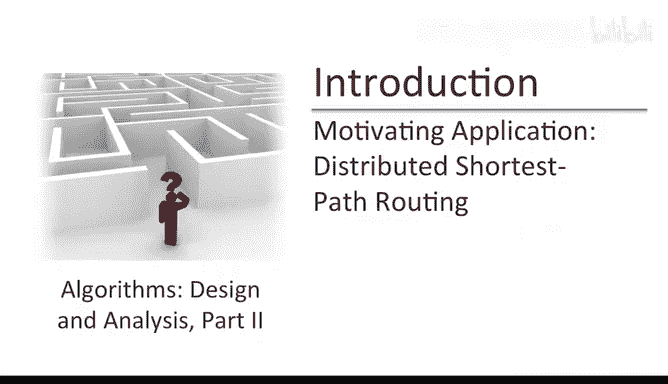
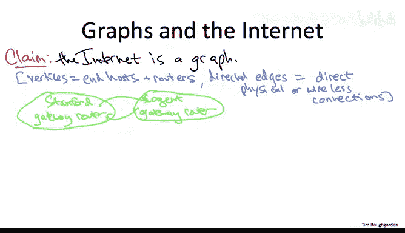
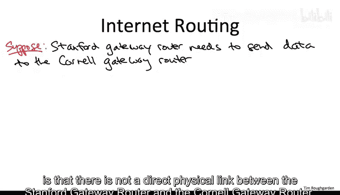
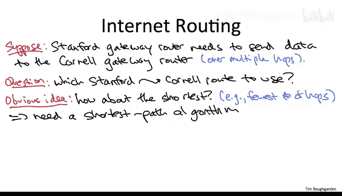

# 076：概述与互联网路由应用 🚀

在本课程中，我们将学习算法设计与分析的核心原理及其在解决具体问题中的应用。我们将探讨多种通用设计范式，并通过实例展示这些技术如何应用于实际问题。课程将涵盖分治、图搜索、贪心算法、动态规划等主题，并深入分析其在各类计算问题中的具体实现。

---

## 算法设计的核心：原理与实例的交互

算法设计与分析是通用原理与解决具体问题的实例化之间的交互。虽然没有万能钥匙或单一技术能解决所有计算问题，但存在一些经过数十年验证的通用设计原则，这些原则在不同应用领域中反复证明有效。本课程将重点探讨这些原则。

例如，在第一部分中，我们将学习分治算法设计范式和图搜索原理等。另一方面，我们将研究这些技术的具体实例。在第一部分中，我们将探讨分治技术及其在斯特拉森矩阵乘法、归并排序和快速排序中的应用。在图搜索部分，我们将以著名的迪杰斯特拉最短路径算法作为高潮。

学习这些内容不仅因为作为计算机科学家或程序员，我们需要了解这些算法的功能，还因为它们为我们提供了一个工具箱，一套可自由使用的基本构件，我们可以将其作为构建块应用于自己的计算问题中。

课程的第二部分将继续这一叙述，我们将学习非常通用的算法设计范式，如贪心算法和动态编程算法，以及许多应用，包括一些经典算法。在本视频及下一个视频中，我想通过挑选两个我们将在课程后期详细研究的应用来激发大家的兴趣，具体是在课程的动态编程部分。

首先，对于这两个问题，我认为它们的重要性不言而喻。其次，这些都是相当棘手的计算问题，我预计你们大多数人目前并不知道解决这些问题的好算法，设计一个算法将具有挑战性。第三，到本课程结束时，你们将掌握解决这两个问题的高效算法。事实上，你们将学到更好的东西：掌握通用的算法设计技术，这些技术是解决这两个问题的特例，并有可能解决你们自己项目中遇到的问题。

在开始这两个视频之前，有一个说明：它们的讲解层次比课程大部分内容更高，这意味着不会有任何方程或数学推导，不会有具体的伪代码，并且我会略过许多细节。重点只是传达我们将要学习的精神，并说明我们将要学习的技术应用范围。

---

## 互联网路由：作为图的最短路径问题 🌐

首先，我想讨论的是分布式最短路径路由，以及它为何是互联网运作的基础。

让我从一个非常非数学的断言开始：我们可以将互联网有效地视为一个图，即顶点和边的集合。这个说法显然有歧义，正如我们将讨论的，它可能意味着许多事情，但在这个特定视频中，我希望你们主要理解以下解释。

具体来说，顶点我指的是互联网的终端主机和路由器，即生成流量的机器、消费流量的机器以及帮助流量从一处传输到另一处的机器。边将是有向的，旨在表示物理或无线连接，表明一台机器可以通过两者之间的物理链路或直接无线连接直接与另一台机器通信。通常，你会看到双向边，这样如果机器A可以直接与机器B通信，那么机器B也可以直接与机器A通信，但你肯定希望允许非对称通信的可能性。

例如，想象我从我的斯坦福账户发送一封电子邮件给我在康奈尔大学读研究生时的一位老导师。那么，这封邮件数据必须从我在斯坦福的本地机器迁移到我在康奈尔的导师的机器上。这是如何发生的呢？最初，有一个本地传输阶段。这些数据必须从我的本地机器到达斯坦福网络内一个可以与外界通信的地方，就像如果我想去康奈尔旅行，我必须先使用本地交通工具到达旧金山机场，只有从那里我才能乘坐飞机。这个数据可以从斯坦福网络逃逸到外部世界的机器被称为网关路由器。

斯坦福的网关路由器将其传递给一个负责横跨国家的网络。据我所知，斯坦福的商业互联网服务提供商是Cogent。当然，他们有自己的网关路由器，可以与斯坦福的网关路由器通信，反之亦然。当然，这两个节点及其之间的边只是嵌入在这个由互联网所有终端主机和路由器组成的大规模图中的极小一部分。这就是本视频中我们将要讨论的图的主要版本，但让我暂停一下，提几个与互联网相关且本身也很有趣的其他图。

一个引起了极大兴趣和研究的图是由网络诱导的图。在这里，顶点将代表网页，边（肯定是有向的）代表一个网页指向另一个网页的超链接。例如，我的主页是这个庞大图中的节点。正如你可能期望的，从我的主页到这个课程页面有一个链接。当然，使用有向边来忠实地建模网络是至关重要的。例如，这个课程的主页到我在斯坦福的个人主页没有有向边。

网络在90年代中期到后期真正爆发，因此在过去的15年多里，关于网络图的研究很多。我相信你不会惊讶地听到，在上个十年中期左右，人们对社交网络的特性变得非常兴奋。这些当然也可以被富有成效地视为图。这里的顶点将是人，链接将表示关系，例如Facebook上的好友关系或Twitter上的关注关系。注意，不同的社交网络可能对应于无向图或有向图，例如，Facebook对应于无向图，Twitter对应于有向图。

---

## 路由挑战与算法需求 🛣️

现在让我们回到我想关注的第一个解释，即顶点是终端主机和路由器，边仅代表直接的物理或无线连接，表明两台机器可以直接相互通信。回到那个图，让我们回到我发送电子邮件给康奈尔某人的故事，这些数据必须以某种方式从我的本地机器传输到康奈尔的某个本地机器。

具体来说，这些数据必须从斯坦福网关路由器（实际上是斯坦福网络的“机场”）到达康奈尔网关路由器（康奈尔一侧的“降落机场”）。现在，要准确弄清楚斯坦福和康奈尔之间路由的结构并不容易，但我可以向你保证的一件事是，斯坦福网关路由器和康奈尔网关路由器之间没有直接的物理链路。两者之间的任何路由都将包含多个跳数，会有中间站点。而且这样的路由不会是唯一的。如果你可以选择一条经过休斯顿、亚特兰大和华盛顿特区的路线，你如何将其与一条经过盐湖城和芝加哥的路线进行比较？希望你的第一直觉是一个完美的想法：在其他条件相同的情况下，偏好某种意义上“最短”的路径。

在这个上下文中，“最短”可能意味着很多事情，思考不同的定义很有趣，但为简单起见，让我们只关注最少的跳数，即最少的中间站点数。如果我们想实际执行这个想法，我们显然需要一个算法，给定源和目的地，计算两者之间的最短路径。

希望你觉得有能力讨论这个问题，因为本课程第一部分的亮点之一就是讨论了迪杰斯特拉最短路径算法，以及使用堆实现的几乎线性时间的极快实现。我们在讨论迪杰斯特拉算法时确实提到了一个注意事项，即它要求所有边权非负，但在互联网路由的背景下，你能想象的几乎任何边度量都会满足这个非负性假设。

然而，尝试直接应用迪杰斯特拉最短路径算法来解决这个分布式互联网路由问题存在一个严重问题，这个问题是由现代互联网的巨大分布式规模引起的。可能在20世纪60年代，当你有12个节点的ARPANET时，你可以勉强运行迪杰斯特拉最短路径算法，但在21世纪，斯坦福网关路由器不可能在本地维护整个互联网图的合理准确模型。

我们如何规避这个问题？是否因为互联网如此庞大，运行任何最短路径算法都是根本不可能的？希望在于，如果我们能有一个允许分布式实现的最短路径算法，其中节点可以仅与其邻居（与其直接连接的机器）进行交互（可能是迭代式的），但又能以某种方式收敛到拥有到所有目的地的准确最短路径？

也许你尝试的第一件事是寻找迪杰斯特拉算法的一种实现，其中每个顶点只使用本地计算。如果你看迪杰斯特拉的伪代码，这似乎很难做到，它看起来不像一个可本地化的算法。因此，我们将学习一种不同的最短路径算法。它也是一个经典算法，绝对是经典汇编中的一员。它叫做贝尔曼-福特算法。正如你将看到的，贝尔曼-福特算法可以被视为一种动态编程算法，并且它确实仅使用本地计算就能正确计算最短路径。每个顶点仅在与它直接连接的其他顶点之间进行轮次通信。此外，我们将看到这个算法也能处理负边权，而迪杰斯特拉算法则不能。但不要认为迪杰斯特拉算法过时了，在可以进行集中式计算的情况下，它仍然具有更快的运行时间。

这里真正令人惊叹的是，贝尔曼-福特算法可以追溯到20世纪50年代，那不仅是互联网之前，甚至是ARPANET之前，互联网在任何人眼中都还没有一丝曙光。然而，它确实是现代互联网路由协议的基础。不用说，将贝尔曼-福特的概念转化为在非常复杂的现代互联网中实际进行路由，需要大量艰苦的工程工作和进一步的想法，但这些协议的基础都可以追溯到贝尔曼-福特算法。

---

## 总结 📚

本节课中，我们一起学习了算法设计是通用原理与具体问题实例化之间的交互。我们探讨了将互联网建模为图的概念，并理解了在互联网这种大规模分布式系统中进行路由时面临的挑战。我们认识到，虽然迪杰斯特拉算法是经典的最短路径算法，但其集中式特性使其难以直接应用于互联网路由。因此，我们引入了贝尔曼-福特算法作为解决方案，它通过分布式和迭代式的本地计算，能够有效地在像互联网这样的图中计算最短路径，这为其成为现代路由协议（如BGP）的核心思想奠定了基础。这展示了算法设计原理如何适应并解决现实世界中的大规模工程问题。