# 078：贪心算法导论 🎯

在本节课中，我们将要学习一种新的算法设计范式——贪心算法。我们会先回顾已学过的算法设计范式，然后介绍贪心算法的基本概念、特点，并讨论其正确性证明的常见方法。

---

## 算法设计范式回顾

在算法设计中，没有适用于所有计算问题的“万能钥匙”。因此，本课程的重点是讨论那些能应用于多种不同问题和领域的通用技术，即算法设计范式。

以下是几个我们已经接触过的算法设计范式：

*   **分治算法**：典型例子是归并排序。其步骤是：将问题分解为更小的子问题，递归地解决子问题，然后将结果组合成原问题的解。例如，在归并排序中，递归地对两个子数组排序，然后合并结果得到原输入数组的排序版本。
*   **随机化算法**：通过在代码内部进行随机选择，常常能设计出更简单、更实用或更优雅的算法。一个典型应用是使用随机主元的快速排序算法，此外在哈希函数设计中也有应用。

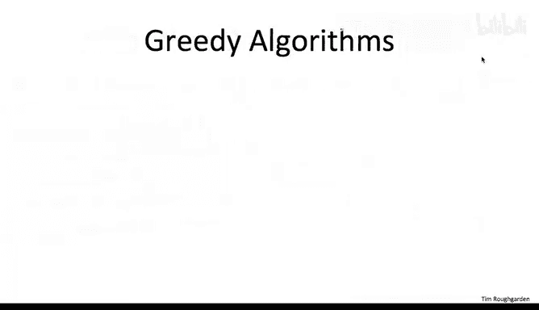

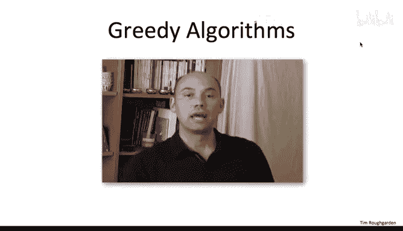

接下来，我们将要深入讨论的范式是**贪心算法**。这类算法迭代地做出“短视”的决策。事实上，我们在第一部分已经见过一个贪心算法的例子：**迪杰斯特拉最短路径算法**。本课程最后将要讨论的范式是**动态规划**，这是一个非常强大的范式，能解决我们之前提到的序列比对和分布式最短路径等核心问题。

---

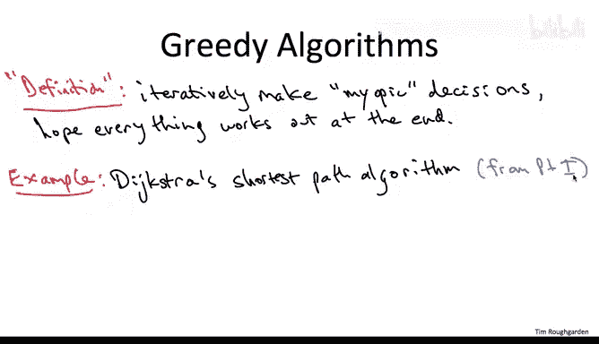

## 什么是贪心算法？

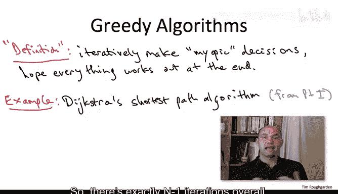

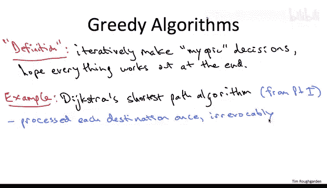

我不会给出一个正式的定义，因为关于哪些算法严格属于贪心算法，一直存在很多讨论。但我可以提供一个非正式的描述，作为判断贪心算法的经验法则。

一般来说，贪心算法会做出一系列决策，每个决策都是**短视**的——即它基于当前可获得的信息，看起来是当时最好的选择。然后，算法希望这些局部最优选择最终能导向全局最优解。

理解贪心算法的最好方法是看例子，接下来的课程会提供多个案例。但我想指出，我们其实已经在本课程的第一部分见过一个贪心算法的例子：**迪杰斯特拉最短路径算法**。

### 迪杰斯特拉算法为何是贪心的？

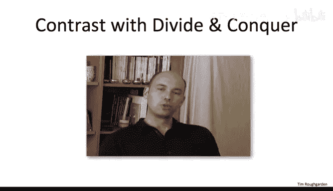

回顾迪杰斯特拉算法的伪代码，其核心是一个主 `while` 循环。算法在每次循环迭代中处理一个新的目标顶点。总共有 `n-1` 次迭代（`n` 是顶点数）。算法对每个给定的目的地只计算一次最短路径，之后**从不回头重新审视这个决策**。从这个意义上说，它的决策是**短视且不可撤销**的，这正是迪杰斯特拉算法属于贪心算法的原因。

---

## 贪心算法范式的一般讨论

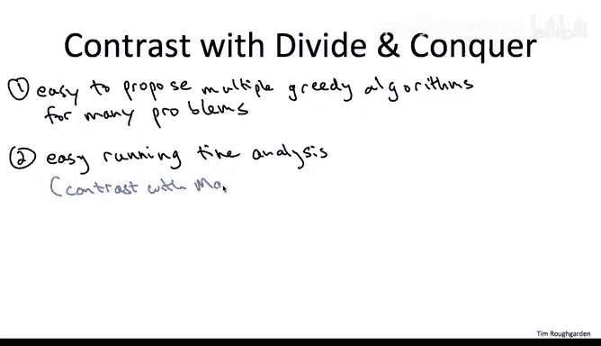

在深入例子之前，让我们从总体上讨论一下贪心算法设计范式。为了更清晰地理解，我们可以将其与我们已经深入研究过的**分治算法**范式进行比较和对比。

以下是几个关键的对比点：

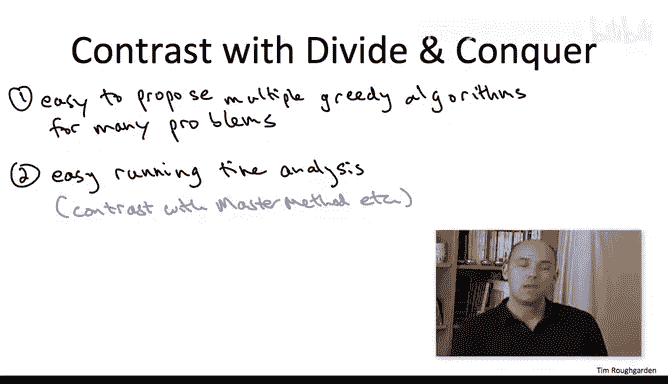

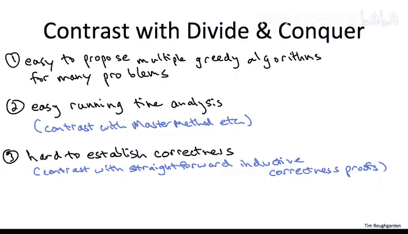

1.  **设计的难易程度**：贪心算法的一个优点（也是缺点）是它通常**非常容易应用**。针对一个问题，常常很容易想出看似合理的贪心算法，甚至多个不同的版本。这与分治算法形成对比，分治算法通常需要灵光一现，找到正确的分解问题方式。
2.  **运行时间分析**：分析贪心算法的运行时间通常比分析分治算法**容易得多**。对于分治算法，我们需要理解递归多层的运行时间，问题规模在减小，但子问题数量在增加，因此我们需要借助主定理等强大工具。而对于贪心算法，运行时间分析常常是一行代码的事，通常很明显工作由某个子程序（如排序）主导，而我们知道排序使用合理算法需要 `O(n log n)` 时间。
3.  **正确性证明**：这是对比的关键点。对于贪心算法，我们通常需要**付出更多努力来理解其正确性**。对于分治算法，正确性证明通常是相当直接的归纳证明。但对于贪心算法，情况完全不同。通常，即使对于一个正确的贪心算法，我们也很难直观理解它为什么正确，更不用说如何证明它了。

**一个非常重要的提醒**：如果你多年后只记得关于贪心算法的一件事，我希望是：它们**常常是不正确的**。尤其是对于那些你自己提出的、感觉非常自然的算法，你可能会因为偏爱而认为它一定是正确的，但事实往往并非如此。

---

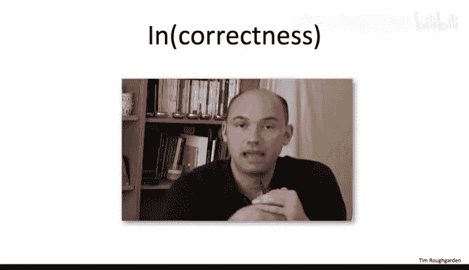

## 贪心算法的不正确性：一个例子

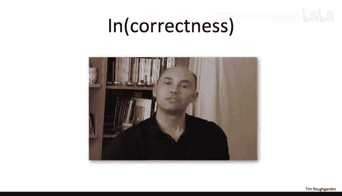

为了让你立即练习识别看似自然但实则错误的贪心算法，让我们回顾本课程第一部分关于迪杰斯特拉算法的一个要点。

在第一部分，我们强调了迪杰斯特拉算法是一个著名的、运行速度极快的算法，能计算所有最短路径。但请记住，我们证明迪杰斯特拉算法正确时有一个**关键假设**：给定网络中的每条边都具有**非负长度**。我们不允许负边长的存在。

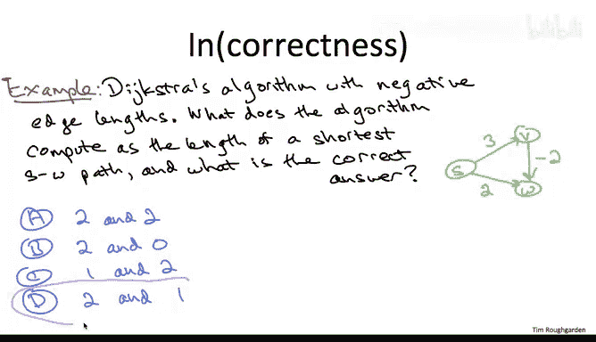

虽然许多应用只关心非负边长，但确实存在需要负边长的应用。让我们通过一个小测验来回顾为什么迪杰斯特拉算法在边长为负时是**不正确**的。

考虑一个简单的三边网络（如绿色图所示），边已标注长度。注意从 `V` 到 `W` 的边具有负长度 `-2`。问题是：考虑源顶点 `S` 和目标顶点 `W`，迪杰斯特拉算法计算出的最短路径距离是多少？实际的、真正的最短路径距离又是多少？（路径长度定义为路径上各边长度的总和）

**答案分析**：
*   **实际最短路径距离**：从 `S` 到 `W` 有两条路径。直接路径 `S->W` 长度为 `2`。经过 `V` 的路径 `S->V->W` 长度为 `3 + (-2) = 1`。因此，实际最短路径距离是 `1`。
*   **迪杰斯特拉算法的输出**：回顾伪代码，在第一次迭代中，算法会贪婪地找到离 `S` “最近”的顶点。此时，`W`（距离 `2`）比 `V`（距离 `3`）更近。因此，算法会基于当前信息，**不可撤销地**将 `S` 到 `W` 的最短路径距离计算为 `2`，之后不会再重新考虑这个决策。所以迪杰斯特拉算法会终止并输出错误的结果 `2`。

这并不与我们第一部分证明的结论矛盾，因为我们是在所有边长为非负的假设下证明其正确性的，而本例违反了该假设。这里的要点是：很容易写出一个贪心算法，尤其是你自己想出来的，你内心深处可能相信它总是正确的。但更多时候，你的贪心启发式方法可能仅仅是一个启发式方法，总存在一些实例让它做出错误的事情。在贪心算法设计中，请牢记这一点。

---

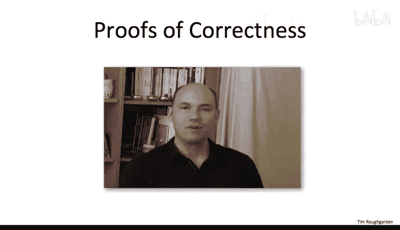

## 如何证明贪心算法的正确性？

既然我已经提醒了你贪心算法设计的风险，现在让我们转向正确性证明。也就是说，如果你有一个实际上是正确的贪心算法（我们将在接下来的课程中看到一些著名的例子），你如何确立这一事实？或者，如果你有一个贪心算法但不知道它是否正确，你该如何着手判断？

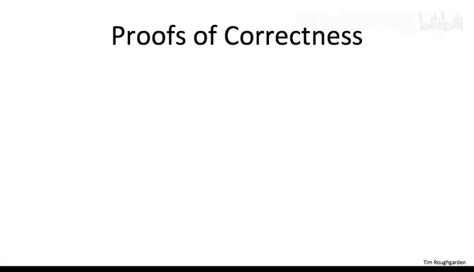

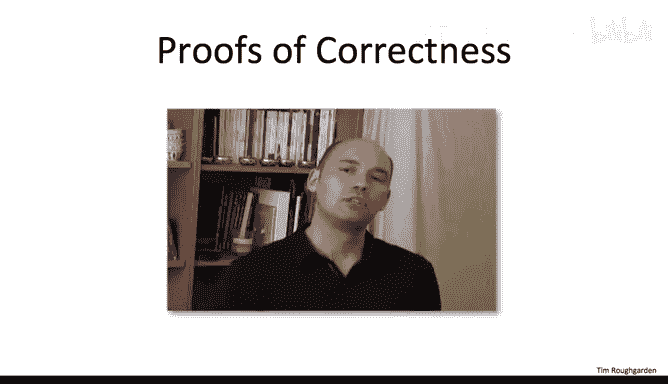

坦白说，证明贪心算法的正确性更像是一门**艺术而非科学**。与分治范式那种公式化的方式不同（有评估递归的黑盒方法、证明正确的模板），证明贪心算法的正确性需要很多创造力，并且带有一点特设的味道。

尽管如此，像往常一样，我会强调那些反复出现的主题和方法。让我从非常高的层次告诉你，你可能会如何着手进行证明。你可能会在看过一些例子后，再回来看这部分内容，那时它会更有意义。

以下是两种常见的方法：

1.  **归纳证明**：这是我们的老朋友（或者说是“宿敌”，取决于你的看法）。贪心算法会顺序做出一系列不可撤销的决策。这里的归纳将基于算法所做的决策。回顾我们对迪杰斯特拉算法正确性的证明，那正是我们采用的方式：对主 `while` 循环的迭代次数进行归纳。在每次迭代中，我们计算到一个新目的地的最短路径，并且总是证明：假设之前所有的计算都是正确的（归纳假设），那么当前迭代的计算也是正确的。通过归纳，算法所做的一切都是正确的。一些教科书称这种方法为 **“贪心保持领先”**，意味着你一步步证明贪心算法始终在做正确的事。
2.  **交换论证**：这是证明许多贪心算法正确性的第二种常用方法。你尚未在本课程中见过交换论证的例子，所以我们接下来会进行介绍。它有不同的形式：
    *   一种形式是**反证法**：假设贪心算法不正确，然后证明你可以取一个最优解，交换其中的两个元素，从而得到一个更好的解，这当然与你始于一个最优解的假设矛盾。
    *   另一种形式是**逐步转换**：证明你可以通过一系列交换，将一个最优解逐步转换成贪心算法输出的解，并且在此过程中不会使解变差。这表明贪心算法的输出实际上也是最优的。形式上，这可以通过对将最优解转换为你的解所需的交换次数进行归纳来完成。

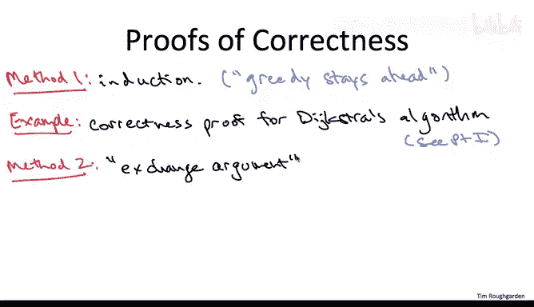

最后，我必须再次强调，证明贪心算法正确性背后没有太多固定公式。你常常需要相当有创造力，可能需要结合方法一和方法二的各个方面，或者做一些完全不同的事情。任何严谨的证明都是可行的。

---

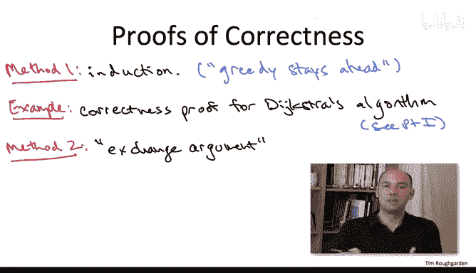

## 总结

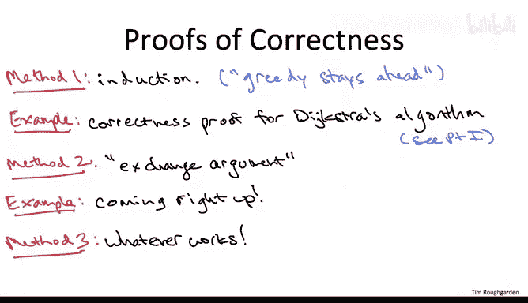

本节课中，我们一起学习了贪心算法这一重要的算法设计范式。我们回顾了算法设计范式的概念，将贪心算法与分治算法进行了对比，明确了贪心算法**短视决策、不可撤销**的核心特征。我们通过迪杰斯特拉算法的例子说明了贪心算法的应用，也通过它在负边权下失效的例子警示了贪心算法常常并不正确。最后，我们探讨了证明贪心算法正确性的两种主要思路：**归纳证明**和**交换论证**。在接下来的课程中，我们将通过具体例子深入实践这些概念和方法。