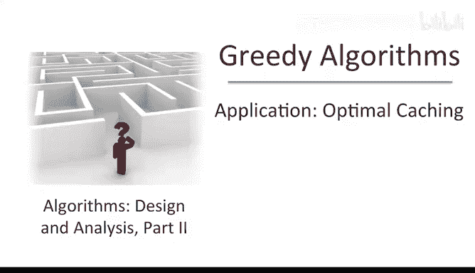
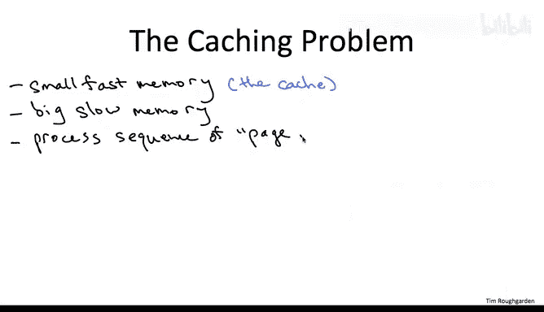
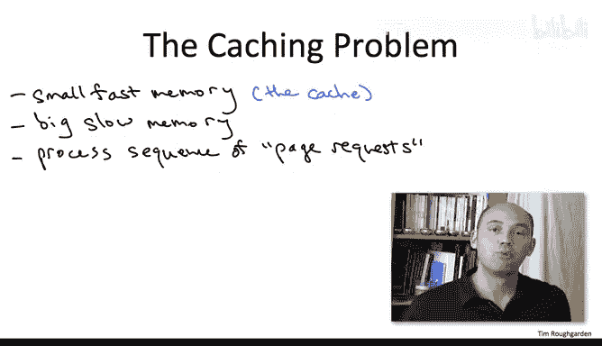
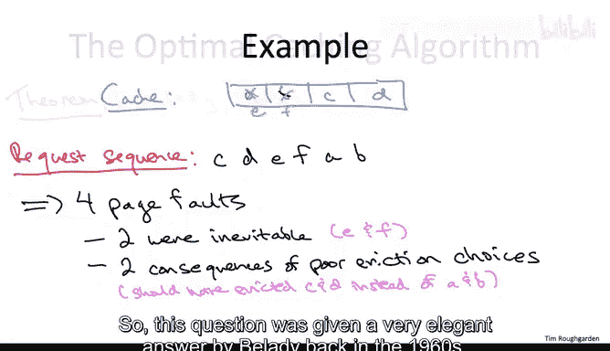
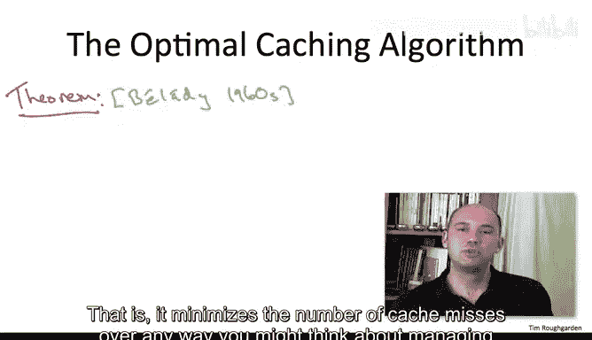
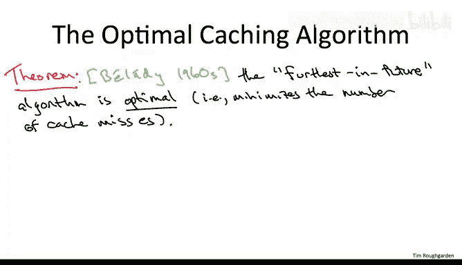
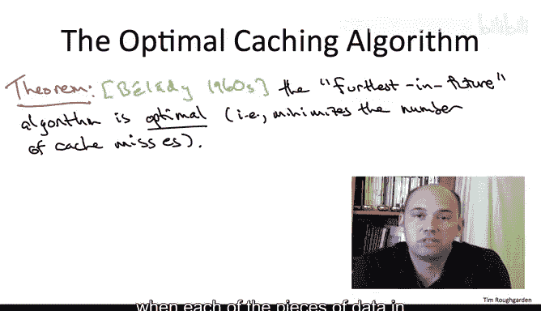
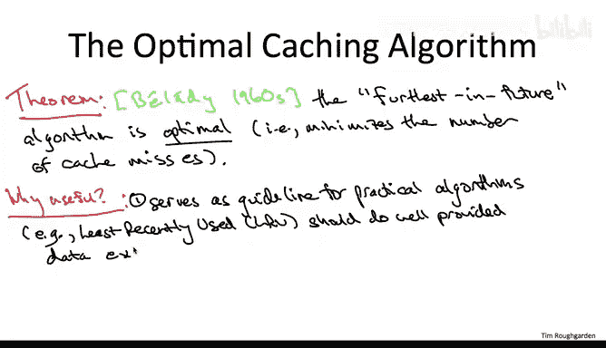

# 079：贪心算法应用-最优缓存 🧠

在本节课中，我们将学习贪心算法的一个经典应用：最优缓存问题。我们将了解缓存的基本概念、缓存未命中的类型，并介绍一个理论上最优的贪心算法——最远将来算法。虽然这个算法在实际中无法直接实现，但它为设计实用的缓存算法提供了重要指导。

---

## 什么是缓存问题？ 💾

上一节我们介绍了贪心算法的基本概念，本节中我们来看看它在缓存问题中的应用。

缓存问题涉及两种内存：一种是**大而慢的内存**，可以存储所有可能用到的数据；另一种是**小而快的缓存**，访问速度远快于前者。这种场景在计算机科学的多个领域都很常见，例如计算机架构、操作系统和网络。

**核心概念**：
- **大内存**：存储所有数据，但访问慢。
- **缓存**：存储部分数据，访问快，但容量有限。

---

## 缓存如何工作？ 🔄

当客户端请求访问某个数据时，我们称之为**页面请求**。该数据保证存在于大内存中，但如果不在缓存中，就需要将其加载到缓存中，这个过程称为**缓存未命中**或**页面错误**。

**缓存未命中时**，必须从缓存中**驱逐**一个现有数据，为新数据腾出空间。驱逐哪个数据，就是缓存管理算法需要决策的问题。

以下是缓存工作的一个简单示例：

假设缓存有四个槽位，初始存储数据 A、B、C、D。

1.  请求数据 C → 命中，无需操作。
2.  请求数据 D → 命中，无需操作。
3.  请求数据 E → 未命中，需驱逐一个数据（假设驱逐 A）并加载 E。
4.  请求数据 F → 未命中，需驱逐一个数据（假设驱逐 B）并加载 F。
5.  请求数据 A → 未命中，需驱逐一个数据并重新加载 A。
6.  请求数据 B → 未命中，需驱逐一个数据并重新加载 B。

在这个例子中，由于驱逐了 A 和 B，导致后续对它们的请求产生了额外的未命中。如果当初驱逐的是 C 和 D，就可以避免这两次未命中。

这个例子说明了两个要点：
1.  缓存管理涉及在未命中时选择驱逐对象。
2.  缓存未命中分为两种：**不可避免的未命中**（如首次请求新数据）和**算法相关的未命中**（由不当的驱逐决策导致）。

---

## 最优算法：最远将来算法 🎯

那么，如何最小化缓存未命中的次数呢？Belady 在 1960 年代给出了一个优雅的答案。

**定理**：一个自然的贪心算法——**最远将来算法**，是缓存问题的最优算法。它能最小化在所有可能的缓存管理方式中产生的缓存未命中次数。

**最远将来算法**的规则很简单：当需要从缓存中驱逐一个数据时，选择**将来最长时间内不会被再次请求**的那个数据。

其思想是：你“后悔”驱逐某个数据的时刻，就是它下次被请求的时刻。因此，驱逐那个下次请求时间最晚的数据，可以将“后悔”推迟得最久。

在前面的例子中，最远将来算法会正确地选择驱逐 C 和 D，而不是 A 和 B。

---

## 算法的实用价值与实践意义 ⚙️

你可能会问：这个算法需要预知未来，这在实际中不可能实现，它有什么用呢？

这个定理的实用性体现在两个方面：

**1. 指导实用算法设计**
最远将来算法为设计可实现的算法提供了思路。一个著名的衍生算法是 **LRU（最近最少使用）算法**。

LRU 算法用过去预测未来：它认为最近被访问过的数据，在不久的将来很可能再次被访问；而很久没被访问的数据，将来一段时间内也可能不会被访问。因此，当需要驱逐时，LRU 选择**过去最久未被访问**的数据作为“将来最久不会被访问”的代理。

只要数据访问模式具有**局部性**（最近访问过的数据倾向于在近期再次被访问），LRU 就能很好地近似最远将来算法。在许多应用中，LRU 是实用缓存算法的黄金标准。

**2. 作为理想化的性能基准**
最远将来算法可以作为一个完美的、假设性的基准，用于评估实际缓存算法的性能。

例如，在实现了一个缓存系统（如使用 LRU）后，你可以分析过去几天的请求日志：
- 计算你的算法（如 LRU）产生了多少次未命中。
- 计算如果“预知未来”采用最远将来算法，会产生多少次未命中（这是可计算的，因为你现在拥有了“未来”的日志）。

如果两者性能接近（例如 LRU 只比最优情况差几个百分点），说明数据具有局部性，且你的算法表现良好。如果性能差距很大，则说明需要重新设计或调整你的缓存策略。

---

## 关于算法正确性证明的说明 📝

在本课程中，对于大多数贪心算法，我们都会严格证明其正确性。但 Belady 的这个定理是一个例外，其证明（通常使用“交换论证”法）相当复杂和精妙。

尽管这个算法看起来直观，但严谨地证明它是最优的并不容易。许多操作系统教科书会提及这个算法及其最优性，但往往省略证明。有兴趣的读者可以尝试挑战自己证明它，这将帮助你深入理解贪心算法正确性证明中的微妙之处。

---

## 总结 📚

本节课中我们一起学习了：
1.  **缓存问题**的核心：管理小而快的缓存，以服务来自大而慢内存的页面请求序列，目标是最小化缓存未命中。
2.  **最优贪心算法**：最远将来算法在理论上能最小化未命中次数，但其需要预知未来，无法直接实现。
3.  **实践意义**：该理论算法为 **LRU** 等实用算法提供了设计灵感，并可作为评估实际算法性能的黄金标准基准。

理解这个理论最优算法，为我们设计和评估高效的缓存策略奠定了坚实的基础。