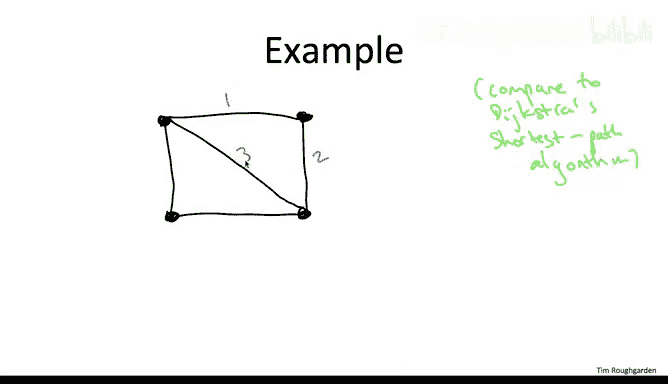
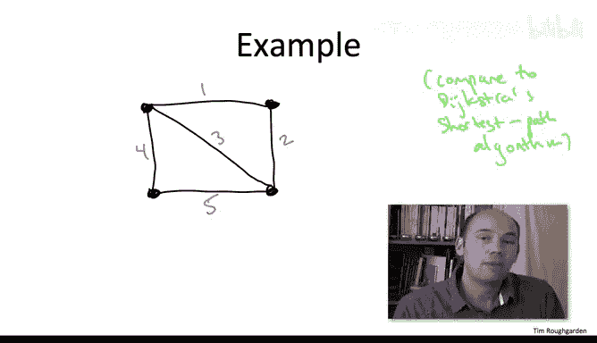
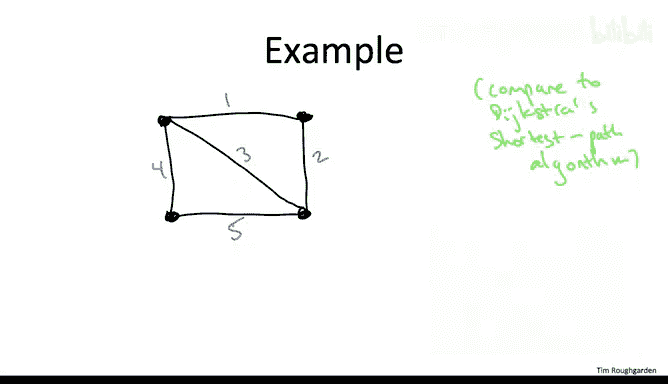
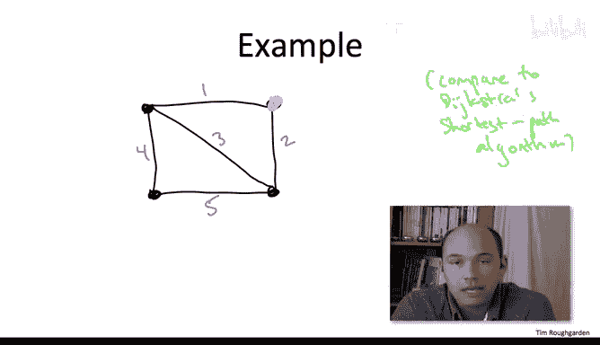
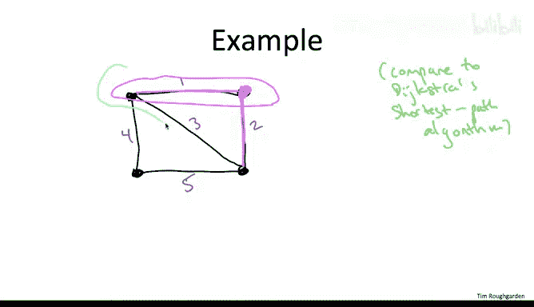
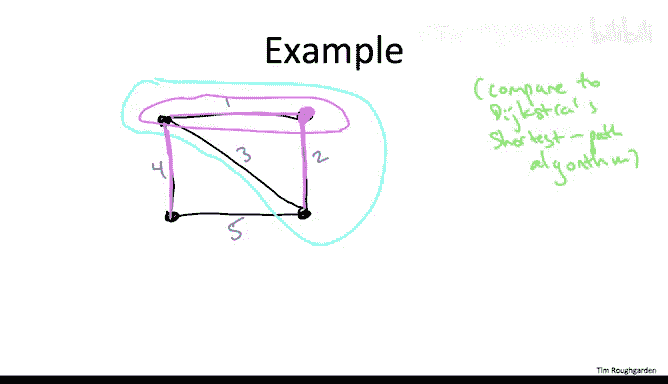
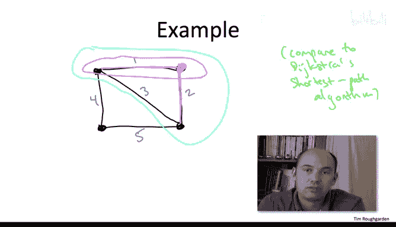
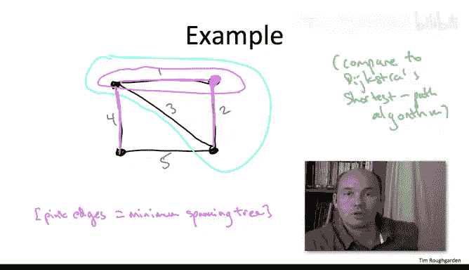
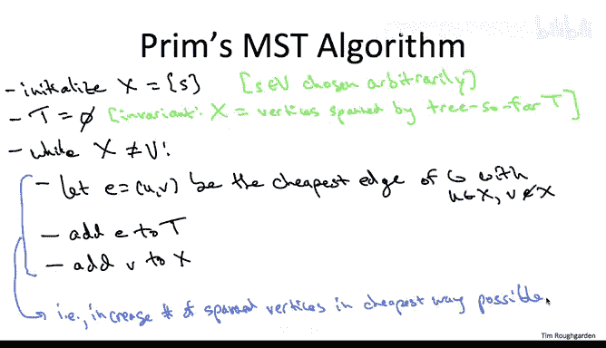
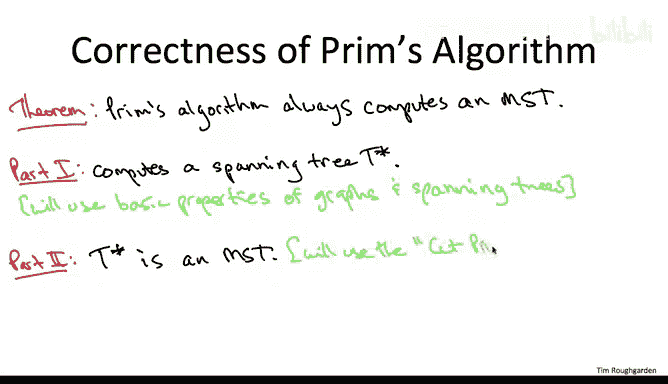

# 086：Prim最小生成树算法 🌳

在本节课中，我们将要学习第一个最小生成树算法——Prim算法。我们将通过一个具体的例子来理解其工作原理，然后给出通用的伪代码描述，并讨论其正确性证明的思路。

---

## 算法工作原理示例

上一节我们介绍了最小生成树问题的定义，本节中我们来看看Prim算法是如何工作的。在展示任何伪代码之前，我们先通过一个例子来图解算法。

我们将使用与上一视频相同的示例图，它有四个顶点和五条边。

算法的计划是每次添加一条边来“生长”一棵树。这个过程类似于霉菌的生长：我们从一颗“种子”顶点开始，然后在算法的每次迭代中“吸收”一个新的顶点。这与Dijkstra的最短路径算法有相似之处。在Dijkstra算法中，我们从给定的源顶点开始生长。在最小生成树问题中，我们没有源顶点，但事实证明，我们可以从任意一个顶点开始，选择哪个顶点并不影响最终结果。

在每次迭代中，我们将添加一条边，以连接一个与当前已覆盖顶点相邻的新顶点。作为一个贪心算法，Prim算法将简单地选择**允许它覆盖一个新顶点的最便宜的边**。

在算法开始时，我们实际上还没有覆盖任何边。我们把自己看作是正在从右上角的顶点开始生长。那么，有哪些边可以让我们连接一个相邻的顶点呢？有两条边：成本为1的顶部边（连接左上角顶点），以及成本为2的右边（连接右下角顶点）。我们将执行贪心选择，选择成本更低的边，即成本为1的边。

至此，我们的树覆盖了顶部的两个顶点。

在下一个迭代中，我们希望再添加一条边以覆盖一个新的顶点。现在，从我们当前已覆盖的区域“伸出”的、能让我们连接一个新顶点的边有三条：成本为2、3和4的边。成本为2和3的边可以让我们连接到右下角的顶点；成本为4的边可以让我们连接到左下角的顶点。我们将再次执行贪心选择，从这三条候选边中选择最便宜的一条，即成本为2的边。

现在，我们生长的“霉菌”覆盖了除左下角顶点之外的所有顶点。

在最后的迭代中，我们希望再包含一条边，以覆盖最后剩下的左下角顶点。请注意，那条成本为3的边我们从未添加，但它已经被我们生长的树所覆盖了。因此我们将忽略它，因为添加这条成本为3的边不会让我们覆盖任何新顶点，反而会创建一个我们不需要的环。所以，现在有两条边可以让我们覆盖一个额外的顶点：成本为4的边和成本为5的边。我们将执行贪心选择，选择成本为4的边。

当我们拥有了成本为1、2和4的边后，我们就得到了一棵生成树：没有环，并且沿着粉色边可以从任何一个顶点到达任何其他顶点，总成本为7。从上一视频可以回忆，这确实是该图的最小成本生成树。

当然，这个在只有四个顶点和五条边的玩具示例中正确运行的简单过程，并不意味着它在一般情况下就是一个好算法。接下来，让我们正式地定义这个通用算法。

---

## 通用算法与伪代码

对于一个通用图，从一个起点开始像霉菌一样生长，每次迭代贪心地覆盖一个新顶点，直到完成，具体意味着什么呢？让我们在下一张幻灯片上阐明伪代码。

以下是Prim的最小生成树算法伪代码：

我们首先进行两行初始化。我们将维护一个顶点集合 `X`，它代表我们目前已经覆盖的顶点。我们需要一个“种子”顶点来开始这个过程。选择哪个顶点无关紧要，最终我们都会得到相同的树。因此，我们任意选择一个顶点 `s` 作为生长的起点。

我们维护的另一个东西当然是树本身，它最初是空的集合 `T`。我们将在每次迭代中向其中添加一条边。

整个算法过程中我们将保持一个**不变式**：当前在集合 `T` 中的边，覆盖了当前在集合 `X` 中的顶点。

然后是我们的主 `while` 循环，这是算法的核心部分，它与Dijkstra算法中的循环非常相似。每次迭代负责选择一条**跨越当前边界**的边，从而将一个新顶点纳入覆盖范围。它同样是贪心的，但选择标准比Dijkstra算法更简单：我们只看**哪条边能让我们以最低成本覆盖一个新顶点**。

只要还有尚未覆盖的顶点，循环就会继续。

在每次迭代中，我们搜索那些能让我们覆盖一个新顶点的边。具体是哪些边呢？我们希望边的一个端点在已覆盖的顶点集合 `X` 内，另一个端点不在 `X` 内（即，在外部）。如果一条边以这种方式跨越边界，那么添加它就可以将覆盖的顶点数增加一个。

如果边 `e` 是所有这种跨越边界的边中最便宜的一条，那么我们就将它添加到当前的树 `T` 中。这条边中那个不在 `X` 中的端点 `v`，就是我们在本次迭代中要添加到 `X` 的顶点。

一次迭代的语义是：我们试图在花费尽可能少的情况下，增加被覆盖的顶点数量。正是在这个意义上，Prim算法是一种贪心算法。

与通常的贪心算法一样，这看起来足够自然，但远不清楚它是否正确，即它是否总是能计算出一棵最小生成树。事实上，仔细想想，甚至不能明显看出它一定能计算出一棵生成树（无论是否最小）。但它是正确的，让我们在下一张幻灯片上精确地陈述这一点。

---

## 正确性声明与证明计划

关键主张是：**Prim算法是正确的**。对于任何连通的输入图，它保证输出一棵具有最小可能成本的生成树。

在我们深入任何细节之前，让我通过说明证明计划来结束本视频。我们将分两部分来证明这个定理：

1.  **第一部分**：首先，我们将证明算法会输出**某棵**生成树（可能不是最小的）。即使这一点也并非微不足道。
2.  **第二部分**：然后，我们将论证输出的生成树实际上就是成本最小的那棵。

证明的两个部分都很有趣。
*   对于第一部分（论证输出的是生成树），我们将回顾一些关于图、割以及图中生成树的预备知识。
*   对于第二部分（论证最优性），我们将依赖于最小生成树的一个非常简洁的性质，称为**割性质**。

我很高兴地告诉大家，我们在这里两部分所做的工作将在以后结出更多的果实。当证明另一个MST算法——Kruskal算法的正确性时，我们将重用这些要素。

对于那些更愿意讨论运行时间而非正确性的同学，请不要担心，在完成这个正确性证明之后，我们会讨论如何快速实现Prim算法，特别是使用堆（heaps）将其运行时间降低到接近线性的 **O(m log n)** 界限。

---

本节课中我们一起学习了Prim最小生成树算法的工作原理，通过示例理解了其贪心生长的过程，并查看了其通用伪代码。我们还概述了证明其正确性的两步计划，为后续深入分析奠定了基础。