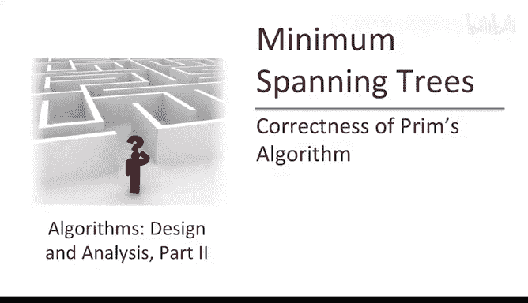
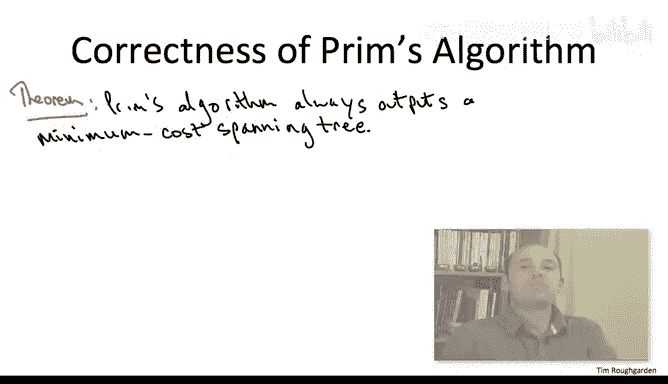
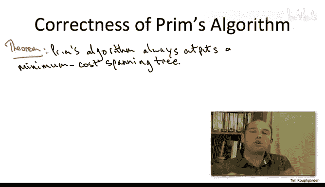
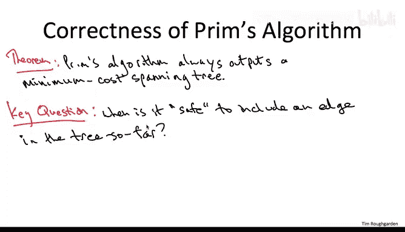
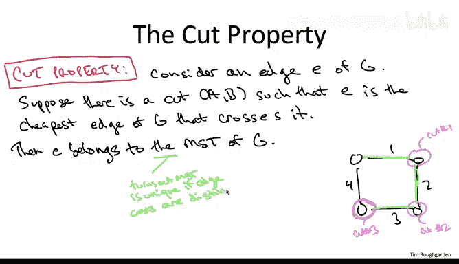
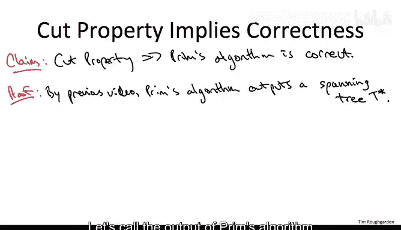
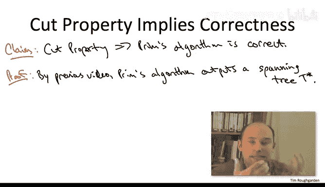
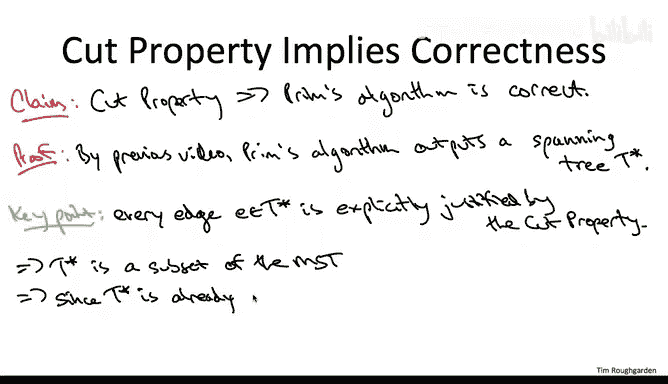

# 088：正确性证明二

在本节课中，我们将学习如何证明普里姆算法总能输出一个最小生成树。我们将借助一个称为“割性质”的关键定理来完成证明。通过理解这个性质，我们将看到普里姆算法每一步的贪心选择为何是安全的，并最终构成最优解。

---

上一节我们证明了普里姆算法至少会输出一个生成树。本节中，我们将证明它输出的是**最小**生成树。

在设计贪心算法时，我们总会面临一个核心问题：如何确保当前看似短视的决策不会在未来导致错误？普里姆算法每一步都选择一条边加入树中，且永不反悔。我们如何保证这个决策是正确的？

对于最小生成树问题，存在一个优美的条件，它能告诉我们何时可以放心地将一条边加入生成树，而绝无后顾之忧。这个条件被称为**割性质**。

### 割性质 ✂️

割性质是一个非常重要的定理，其内容如下：

> 考虑图 `G` 中的任意一条边 `e`。假设存在图的一个割 `(A, B)`（即将顶点集划分为两个非空集合 `A` 和 `B`），使得边 `e` 是**所有横跨该割的边中成本最低的**。那么，边 `e` 必定属于图 `G` 的**每一个**最小生成树。

换句话说，如果你能为一条边找到一个割，使得它是该割上最便宜的“桥”，那么这条边就必须出现在最终的最小生成树里。

为了让大家更好地感受这个性质，我们来看一个简单的例子。

### 性质应用示例 🔍

考虑一个由4个节点和4条边组成的环，各边成本分别为1、2、3、4。

以下是几个应用割性质的例子：

*   **第一个割**：将右上角的节点单独放在割的一侧，其余三个节点放在另一侧。横跨这个割的边有成本为1和2的两条边。成本为1的边是最便宜的。因此，根据割性质，成本为1的边必须在最小生成树中。
*   **第二个割**：将右下角的节点单独放在割的一侧，其余三个节点放在另一侧。横跨这个割的边有成本为2和3的两条边。成本为2的边是最便宜的。因此，成本为2的边也必须在最小生成树中。
*   **第三个割**：将左下角的节点单独放在割的一侧，其余三个节点放在另一侧。横跨这个割的边有成本为3和4的两条边。成本为3的边是最便宜的。因此，成本为3的边必须在最小生成树中。

通过观察这些例子，我们可以发现一个关键点：对于一条边，我们**只需要找到一个**能证明它是该割上最便宜边的割，就足以断定它属于最小生成树。例如，成本为2的边在第一个割中并不是最便宜的，但我们在第二个割中找到了证明它的理由。

另一方面，我们无法为成本为4的边找到任何一个割，使其成为该割上最便宜的边。这符合预期，因为成本为4的边确实不在最小生成树中。

> **关于唯一性的说明**：割性质的结论中提到了“最小生成树”，这暗示了唯一性。在本课程中，我们假设所有边的成本都是互不相同的。在这种情况下，最小生成树确实是唯一的。如果边成本存在相同值，则可能有多个不同的最小生成树，割性质的表述也需要稍作调整。

---

现在，让我们利用割性质来证明普里姆算法的正确性。

### 证明普里姆算法的正确性 ✅

我们假设割性质成立（其证明本身需要一些技巧，我们将在另一个视频中单独讨论）。基于此，我们来论证普里姆算法总能输出最小生成树。

回顾上一节的结论：普里姆算法的输出 `T*` 是一个生成树（即连通所有顶点且无环）。

现在，让我们仔细观察普里姆算法的伪代码。在算法的每一步迭代中：
1.  我们有一个已纳入生成树的顶点集合 `X`。
2.  其余顶点构成集合 `V - X`。
3.  `(X, V - X)` 构成了图的一个割。
4.  算法会**暴力搜索所有横跨这个割的边**，并选择其中**成本最低的一条**加入树中。

这正是割性质所描述的场景！割性质说：“横跨一个割的最便宜的边，必须属于最小生成树。” 而普里姆算法在每一步迭代中，**恰好**选择的就是这样一条边。

因此，算法 `T*` 中每一条边的加入，都满足割性质的前提条件。根据割性质的结论，这些边都必须属于最小生成树。这意味着，`T*` 中的所有边都是最小生成树的边，即 `T*` 是最小生成树的一个子集。

然而，`T*` 本身已经是一个生成树（连通且无环）。如果我们向一个生成树中添加任何不属于它的边，就会产生环，从而破坏树的定义。因此，`T*` 不可能只是最小生成树的一个**真子集**，它必须就是**整个**最小生成树本身。

由此，我们得出结论：对于任意连通的输入图，普里姆算法输出的 `T*` 就是该图的最小生成树。

---

本节课中我们一起学习了**割性质**，并利用它证明了**普里姆算法**的正确性。我们了解到，该算法每一步选择当前割上最小边的贪心策略，并非短视行为，而是由割性质保证的、通向全局最优解的必然步骤。这完美解释了为何这个简单的贪心算法总能找到最小生成树。