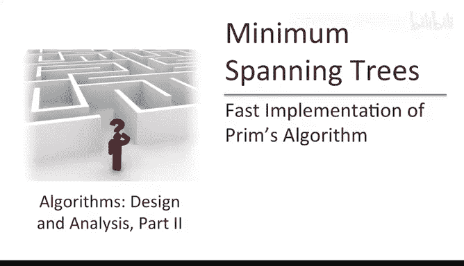
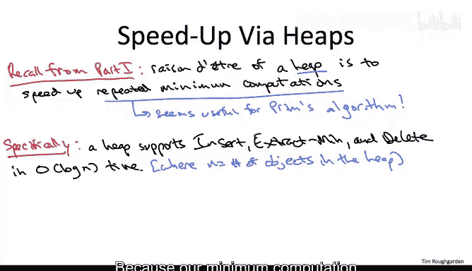
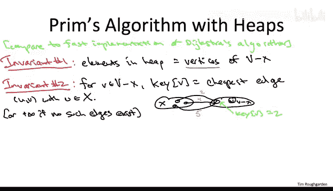

# 090：快速实现一

## 概述
在本节课中，我们将要学习普里姆算法的实现细节与运行时间分析。我们将从分析其朴素实现开始，然后探讨如何通过巧妙运用堆数据结构来显著提升算法效率。

## 算法回顾与朴素实现分析
上一节我们介绍了普里姆算法的正确性。本节中我们来看看它的实现。

普里姆算法通过逐步添加边来构建最小生成树。它维护两个集合：已覆盖的顶点集合 **X** 和已选中的边集合 **T**。算法从一个任意顶点 **s** 开始，每次迭代选择一条连接 **X** 与 **V-X** 的最小成本边，并将其对应的新顶点加入 **X**。

如果直接按此伪代码实现，运行时间是多少？

初始化步骤仅需常数时间。主循环的迭代次数为 **n-1** 次，其中 **n** 是顶点数。每次迭代需要检查所有边以找到跨越当前割的最小成本边，这可以在 **O(m)** 时间内完成，其中 **m** 是边数。

因此，朴素实现的总运行时间为 **O(m * n)**。这个多项式时间算法已经比检查所有生成树要高效得多。但算法设计者总会问：我们能做得更好吗？

## 加速的核心思想：使用堆
为了加速普里姆算法，我们将采用与加速迪杰斯特拉算法相同的大思路：部署一个合适的数据结构。

主循环中反复执行的操作是在所有跨越割的边中寻找最小值。什么样的数据结构能加速重复的最小值计算？答案就是堆。堆的专长正是加速重复的最小值计算。

以下是堆支持的关键操作及其时间复杂度：
*   **插入**：将带有键值的新对象插入堆中。
*   **提取最小值**：移除并返回键值最小的对象。
*   **删除**：从堆中删除任意指定对象。
*   所有这些操作都可以在 **O(log N)** 时间内完成，其中 **N** 是堆中对象的数量。

堆在底层通常实现为满足堆性质的完全二叉树：每个父节点的键值都小于其子节点的键值。这使得最小值总是位于根节点。

## 堆的部署策略
我们的直觉是，既然普里姆算法需要重复的最小值计算，堆似乎很合适。第一个自然的想法是让堆存储边，并以边成本作为键值。这样，提取最小值就能直接给我们一条边。

这已经是一个很好的想法，能将运行时间提升至 **O(m log n)**。但我们将探讨一种更巧妙、在实践中更优的实现方式：让堆存储顶点而非边。

这种更高级的实现方式运行时间也是 **O(m log n)**，但常数更优。其核心思想与我们加速迪杰斯特拉算法时所用的想法非常相似。

## 基于顶点的堆实现方案
我们的计划是维护两个不变式。

第一个不变式描述堆的内容：堆中存储所有尚未被覆盖的顶点，即 **V - X** 中的顶点。这样，我们从堆中提取最小值时，得到的就是下一个要加入 **X** 的顶点。

第二个不变式定义堆中顶点的键值：对于堆中的每个顶点 **v**（属于 **V - X**），其键值定义为所有连接 **v** 与已覆盖集合 **X** 的边中成本的最小值。如果没有这样的边，则键值定义为 **+∞**。

用公式表示，对于 **v ∈ V - X**：
`key[v] = min{ cost(e) | e = (u, v), u ∈ X }`，若这样的边存在；否则 `key[v] = +∞`。

## 实现细节
给定这个使用堆的高级方案，我们需要思考三个问题：如何初始化堆以满足不变式；如何利用堆高效模拟每次迭代；以及如何在算法执行过程中维护这些不变式。

### 1. 堆的初始化
在预处理步骤中，我们需要设置堆以满足两个不变式。

开始时，**X** 只包含起始顶点 **s**。**V - X** 包含其余 **n-1** 个顶点。对于 **V - X** 中的每个顶点 **v**，其初始键值就是边 **(s, v)** 的成本（如果存在），否则为 **+∞**。

通过一次 **O(m)** 的边扫描，我们可以计算出每个需要入堆顶点的键值。然后将这 **n-1** 个顶点插入堆中，插入操作的总成本为 **O(n log n)**。因此，初始化总时间为 **O(m + n log n)**，在渐进意义上可记为 **O(m log n)**。

### 2. 模拟主循环迭代
假设两个不变式成立，那么从堆中提取最小值就能忠实地模拟朴素实现中的暴力搜索。

提取最小值操作返回的是下一个应加入 **X** 的顶点 **w**。同时，连接 **w** 与 **X** 且成本等于 `key[w]` 的那条边，就是本次迭代应加入边集合 **T** 的边。

这可以看作是一个两轮淘汰赛：
*   **第一轮（本地优胜）**：每个在 **V-X** 中的顶点 **v**，通过其键值 `key[v]` 记住它连接到 **X** 的最佳（最便宜）边。
*   **第二轮（全局优胜）**：堆的提取最小值操作，从所有第一轮的本地优胜者中，选出成本最小的那一个，即全局跨越割的最小成本边。

因此，每次迭代的核心操作就是一次堆的提取最小值，这可以在 **O(log n)** 时间内完成。

### 3. 维护不变式
当我们从堆中提取一个顶点 **w** 并将其加入 **X** 后，割发生了变化。一些原本在 **V-X** 中的顶点，现在可能有了新的、更便宜的边连接到新的 **X** 集合（特别是连接到新加入的顶点 **w**）。

因此，对于每个与 **w** 相邻且仍在堆中的顶点 **v**（即 **v ∈ V-X**），我们需要检查边 **(w, v)** 的成本是否小于 `key[v]` 的当前值。如果是，我们就需要更新顶点 **v** 在堆中的键值为这个更小的值。这可以通过堆的删除后重新插入操作，或专门的“键值减小”操作来完成，时间复杂度为 **O(log n)**。

每个顶点最多被加入 **X** 一次，每条边最多触发一次对相邻顶点的键值检查/更新。因此，维护不变式的总开销是 **O(m log n)**。

## 总结
本节课中我们一起学习了如何高效实现普里姆算法。

我们首先分析了其 **O(m * n)** 的朴素实现。然后，我们引入了堆数据结构来加速重复的最小值查找操作。我们探讨了一种实用的策略：在堆中存储顶点而非边，并为每个顶点维护一个键值，表示它连接到已覆盖部分的最小边成本。

通过精心维护堆和顶点键值，我们能够在 **O(log n)** 时间内模拟每次主循环迭代，并在 **O(m log n)** 的总时间内维护数据结构。这使得普里姆算法的总运行时间从 **O(m * n)** 提升到了 **O(m log n)**，对于稠密图而言是一个显著的加速。