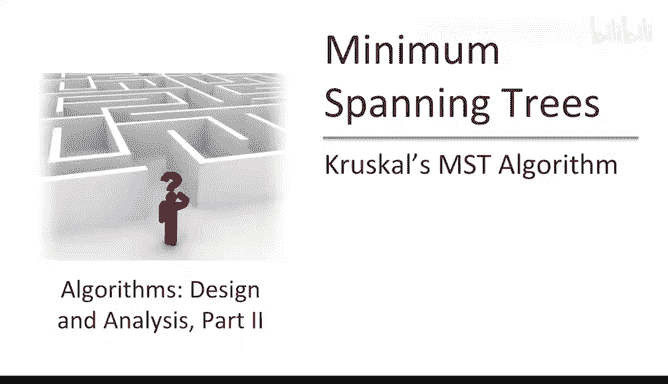
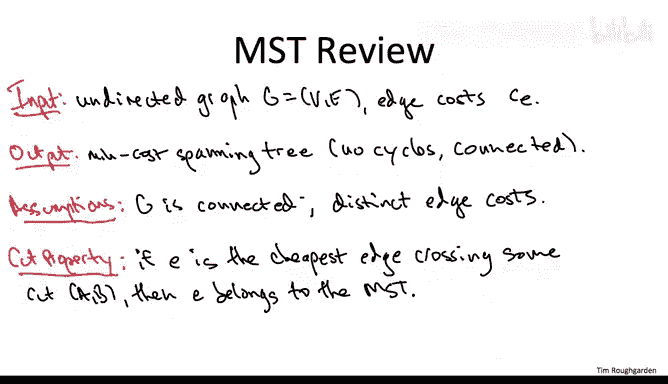
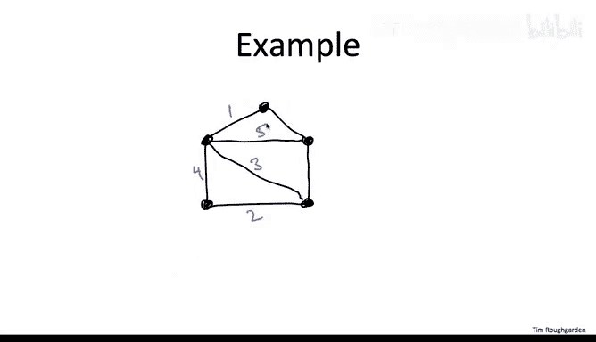
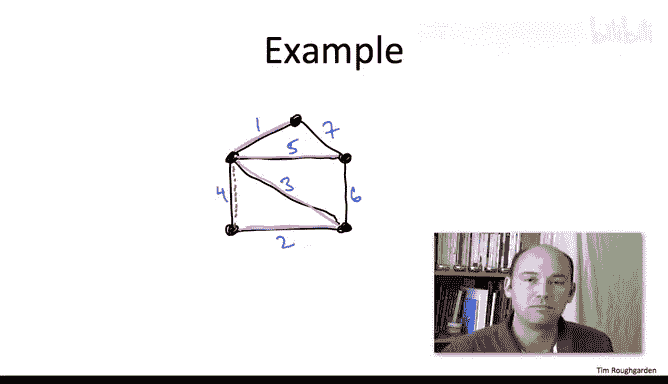
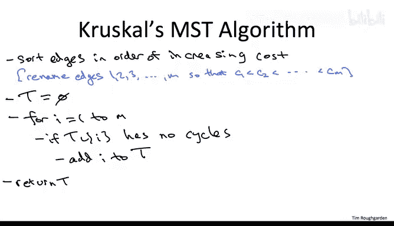
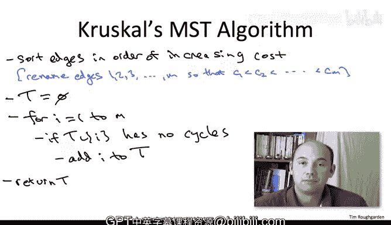
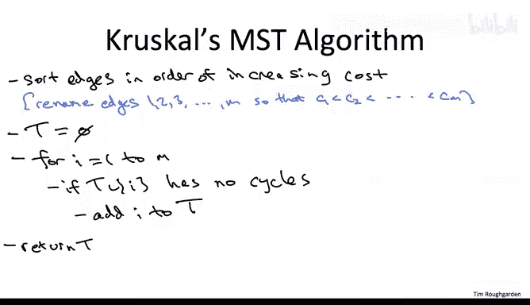

# 092：17_02_02_Kruskal最小生成树算法 🌳



## 概述

在本节课中，我们将学习求解最小生成树问题的第二个优秀贪心算法——Kruskal算法。我们将理解其工作原理，证明其正确性，并探讨其高效实现所需的数据结构。

---

## 算法背景与动机

上一节我们介绍了Prim算法，本节中我们来看看Kruskal算法。你可能会问，既然已经有了Prim算法，为何还要学习第二个？主要有三个原因。

以下是学习Kruskal算法的三个理由：

1.  **算法本身很优秀**：它是算法领域的经典之作，在理论和实践中都与Prim算法具有竞争力，是解决最小生成树问题的另一个杰出贪心方案。
2.  **学习新数据结构的机会**：为了高效实现Kruskal算法，我们将学习并应用一个本课程尚未讨论的新数据结构——**并查集**。这类似于我们使用堆来高效实现Prim算法。
3.  **与聚类算法的联系**：Kruskal算法与某些类型的聚类算法有着非常有趣的联系。理解这种联系有助于我们更好地理解聚类上下文中的自然贪心算法。

---

## 问题回顾与假设

在深入Kruskal算法之前，让我们简要回顾最小生成树问题及其基本假设。

**问题定义**：输入是一个无向图 **G**，每条边都有一个成本。算法的任务是输出一个**生成树**，即一个无环且连通（任意两个顶点间都有路径）的子图。在所有可能指数级多的生成树中，算法应输出总边成本最小的那一个。

**基本假设**：
1.  输入图是连通的（这是存在生成树的必要条件）。虽然Kruskal算法可以优雅地扩展到非连通图，但本节课不讨论这种情况。
2.  为简化证明，我们假设所有边成本**互不相同**（即没有并列成本）。请注意，Kruskal算法在存在并列成本时同样是正确的，只是本节课的证明不涵盖该情况。
3.  我们将再次使用证明Prim算法正确性时最重要的工具之一——**割性质**。

**割性质回顾**：如果图中存在一条边，并且你能找到一个割，使得这条边是**穿过该割的所有边中成本最低的**，那么这条边必定属于最小生成树。它保证了包含这条边是“安全”的。我们将在证明Kruskal算法正确性时再次使用这个性质。

---

## Kruskal算法工作原理 🛠️



与介绍Prim算法时一样，在展示伪代码之前，我们先通过一个例子来理解Kruskal算法的工作原理。你会发现它非常直观。




考虑以下这个具有5个顶点和7条边的图，蓝色数字标注了各边的成本。


**Kruskal与Prim的核心思想差异**：
*   在Prim算法中，我们从一个起点出发，像霉菌生长一样，每次迭代都保证子图连通并覆盖一个新的顶点。
*   在Kruskal算法中，我们放弃了每一步都保持子图连通的要求。它很乐意并行地生长多个小树片段，只在算法最后才将它们合并起来。

**Kruskal算法的基本步骤**：我们简单地按成本从低到高的顺序查看所有边。每次选择当前**成本最低且尚未查看的边**。当然，有一个限制：我们不能引入环。因此，我们会跳过那些会导致环的边。除此之外，我们只需按顺序选择下一条最便宜的边。

让我们在上述5顶点示例中运行算法：

1.  **选择成本为1的边**：这是全局成本最低的边，我们将其加入生成树。
2.  **选择成本为2的边**：这是下一个成本最低的边，加入生成树。注意，此时这两条边是**互不相连**的，这体现了Kruskal算法不要求中间步骤连通的特点。
3.  **选择成本为3的边**：这是下一个成本最低的边。加入后，它恰好将之前两个独立的片段连接成了一个连通分量。
4.  **考虑成本为4的边**：这是下一个成本最低的边。但是，加入它会与成本为2和3的边形成一个三角形（环）。这是不允许的，因此我们**跳过**这条边。
5.  **选择成本为5的边**：这是下一个成本最低且不会形成环的边，我们将其加入。此时，我们已经有了一个包含4条边的生成树（顶点数n=5，边数n-1=4），算法可以停止。
    *   （补充说明：我们也会考虑成本为6和7的边，但它们都会形成环，因此被跳过。）

经过对边的一次排序扫描，我们得到了图中由粉色边构成的生成树。我们将看到，不仅在这个例子中，而且在任何图中，Kruskal算法输出的都是最小成本生成树。

---

## Kruskal算法伪代码 📝

有了直观理解后，下面的伪代码就不会令人意外了。我们希望只对边进行一次排序扫描。

**预处理**：首先，我们需要对边按成本进行排序。为了使伪代码简洁，我们假设边已按成本从低到高重新编号为 **e1, e2, e3, ..., em**。

以下是Kruskal算法的核心伪代码：

```pseudocode
// 输入：图G，边已按成本升序排序为 e1, e2, ..., em
// 输出：最小生成树T

T = ∅ // 初始化空树
for i = 1 to m:
    if T ∪ {ei} 不包含环:
        T = T ∪ {ei} // 将边ei加入树T
return T
```

算法维护一个进行中的树 **T**。它简单地按排序顺序遍历所有边。对于每条边，除非它会导致环（这是坏主意），否则就将其加入 **T**。遍历结束后，返回 **T**。

可以想象一些优化，例如，一旦 **T** 中包含了 **n-1** 条边（构成生成树所需的最小边数），就可以提前终止循环。但本节课我们将分析这个简洁的三行版本。



---

## 后续学习路径

与讨论Prim算法时类似，我们接下来的步骤是：

1.  **证明正确性**：首先，我们需要理解为什么Kruskal算法总能输出一个生成树，并且为什么这个生成树具有最小成本。
2.  **分析运行时间**：然后，我们将分析一个朴素实现的运行时间。
3.  **探讨高效实现**：最后，我们将学习如何使用合适的数据结构（特别是**并查集**）来实现一个高速版本的Kruskal算法。

---

## 总结







本节课我们一起学习了Kruskal最小生成树算法。我们了解了它与Prim算法在哲学上的差异：Kruskal算法通过按成本顺序贪心地添加边来并行构建多个连通分量，最终合并成完整的最小生成树。我们通过示例演示了其工作流程，并给出了核心伪代码。在接下来的课程中，我们将深入探讨其正确性证明以及如何高效地实现它。