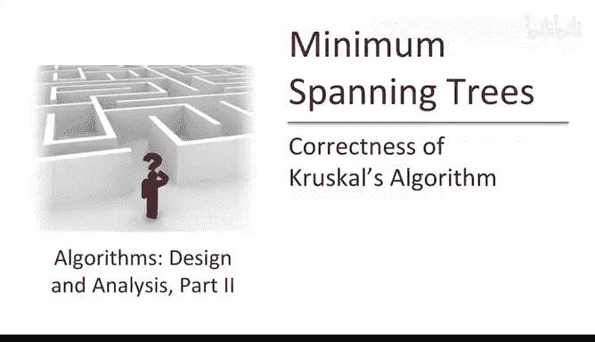
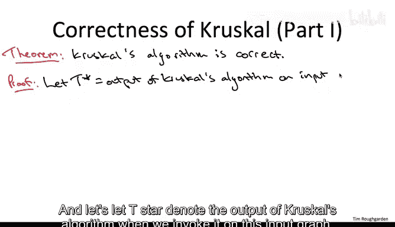
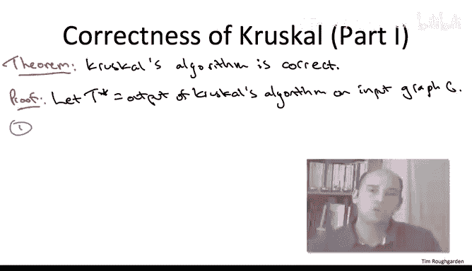
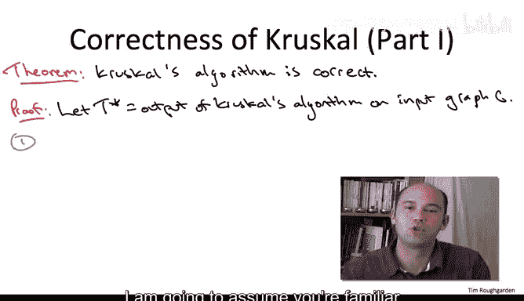
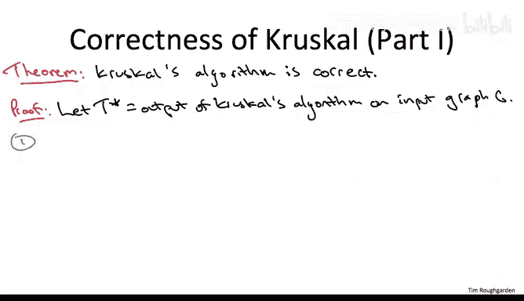
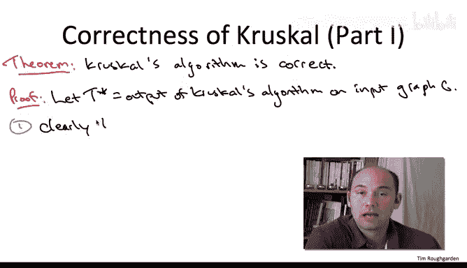
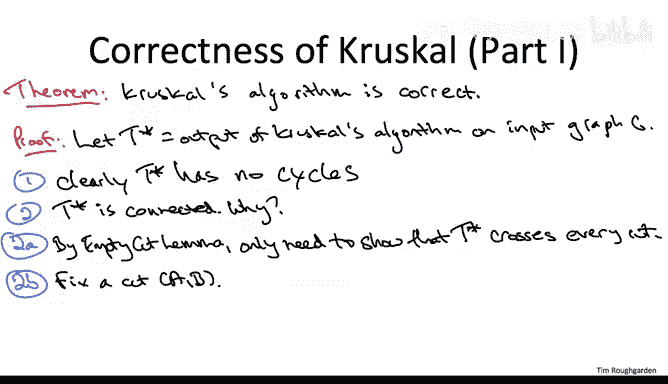
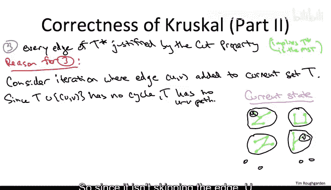

# 093：Kruskal算法正确性证明 🧩





在本节课中，我们将学习如何证明Kruskal最小生成树算法的正确性。我们将通过三个步骤来论证：首先证明算法输出的是一个生成树，然后证明该生成树是最小成本的。我们将依赖“割性质”这一核心概念来完成证明。

---



## 生成树性质的证明 🌳





上一节我们介绍了证明的整体计划，本节中我们首先来论证Kruskal算法的输出是一个生成树。生成树需要满足两个条件：无环性和连通性。



### 无环性证明

Kruskal算法的伪代码明确排除了会形成环的边。以下是算法中避免环的核心逻辑：

```pseudocode
对边按权重升序排序
初始化空集合 T
for 每条边 e (按排序顺序):
    if 将 e 加入 T 不会形成环:
        将 e 加入 T
```

因此，算法的输出 **T*** 不可能包含任何环。



### 连通性证明

要证明输出 **T*** 是连通的，我们需要借助“空割引理”。该引理指出：一个图是连通的，当且仅当对于图的**每一个割**，都至少有一条边横跨该割。

因此，我们只需证明对于任意割 (A, B)，**T*** 都至少包含一条横跨边。

**论证过程如下：**
1.  假设输入图 G 是连通的，则对于任意割 (A, B)，G 中至少有一条横跨边。
2.  Kruskal算法会按权重顺序扫描 G 中的每一条边。
3.  考虑算法**第一次**遇到横跨割 (A, B) 的边 e 的时刻。
4.  在此时刻，集合 **T*** 中尚未包含任何横跨该割的边（因为 e 是第一次被遇到）。
5.  根据“孤独割推论”，如果一条边是横跨某个割的**唯一**边（即“孤独”的），那么它不可能属于任何环。
6.  因此，将边 e 加入当前集合不会形成环，算法必定会将其加入 **T***。
7.  由于割 (A, B) 是任意的，这意味着 **T*** 横跨了所有割，因此 **T*** 是连通的。

综上所述，Kruskal算法的输出 **T*** 是一个生成树。

---

## 最小生成树性质的证明 ⚖️


上一节我们证明了Kruskal算法输出的是生成树，本节中我们来看看如何证明它是最小成本的。我们将论证算法选择的每一条边都符合“割性质”，因此都是某个最小生成树的一部分。

### 割性质的应用回顾

割性质指出：对于图的任意割，如果一条边是该割上权重最小的横跨边，那么这条边必然属于图的某个最小生成树。


在Prim算法的证明中，这一点是显然的，因为Prim算法就是依据“选择某割的最小横跨边”来运行的。但Kruskal算法的伪代码中并没有显式地提到“割”。因此，我们需要证明：Kruskal算法在添加每条边时，都**等价于**选择了某个割的最小横跨边。

### 中间迭代状态分析

让我们“冻结”Kruskal算法的任意一次迭代。假设此时算法已选择的边集为 **T**，即将加入的边为 **e = (u, v)**。

由于算法决定加入边 **e**，我们知道在当前的边集 **T** 下，顶点 **u** 和 **v** 必定位于不同的连通分量中（否则加入 **e** 会形成环）。

### 构造关键割



基于 **u** 和 **v** 分属不同分量这一事实，我们可以构造一个割 (A, B)：
*   将 **u** 所在的连通分量中的所有顶点放入集合 **A**。
*   将图中所有其他顶点放入集合 **B**。
*   显然，**u ∈ A**，**v ∈ B**，且当前边集 **T** 中**没有**边横跨这个割（因为 **A** 就是一个完整的连通分量）。

### 论证 e 是该割的最小横跨边

现在，我们需要证明边 **e = (u, v)** 是这个割 (A, B) 上权重最小的横跨边。

**论证过程如下：**
1.  边 **e** 横跨了割 (A, B)。
2.  由于当前边集 **T** 中没有边横跨该割，因此 **e** 将是算法考虑的所有边中，**第一个**被遇到的横跨割 (A, B) 的边。
3.  我们之前已经论证过：Kruskal算法**必定会选取**它遇到的第一个横跨任何给定割的边（因为此时加入该边不会形成环）。
4.  同时，Kruskal算法是**按权重升序**检查边的。
5.  因此，作为算法遇到的第一个横跨割 (A, B) 的边，**e** 也必定是原始图 **G** 中所有横跨该割的边里**权重最小**的那一条。

这恰好满足了“割性质”的条件：**e** 是割 (A, B) 的最小横跨边。因此，将 **e** 加入生成树是正确的选择，它属于某个最小生成树。

由于算法在每次迭代中加入的边都通过这样的割被证明是合理的，所以最终构建出的整个生成树 **T*** 就是一个最小生成树。

---

## 总结 📝

本节课中我们一起学习了Kruskal算法正确性的完整证明。

1.  **首先**，我们证明了算法的输出是一个生成树，这通过论证其**无环性**（算法显式避免环）和**连通性**（利用“空割引理”和“孤独割推论”）来完成。
2.  **接着**，我们证明了该生成树是最小成本的。核心在于展示算法加入的每一条边 **e**，都对应于一个特定的割，并且 **e** 是该割上权重最小的横跨边，从而符合**割性质**。这利用了算法**按权重排序**和**遇到横跨割的第一条边必选**这两个关键行为。

因此，Kruskal算法总能正确地找到给定连通图的最小生成树。