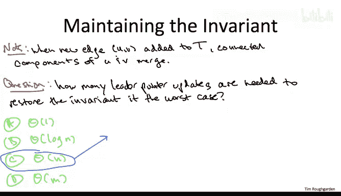
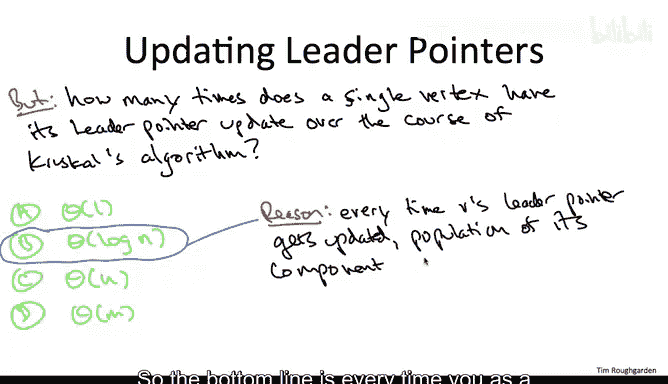
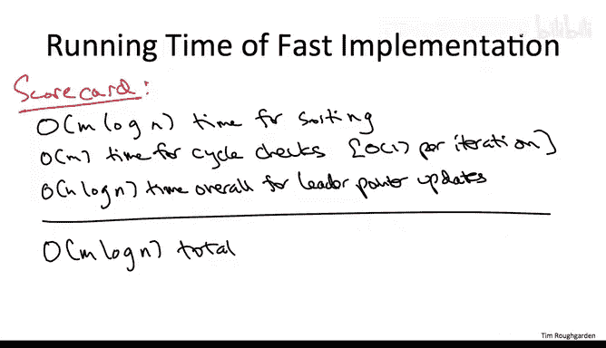

# 095：通过并查集实现Kruskal算法二

在本节课中，我们将学习如何使用并查集数据结构来高效地实现Kruskal算法，特别是如何以常数时间检查环路，并通过巧妙的优化将总运行时间控制在近乎线性的水平。

## 目标与基本思想

上一节我们介绍了Kruskal算法的框架，本节中我们来看看如何高效地检查环路。我们的目标是能够在Kruskal算法中以**常数时间**检查加入一条边是否会形成环路。

并查集数据结构实现的第一也是最基本的思想是：为Kruskal算法当前已选边构成的**每个连通分量**维护一个**链式结构**。所谓链式结构，是指图中的每个顶点都有一个额外的指针字段。此外，在每个连通分量中，我们会指定一个顶点（具体是哪个无关紧要）作为该分量的**领导者顶点**。

我们将维护一个关键的不变性：**每个顶点通过其额外指针，都指向其所在连通分量的领导者顶点**。

例如，假设有两个不同的连通分量，一个包含顶点U、V、W，另一个包含X、Y、Z。U可能是第一个分量的领导者，X是第二个分量的领导者。那么，V和W的指针应指向U，U的指针指向自身；Y和Z的指针应指向X，X的指针指向自身。这样，每个分量实际上继承了其领导者顶点的“名字”。

## 常数时间环路检查

有了这个不变性，进行常数时间的环路检查就变得非常简单。检查加入边(U, V)是否会形成环路，本质上就是检查U和V是否已经在同一个连通分量中。

给定两个顶点U和V，我们如何知道它们是否在同一个连通分量中？我们只需跟随它们各自的领导者指针，看是否到达同一个顶点。如果它们在同一个分量中，我们会得到相同的领导者；如果在不同分量中，则得到不同的领导者。因此，检查环路只需比较U和V的领导者指针是否相等，这显然是常数时间操作。

更一般地说，在这种并查集数据结构中实现`Find`操作的方法是：给定一个顶点，只需跟随其领导者指针，并返回最终到达的顶点。

只要这个简单数据结构的不变性得到满足，我们就能实现所需的常数时间环路检查。

## 维护不变性的挑战

然而，每当数据结构发生变化时（例如进行`Union`操作合并两个分组），我们都需要担心不变性是否会被破坏，以及如何在不做过多工作的情况下恢复它。

在Kruskal算法的上下文中，情况如下：
*   当一条边会形成环路时，我们跳过它，不改变数据结构。
*   当一条边**不会**形成环路时，Kruskal算法要求我们将此边加入正在构建的集合T中，这会将两个连通分量融合为一个。

问题在于融合会破坏不变性。原来有两个领导者，现在必须只有一个。我们必须更新一些领导指针以恢复不变性。

为了确保你理解这个重要问题，请思考：在最坏情况下，为了恢复不变性，可能需要更新多少个领导指针？

答案是：可能需要与顶点数n成**线性**关系的指针更新次数。一个简单的理解方式是想象Kruskal算法添加的最后一条边，它将最后两个连通分量合并为一个。这两个分量可能各有n/2个顶点。从两个领导者变为一个，其中一组n/2个顶点必须将其领导指针更新为另一组的领导者。

这令人担忧，因为我们希望算法接近线性时间。如果每次边添加（共O(m)次）都可能触发线性次数的指针更新，那将导致**二次**时间复杂度。

## 优化一：保留较大分量的领导者

幸运的是，这只是第一个想法。第二个优化非常自然：在合并两个分量A和B时，我们不计算全新的领导者，而是**重用**其中一个分量的领导者（例如A的领导者）。这样，只有来自另一个分量（B）的顶点需要重写其领导指针。

那么，应该保留哪个领导呢？显然，应该保留**较大**分量的领导者。这样需要重写的指针更少。例如，如果一个分量有1000个顶点，另一个有100个，保留大分量的领导者只需更新100个指针；反之则需要更新1000个。

为了实现这个优化，我们需要快速判断哪个分量更大。我们可以扩充数据结构，为每个分量维护一个`size`字段（记录分量中的顶点数）。这样就能在常数时间内比较两个分量的大小，并在常数时间内决定保留哪个领导者。合并后，新分量的`size`就是两个旧分量`size`之和。

然而，即使有这个优化，在最坏情况下（例如最后合并两个大小均为n/2的分量），单次合并仍然可能需要更新Θ(n)个领导指针。因此，这个优化虽然在实际中很聪明，但在我们的渐近运行时间分析中似乎没有带来改善。

## 顶点视角的分析与对数界

但是，如果我们从**顶点中心**的视角来看待所有领导指针更新的总工作量呢？

假设你是图中的一个顶点。在Kruskal算法开始时，你处于自己的孤立分量中，指向自己。随着算法运行，你的领导指针会周期性地被更新。在优化策略下（总是保留较大分量的领导者），你的指针**只会在你所在的分量是较小分量时被更新**。

关键结论来了：在整个Kruskal算法过程中，**每个顶点的领导指针最多被更新O(log n)次**。

原因如下：假设你所在的某个分量有k个顶点。当你的领导指针被更新时，意味着你的分量（大小为k）与一个**至少同样大**的分量合并了（因为你的分量是较小的那个）。因此，合并后你所属的新分量大小至少是2k。也就是说，**每次你的领导指针被更新，你所属的分量大小至少翻倍**。你从一个大小为1的分量开始，而一个连通分量的大小不会超过n。因此，你所能经历的“翻倍”次数最多是log₂ n次。这就限制了你作为图中一个顶点，其领导指针被更新的次数。

## 运行时间分析

基于这个非常棒的性质，我们现在可以对使用并查集数据结构的Kruskal算法进行良好的运行时间分析。

算法的工作主要分为三部分：
1.  **预处理排序**：将边按权重从小到大排序。这需要**O(m log n)**时间（注意，通常我们说O(m log m)，而m最多为O(n²)，所以O(m log n)是等价的）。
2.  **循环检查**：主循环迭代O(m)次，每次检查一条边。利用并查集，我们可以在常数时间内通过比较端点领导指针是否相等来完成环路检查。这部分总时间为**O(m)**。
3.  **维护并查集**：每次向集合T中添加新边（即合并两个分量）时，需要更新领导指针以恢复不变性。我们不再分析单次合并的最坏情况，而是进行**全局分析**。根据顶点视角的分析，所有顶点领导指针更新的总次数为 **n * O(log n) = O(n log n)**。

综合来看，运行时间由三部分相加：O(m log n) + O(m) + O(n log n)。由于m通常至少为n-1（连通图），因此**瓶颈在于预处理排序步骤的O(m log n)**。整个主循环的工作量O(m + n log n)被排序步骤所主导。

因此，使用并查集实现的Kruskal算法的总运行时间为 **O(m log n)**。这与使用堆实现的Prim算法的理论性能相匹配。

## 总结

本节课中我们一起学习了如何用并查集高效实现Kruskal算法：
*   我们通过为每个连通分量维护领导指针，实现了**常数时间**的环路检查（`Find`操作）。
*   我们遇到了合并分量时需要更新大量指针以维护不变性的挑战。
*   我们引入了**保留较大分量领导者**的优化，这虽然不能改善单次合并的最坏情况，但改变了分析视角。
*   通过从**单个顶点**的视角分析，我们得出了每个顶点的领导指针最多更新**O(log n)**次的关键结论。
*   基于此，我们进行了全局运行时间分析，得出总时间为**O(m log n)**，其瓶颈在于边的排序预处理。

与基于堆的Prim算法一样，Kruskal算法也因此获得了近乎线性的运行时间（仅比读入输入多一个对数因子），在实践中极具竞争力。