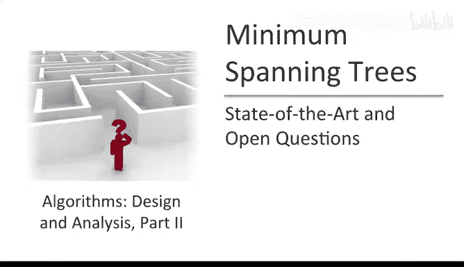

# 096：最小生成树研究现状与开放问题 🧩

在本节进阶选学内容中，我们将探讨计算最小生成树问题的研究前沿。我们将回顾已有的优秀算法，了解理论上的最优解，并揭示该领域至今仍存在的开放性问题。

## 算法现状回顾

上一节我们介绍了Prim算法和Kruskal算法。这两种算法在配合合适的数据结构时，都能在接近线性的时间内运行，时间复杂度为 **O(m log n)**，其中 **m** 是边数，**n** 是顶点数。

一方面，我们应该对这些算法感到满意，因为它们仅比读取输入所需的时间慢一个对数因子。但另一方面，优秀的算法设计者永不满足，他们总会问：我们能否做得更好？也许我们可以超越 **m log n**。

## 理论上的突破

令人惊讶的是，至少在理论上，我们可以做得比这些经典实现更好。以下是几个在渐进时间复杂度上优于 **m log n** 的MST算法参考文献。

*   **随机化线性时间算法**：如果你能接受随机化算法（就像我们在快速排序算法中那样），那么最小生成树问题可以在线性时间内解决。这显然是最优的算法，因为计算最小生成树必须查看整个图。该算法由Karger和Tarjan等人提出，其时间复杂度为 **O(m)**，仅比读取输入所需时间多一个常数因子。
*   **确定性近线性时间算法**：如果我们不满足于仅基于算法随机性的期望运行时间，而想要一个确定性算法，情况则不同。目前我们尚不清楚是否存在确定性的线性时间MST算法，这是一个开放性问题。但我们知道存在一个运行时间极其接近线性的确定性算法，其时间复杂度为 **O(m α(n))**。

### 关于逆阿克曼函数 α(n)

这里的 **α(n)** 是逆阿克曼函数。定义阿克曼函数及其逆函数需要一些工作，此处不展开。你只需知道这是一个增长极其缓慢的函数。

为了让你体会其缓慢程度，这里有一个比逆阿克曼函数增长快得多的函数 **log\* n**（迭代对数）作为对比：

以下是 **log\* n** 的定义方法：
1.  在计算器中输入一个数字 **n**。
2.  反复按下 **log** 按钮（计算以2为底的对数）。
3.  记录需要按多少次 **log** 按钮，结果才会降至 **1** 以下。这个次数就是 **log\* n**。

**log\* n** 是“幂塔函数”的逆函数。你可以尝试在计算器或电脑中输入你能想到的最大数字（比如一连串的9），然后计算它的 **log\* n**，结果很可能在 **5** 左右。由此可见，**log\* n** 的增长已经慢得惊人，而逆阿克曼函数 **α(n)** 的增长比 **log\* n** 还要慢得多。

因此，算法社区几乎已经确定了MST问题的时间复杂度，但在确定性情况下尚未完全解决。正确答案介于 **O(m)** 和 **O(m α(n))** 之间，我们尚不清楚具体是哪一个。

## 未解之谜与开放问题

事情甚至变得更加奇特。Pettie和Ramachandran的一项研究在某种意义上“解决”了确定性MST问题。他们提出了一个算法，并证明了其时间复杂度是最优的（即没有其他算法能在渐进意义上比它更好）。然而，他们并未明确计算出该算法的具体时间复杂度。所以，我们已知该问题存在一个最优的时间复杂度，也已知一个能达到此复杂度的算法，但至今我们仍不知道这个最优的时间复杂度，作为图大小的函数，具体是什么。

以上是我们对最小生成树问题已知的一些最前沿进展。接下来，让我提几个至今我们仍不知道的事情。

### 随机化算法的开放问题

你可能会认为随机化算法领域没有开放问题了，因为我们知道解决问题需要线性时间，并且我已经告诉过你存在期望运行时间为线性的随机化算法。但我们还想要一个不仅线性时间，而且足够简单的算法，简单到可以教给本科生（比如在本课程中），或者至少能在研究生课程中讲授。目前的线性时间算法不具备这个特性，它们甚至复杂到无法在研究生课程中完整覆盖。

要实现这个目标，解决一个看似更简单的任务就足够了：为 **MST验证问题** 设计一个简单的随机化线性时间算法。

*   **MST问题**：你需要从指数级数量的生成树中优化，找到总边权最小的那一个。
*   **MST验证问题**：我给你一个候选的生成树（它可能最优，也可能不是），你只需要检查它是否是最优的。此外，如果它不是最优的，你应该告诉我哪些边不在最小生成树中（即哪些边太贵，应该被丢弃）。

之所以解决这个看似更简单的问题就足够了，是因为Karger和Tarjan论文的核心内容是一个归约：一个从生成树优化问题到MST验证问题的随机化归约。该论文中新颖的、线性的、随机化的内容其实非常简单，我曾在研究生课程中讲授。但它需要一个MST验证子程序作为黑盒，而目前已知的线性时间MST验证实现都相当复杂。因此，**找到一个能在线性时间内运行的、简单的MST验证方法，你就能得到一个简单的最优MST算法**。

### 确定性算法的开放问题

确定性算法的终极目标很明显：我们渴望有一个运行在线性时间的确定性MST算法。或者，至少我们需要弄清楚确定性MST算法可能的最佳时间复杂度到底是什么。

## 总结与延伸阅读

本节课中，我们一起学习了最小生成树问题的研究前沿。我们了解到，尽管Prim和Kruskal算法已经非常优秀，但理论上存在更快的随机化线性时间算法和确定性近线性时间算法。同时，我们也认识到，即使经过过去50年左右计算机科学家在算法设计与分析上的惊人进步，我们仍然对一些完全基础的事情缺乏理解，例如确定性线性时间算法的存在性、最优时间复杂度的精确表达式，以及简单随机化线性时间算法的构造。这意味着未来仍有伟大的思想等待被发现。

如果你对本视频中讨论的内容感兴趣，并想了解更多关于这些高级最小生成树算法的知识，我推荐Jason Eisner撰写的一篇综述文章《State of the Art Minimum Spanning Tree Algorithms》。这篇文章虽然已有约15年历史，但仍然是学习这些高级材料的绝佳资源。