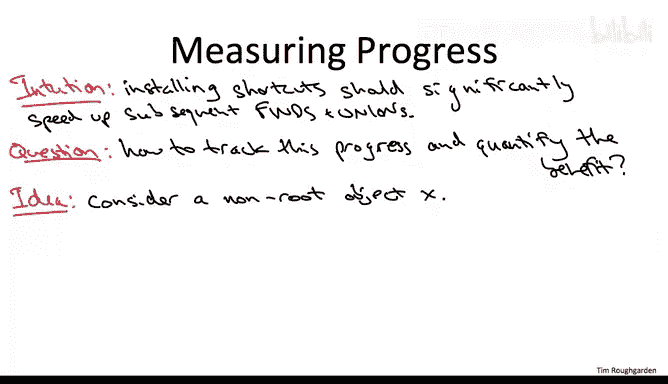

# 103：路径压缩-Hopcroft-Ullman分析一-进阶选学

## 📋 概述

在本节课程中，我们将学习并证明带路径压缩的并查集数据结构的第一个性能保证。这个由Hopcroft和Ullman提出的定理指出，对于任意包含M次操作的序列，其总工作量最多为M乘以一个增长极慢的函数log* n。我们将深入探讨证明背后的直觉和核心思想。

---

## 🎯 性能保证与定理陈述

考虑一个使用惰性合并、按秩合并以及路径压缩优化的并查集数据结构。对于一个包含M次合并与查找操作的任意序列，其保证是：在整个操作序列过程中，你所做的总工作量最多为操作次数M乘以增长极慢的函数log* n。

需要记住，log* n定义为：在得到一个小于1的结果之前，你需要对n应用对数函数的次数。例如，2的65536次方是一个极其巨大的数字，但其log*值仅为5。

这个定理无论M是多少都成立，无论你执行的操作是很少还是非常多。我们将重点关注M在渐进意义上至少与n一样大的情况，即M是Ω(n)。你可以自行思考，我们即将看到的论证为何能推出无论M为何值定理都成立。

在转向证明之前，关于这个保证还有一个重要的说明：定理**并非**声称每一次查找和合并操作都在O(log* n)时间内运行。因为一个更强的、声称每个操作都是O(log* n)的陈述通常是错误的。总会有一些操作花费超过log* n的时间。

一方面，我们知道即使没有路径压缩，也没有操作会比对数时间更慢。有了路径压缩，我们也不会做得比log n更差。因此，最坏情况时间界限是log n，但有些操作确实可能运行得那么慢。然而，在一个包含m次操作的序列中，我们每次操作平均完成的工作量仅为log* n。这正是我们在第一次使用积极合并的并查集实现中所做的那种所谓的“摊还分析”。我们同意特定的合并操作可能需要线性时间，但在一系列合并操作中，我们只花费了对数时间。这里的情况类似，区别在于我们在一系列操作中得到了一个显著更好的平均运行时间界限log* n。

---

## 💡 证明思路与直觉

在深入证明细节之前，我们先花一点时间讨论证明计划，特别是我们试图在后续证明中精确化和数学化编码的性能背后的直觉。

如果我们希望证明一个优于没有路径压缩时受困的log n界限，那么安装所有这些快捷方式必须从本质上加速查找和合并操作。在某种程度上，很明显事情必须被加速，因为你用单个指针替换了一条旧的指针链，所以你只能更快。

但如何跟踪这种进展？如何将这种直觉编译成一个严格的保证？

以下是核心思路：让我们聚焦于一个对象X，它此刻不再是根节点，其父节点是自身以外的某个节点。

从我们按秩合并的分析中，需要记住的一点是：一旦一个对象不再是根节点，它的秩就永远冻结了。我们在没有路径压缩的背景下证明了这一点。但请再次记住，在有路径压缩时，我们以完全相同的方式操作秩。所以这仍然成立。如果你是一个对象且不再是根节点，你的秩将永远不会再改变。

我们现在当然希望的是，起源于这个对象X的查找操作运行得很快，不仅如此，随着时间的推移，由于我们进行了越来越多的路径压缩，它们应该变得越来越快。

核心思路如下：我们推理查找操作最坏情况运行时间（或者说，为了到达根节点可能需要遍历的最长父指针序列）的方法是，我们将考虑从对象X向上遍历这些父指针直到根节点时观察到的秩的序列。

让我举个例子。最坏情况会是：假设我们有一个数据结构，最大秩大约是100。我们可能看到的最长秩序列、最坏情况序列会是：我们在一个秩为0的对象处开始一个查找操作，遍历一个父指针到达其父节点，其秩为1；再遍历其父指针，秩为2；然后是3、4，依此类推直到100。请记住，每当我们遍历一个父指针时，秩必须严格递增，正如我们讨论过的，无论有没有路径压缩这都是成立的。因此，在最坏情况下，要从0到100，你必须遍历100个指针。

这很糟糕，不是吗？如果我们每次遍历一个父指针时，秩的增加不是1，而是一个大得多的数字，那该多好。例如，如果我们从0到10，到20，到30，到40，依此类推，那将保证我们只需10步就能到达最大秩节点100。所以，重申一下，关键在于：如果我们能在对象与其父节点的秩之间有一个更好、更大的下界，那就意味着在我们可能看到的节点可能秩中进展更迅速，并转化为更快的查找、更少的父指针遍历。

---

## 📊 进展度量与路径压缩的益处

基于“秩之间的巨大差距意味着快速进展”这一思路，我想为给定的非根对象X提出一个进展度量：X的秩（请再次记住，它永远冻结了）与其当前父节点的秩之间的差距。

这个进展度量是一个好的选择，原因有二：首先，正如我们刚刚讨论的，如果你能控制这个差距，如果你能为其设定一个下界，那么这就能给你一个搜索时间的上界。其次，这个差距允许我们量化安装这些快捷方式（即路径压缩）的好处。具体来说，每当你安装一个新的快捷方式，重新连接一个对象的父指针指向树中更高的位置时，它的新父节点的秩将严格大于其旧父节点。这意味着这个差距只会变得更大。总结来说，路径压缩改善了这个进展度量。

也就是说，如果一个对象X之前有一个父节点P，然后其父指针被重新连接到另一个节点P‘，那么P’的秩大于P的秩。

为了确保这一点绝对清晰，让我们画几个示意图例子。

首先，抽象地思考：考虑一个对象X，假设它有某个父节点P，并假设树的根是某个P‘，即树中更上游的某个祖先。请记住，当你沿着父指针向上遍历树时，秩总是递增的。所以这意味着P的秩严格大于X，P’的秩严格大于P。因此，当你将X的父指针从P重新指向P‘时，它获得了一个新的父节点，并且这个新父节点是其旧父节点的祖先，因此它的秩必须严格更大。由于这个原因，X的秩（永远固定）与其新父节点秩之间的差距，大于其秩与其旧父节点秩之间的差距。

你也可以在我们上一视频中使用的七个对象运行示例中看到这种效果的实际作用。

我已经展示了那个示例树在路径压缩前后的情况（用粉色表示）。在路径压缩之前，我按照按秩合并的方式定义了秩，使得每个节点的秩等于从叶子到该节点的最长路径长度。当然，当我们应用路径压缩时，我们不改变秩。我们观察到什么？恰好有两个对象的父指针被重新连接：即对象1和4的父指针被重新指向直接指向7。结果，对象1与其父节点之间的秩差距从仅仅1（其秩与节点4的秩之差）跃升到了3（其秩与其新父节点7的秩之差）。类似地，对象4的秩差距从1跳到了2。它的秩只比其旧父节点6小1，但比其新父节点7小2。

---

## 🧱 证明的核心构件

信不信由你，我们实际上已经拥有了Hopcroft-Ullman分析的两个关键构建模块。

构建模块一：是我们几个视频前讨论过的秩引理。无论有没有路径压缩，具有给定秩r的对象数量不能太多，最多有n / 2^r个。

构建模块二：就是我们刚刚讨论的，每次在路径压缩下更新一个父指针时，该对象的秩与其新父节点秩之间的差距必须增长。

证明的其余部分只是对这两个构建模块的最佳利用。现在让我向你展示细节。

---

## 📝 总结

本节课中，我们一起学习了Hopcroft-Ullman对带路径压缩的并查集性能分析的第一部分。我们明确了定理的陈述：对于任意M次操作的序列，总工作量为O(M log* n)。我们探讨了证明的核心直觉，即通过跟踪对象与其父节点秩之间的“差距”作为进展度量，并理解了路径压缩如何通过增大这个差距来加速后续操作。最后，我们指出了完成证明所需的两大核心构件：秩的数量限制引理，以及路径压缩会增大秩差距的性质。下一节我们将利用这些构件完成正式的证明。