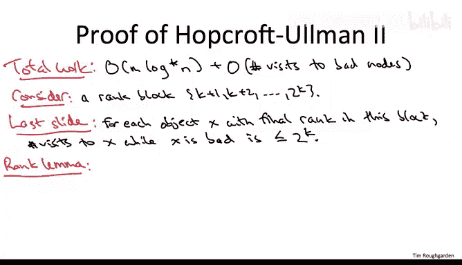

# 104：路径压缩-Hopcroft-Ullman分析二-进阶选学 🔍

在本节课中，我们将深入探讨Hopcroft-Ullman分析的第二部分，重点是利用“秩块”和“好/坏节点”的定义，来全局地分析路径压缩下并查集操作的平摊时间复杂度。我们将证明，在路径压缩优化下，每个`find`操作的平均时间复杂度为**O(log* n)**。

---

## 秩块的定义 📊

上一节我们介绍了秩引理和路径压缩提升父节点秩的核心概念。本节中，我们来看看如何利用“秩块”来量化这种提升。

首先，我们需要建立一些符号和定义。第一个是秩块的定义。

对于一个给定的n（数据结构中对象的数量），我们如下定义秩块：
*   0和1各自构成一个块。
*   下一个块是2, 3, 4。
*   再下一个块从5开始，最后一项是2⁴，即16。
*   接着的块从17开始，直到2¹⁶，即65536。
*   以此类推，直到我们拥有足够多的秩块来覆盖n。

实际上，由于秩最多为log n，我们只需要覆盖到log n，但这不会影响常数级别以上的结果，所以我们可以直接覆盖到n。

那么有多少个秩块呢？关注每个秩块的最大成员。一个给定秩块的最大成员是2的（前一个秩块的最大成员）次方。因此，对于第t个秩块，其最大成员大致是 `2^(2^(...^2))`（t次）。你需要进行多少次这样的操作才能达到n？根据定义，你需要 **log* n** 次。这就是秩块的数量，也是 **log* n** 进入分析的地方。

这个定义可能看起来非常晦涩。让我解释一下应该如何理解它们。

秩块旨在编码我们在上一张幻灯片中提到的直觉：当一个对象的父节点的秩远大于该对象本身的秩时，我们应该感到“满意”。为什么？因为当我们遍历该对象的父指针时，我们在秩空间中取得了巨大进展，而在秩空间中取得巨大进展的次数是有限的，这意味着父指针遍历次数少，即`find`操作快。

这些秩块是定义“足够进展”的一种非常巧妙的方式。具体来说，当一个对象的秩与其父节点的秩位于不同的秩块时，我们就感到满意；如果它们位于同一个秩块中，我们就不满意。

例如，如果你在一个秩为8的对象处，然后去到其秩为18的父节点，那么我们满意，因为18位于包含8的秩块之后的下一个秩块中。另一方面，如果你从秩8去到秩15，那么我们不满意，我们称之为对象秩与其父节点秩之间的差距不够大。

---

## 好节点与坏节点 🏷️

基于这个想法，我们来做另一个定义。

考虑一个给定的时间快照（即我们已经进行了一些`find`和`union`操作序列）。在此时刻，我们将一些对象称为“好”的，另一些称为“坏”的。以下是判断好坏的标准：
*   首先，如果你是树的根节点，你是好的。
*   如果你是根节点的直接后代（即你的父节点是你所在树的根节点），那么你也是好的。
*   如果不是（即你在树中更深的位置），那么当且仅当你的父节点的秩位于一个严格大于你自身秩的秩块中时，你才是好的。

这个定义的作用是将我们所做的工作分为两部分：
1.  访问好节点所做的工作。
2.  访问坏节点所做的工作。

访问好节点所做的工作将非常容易界定。访问坏节点所做的工作总量，则需要一个单独的全局分析来界定。这种二分法与我们在分析使用带急切合并的并查集数据结构实现Kruskal算法时遇到的情况完全相同。在那里，Kruskal算法中的部分工作可以逐次迭代轻松界定（例如，每次环检查只花费常数时间），但还有一种更复杂的工作（即所有领导指针的更新），需要通过单独的论证进行全局界定。这里将发生完全相同的事情：好节点可以按操作逐个界定，而坏节点则需要一个全局分析来控制所有操作的总工作量。

更精确地说，我这样设置定义，使得每次操作中访问好节点所做的工作量都以 **O(log* n)** 为界。

确实，在一次`find`操作中（例如从某个对象X开始），你最多可能访问多少个好节点？你沿着父指针一直向上遍历到根节点。首先，有根节点本身。其次，有根节点的直接后代。这是2个。我们把它们放在一边。你在路径上遇到的其他好节点呢？根据定义，当你访问一个好节点时，其父节点的秩位于一个比该节点自身秩更大的秩块中。也就是说，每次你从一个好节点遍历其父指针时，你都会前进到下一个秩块。而总共只有 **log* n** 个秩块。因此，你最多只能前进 **log* n** 次。所以，你将看到的好节点总数是 **O(log* n)**。

---

## 总工作量分解 ⚖️

现在，让我们来表达在所有`find`和`union`操作中完成的总工作量，即这两部分之和：访问好节点的工作量（我们现在知道每次操作仅为 **log* n**），加上访问坏节点的工作量（目前我们还不知道有多大）。

总工作量 = (访问好节点的工作) + (访问坏节点的工作)

---

## 坏节点工作量的全局界定 🎯

现在，让我们着手进行对坏节点总工作量的全局界定，这实际上是整个定理的核心。

让我们快速回顾一下定义：成为一个坏节点意味着什么？
1.  你不是根节点。
2.  你不是根节点的直接后代（即你有一个祖父节点）。
3.  你的父节点的秩并不在更晚的秩块中，它恰好与你自身的秩位于同一个秩块中。这就是你“坏”的含义。

我们如何界定在坏节点上花费的工作量？让我们一次分析一个秩块。

固定一个任意的秩块，假设对于某个整数K，其最小秩是K+1，最大秩是2^K。

现在，我要用到我们的两个主要构建模块。第一个是秩引理，我稍后会请你记住它。但首先，我想使用我们的另一个构建模块：**路径压缩会增加对象与其父节点之间的秩差**。这就是我们现在要用的。

具体来说，考虑一次`find`操作以及它访问的一个坏对象X。由于X是坏的，它不是根节点，也不是根节点的直接后代。因此，根节点是其父节点更上层的祖先。所以，X的父指针将在随后的路径压缩中被改变，它将被重新连接到指向根节点（其先前父节点的一个严格祖先）。因此，其新父节点的秩将严格大于其先前父节点的秩。

只要X在处于坏的状态时被访问，这种情况就会持续发生。它不断获得新的父节点，而这些新父节点的秩总是严格大于前一个父节点。那么，在X的父节点的秩增长到足以位于后续秩块之前，这种情况能发生多少次？

X的秩块中的最大值是2^K。请记住，X是一个非根节点，其秩是永久冻结的，所以它始终卡在这个秩块中。一旦其父节点的秩更新到至少2^K+1，那么该秩就必须大到足以位于下一个秩块中。在那一刻，X不再是坏的。它的父指针取得了如此大的进展，进入了另一个秩块。现在，我们必须称它为好的。

当然，一旦X以这种方式变成好的，它将永远是好的。它不是根节点，永远不会再成为根节点。它的秩永远冻结，而其父节点的秩只能上升。所以，一旦你是好的，一旦你父节点的秩足够大，它在剩余的时间里都将保持足够大。

好的，我们快完成了。让我们确保没有忘记我们已经做的任何事情。

我们正在以这两种方式界定总工作量。首先，每次操作我们访问 **log* n** 个好节点。所以，对于M次操作，好节点部分的总工作量是 **O(M log* n)**。加上在M次操作中访问坏节点的次数，我们将全局界定这部分工作，但我们将按秩块进行。

我们固定了一个秩块K+1到2^K。我们在上一张幻灯片中证明，对于每个最终冻结秩位于此秩块中的对象X，它在处于坏的状态时被访问的次数（在它永远变成好节点之前可以被访问的次数）以 **2^K** 为上界。

---

## 应用秩引理完成分析 ✅

现在我们已经使用了我们的一个关键构建模块（路径压缩增加父节点秩），让我们使用另一个构建模块：秩引理。

秩引理指出，在任何给定时刻，对于任何可能的秩r，当前秩为r的对象数量不可能超过 **n / 2^r**。

让我们使用秩引理来上界可能有多少个节点的最终冻结秩位于这个秩块中（即最终冻结秩在K+1到2^K之间）。

我们可以对所有在秩块中的秩进行求和。从K+1开始，直到2^K。根据秩引理，对于给定的i值，我们知道最终秩为i的对象最多有 **n / 2^i** 个。通过通常的几何级数求和，整个和可以上界为 **n / 2^K**。

现在，这开始看起来像一个神奇的巧合。当然，我们在分析中做了许多定义，特别是我们构建了秩块，以便这种神奇的事情发生。具体来说，一个秩块的居民数量（**n / 2^K**）乘以一个居民在处于坏的状态时被访问的最大次数（**2^K**），这两个数相乘实际上与秩块无关。我们将这两者相乘：每个对象的访问次数 **2^K**，对象的数量 **n / 2^K**，我们得到什么？我们得到 **n**。

这仅仅计算了在一个给定秩块中访问坏对象的次数。但并没有那么多秩块，记住，只有 **log* n** 个。

因此，这意味着访问坏节点所花费的总工作量，在所有秩块上求和，是 **O(n log* n)**。

---

## 最终结论 🏁

结合好节点和坏节点的界限，我们得到总工作量为 **O(M log* n + n log* n)**。

在开始时我提到，有趣的情况是当 **M = Ω(n)** 时。在这种情况下，这个界限就是 **O(M log* n)**。本质上，如果你有一个非常稀疏的`union`操作集合，你可以将这个分析分别应用于每个有向树。

以上就是完整的故事：对卓越的Hopcroft-Ullman分析的完整阐述，证明了在路径压缩下，每次操作的平均时间为 **O(log* n)**。

尽管这个分析已经很出色，但你还可以做得更好。这是接下来几个视频的主题。