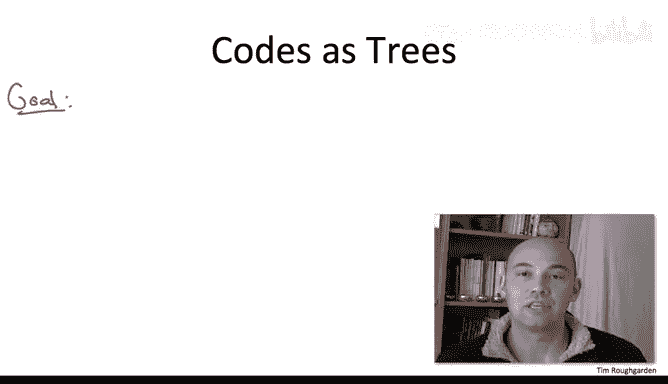
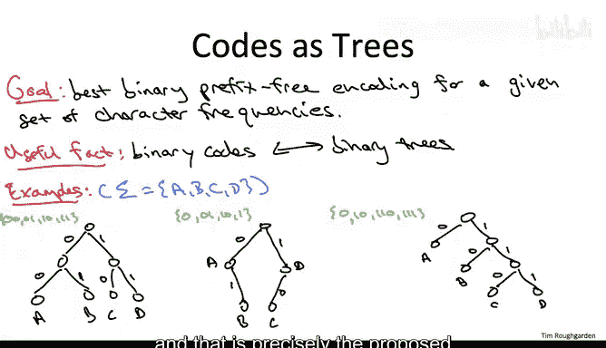
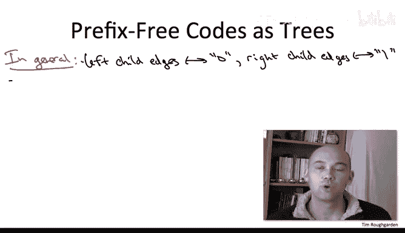
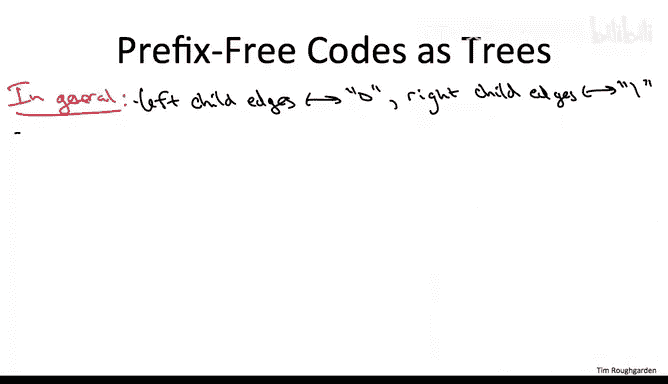
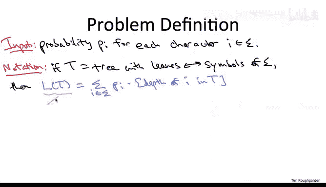
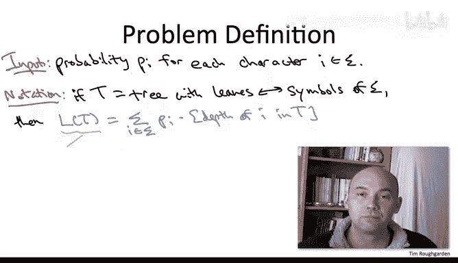
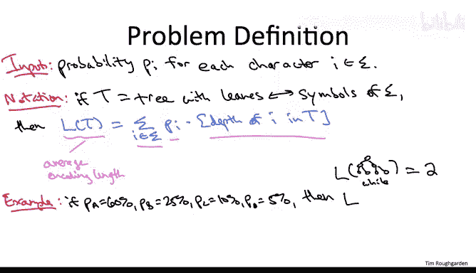

# 109：问题定义 📚

在本节课中，我们将学习如何将“最优二进制前缀编码”问题转化为一个清晰的数学问题。我们将通过将编码与二叉树建立对应关系，来形式化地定义我们的优化目标。

上一节我们介绍了前缀编码的基本概念及其优势。本节中，我们将通过二叉树这一工具，来精确地定义我们所要解决的问题。

## 从编码到二叉树 🌳

理解这个问题的关键在于将二进制编码视为二叉树。为了让你理解这种对应关系，让我们回顾上一节中看到的三个二进制编码例子，并看看它们对应什么样的树。

我们继续使用包含A、B、C、D四个符号的字母表。

### 1. 固定长度编码的树
明显的固定长度编码（A=00， B=01， C=10， D=11）对应一棵有四个叶子的完全二叉树。

按以下方式标记这棵树：
*   从左到右标记叶子为A到D。
*   标记每条边：如果对应左子节点关系，则标记为0；如果对应右子节点关系，则标记为1。

你会发现，从根节点到叶子的路径上的比特序列与固定长度编码相对应。例如，对于符号C，从根节点到标记为C的叶子的路径，首先遇到一个1（右子节点），然后遇到一个0（左子节点），得到序列“10”，这与C的编码相同。

### 2. 非前缀编码的树
当我们最初尝试变长编码以激发前缀属性时，我们研究了一个将A的双00替换为单0，将D的双11替换为单1的编码。这个编码不是前缀编码，但我们仍然可以将其表示为二叉树，只是它不再是完全平衡的。

以同样的方式标记边：左子边标记为0，右子边标记为1。将根的左、右子节点分别标记为A和D，两个叶子标记为B和C。

这样标记后，我们为各个符号提出的编码与从根节点到带有这些符号的节点的路径上的比特序列之间，存在同样的对应关系。例如，标记为D的节点，从根节点出发的路径只有一个比特1，这与D的提议编码一致。

这个编码不是前缀编码，因此存在歧义。这种歧义在树中也很明显：提示你存在歧义的属性是，树中有内部节点被标记了符号。符号并不像第一个固定长度编码的树那样只出现在叶子节点。

### 3. 前缀编码的树
现在，让我们画出上一节看到的最后一个例子——变长但前缀编码的树。

这棵树不是完美平衡的，但它的标签只出现在叶子节点上。

以我们一直使用的方式标记这棵树的边：所有左子边标记为0，所有右子边标记为1。从左到右标记叶子为A到D。你会看到，与之前两棵树一样，从根节点到叶子的比特序列与为该叶子提出的编码一致。例如，标记为C的叶子，你需要遍历一个右子节点、另一个右子节点，然后一个左子节点才能到达，序列是“110”，这正是符号C的提议编码。

## 一般对应关系与关键属性 🔑

一般来说，任何二进制编码都可以用这种方式表示为一棵树：
*   左子指针标记为0。
*   右子指针标记为1。
*   各个节点标记为给定字母表的符号。
*   从根节点向下到标记有给定符号的节点的比特，对应于该符号的提议编码。

将编码视为树的妙处在于，那个看似抽象且麻烦的重要属性——前缀条件，在这些树中以非常清晰的方式显现出来。

**前缀条件等价于：只有叶子节点可以有标签，内部节点不允许有标签。**

原因在于，我们这样设置使得编码对应于从根节点到标记节点的路径上的比特。因此，一个编码是另一个编码的前缀，就对应于一个节点是另一个节点的祖先。所以，如果所有标签都在叶子节点，那么没有节点是另一个节点的祖先，也就没有前缀。

## 解码过程与编码长度 📏

这种编码的树表示法的另一个很酷的地方是，解码过程变得直观明了。

给定一个来自前缀自由二进制编码的0和1序列，解码过程如下：
1.  从序列开头开始，并位于树的根节点。
2.  每当看到一个0，就向左走；每当看到一个1，就向右走。
3.  最终会到达一个叶子节点。该叶子有一个标签，那就是被编码的符号。
4.  到达叶子后，重新开始，回到根节点。

例如，使用我们运行示例中的四字母字母表的变长前缀编码，如果给定序列“0 110 111”，你会这样做：
*   从根开始，看到0，跟随左子指针，立即到达标记为A的叶子。输出A作为第一个符号。
*   重新开始，回到根。看到1，向右；再看到1，再向右；看到0，向左。到达标记为C的叶子。输出C。
*   重新开始，回到根。看到1，向右；再看到1，向右；再看到1，向右。到达标记为D的叶子。输出D。

通过反复遍历树，你将这个0和1序列解码为“A C D”。由于每次到达标签时你都知道自己在叶子节点（无处可去），而在每个内部节点（未标记）你知道需要期待另一个比特，因此从未产生任何歧义。

关于这种对应的最后一个要点是：**符号的编码长度（编码各个符号所需的比特数）就是树中对应叶子节点的深度。**

例如，在我们的运行示例中，符号A是唯一一个只需要1比特编码的，它也是树中唯一一个在第一层的叶子。类似地，B需要2比特，出现在下一层；需要3比特的C和D出现在第三层。

这种对应关系是构造性的：如何编码一个给定的符号？就是从根节点到该叶子路径上的比特，而比特的数量就是从根节点到该叶子所需的指针遍历次数，也就是该叶子在树中的深度。

## 问题的形式化定义 🎯

现在，我们处于一个绝佳的位置，可以真正清晰地定义问题了。

**输入**：只是一堆不同符号 `i`（来自某个字母表 `Σ`）的频率。我将使用 `p_i` 表示符号 `i` 的频率。

我们知道要优化什么：我们希望最小化编码一个符号所需的**期望比特数**，其中平均值是根据提供的各个符号的频率计算的。

现在，让我们利用我们新发现的与二叉树的对应关系来表达这个目标函数，特别是编码长度即叶子深度的概念。

给定一棵对应前缀自由二进制编码的树 `T`（即它应该是一棵二叉树，并且这棵树的叶子应该与 `Σ` 的符号一一对应），我们定义 `L(T)` 为平均编码长度。

**平均编码长度公式**：
`L(T) = Σ (p_i * depth_T(i))`
其中求和遍历字母表的所有符号 `i`。

解释：
*   我们对字母表的所有符号求和。
*   每个符号 `i` 的权重是其频率 `p_i`（这是输入的一部分）。
*   编码符号 `i` 需要多少比特？就是给定树 `T` 中标记为 `i` 的叶子的深度 `depth_T(i)`。

我们的目标就是让这个 `L(T)` 尽可能小。

例如，使用上一节的数据：字母A、B、C、D的频率分别为60%、25%、10%、5%。
*   如果使用完全二叉树（即固定长度编码），我们得到每个字符2比特。
*   如果使用优化过的倾斜树（让A只花1比特，而C和D承受3比特），那么平均编码长度降至1.55，正如上一节所见。

## 目标与算法责任 🏁

那么，目标是什么？我们算法的责任是什么？

**目标**：在所有叶子与 `Σ` 的符号一一对应的二叉树中，计算能使这个平均编码长度 `L(T)` 尽可能小的那一棵，即最小化我们的目标函数 `L`。

事实证明，霍夫曼的贪心算法可以做到这一点。更多细节将在后续课程中介绍。

---

**本节课总结**：在本节课中，我们一起学习了如何将寻找最优前缀编码的问题转化为一个关于二叉树的最小化问题。我们建立了编码与二叉树的对应关系，明确了前缀条件在树中表现为“标签仅存在于叶子节点”，并形式化地定义了优化目标——最小化加权深度和 `L(T)`。这为后续学习霍夫曼算法奠定了坚实的基础。