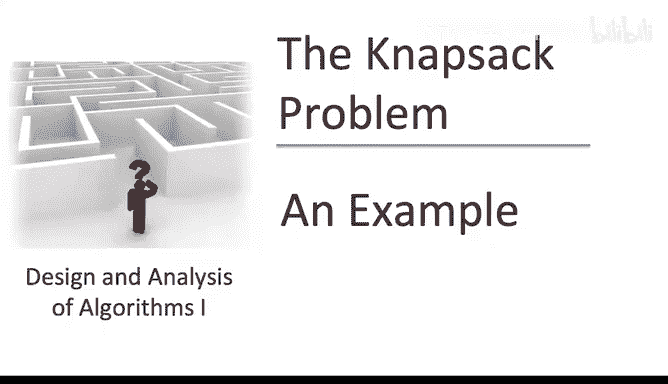
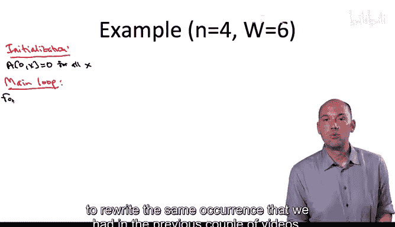
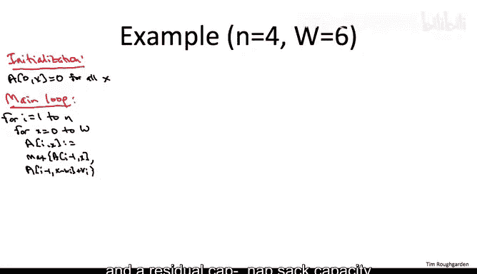
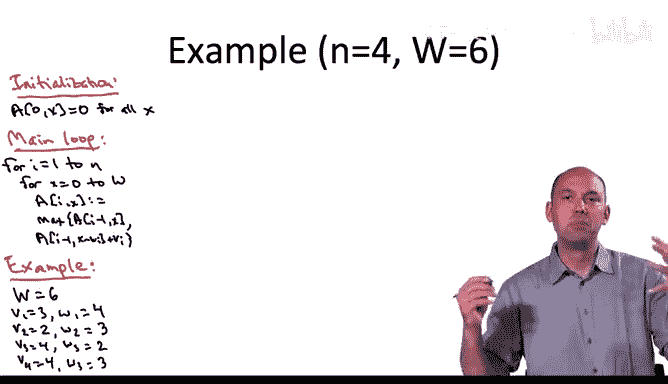
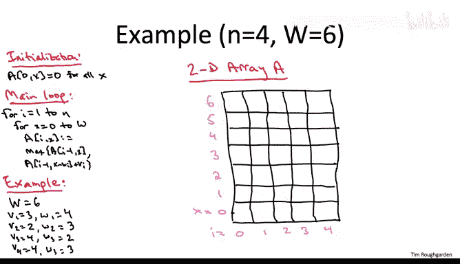
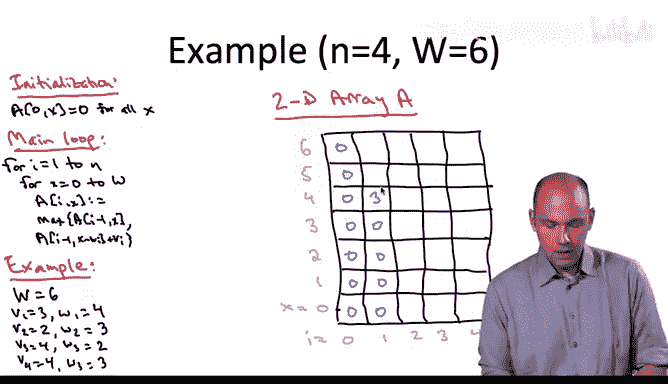
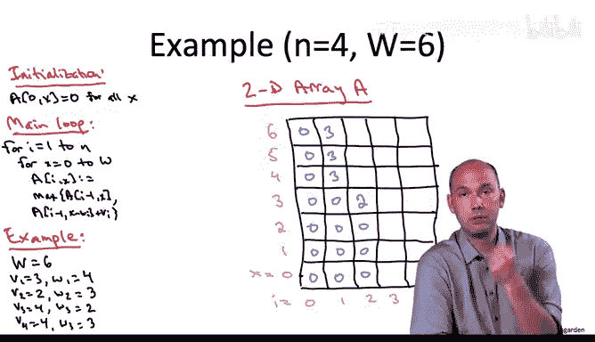
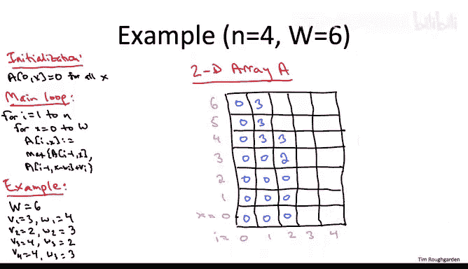
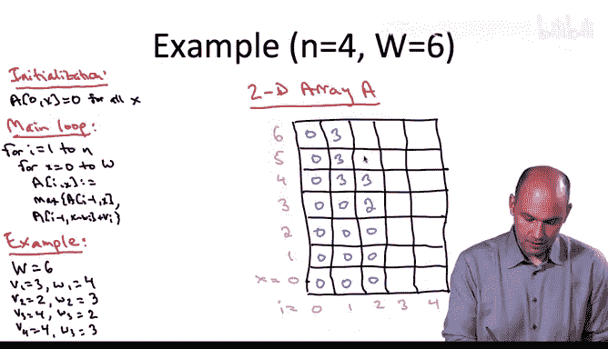
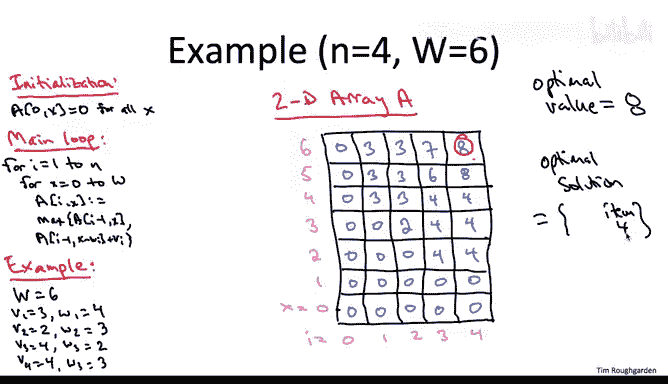

# 121：46_04_04_示例回顾-选学 📚

在本节课中，我们将通过一个具体的例子，回顾动态规划算法在解决背包问题中的应用。我们将一步步填充动态规划表格，并演示如何通过回溯来重构最优解。

---

我们已经掌握了两种动态规划算法。我们学会了如何计算路径中的加权独立集，也了解了解决著名背包问题的动态规划方案。但在继续学习更多有用且著名的动态规划算法之前，让我们先停下来做一个检查。我们将通过一个动态规划算法解决背包问题的完整示例，以确保一切都清晰明了。

首先，让我们回顾一下背包算法的关键点。我们有一个二维数组 **A**。初始化时，当 **i = 0**（即不能使用任何物品）时，最优解的值自然是 **0**。然后，我将重写前几个视频中提到的递推关系。

**递推公式：**
`A[i][x] = max( A[i-1][x], v_i + A[i-1][x - w_i] )`

在算法的主循环中，当考虑一个给定的物品 **i** 和剩余的背包容量 **x** 时，我们比较两种方案并取较优者：要么继承不包含物品 **i** 时的最优解（即 `A[i-1][x]`），要么选择物品 **i**，获得其价值 **v_i**，但剩余容量从 **x** 减少到 `x - w_i`，并查找对应子问题的最优解 `A[i-1][x - w_i]`。

---

## 具体示例

让我们看一个包含四个物品的实例。初始背包容量 **W = 6**。四个物品的价值和重量如下表所示：

| 物品编号 (i) | 价值 (v_i) | 重量 (w_i) |
| :----------- | :--------- | :--------- |
| 1            | 3          | 4          |
| 2            | 2          | 3          |
| 3            | 4          | 2          |
| 4            | 4          | 3          |

我们将采用最直接的动态规划算法实现，即显式地构建一个二维数组 **A**。索引 **i** 的范围是 **0 到 n**（物品数），索引 **x** 的范围是 **0 到 W**（初始容量）。虽然填充这个表格时可以进行很多优化，但为了确保基本算法完全清晰，我们现在先坚持使用朴素实现。

以下是填充动态规划表格的步骤说明。

### 初始化

首先进行初始化。当 **i = 0**（没有物品可用）时，无论剩余容量 **x** 是多少，最优值都是 **0**。因此，我们将表格最左边一列（对应 **i = 0**）全部填充为 **0**。

### 主循环填充

接下来进入主循环。外层循环依次考虑每个物品 **i**（即从左到右处理每一列）。对于固定的 **i**，内层循环考虑所有可能的剩余容量 **x**（从 **0** 到 **W**），即从下到上填充该列。

以下是逐列填充的详细过程：

#### 第1列 (i = 1，物品1：v=3, w=4)

物品1的重量是4。因此，当剩余容量 **x** 小于4时（即 **x = 0, 1, 2, 3**），我们无法选择物品1，只能继承左边一列（i=0）的值，即 **0**。

当 **x = 4** 时，我们有了选择：可以继承左边的 **0**，或者选择物品1（价值3）并加上子问题 `A[0][0]` 的值（0）。显然，选择物品1得到价值 **3** 更优。

当 **x = 5, 6** 时，同样可以选择物品1，得到价值 **3**（因为选择物品1后，剩余容量不足以再装其他物品，子问题值仍为0）。因此，该列顶部两行也填入 **3**。

#### 第2列 (i = 2，物品2：v=2, w=3)

物品2的重量是3。因此，当 **x = 0, 1, 2** 时，无法选择物品2，只能继承左边一列（i=1）的值（分别是0, 0, 0）。

当 **x = 3** 时，我们可以选择物品2（价值2）并加上 `A[1][0]` 的值（0），得到2。这优于继承左边 `A[1][3]` 的值（0）。因此填入 **2**。

当 **x = 4** 时，出现第一个有趣的决策。我们有两个非平凡选项：
1.  继承左边 `A[1][4]` 的值：**3**。
2.  选择物品2（价值2）并加上 `A[1][1]` 的值（0），得到 **2**。
显然，继承左边的 **3** 更优。

当 **x = 5, 6** 时，同样继承左边 `A[1][5]` 和 `A[1][6]` 的值（都是3）更优。因此该列顶部两行填入 **3**。

#### 第3列 (i = 3，物品3：v=4, w=2)

物品3的重量是2。因此，当 **x = 0, 1** 时，无法选择物品3，继承左边 `A[2][0]` 和 `A[2][1]` 的值（0, 0）。

当 **x = 2** 时，选择物品3（价值4）优于继承左边的0。填入 **4**。

当 **x = 3** 时，选择物品3（价值4）优于继承左边的2。填入 **4**。

当 **x = 4** 时，选择物品3（价值4）优于继承左边的3。填入 **4**。

当 **x = 5** 时：
- 选项1：继承左边 `A[2][5]` 的值：**3**。
- 选项2：选择物品3（价值4）并加上 `A[2][3]` 的值（2），得到 **6**。
选择物品3更优，填入 **6**。

当 **x = 6** 时：
- 选项1：继承左边 `A[2][6]` 的值：**3**。
- 选项2：选择物品3（价值4）并加上 `A[2][4]` 的值（3），得到 **7**。
选择物品3更优，填入 **7**。

#### 第4列 (i = 4，物品4：v=4, w=3)

物品4的重量是3。因此，当 **x = 0, 1, 2** 时，无法选择物品4，继承左边 `A[3][0]`、`A[3][1]`、`A[3][2]` 的值（0, 0, 4）。

当 **x = 3** 时：
- 选项1：继承左边 `A[3][3]` 的值：**4**。
- 选项2：选择物品4（价值4）并加上 `A[3][0]` 的值（0），得到 **4**。
两者相等，任选其一，填入 **4**。

当 **x = 4** 时：
- 选项1：继承左边 `A[3][4]` 的值：**4**。
- 选项2：选择物品4（价值4）并加上 `A[3][1]` 的值（0），得到 **4**。
两者相等，填入 **4**。

当 **x = 5** 时：
- 选项1：继承左边 `A[3][5]` 的值：**6**。
- 选项2：选择物品4（价值4）并加上 `A[3][2]` 的值（4），得到 **8**。
选择物品4更优，填入 **8**。

当 **x = 6** 时：
- 选项1：继承左边 `A[3][6]` 的值：**7**。
- 选项2：选择物品4（价值4）并加上 `A[3][3]` 的值（4），得到 **8**。
选择物品4更优，填入 **8**。

至此，我们完成了动态规划表格的**前向填充**。表格的右上角 `A[4][6] = 8` 就是整个背包问题的最优解值。

---

## 重构最优解 🧩

在完成前向填充后，如果我们想得到具体的最优物品组合，可以通过**反向回溯**来实现。

我们从最大的子问题开始，即 `A[4][6]`。我们询问：这个值 **8** 是通过递推关系的哪个分支得到的？这指导我们判断是否选择了物品4。

查看计算过程，`A[4][6]` 并非直接继承自左边的 `A[3][6]`（值为7），而是通过选择物品4（价值4）加上 `A[3][3]`（值为4）得到的。这意味着**最优解中包含物品4**。

确定了物品4在解中后，我们回溯到用于构建当前解的那个子问题，即 `A[3][3]`（因为 `6 - w_4 = 3`）。

接着，我们同样询问 `A[3][3]` 的值 **4** 是如何得到的。它并非继承自左边的 `A[2][3]`（值为2），而是通过选择物品3（价值4）加上 `A[2][1]`（值为0）得到的。这意味着**最优解中也包含物品3**。

然后，我们回溯到 `A[2][1]`（因为 `3 - w_3 = 1`）。此时，剩余容量很小，`A[2][1]` 的值 **0** 是直接继承自左边的 `A[1][1]`，这意味着我们没有选择物品1或物品2。

继续向左回溯到 `A[1][1]`，它同样继承自 `A[0][1]`（值为0）。当我们到达 **i = 0** 时，回溯结束。

因此，我们重构出的最优解是：**选择物品3和物品4**。总价值为 **4 + 4 = 8**，与动态规划表格的结果一致。

---

## 总结 ✨

本节课中，我们一起通过一个具体的背包问题实例，完整演练了动态规划算法的两个核心步骤：

1.  **前向填充**：我们系统地使用递推公式 `A[i][x] = max(A[i-1][x], v_i + A[i-1][x-w_i])` 填充了动态规划表格，最终在 `A[n][W]` 处得到了问题的最优值。
2.  **反向回溯**：我们从最终的最优值出发，根据表格中每个值是如何计算出来的（是继承还是选择当前物品），逆向追踪，最终重构出组成最优解的具体物品集合。

这个例子清晰地展示了动态规划如何将复杂问题分解为重叠子问题，并通过存储子问题的解来避免重复计算，从而高效地找到全局最优解。