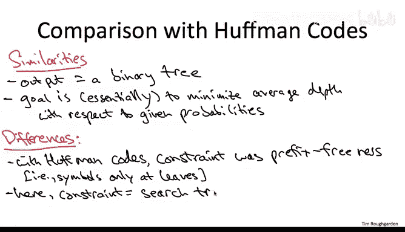

# 124：最优二叉搜索树问题定义 🎯

在本节课中，我们将学习动态规划范式的一个更复杂的应用：计算最优二叉搜索树。我们将探讨如何构建一个搜索树，使其在给定键值访问概率的情况下，平均搜索时间最小化。

---

## 问题背景与动机 🌲

上一节我们介绍了动态规划的基本思想，本节中我们来看看它在搜索树优化问题上的具体应用。首先，我们假设你已经掌握了二叉搜索树数据结构的基础知识。如果需要复习，可以回顾课程第一部分的相关内容。

二叉搜索树存储对象，每个对象有一个来自全序集合的键。搜索树性质规定：对于树中任意一个键值为 `x` 的节点，其左子树中的所有键必须小于 `x`，其右子树中的所有键必须大于 `x`。这个性质必须在树的每个节点上同时成立。

搜索树性质的目的是使搜索操作像在有序数组中二分查找一样直观。例如，如果你要查找键为 `17` 的对象，从根节点开始，根据根节点的键值决定向左还是向右递归搜索。

最初在讨论红黑树等平衡二叉搜索树时我们提到，对于一组给定的键，存在许多不同的有效搜索树。一个自然的问题是：在所有可能的搜索树中，哪一棵是最好的？

你可能会觉得似曾相识，因为在讨论红黑树时我们已经从某个角度提出并回答了这个问题。当时我们认为，最好的选择是保持树的高度尽可能小的平衡二叉搜索树，从而使最坏情况下的搜索时间（与高度成正比）尽可能小，即与树中对象数量的对数成正比。

但现在，让我们做出与讨论霍夫曼编码时类似的假设：我们实际上拥有关于树中每个项目被搜索频率的准确统计数据。例如，我们可能知道项目 `X` 将被搜索 `80%` 的时间，而 `Y` 和 `Z` 各占 `10%`。在这种情况下，我们能否改进完全平衡的搜索树方案？

---

## 一个具体例子 🔍

为了让问题更具体，我们比较两个候选方案：
1.  **平衡树**：`Y` 为根，`X` 和 `Z` 为子节点。
2.  **链式树**：`X` 为根，`Y` 是其右子节点，`Z` 是 `Y` 的右子节点。

假设搜索频率为：`X: 80%`, `Y: 10%`, `Z: 10%`。一个节点的搜索时间定义为从根节点到找到该节点所经过的节点总数（包括目标节点本身）。例如，根节点的搜索时间为 `1`。

以下是两种树的平均搜索时间计算：

*   **平衡树**：
    *   搜索 `X`（`80%` 概率）需经过 `Y` 和 `X`，时间为 `2`。贡献值：`0.8 * 2 = 1.6`
    *   搜索 `Y`（`10%` 概率）时间为 `1`。贡献值：`0.1 * 1 = 0.1`
    *   搜索 `Z`（`10%` 概率）需经过 `Y` 和 `Z`，时间为 `2`。贡献值：`0.1 * 2 = 0.2`
    *   **总加权搜索时间**：`1.6 + 0.1 + 0.2 = 1.9`

*   **链式树**：
    *   搜索 `X`（`80%` 概率）时间为 `1`。贡献值：`0.8 * 1 = 0.8`
    *   搜索 `Y`（`10%` 概率）需经过 `X` 和 `Y`，时间为 `2`。贡献值：`0.1 * 2 = 0.2`
    *   搜索 `Z`（`10%` 概率）需经过 `X`、`Y` 和 `Z`，时间为 `3`。贡献值：`0.1 * 3 = 0.3`
    *   **总加权搜索时间**：`0.8 + 0.2 + 0.3 = 1.3`

这个例子揭示了一个有趣的算法机会：当访问频率不均匀时，明显的“平衡”解决方案未必是最优的。如果能让访问频率极高的项目更靠近根部以减少搜索时间，像链式树这样的不平衡树可能更好。因此，核心问题是：给定一组项目和已知的访问频率，**哪棵搜索树能使平均搜索时间最小化？**

---

## 形式化问题定义 📝

我们被告知有 `n` 个对象需要存储在搜索树中，并且知道每个对象的访问频率。为了简化表示，假设项目按键值从小到大命名为 `1` 到 `n`。`p_i` 表示搜索具有第 `i` 小键值的项目的频率。

你可能会好奇这些频率从何而来。这取决于具体应用。有些应用没有这类统计数据，这时你可能需要转向通用的平衡二叉搜索树解决方案（如红黑树），以保证每次搜索都相对较快。但也有很多应用可以获取相当准确的搜索频率统计数据，例如拼写检查器。通过扫描文档，你可以统计不同单词的查找频率，并利用这些估计为未来的文档构建高度优化的二叉搜索树。如果频率随时间变化，你可以定期（如每天或每周）根据最新统计数据重建搜索树。

无论如何，如果你有幸拥有这些统计数据，你的目标就是构建一棵搜索树，它既要满足搜索树性质，又要使平均搜索时间尽可能小。

以下是平均搜索时间的公式及一些符号定义：
*   用 `C(T)` 表示提议的搜索树 `T` 的（加权）平均搜索时间。
*   本课程我们专注于所有搜索都成功的情况（只搜索树中存在的键）。算法可以轻松扩展到包含不成功搜索的情况。
*   如果只有成功搜索，那么我们只对树中存储的 `n` 个元素求平均。

公式如下：
`C(T) = Σ (p_i * [search time for key i in T])`
其中，在树 `T` 中搜索键 `i` 的时间等于该节点在树中的深度加 `1`。例如，如果键在根节点，深度为 `0`，搜索时间记为 `1`。

一个次要的说明：为方便起见，我们不要求 `p_i` 的和为 `1`。它们可以是任意正数。因此，我们有时称 `C(T)` 为**加权搜索时间**而非平均搜索时间。但在思考时，你可以将其视为和为 `1` 的概率这一典型特例。

例如，当 `p_i` 是概率（和为 `1`）时，我们可以将红黑树作为参考基准。但正如所见，当这些概率不均匀时，通常可以做得更好。本计算问题的要点就是利用给定概率中的非均匀性，构建可能的最优不平衡搜索树。

---

## 与霍夫曼编码的异同 ⚖️

许多同学可能已经注意到最优二叉搜索树问题与我们之前在贪心算法部分解决的霍夫曼编码问题之间的相似性。霍夫曼编码在所有前缀无关的二进制编码中最小化平均编码长度。

以下是两个问题的相似之处和关键区别，特别是为什么我们不能直接重用霍夫曼算法来解决最优二叉搜索树问题。

**相似之处**：
在两个问题中，算法的输出形式都是**二叉树**，目标都是（大致上）最小化关于所提供频率的**平均深度**。在霍夫曼编码中，对象是字母表中的字符；在二叉搜索树中，对象是来自全序集合的带键项目。

**重要区别**：
1.  **约束条件不同**：
    *   在霍夫曼编码问题中，输出必须是**前缀无关编码**。用树的语言来说，这意味着被编码的符号必须对应输出树的**叶子节点**，不能对应内部节点。
    *   在最优二叉搜索树问题中，我们没有前缀无关的约束。树中的**每个节点**（无论是叶子还是内部节点）都可以被标记为一个对象。但我们有一个不同的、看似更难的约束需要处理：**搜索树性质**。
2.  **排序要求**：
    *   在霍夫曼编码中，字母表的符号没有顺序，谈论“小于”没有意义。
    *   在最优二叉搜索树中，我们被赋予了这些键，并且它们存在全序关系。我们输出的树**必须满足搜索树性质**：对于输出树中的每个节点，其左子树中的所有键必须小于该节点的键，右子树中的所有键必须大于该节点的键。这是一个我们必须满足的硬性约束。

这个约束的“更难”之处在于，**没有贪心算法（包括霍夫曼算法）能够解决最优二叉搜索树问题**。相反，我们必须转向更复杂的工具——**动态规划**，来设计一个计算最优二叉搜索树的有效算法。我们将在下一个视频中开始开发这个解决方案。

---

## 总结 📚

本节课中，我们一起学习了最优二叉搜索树问题的定义。我们了解到，当键的访问频率已知且不均匀时，平衡树不一定是最优选择。问题的目标是构建一棵满足二叉搜索树性质的树，以最小化加权平均搜索时间 `C(T) = Σ p_i * (depth(i) + 1)`。虽然此问题与霍夫曼编码有相似之处，但由于必须遵守搜索树性质这一更复杂的约束，我们需要使用动态规划而非贪心算法来求解。下一节我们将开始探讨如何使用动态规划解决这个问题。