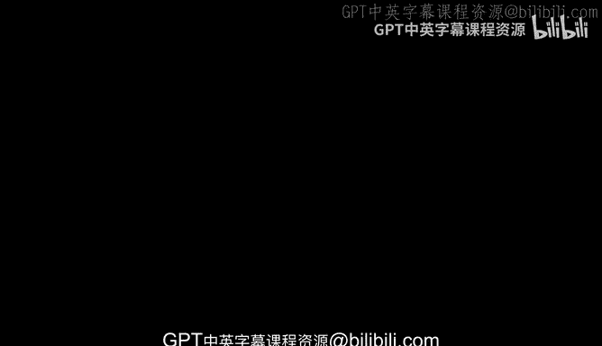
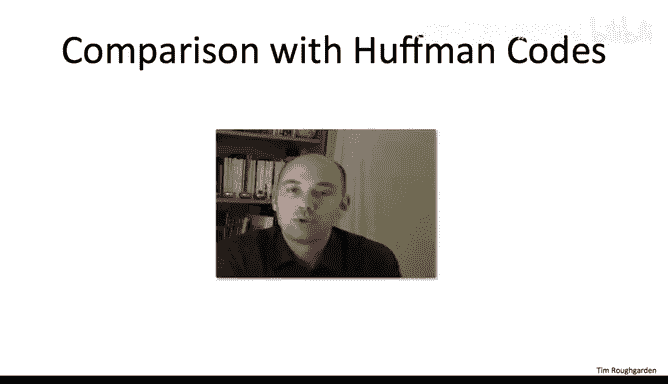

# 125：最优子结构

在本节中，我们将探讨如何解决最优二叉搜索树问题。我们已经正式定义了该问题，现在将思考如何求解。在确定使用动态规划作为尝试的范式后，我们将按照常规方式进行：从最优解中寻找线索，探究它如何由更小子问题的最优解构成。

首先，让我们回顾一下问题的正式描述。我们有 n 个对象需要存储在搜索树中。为简便起见，我们按它们的键值顺序将其命名为 1, 2, 3, ..., n。同时，我们被赋予反映不同对象被搜索频率的权重，即 P1 到 PN，它们是正数。通常我们认为这些概率之和为 1，但事实上我们不会使用这个性质，它们可以是任意正数。目标是输出一个满足二叉搜索树性质、包含所有对象 1 到 n 的搜索树，并且在所有这样的搜索树中，最小化加权搜索时间，即所有对象 i 的 `概率(i) * (深度(i) + 1)` 之和。

如果你因为贪心算法成功解决了看似相似的最优前缀码问题（霍夫曼编码）而感到自信，我想花点时间指出，贪心算法不足以、也不正确来解决最优二叉搜索树问题。

如果我们设计一个贪心算法，什么样的直觉会引导出特定的贪心规则呢？观察目标函数，很明显我们希望访问频率高的对象位于或接近根节点，而访问频率低的对象位于树的底层，如叶子节点。

那么，我们如何将这种直觉转化为贪心算法呢？一种可能受霍夫曼算法成功启发的思路是采用自底向上的方法。非正式地说，我们希望从最底层的叶子节点开始，那里放置访问频率最低的对象。然而，任何合理实现这种自底向上贪心规则的方法都不会奏效。让我展示一个简单的反例。

假设我们有四个对象 1, 2, 3, 4。右边粉色部分展示了两种可能适用于这四个键的有效搜索树。假设频率如下：对象 1 被搜索的概率是 2%，对象 2 是 23%，对象 3 是 73%（大部分时间），对象 4 是 1%。任何坚持将最低频率对象放在树最底层的贪心算法都不会产生右边的树，因为右边的树中 2% 的对象比 1% 的对象更深。相反，这种贪心算法可能会产生左边的树，它以对象 2 为根，对象 4 在深度为 2 的最底层。但你应该能轻易说服自己，对于这些概率，右边的树才是最优的，因为对象 3 是大部分时间被搜索的，你希望它在根节点，而不是对象 2。

我意识到这里有些非正式，但我希望你能理解，一个朴素的自底向上贪心算法实现（如果你仔细想想，这正是我们在霍夫曼算法中所做的）在这里行不通。同样，自顶向下的方法也是如此。最简单的自顶向下方法可能是取最常被搜索的对象放在根节点，然后在该最常访问元素下递归地构建适当的左右子树。

让我再次非正式地展示一个类似的反例。我们将使用完全相同的四个对象和完全相同的两棵树，但改变数字。现在，假设对象 1 几乎不被搜索，仅占 1% 的时间。其他三个对象每个被搜索的频率大约各占三分之一。但让我打破平局，使对象 2 成为最常被搜索的，占 34%。在这种情况下，贪心算法会将 34% 的节点放在根节点，而实际上应该发生的是，你希望为对象 2、3、4 构建一个完美平衡的子树，因为每个对象大约占搜索的三分之一。所以，给对象 3 分配 33% 的搜索，对象 4 分配 32% 的搜索。同样，我留给你去验证这确实是一个反例：左边贪心算法产生的树的平均搜索时间大约为 2，而右边树的平均搜索时间大约为 5/3。我们希望产生右边的树，但这里提出的贪心算法会产生左边的树。

当然，这并没有穷尽所有可能尝试的贪心算法，你可以尝试其他方法，但它不会成功。目前没有已知的贪心算法能成功解决最优二叉搜索树问题。

因此，特别是如果我们专注于自顶向下的方法，根节点的选择、在最上层做什么选择，对两个不同子问题的形态有着难以预测的影响。这不仅阻碍了自顶向下的贪心方法，也阻碍了朴素的分治方法。例如，如果我们只是想将键分成前半部分和后半部分，递归计算这两个部分各自的最优二叉搜索树，然后将它们重新组合，搜索树性质要求我们必须用一个根节点来连接这两个子解，这个根节点是两个子问题之间的中位数。但谁能说中位数就是一个好的根选择呢？因为其影响会进一步延伸到树的下层，也许那是一个糟糕的根节点。

然而，尝试递归地解决这个问题是非常诱人的。我们试图输出这棵二叉树，它具有递归结构。要是我们知道应该选择哪个根节点就好了，那样我们就可以递归两次：一次构建最优左子树，一次构建最优右子树。

所以，要是我们知道正确的根节点就好了。这听起来开始有点熟悉了。实际上，在我们所有的动态规划解决方案中，我们总是说，要是有一个“小精灵”告诉我们解的这一小部分信息就好了，那么我们就可以通过查表或递归计算其余部分的解，并轻松地将其扩展回原始问题的解。也许这里情况相同，也许要是有个小精灵告诉我们根节点是什么，那么我们就可以查表或递归计算更小子集问题的最优解，然后把所有东西粘贴在一起，问题就解决了。那就太好了。

和往常一样，我们希望通过一个最优子结构引理来使这一点精确化。我们希望理解最优二叉搜索树问题的解必须如何由更小子问题的最优解构成。在接下来的测验中，我将请你猜测适当的最优子结构引理是什么，然后在我们确定了正确的陈述之后，我将向你展示证明。

很好，我期待的答案是第四个，即 D，这是所有陈述中最强的一个。

第一个要点是，作为二叉搜索树的子树，T1 和 T2 本身也是对其所包含键有效的二叉搜索树。不仅如此，我们接下来几页将要证明的论断是，它们确实是最优的——在所有可能包含那些对象的搜索树中，它们最小化了加权搜索时间。这排除了 A 和 B，我们可以说得比 C 更强：这两棵树对于它们包含的项都是最优的。实际上，我们确切地知道 T1 和 T2 中包含哪些项，这是由搜索树性质决定的。搜索树性质表明，在每个节点（特别是这里的根节点），根节点左侧的所有元素都小于它，右侧的所有元素都大于它。因此，根据假设根节点是 r，我们知道对象 1 到 r-1 必须在某个地方，而它们唯一可能在的地方就是左子树 T1 中。所以，这正好是 T1 的内容。类似地，T2 的内容正好是对象 r+1 到 n。因此，这两个子树都是最优的，并且我们确切知道它们包含哪些键：左边是所有小于 r 的键，右边是所有大于 r 的键。

好的，这就是本次测验结束时的情况。我们已经确定了我们希望为真的陈述。我们真的希望一个最优二叉搜索树必须必然以这种方式构成：由根节点左侧和右侧键的最优二叉搜索树组成。如果这是真的，凭借我们现有的经验，我们或许可以设想动态规划算法可能是什么样子。如果不是这样，说实话我不知道如何开始。如果这不成立，算法会是什么样子真的不清楚。

在接下来的几页中，我想向你证明这一点。形式不会与我们已见过的有太大不同，我认为不会有大的意外，但这非常重要，这确实是算法能够工作的全部原因。我仍然会给你一个完整的证明。