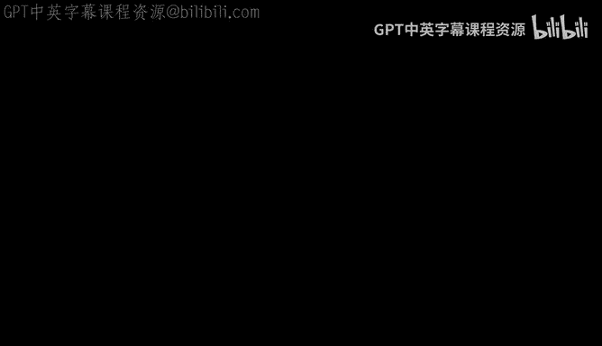
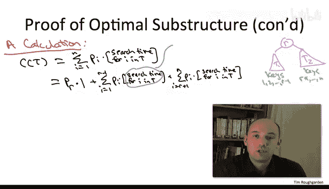

# 126：最优二叉搜索树的最优子结构证明 🔍



在本节中，我们将学习如何证明最优二叉搜索树问题具有最优子结构性质。这是应用动态规划解决该问题的关键理论基础。我们将通过反证法，严谨地推导出：如果一个二叉搜索树对于整个键集合是最优的，那么它的左右子树也必然分别是其对应键子集的最优解。

---

上一节我们介绍了最优二叉搜索树问题的定义，本节中我们来看看其最优子结构性质的证明。

假设我们有一个针对键 `1` 到 `n`（对应频率为 `P1` 到 `Pn`）的最优二叉搜索树 `T`，其根节点为 `r`。

我们试图证明的是：其左子树 `T1`（包含键 `1` 到 `r-1`）必须是该子集的最优二叉搜索树，其右子树 `T2`（包含键 `r+1` 到 `n`）也必须是该子集的最优二叉搜索树。

我们将采用反证法进行证明。假设上述结论不成立，这意味着对于两个子问题（`1` 到 `r-1` 或 `r+1` 到 `n`）中的至少一个，存在一个加权搜索成本更低的二叉搜索树。我们以左子树 `T1` 不是最优的情况为例进行证明。

如果 `T1` 不是最优的，那么必然存在一个针对键 `1` 到 `r-1` 的、更优的搜索树，我们称之为 `T1*`。

为了引出矛盾，我们将构造一个针对所有键 `1` 到 `n` 的、比 `T` 更优的搜索树，但这与 `T` 是最优的假设相矛盾。构造方法是对树 `T` 进行“剪切-粘贴”手术：移除其左子树 `T1`，并将更优的子树 `T1*` 粘贴上去，得到的新树记为 `T*`。

为了完成反证，我们只需证明 `T*` 的加权搜索成本严格小于 `T` 的加权搜索成本。接下来我们将通过计算来展示这一点。

---

首先，让我们展开原始树 `T` 的加权搜索时间定义。

加权搜索成本公式为：
```
C(T) = Σ_{i=1}^{n} [ P_i * depth_T(i) ]
```
其中 `depth_T(i)` 是在树 `T` 中搜索键 `i` 所需的比较次数（深度加一）。

计算的关键在于，将树 `T` 的总搜索成本用其左右子树 `T1` 和 `T2` 的搜索成本表示出来。这将使我们能够轻松分析“剪切-粘贴”操作带来的影响。

我们可以将求和项按三类键进行分桶：
1.  根节点键 `r`。
2.  左子树 `T1` 中的键（`1` 到 `r-1`）。
3.  右子树 `T2` 中的键（`r+1` 到 `n`）。

因此，成本可以重写为：
```
C(T) = P_r * 1 + Σ_{i=1}^{r-1} [ P_i * depth_T(i) ] + Σ_{i=r+1}^{n} [ P_i * depth_T(i) ]
```
根节点 `r` 的搜索成本为 `1`。

接下来，我们建立在大树 `T` 中的搜索深度与在子树中搜索深度的关系。对于左子树 `T1` 中的任意键 `i`，在 `T` 中搜索它时，需要先访问根节点 `r`（一次比较），然后进入左子树 `T1` 进行搜索。因此：
```
depth_T(i) = 1 + depth_{T1}(i)   (对于 i 在 T1 中)
```
同理，对于右子树 `T2` 中的任意键 `i`：
```
depth_T(i) = 1 + depth_{T2}(i)   (对于 i 在 T2 中)
```

将这两个关系代入上面的成本公式：
```
C(T) = P_r * 1 + Σ_{i=1}^{r-1} [ P_i * (1 + depth_{T1}(i)) ] + Σ_{i=r+1}^{n} [ P_i * (1 + depth_{T2}(i)) ]
```



展开并整理项：
```
C(T) = P_r + Σ_{i=1}^{r-1} P_i + Σ_{i=r+1}^{n} P_i + Σ_{i=1}^{r-1} [ P_i * depth_{T1}(i) ] + Σ_{i=r+1}^{n} [ P_i * depth_{T2}(i) ]
```

现在，我们来审视这三个求和式：
1.  第一项 `P_r + Σ_{i=1}^{r-1} P_i + Σ_{i=r+1}^{n} P_i` 其实就是所有频率 `P_i` 的总和 `Σ_{i=1}^{n} P_i`。这是一个常数，与树的结构无关。
2.  第二项 `Σ_{i=1}^{r-1} [ P_i * depth_{T1}(i) ]` 正是左子树 `T1` 的加权搜索成本 `C(T1)`。
3.  第三项 `Σ_{i=r+1}^{n} [ P_i * depth_{T2}(i) ]` 正是右子树 `T2` 的加权搜索成本 `C(T2)`。

因此，我们得到了一个关键公式：
```
C(T) = Σ_{i=1}^{n} P_i + C(T1) + C(T2)
```

这个代数关系适用于任何二叉搜索树：一棵树的总成本等于所有键的频率之和加上其左右子树的成本。

现在，将这个推理应用到我们通过“剪切-粘贴”得到的新树 `T*` 上。`T*` 的根节点同样是 `r`，其左子树是更优的 `T1*`，右子树与 `T` 相同，仍是 `T2`。因此：
```
C(T*) = Σ_{i=1}^{n} P_i + C(T1*) + C(T2)
```

根据我们的假设，`T1*` 是比 `T1` 更优的解，即 `C(T1*) < C(T1)`。由于 `Σ_{i=1}^{n} P_i` 是常数，且 `C(T2)` 相同，比较两个总成本公式：
```
C(T*) - C(T) = [Σ_{i=1}^{n} P_i + C(T1*) + C(T2)] - [Σ_{i=1}^{n} P_i + C(T1) + C(T2)] = C(T1*) - C(T1) < 0
```
因此，`C(T*) < C(T)`。

这产生了矛盾：我们最初假设 `T` 是针对所有键的最优二叉搜索树，但现在我们构造出了一个成本更低的树 `T*`。这个矛盾源于我们最初的假设——`T` 的某个子树不是最优的。因此，假设不成立。

---

**结论**：最优二叉搜索树确实具有最优子结构性质。一个全局最优二叉搜索树的左右子树，必定分别是其对应键子集上的最优二叉搜索树。这个性质保证了我们可以通过组合子问题的最优解来构造原问题的最优解，从而为动态规划算法提供了基础。

本节课中我们一起学习了如何使用反证法证明最优二叉搜索树的最优子结构性质。我们通过将总成本分解为常数项与子树成本之和，清晰地展示了替换一个更优的子树将导致整体得到一个更优的树，从而完成了证明。这是理解后续动态规划求解步骤的核心。