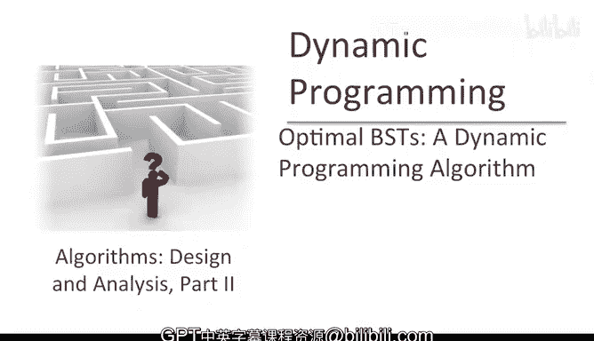
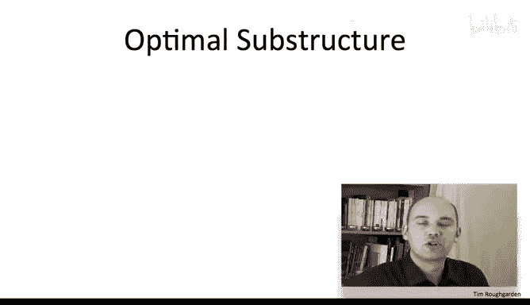
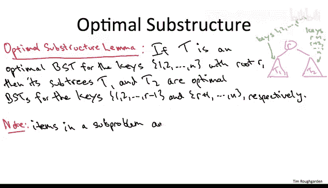
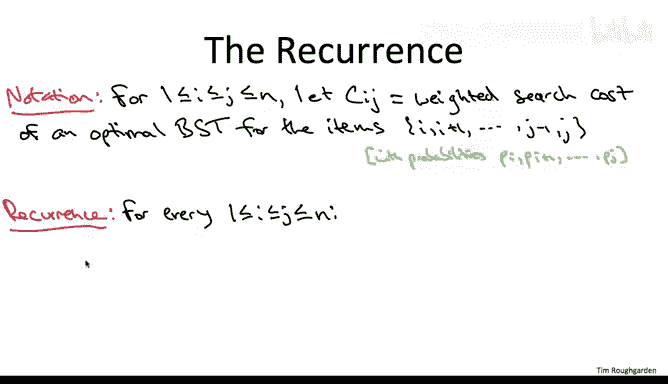
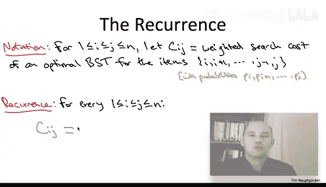
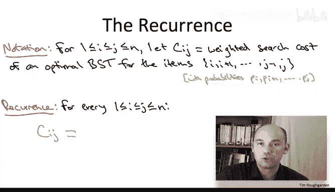
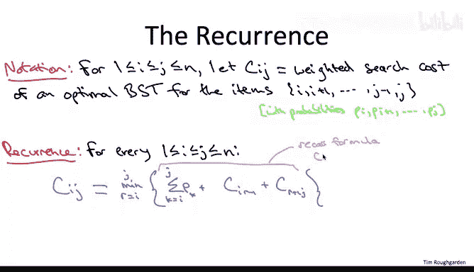

# 127：动态规划算法一

在本节课中，我们将学习如何将最优二叉搜索树问题的结构理解，转化为一个多项式时间的动态规划算法。我们将从回顾最优子结构引理开始，识别相关的子问题，并最终构建出完整的动态规划递推关系。

## 回顾最优子结构引理

上一节我们介绍了最优二叉搜索树问题的最优子结构性质。本节中，我们来看看如何利用这个性质来设计算法。

假设我们有一个针对给定键集合1到n及其概率的最优二叉搜索树，并且该树有一个根节点R。那么，根据二叉搜索树的性质，它有两个子树T1和T2。我们知道这两个子树的确切构成：T1必须包含键1到R-1（假设键已排序），而右子树T2必须包含键R+1到n。此外，T1和T2本身分别是这两个键集合的有效搜索树。最重要的是，我们在上一节证明了它们对于各自的子问题是最优的：T1对于键1到R-1及其对应概率是最优的，T2对于键R+1到n及其对应频率是最优的。

## 识别相关子问题

现在我们已经理解了最优解必须由更小子问题的解以简单方式构成。让我们退一步思考：既然我们最终关心的是原始问题的最优解，那么哪些子问题是相关的？我们必须解决哪些子问题？

以下是需要考虑的相关子问题集合：

*   **所有子集**：原始项的所有子集。
*   **所有前缀和后缀**：原始项的所有前缀和后缀。
*   **所有连续区间**：原始项的所有连续区间。

在序列比对问题中，当我们查看子问题时，我们是从一个或两个字符串中移除字符，因此我们关心对应于两个字符串前缀的子问题。然而，二叉搜索树问题的有趣之处在于，当我们查看最优子结构引理中的子问题时，我们可能要考虑两个：我们不仅仅是从右侧移除元素，我们同时关心由左子树和右子树诱导出的子问题。在第一种情况下，我们查看的是起始项的一个前缀，这类似于我们之前见过的许多例子。但在第二种情况下，对应于子树T2的子问题，实际上是我们起始项的一个后缀。换句话说，我们关心的子问题，是那些通过丢弃起始项的一个前缀或一个后缀而得到的子问题。

考虑到最优解的值仅直接依赖于通过丢弃项的前缀或后缀得到的子问题，我们需要思考整个相关子问题的集合。也就是说，对于原始项1到n的哪些子集S，计算仅包含S中项的最优二叉搜索树的值是重要的？

在解释正确答案（第三个选项）之前，让我们先讨论一个非常自然但不正确的答案，即第二个选项。确实，第二个答案似乎与最优子结构引理有最好的对应关系。最优子结构引理指出，最优解必须由某个前缀上的最优解和某个后缀上的最优解在共同根节点下联合而成。因此，我们肯定关心所有项的前缀和后缀的解。但我们关心的不仅仅是这些。

也许理解这一点最简单的方法是考虑最优子结构引理的递归应用。最终，相关的子问题将对应于在整个递归实现过程中解决的所有不同子问题。让我们考虑递归树中的一个示例路径。在最顶层的递归中，你拥有整个项集，比如有100个项1到100。你将遍历并尝试所有可能的根节点。在某个时刻，你尝试根节点23，看看它的效果如何。你必须递归地在项1到22上最优地构建一个搜索树，同样地，在项24到100上递归。现在，让我们深入到这个第一个递归调用中，你在项1到22上递归。在这里，你再次尝试所有可能的根节点，有22种选择。在某个时刻，你将尝试根节点17，这又会引发两个递归调用。第二个递归调用将在项18到22上进行。这个子问题是被传递给这个递归调用的项（原始项的一个前缀）的一个后缀。因此，在这种情况下，项18到22是原始前缀1到22的一个后缀。总的来说，当你思考这个递归的多个层级时，每一步你都在做的是：要么从开头（一个前缀）删除一块项，要么从结尾删除一块项，但你可能会交错进行这两种操作。因此，你并不总是拥有原始项集的一个前缀或后缀。但正确的是，你将拥有某个连续的项集。如果你的子问题中最小的项是i，最大的项是j，那么你将拥有它们之间的所有项。这是因为你只从左侧或右侧移除项。这就是为什么C是正确答案。你需要比仅仅前缀和后缀更多的子问题。

## 构建动态规划算法

好了，识别相关子问题有点棘手，但现在我们已经掌握了它们，动态规划算法将像往常一样水到渠成。相关的子问题集合以一种非常机械的方式解锁了整个范式的力量。现在让我们来填写所有细节。

第一步是形式化递推关系，即给定子问题的最优解如何依赖于更小子问题的值。这将是一个数学公式，编码了我们在最优子结构引理中已经证明的内容。然后，我们将使用这个公式在动态规划算法中填充一个表格，以系统地求解所有子问题的值。

让我们引入一些符号来放入我们的递推公式中。

我们将用两个索引i和j来索引子问题，这是因为我们有两个自由度：连续项区间的起始点i和结束点j。

对于给定的i和j的选择（当然i应小于等于j），我将用大写C_ij表示仅包含从i到j的连续项集的最优二叉搜索树的加权搜索成本。当然，概率的权重与原始问题完全相同，它们只是在这里被继承下来，即p_i到p_j。

现在让我们来陈述递推关系。对于给定的子问题C_ij，我们将根据更小子问题的最优解来表达最优二叉搜索树的值。最优子结构引理告诉我们如何做到这一点。

最优子结构引理指出，如果我们知道根节点R（这里R将介于项i和j之间），那么最优解必须由两个更小子问题的最优解在根节点下联合而成。但我们不知道根节点是什么。有j-i+1种可能性，它可以是i到j（包含）之间的任何值。因此，像往常一样，我们将对我们已识别的相对较小的候选集合进行暴力搜索。

我们将暴力搜索编码为显式地取一个最小值。

选择一个根节点R，位于i和j之间（包含）。给定R的选择，我们将继承仅包含项i到R-1这个前缀的最优解的加权搜索成本。在我们的符号中，这将是C(i, R-1)。类似地，我们获取项R+1到j这个后缀的最优解的加权搜索成本。如果你回顾我们对最优子结构引理的证明，你会看到我们做了一个计算，给出了树的加权搜索成本如何依赖于其子树的加权搜索成本的公式。除了由两个搜索树各自贡献的加权搜索成本外，我们还加上一个常数，即我们正在处理的项中所有概率的总和。在这里，这个总和是p_k的和，其中k的范围从子问题的第一个项i到最后一个项j。

我们需要处理的一个额外边界情况是：如果我们选择根节点为第一个项i，那么第一个递归项C(i, i-1)没有意义。同样地，如果我们选择根节点为j，那么最后一项C(j+1, j)也没有意义。请记住，索引应该是按顺序的。在这种情况下，我们只需将这些大写C解释为零。

为什么这个递推关系是正确的？所有繁重的工作都在我们证明最优子结构引理时完成了。我们在那里证明了什么？我们证明了最优解必须是j-i+1种可能情况之一。给定根节点，其余部分就为我们确定了。递推关系通过定义，对我们已识别的唯一候选集合进行暴力搜索。因此，它确实是一个用更小子问题的最优解来表达最优解值的正确公式。

## 总结

本节课中，我们一起学习了如何为最优二叉搜索树问题构建动态规划算法。我们从回顾最优子结构引理开始，理解了最优解如何由更小子问题的解构成。接着，我们识别出相关的子问题集合是所有连续的项区间，而不仅仅是前缀或后缀。最后，我们形式化了递推关系，该关系通过枚举所有可能的根节点并组合更小子问题的最优解，来计算任意连续区间的最优加权搜索成本。这为我们下一步实现具体的动态规划表格计算算法奠定了基础。