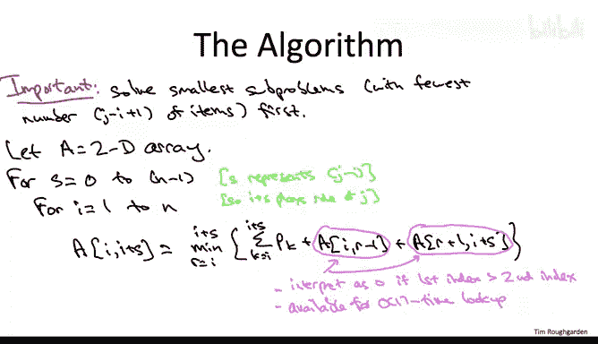
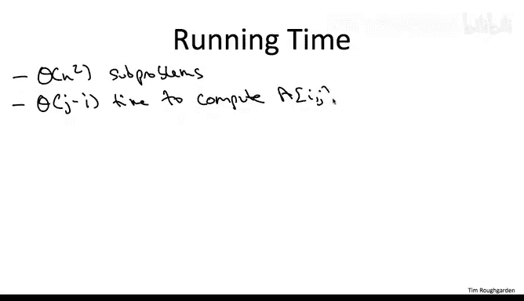
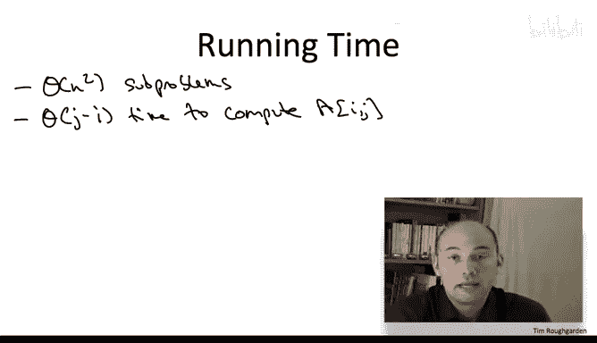
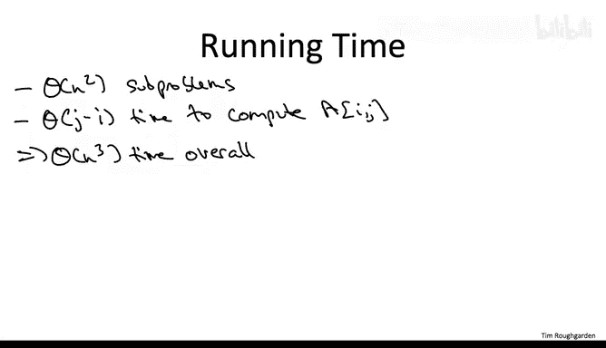
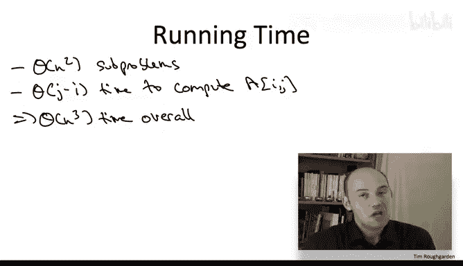
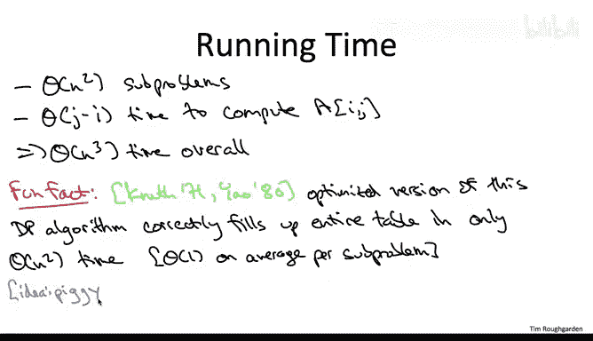

# 128：动态规划算法二

在本节课中，我们将学习如何将最优二叉搜索树问题的递推公式，系统地转化为一个动态规划算法。我们将详细讲解子问题的定义、求解顺序、算法的具体实现步骤，并分析其时间复杂度。

---

## 子问题定义与求解顺序

上一节我们推导出了最优二叉搜索树价值的“魔法公式”（递推关系）。本节中，我们来看看如何系统地求解这些子问题。与往常一样，**按照从小到大的顺序求解子问题至关重要**。

在最优二叉搜索树问题中，衡量子问题大小的自然方式是**子问题中包含的项目数量**。如果子问题从项目 `i` 开始，到项目 `j` 结束，那么其大小为 `j - i + 1`。我们将以此作为子问题规模的度量。

## 算法实现：二维数组与循环

为了实现动态规划，我们需要一个二维数组 `A`。数组的维度为2，因为子问题由两个自由度索引：区间的**起始索引** `i` 和**结束索引** `j`。



以下是填充数组 `A` 的核心逻辑：

*   **外层循环**控制子问题的大小 `s`，确保我们先求解所有较小的子问题，再处理较大的子问题。`s` 代表 `j` 与 `i` 的差值，即 `s = j - i`。
*   **内层循环**控制区间的起始索引 `i`。

对于每个由 `i` 和 `j = i + s` 定义的子问题，我们通过暴力枚举所有可能的根节点 `r`（从 `i` 到 `i + s`）来应用递推公式。公式的核心是：

```
A[i][j] = min_{r in [i, j]} ( sum_{k=i}^{j} p_k + A[i][r-1] + A[r+1][j] )
```

关于公式右侧的两次数组查找，有两点需要注意：
1.  当选择的根 `r` 等于起始项 `i` 时，`A[i][r-1]` 无意义，应视为0。同样，当 `r` 等于结束项 `j` 时，`A[r+1][j]` 也应视为0。在实际编码中需要处理这些边界情况。
2.  我们必须确保在计算 `A[i][j]` 时，公式右侧引用的 `A[i][r-1]` 和 `A[r+1][j]` 这两个子问题的值**已经被计算出来**。由于外层循环按 `s` 从小到大进行，而 `r-1 - i` 和 `j - (r+1)` 都严格小于 `s`，因此这个条件总是满足的。

当两层循环完成后，我们最终需要的答案存储在 `A[1][n]` 中，即包含所有项目的最优二叉搜索树的价值。

## 算法执行过程可视化

我们可以将二维数组 `A` 想象成一个网格：
*   **x轴**对应起始索引 `i`。
*   **y轴**对应结束索引 `j`。


我们只关心 `j >= i` 的部分（表格的西北部分）。算法的执行过程是**按对角线填充**这个上三角区域：
1.  当 `s=0` 时，我们填充主对角线 `(i, i)`，这些是单项目子问题的基案例，`A[i][i] = p_i`。
2.  每次外层循环递增 `s`，我们就移动到更西北方向的下一条对角线。
3.  在内层循环中，我们沿着当前对角线从西南向东北填充。
4.  填充某个位置 `(i, j)` 时，我们只需要查找位于更低对角线（即规模更小的子问题）上的两个值 `A[i][r-1]` 和 `A[r+1][j]`。


## 算法正确性与时间复杂度分析

算法的正确性基于之前证明的**最优子结构引理**。只要递推公式正确，并且我们按此系统性地填充数组，通过归纳法即可证明动态规划算法的正确性。






现在我们来分析算法的时间复杂度。我们遵循常规步骤：计算需要解决的子问题数量，以及解决每个子问题所需的工作量。



*   **子问题数量**：所有满足 `1 <= i <= j <= n` 的 `(i, j)` 对。这大约是 `n^2/2` 个，即 **Θ(n²)**。
*   **每个子问题的工作量**：对于每个子问题 `(i, j)`，我们需要枚举所有可能的根节点 `r`（从 `i` 到 `j`），共 `j-i+1` 个选项。对于每个候选根，我们进行常数时间的计算（求和与查表）。因此，解决一个子问题的时间是 **O(n)**。

综合来看，总的时间复杂度是 **Θ(n³)**。这是一个多项式时间算法，远优于枚举所有指数级数量的二叉搜索树的暴力方法，适用于 `n` 在几百数量级的问题。



## 算法优化：一个有趣的事实

虽然 Θ(n³) 的时间可以接受，但并非极快。这里有一个有趣的事实：**存在一种方法可以显著加速这个动态规划算法**。

我们可以保持相同的二维数组和语义，但通过利用最优二叉搜索树问题中蕴含的**额外结构**，来避免在每个子问题中都进行 `O(n)` 的暴力根节点搜索。其核心思想是，在求解较小规模子问题时获得的信息，可以用来推断当前子问题中哪些根节点**可能**是最优的，从而将搜索范围缩小到平均常数个候选根。

这种优化技巧可以将总运行时间从 **Θ(n³) 降低到 Θ(n²)**。这极大地提升了算法能处理的问题规模，从几百提高到几千甚至上万，非常巧妙。如果你感兴趣，可以查阅相关原始论文或网络资源以了解其详细实现。

---



本节课中我们一起学习了如何将最优二叉搜索树的递推关系实现为一个动态规划算法。我们明确了子问题的定义和求解顺序，描述了使用二维数组和双重循环的算法框架，并通过可视化方式理解了其执行过程。最后，我们分析了算法 Θ(n³) 的时间复杂度，并简要介绍了一种可将其优化至 Θ(n²) 的进阶方法。