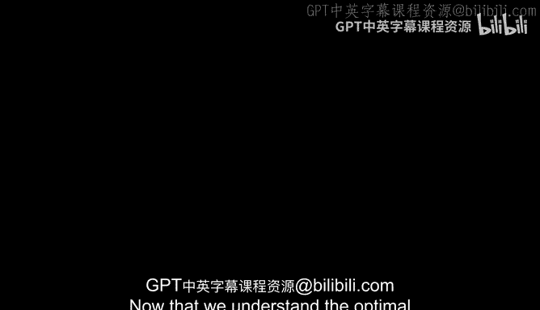
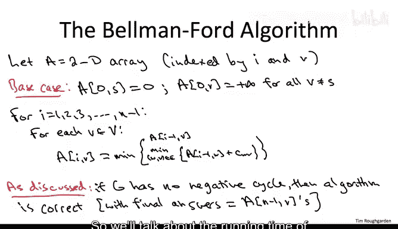

# 131：基本算法一



## 概述

在本节中，我们将学习如何将最短路径问题中的最优子结构性质，转化为一个动态规划递推式，并由此推导出贝尔曼-福特算法的基本版本。我们将理解算法如何通过限制路径的边数（预算）来逐步构建最短路径，并探讨在图中没有负权环的情况下，算法如何保证正确性。

---

## 最优子结构到递推式

上一节我们介绍了最短路径问题中存在的最优子结构。本节中，我们将根据动态规划的通用方法，将这个性质转化为一个递推公式，该公式定义了子问题最优解与其更小子问题最优解之间的关系。

我们使用符号 **L(i, v)** 来表示对应子问题的最优解值。每个子问题由两个参数索引：
1.  **v**：子问题中我们感兴趣的目的地。
2.  **i**：子问题中允许从源点 **s** 到 **v** 的路径所使用的最大边数（预算）。

需要说明几点细节：
*   我们之前证明的最优子结构引理适用于一般图 **G**，它可能包含负权环。因此，在从 **s** 到 **v** 的最短路径中，我们必须允许环的存在。我们之所以不担心环被无限次遍历，是因为我们有限制边数的预算 **i**。
*   如果不存在使用最多 **i** 条边从 **s** 到 **v** 的路径（当 **i** 很小时，对许多目的地 **v** 确实如此），我们定义 **L(i, v) = +∞**。

递推式对每个正整数 **i** 和每个可能的目的地 **v** 进行定义。它表明，子问题的最优解值是最优子结构引理中识别的所有可能候选解中的最佳者。

以下是递推式：

**L(i, v) = min( L(i-1, v), min_{(w, v) ∈ E} { L(i-1, w) + c_{wv} } )**

解释：
*   **情况一候选解**：直接继承使用最多 **i-1** 条边从 **s** 到 **v** 的最优路径长度，即 **L(i-1, v)**。
*   **情况二候选解**：考虑所有可能的最后一条边 **(w, v)**。对于每个选择，其路径长度为：使用最多 **i-1** 条边从 **s** 到 **w** 的最短路径长度 **L(i-1, w)**，加上最后一条边 **(w, v)** 的成本 **c_{wv}**。我们从所有这些可能性中取最小值。

该递推式的正确性直接源于最优子结构引理。我们知道这些是仅有的候选解，并且根据递推式的定义，我们选择其中最好的一个。无论图 **G** 是否包含负权环，这个递推式对所有正的 **i** 值都是正确的。

---

## 无负权环假设的作用

现在，让我们看看假设输入图 **G** 没有负权环是如何有用的。

我们之前有一个测验讨论了“无负权环”假设的用途。具体来说，我们论证了 **n-1** 条边总是足以捕获从 **s** 到任何可能目的地的最短路径。原因如下：
*   假设没有负权环。固定一个目的地 **v**。
*   考虑一条至少有 **n** 条边的路径。由于它有至少 **n** 条边，它访问了至少 **n+1** 个顶点。
*   图中只有 **n** 个顶点，因此该路径必定访问了某个顶点至少两次。
*   在两次连续访问同一个顶点之间，存在一个有向环。根据假设，没有负权有向环，所有环的权重都是非负的。
*   如果我从这条路径中丢弃这个有向环，我将得到一条通往同一目的地 **v** 的新路径，并且其总长度只会减少（或保持不变）。丢弃环只会使路径更短（或不增长）。
*   因此，存在一条没有重复顶点（即最多有 **n-1** 条边）的最短路径。

这个观察结果与我们的递推式有什么关系呢？它告诉我们，只需要计算递推式，评估 **i** 值直到 **n-1** 的子问题。如果没有负权环，给子问题分配超过 **n-1** 条边的预算是没有意义的。因为当 **i** 达到 **n-1** 时，我们保证已经找到了最短路径。

为了明确这一点，我们正式写下在贝尔曼-福特算法中将要解决的子问题集合，这些子问题足以正确计算没有负权环的输入图 **G** 的最短路径。

子问题集合是计算所有最短路径长度 **L(i, v)**，其中：
*   **v** 遍历所有顶点（目的地）。
*   **i** 从 **0** 到 **n-1**。

这是一个相当简洁的子问题集合。虽然它看起来数量很多（有 **n** 个目的地和 **n** 个预算值，共 **n²** 个），但请记住，这个问题的输出大小是线性的（我们需要为每个目的地 **v** 输出一个数字）。因此，对于我们负责计算的每个统计数据，我们实际上只有线性数量的子问题，这与我们讨论过的其他动态规划算法一样好。

---

## 贝尔曼-福特算法伪代码

现在，我们可以轻松地写出著名的贝尔曼-福特算法的伪代码。

由于我们的子问题由两个参数（边预算 **i** 和目的地 **v**）索引，我们将使用一个二维数组 **A**。我们通过边预算 **i** 来衡量子问题的大小，这是贝尔曼-福特算法中引入边预算来控制子问题大小的核心思想。

以下是算法的伪代码：

```
// 初始化
令 A 为一个二维数组，维度为 [0..n-1][所有顶点 v]
对于每个顶点 v：
    A[0][v] = ∞  // 使用0条边无法到达任何其他顶点
A[0][s] = 0      // 从s到s的空路径长度为0

// 主循环
for i = 1 to n-1:
    for 每个顶点 v:
        // 情况一：继承 i-1 条边时的最优解
        A[i][v] = A[i-1][v]

        // 情况二：考虑所有可能的最后一条边 (w, v)
        for 每条指向 v 的边 (w, v):
            if A[i-1][w] + c_{wv} < A[i][v]:
                A[i][v] = A[i-1][w] + c_{wv}

// 最终答案
对于每个顶点 v:
    最短路径距离 d[v] = A[n-1][v]
```

**解释：**
*   **基础情况 (i=0)**：如果 **v** 恰好等于源点 **s**，则可以使用空路径到达，长度为 **0**。如果 **v** 是 **s** 以外的任何顶点，则无法使用 **0** 条边从 **s** 到达 **v**，我们定义其最优解值为 **+∞**。
*   **主循环**：我们有两个嵌套的 `for` 循环。与大多数动态规划算法不同，这里的循环顺序很重要。外层循环必须按子问题大小 **i** 递增的顺序进行，以确保在需要时，所有更小的子问题都已解决。
    *   对于每个 **i** 和 **v**，我们直接将递推式转化为代码。
    *   情况一提供了一个候选解：**A[i][v] = A[i-1][v]**。
    *   情况二为每条指向 **v** 的边 **(w, v)** 提供一个候选解：**A[i-1][w] + c_{wv}**。我们取所有候选解中的最小值。

如前所述，如果输入图 **G** 没有负权环，则该算法将正确终止，并计算出从 **s** 到所有目的地的最短路径。最终答案将存储在最大的子问题中，即 **A[n-1][v]** 中。

正确性主要源于最优子结构引理，同时，“无负权环”的假设保证了取 **i = n-1** 足够大，能够捕获最终答案。

---

## 总结



本节课中，我们一起学习了如何将最短路径的最优子结构性质形式化为一个动态规划递推式。我们引入了边预算 **i** 的概念来控制子问题规模，并基于此推导出了贝尔曼-福特算法的基本版本。我们了解到，在假设图中没有负权环的前提下，只需计算 **i** 从 **0** 到 **n-1** 的子问题，就能确保算法找到所有正确的最短路径。算法的伪代码清晰地展示了如何通过迭代填充一个二维数组来实现这一过程。