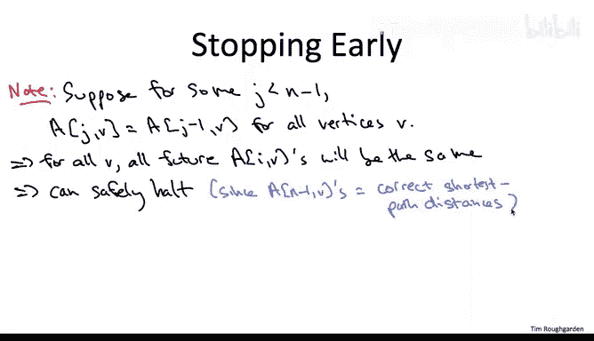
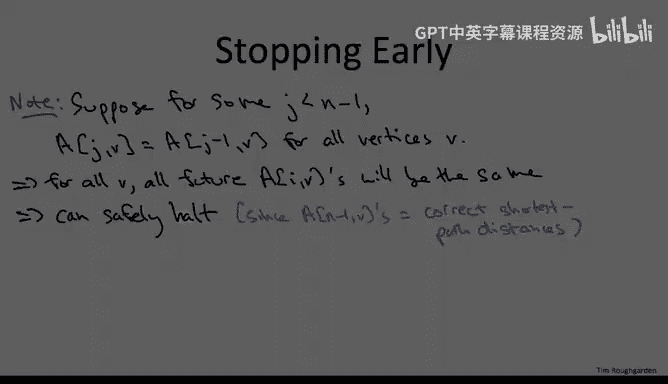

# 132：贝尔曼-福特算法详解 🧮

在本节课中，我们将深入学习贝尔曼-福特算法。这是一种用于在带权有向图中计算单源最短路径的动态规划算法，尤其适用于处理包含负权边的图。我们将通过一个具体的例子，逐步解析算法的执行过程，分析其时间复杂度，并探讨一些实用的优化技巧。

## 算法执行步骤演示

上一节我们介绍了贝尔曼-福特算法的基本思想和递推关系。本节中，我们通过一个包含五个顶点的具体图例，来一步步演示算法的执行过程。

考虑以下包含五个顶点的图，蓝色数字标注了各边的权值（成本）。

我们将逐步遍历外层循环的索引 `i`。由于有五个顶点，`i` 将取值 0, 1, 2, 3, 4。让我们看看每一轮子问题计算的结果。

在基础情况下，当 `i = 0` 时，从源点 `S` 到自身的距离为 `0`，对于所有其他顶点，子问题的值定义为 `+∞`。

让我再次写下递推关系，以防你忘记：
`A[i, v] = min{ A[i-1, v], min_{(w, v) ∈ E} { A[i-1, w] + c_wv } }`

现在我们进入主循环，从 `i = 1` 开始。

我们以任意顺序遍历顶点并计算递推式。

*   节点 `S` 将直接继承上一步的解决方案，它仍然满足总长度为 `0` 的空路径。
*   节点 `V` 当然不希望继承上一轮（`i = 0`）的 `+∞` 解。实际上，当 `i = 1` 时，顶点 `v` 的子问题解将是 `2`。这是因为我们可以选择最后一条边为 `(S, V)`，其长度为 `2`，而上一次迭代（`i = 0`）时 `S` 的子问题值是 `0`。
*   同理，`X` 的新子问题值将是 `4`，因为我们可以选择最后一条边为 `(S, X)`，并将该边的成本 `4` 加到 `S` 在上次迭代（`i = 0`）时的子问题值上。
*   节点 `W` 和 `T` 希望摆脱它们的 `+∞` 解并获得有限值。你可能会想，因为 `V` 和 `X` 现在有了有限距离，这些值会传播到节点 `W` 和 `T`。这确实会发生，但我们必须等到下一次迭代，即 `i = 2`。原因是，如果你查看代码或递推式，当我们在给定迭代 `i` 计算子问题时，我们只使用前一次迭代 `i-1` 的子问题解，而不使用当前迭代 `i` 中已经发生的任何更新。因此，由于当 `i = 0` 时，`A[0, V]` 和 `A[0, X]` 都是 `+∞`，`A[1, W]` 和 `A[1, T]` 也将是 `+∞`。

现在让我们继续外层 `for` 循环的下一次迭代，当 `i = 2` 时。

*   顶点 `S` 的子问题解不会改变，你不会得到比 `0` 更好的结果，所以它将保持不变。
*   类似地，在顶点 `V`，你不会得到比 `2` 更好的结果，所以它在此次迭代中也保持不变。
*   然而，在顶点 `X` 发生了一些有趣的事情。在递推式中，你当然可以选择继承之前的解，即一个选项是将 `A[2, X]` 设为 `4`。但实际上有一个更好的选择。具体来说，如果我们选择最后一条边为从 `V` 到 `X` 的单位成本弧，我们将该单位成本加到 `V` 在上次迭代（`i = 1`）时的子问题值 `2` 上。`2 + 1 = 3`。这将是 `i = 2` 的此次迭代中 `X` 的新子问题值。

正如所宣传的那样，在 `i = 1` 的迭代中对顶点 `V` 和 `X` 的更新，现在在 `i = 2` 时传播到了顶点 `W` 和 `T`。因此，`W` 和 `T` 摆脱了它们的 `+∞` 值，并分别获得了值 `4` 和 `8`。

请注意，我将顶点 `T` 标记为 `8`，而不是 `7`。我计算出的 `A[2, T]` 是 `8`。原因同样是，本次迭代中的相同更新，特别是 `X` 从 `4` 降到 `3` 这一事实，不会在同一迭代中反映到其他节点上。我们必须等到外层 `for` 循环的下一次迭代，这些更新才会发生。因此，我们使用的是 `X` 的过时信息，即当 `i = 1` 时，它的解值是 `4`。我们正是用这个信息来更新 `T` 的解值，所以是 `4 + 4 = 8`。

在倒数第二次迭代中，当 `i = 3` 时，`S`、`V`、`X`、`W` 处的大部分值保持不变，实际上我们已经计算出了最短路径，所以它们都将直接继承前一次迭代的解。

但在顶点 `T`，它将利用顶点 `X` 在 `i = 2` 迭代中改进的解值，因此它的 `8` 被更新为 `7`，反映了前一次迭代中 `X` 的改进。

此时，我们实际上已经完成了计算，得到了到所有目的地的最短路径。但算法还不知道我们已经完成，所以它仍然会执行外层 `for` 循环的最后一次迭代，即 `i = 4`。但每个节点都只是继承了前一轮的解。此时，算法终止。

## 时间复杂度分析

在我们讨论过的大多数动态规划算法中，运行时间分析都很简单。贝尔曼-福特算法从运行时间分析的角度来看则更有趣。请在下面的测验中思考一下。

正确答案是 **B**，即在所有这些运行时间界限中，这是最小的且实际上正确的界限。让我解释为什么它是边数乘以顶点数，同时也评论一下其他选项。

*   **选项 A：O(n²)**。这是子问题的数量。子问题由 `i`（介于 `0` 和 `n-1` 之间）和目的地 `v` 的选择索引。每个都有 `n` 种选择，所以恰好有 `n²` 个子问题。如果我们每次评估一个子问题只花费常数时间，那么贝尔曼-福特的运行时间确实是 `O(n²)`。在本课程讨论的大多数动态规划算法中，确实每个子问题只花费常数时间求解。一个例外是最优二叉搜索树问题，在一般情况下我们花费线性时间。这里，像最优二叉搜索树一样，我们可能花费超过常数的时间来解决一个子问题。原因是我们必须对可能超常数的候选列表进行暴力搜索。原因是，每条指向目的地 `v` 的边都提供了一个候选解。候选数量与顶点的**入度**成正比，最大可以达到 `n-1`，与顶点数成线性关系。这就是为什么贝尔曼-福特算法的运行时间通常可能比 `O(n²)` 差。

*   **选项 C：O(n³)**。确实，`O(n³)` 是贝尔曼-福特算法运行时间的有效上界，但它不是可能的最紧上界。为什么它是一个有效上界？如前所述，有 `O(n²)` 个子问题。每个子问题做多少工作？它与顶点的入度成正比，顶点的最大入度是 `O(n)`。因此，对 `O(n²)` 个子问题中的每一个进行线性工作，导致立方级的运行时间。

然而，对贝尔曼-福特算法有一个更紧、更好的分析。

*   **选项 B：O(mn)**。为什么 `O(mn)` 比 `n³` 大？在稀疏图中，`m` 是 `Θ(n)`；在稠密图中，`m` 是 `n²`。所以如果是稠密图，`O(mn)` 确实不小于 `O(n³)`。但如果图不是稠密的，那么这个上界确实是改进过的。

为什么这个界限成立？请从以下角度思考所有子问题的总工作量：我们只需取外层 `for` 循环单次迭代中所做的工作量，然后乘以外层循环的迭代次数 `n`。

那么，在外层循环的给定迭代（给定 `i`）中，我们做了多少工作？它就是所有顶点入度的总和。当我们考虑顶点 `v` 时，我们做的工作与其入度成正比，并且在外层循环的给定迭代中，我们考虑每个顶点 `v` 一次。但我们知道所有入度之和有一个更简单的表达式：**这个和恰好等于 `m`，即图中边的数量**。在任何有向图中，边的数量恰好等于所有入度之和。一个简单的理解方式是：取你最喜欢的有向图，想象你一次一条边地将边插入图中，从空的边集开始。每次插入一条新边，显然图中的边数增加 `1`，同时恰好有一个顶点的入度增加 `1`（即你刚插入的边的头顶点）。因此，无论有向图是什么，入度之和与边数总是相同的。这就是为什么总工作量是 `O(mn)`，优于 `O(n³)`。

## 算法优化技巧

基本贝尔曼-福特算法的一些优化是可能的。让我在本视频结束时快速介绍一个关于**提前停止**的优化。另请参阅一个关于算法更复杂的空间优化的单独视频。

基本版本的算法，外层 `for` 循环运行 `n-1` 次。通常，你不需要全部迭代。我们已经在简单示例中看到，最后一次迭代没有做任何有用的工作，它只是继承了前一次迭代的解。

一般来说，假设在早于最后一次的某次迭代中，比如当前索引值为 `j`，恰好没有任何变化，在每个目的地 `v`，你只是重用了在外层 `for` 循环前一次迭代中重新计算的最优解。那么，如果你仔细想想，在下一次迭代中会发生什么？你将用完全相同的输入集进行完全相同的计算集，因此你将得到完全相同的输出集。也就是说，在下一次迭代中，你将再次仅仅从前一次迭代继承最优解，并且这种情况将一次又一次地发生，直到永远。

因此，特别地，当你到达外层 `for` 循环的第 `n-1` 次迭代时，你将拥有与现在完全相同的解值集。我们已经证明，迭代 `n-1` 结束时的结果是正确的，它们是真正的最短路径距离。如果你现在就已经掌握了它们，那么不妨中止算法，并将它们作为最终的、正确的最短路径距离返回。

## 总结

本节课中，我们一起学习了贝尔曼-福特算法的详细执行步骤。我们通过一个五顶点图例，逐步跟踪了算法各轮迭代中距离值的更新过程，理解了为什么更新需要多轮迭代才能传播到所有节点。我们深入分析了算法的时间复杂度，得出其核心运行时间为 **O(mn)**，并解释了其与子问题数量及顶点入度的关系。最后，我们探讨了一个简单的优化技巧——提前停止检测，它可以在算法实际收敛时提前终止循环，提升效率。掌握这些细节，有助于你更扎实地理解和应用这一重要的最短路径算法。