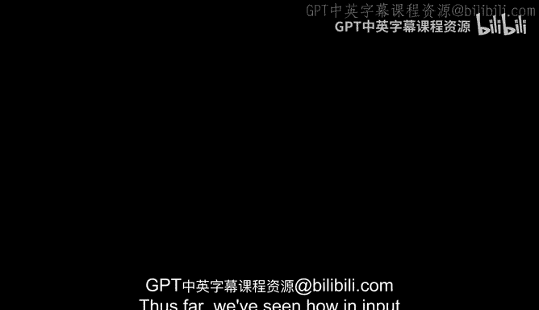
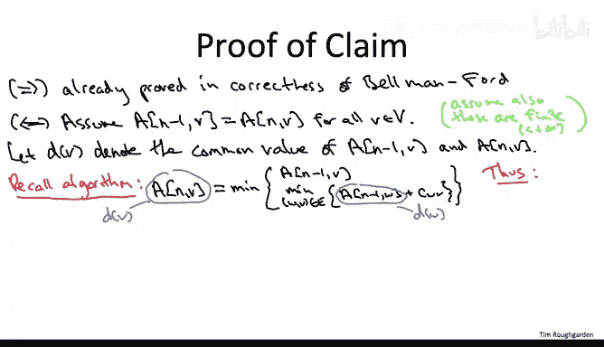

# 133：检测负环 🔍

在本节中，我们将学习如何扩展贝尔曼-福特算法，使其能够检测输入图中是否存在负成本环。我们将看到，只需在算法中增加一次额外迭代，就能在不显著增加运行时间的情况下完成这一检测。

---

## 概述

到目前为止，我们已经了解了在没有负成本环的输入图中，贝尔曼-福特算法如何正确计算从源顶点 S 到所有目标顶点 V 的最短路径。但是，如果输入图中确实存在负成本环呢？在这个简短的视频中，我们将看到如何扩展贝尔曼-福特算法，使其能够轻松检查输入图是否包含负成本环，同时保持其运行时间基本不变。

## 核心概念与扩展

上一节我们介绍了贝尔曼-福特算法在无负环图中的正确性。本节中，我们来看看如何修改它以检测负环。

以下断言将指出贝尔曼-福特算法的适当扩展。具体来说，该断言根据贝尔曼-福特算法的行为，描述了输入图中是否存在负成本环。

我们设想将外层循环多运行一次迭代，即当 `I = n` 时，对所有目标顶点 V 运行相同的旧递推关系。那么，断言是：输入图 G 没有负环，当且仅当从这额外一批子问题中我们没有获得任何新信息。也就是说，当且仅当对于每个可能的目标顶点 V，`A[n][V]` 与 `A[n-1][V]` 完全相同。等价地，输入图确实存在负成本环，当且仅当存在某个子问题，存在某个目标顶点 V，通过为这次额外迭代运行贝尔曼-福特算法，我们看到 V 处有改进。

我们将在下一张幻灯片中证明这个断言。这并不难，但我希望你能立即清楚该断言的含义，以及我们如何检查负成本环。

## 检测负环的步骤

现在，给定一个没有任何承诺的任意输入图（它可能有负成本环，也可能没有），你该怎么做？你运行贝尔曼-福特算法，但多运行一次迭代。你将外层 `for` 循环索引 `I` 一直运行到 `N`，然后检查：在最后一次迭代中，是否有某个子问题的值发生了变化？如果没有，如果你的所有 `A[n-1][V]` 都与 `A[n][V]` 相同，那么根据断言，你知道没有负成本环。根据我们之前的工作，我们知道贝尔曼-福特算法是正确的。因此，我们像以前一样愉快地返回 `A[n-1][V]` 作为正确的最短路径距离。

另一方面，如果你注意到存在一个顶点 V，使得 `A[n][V]` 不同于（小于）`A[n-1][V]`，那么根据断言，你会说：“嘿，存在负环。” 因此，我不会为你计算最短路径距离。这没有意义。存在负成本环，你只能放弃。

当然，贝尔曼-福特算法中的这一次额外迭代对其运行时间的影响可以忽略不计，它仍然是 `O(m * n)`。

## 关于断言的说明

在这个断言中，我撒了一点谎。有一个边缘情况我没有正确处理。当我写下这个断言时，我考虑的是输入图 G 的常见情况，即存在一条从 S 到每个其他目标 V 的路径，也就是说，所有最短路径距离都是有限的输入图。如果不是这种情况，那么所述的断言就不正确。一种理解方式是考虑一个退化实例，其中源顶点 S 根本没有出弧，而其他顶点可能形成一个负成本环。在这种图中，该断言的左侧为假，但右侧却得到满足。

因此，为了修改它以适应可能具有无限距离的图，我将修改左侧，改为：G 有一个从源顶点 S 可达的负成本环。

实际上，如果你想检测输入图中是否存在负环（无论是否从 S 可达），你可以使用贝尔曼-福特算法通过各种技巧来解决这个问题。例如，给定一个输入图，你可以添加一个虚拟的额外顶点，并从该顶点向所有其他顶点添加长度为 0 的弧，然后在该图上运行贝尔曼-福特算法，如果存在负成本环，它将被检测出来。

## 证明断言

既然我们知道了为什么希望断言成立，现在让我们理解它为什么成立。让我们进入证明。

该断言断言了一个“当且仅当”的关系：左侧是输入图没有负成本环的属性，右侧是如果你多运行一次迭代，贝尔曼-福特算法不会做出任何更改的属性。

像这样的证明有两个部分：假设左侧成立，证明右侧；假设右侧成立，证明左侧。这两个部分中，如果你仔细想想，我们已经完成了一个。当我们证明贝尔曼-福特算法对于没有负成本环的图是正确的时候，我们就已经完成了。也就是说，如果左侧成立，如果输入图没有负成本环，我们已经论证过，你不需要将外层 `for` 循环运行超过 `I = n - 1`。这足以捕获最短路径。因此，特别是，取任意大的 `I`，例如 `I = n`，你也不会看到更短的路径。你将得到完全相同的子问题解。

那么，内容就是反向方向。因此，让我们假设我们多运行了一次贝尔曼-福特迭代，并且没有任何子问题解发生变化。我警告过你，当输入图没有从 S 到所有其他顶点的路径并且你有无限距离时，存在这个边缘情况。我将这些细节留给你，所以让我们只关注从 S 到其他所有顶点都存在路径的情况，特别是这些子问题值将是有限的。

用一点符号表示，我将使用小写 `d(v)` 表示顶点 V 在最后两次迭代（当 `i = n - 1` 和 `i = n` 时）中子问题的公共值。

现在的计划是，我们将仔细研究用于评估这些子问题的公式。它就在贝尔曼-福特算法的伪代码中盯着我们。从那里，我们将得到一个将这些 `d` 值相互关联的不等式，并且从那个不等式，我们将能够轻松推断出输入图的每个环确实是非负的——这就是陈述的左侧。

我们用什么公式来填充表格的这次额外迭代？`A[n][V]`，但我们只是取了两者中较好的一个：一方面是 `A[n-1][V]`，即前一次迭代的解；另一方面是使用最后一跳 `(W, V)` 并连接一条最多有 `n-1` 条边到 W 的路径以及那条边 `(W, V)` 的最佳候选者。

还要注意，用我们的新符号表示这些小的 `d` 值（子问题在第 `n-1` 次和第 `n` 次迭代中的公共值），我们可以将这个公式的左侧写为 `d(V)`，在情况 2 的子问题中，我们可以将 `A[n-1][W]` 写为 `d(W)`。

因为这个等式的左侧是右侧一系列候选者的最小值，如果我们实例化，如果我们放大右侧任何一个候选者，即任何最后一跳 `(W, V)` 的选择，我们得到的东西至少和左侧一样大。同样，左侧是所有候选者中最小的。

因此，特别是对于给定的最后一跳 `(W, V)` 的选择，我们得到 `d(V) <= d(W) + c(W, V)`，其中 `c(W, V)` 是从 W 到 V 的边的长度。

实际上，这个不等式所说的只是，从 S 到 V 的一条路径的一种方式是取一条从 S 到 W 的路径并连接最后一跳 `(W, V)`。到 V 的最短路径只能比这个经由 W 的特定候选者更好。

现在，记住我们试图证明什么：我们试图证明输入图没有负成本环。让我们只选择我们最喜欢的环 `C`，并证明它具有非负成本。

这将是我们刚刚写下的粉色不等式的巧妙应用。具体来说，我们将对该不等式在环中的所有边上求和。如果我稍微重新排列一下那个粉色不等式，就会很清楚。

让我们看看环 `C` 中边长的和。记住，这就是我们想要证明是非负的。

我们对大 `C` 中的边 `(W, V)` 求和，对于每条边，我们查看其成本 `c(W, V)`。根据粉色不等式，我们可以用环 `C` 中边的端点 `d` 值之差的求和来下界这个和。

注意，对于环上的一条给定弧 `(W, V)`，这条弧的尾部 W 的 `d` 值以系数 `+1` 出现，而这条弧的头部 V 的 `d` 值以系数 `-1` 出现。

但是，环当然有一个非常特殊的属性：环的每个顶点恰好作为某条弧的尾部出现一次，也恰好作为某条弧的头部出现一次。因此，环上每个顶点的 `d` 值将出现一次，系数为 `+1`，出现一次，系数为 `-1`。所以我们得到巨大的抵消，只剩下零。

因此，环 `C` 具有非负成本。`C` 是任意环，所以它同时适用于输入图中的所有环。这正是我们试图证明的。

## 总结

本节课中，我们一起学习了如何扩展贝尔曼-福特算法以检测负成本环。我们看到，输入图中负成本环的存在与否，可以通过贝尔曼-福特算法在额外一次迭代中的行为来表征。这就是为什么很容易扩展基本算法来检查负环，而不影响其运行时间。