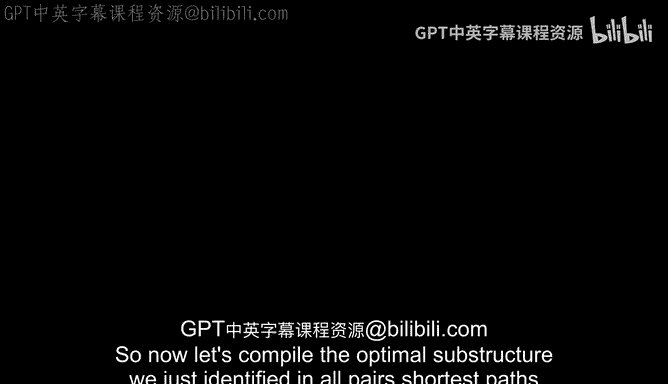
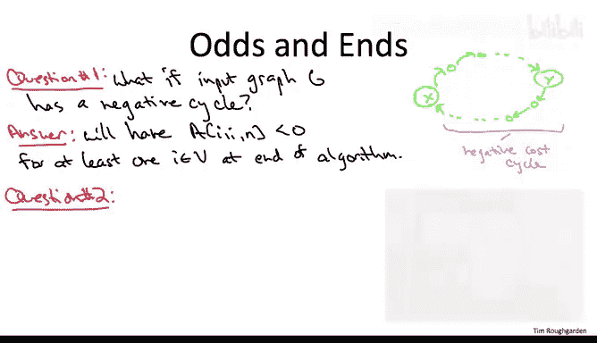

# 139：弗洛伊德-沃舍尔算法



在本节课中，我们将学习如何将“所有点对最短路径”问题的最优子结构，编译成一个动态规划算法，即弗洛伊德-沃舍尔算法。我们将从理解基础情况开始，逐步构建算法，并讨论如何处理负成本环以及如何重构最短路径。

## 基础情况

上一节我们介绍了子问题的定义，它包含三个索引：起点 `i`、终点 `j` 和预算 `k`。本节中我们来看看如何确定这些子问题的基础情况，即当 `k = 0` 时的情况。

以下是填充 `A[i][j][0]` 的规则：

*   如果 `i` 等于 `j`，则存在一条空路径，其长度为 `0`。
*   如果 `i` 不等于 `j`，且 `i` 和 `j` 之间有一条直接相连的边，则 `A[i][j][0]` 等于该边的成本 `C[i][j]`。
*   如果 `i` 不等于 `j`，且 `i` 和 `j` 之间没有直接相连的边，则不存在任何不使用内部节点的路径，因此 `A[i][j][0]` 被定义为正无穷 `+∞`。

## 算法实现

在明确了基础情况后，我们现在可以系统地编写弗洛伊德-沃舍尔算法的完整代码。算法的核心是使用一个三重循环，从小到大解决所有子问题。

```python
# 假设 n 为顶点数量，C 为邻接矩阵（无边则为无穷大）
A = [[[0 for _ in range(n+1)] for _ in range(n)] for _ in range(n)]

# 初始化基础情况 (k=0)
for i in range(n):
    for j in range(n):
        if i == j:
            A[i][j][0] = 0
        elif C[i][j] is not None: # 存在直接边
            A[i][j][0] = C[i][j]
        else:
            A[i][j][0] = float('inf')

# 动态规划主循环
for k in range(1, n+1):
    for i in range(n):
        for j in range(n):
            # 情况1：不经过顶点k
            candidate1 = A[i][j][k-1]
            # 情况2：经过顶点k
            candidate2 = A[i][k-1][k-1] + A[k-1][j][k-1]
            # 取两者中的较小值
            A[i][j][k] = min(candidate1, candidate2)
```

算法的正确性依赖于最优子结构引理，该引理指出，任何最短路径要么完全不使用顶点 `k`，要么必然经过顶点 `k`。我们通过比较这两种情况来更新子问题的解。由于有三重循环，每层循环最多迭代 `n` 次，因此算法的总运行时间为 **O(n³)**。

## 处理负成本环

一个常见的问题是，如果输入图中存在负成本环，算法会如何表现？我们的最优子结构引理和算法正确性论证都基于图中没有负成本环的假设。然而，算法本身无论图中是否存在负环都会执行。

幸运的是，有一个简洁的方法来检测负环。算法运行完毕后，只需检查最终结果（即 `k = n` 时）的对角线元素 `A[i][i][n]`。

以下是检测方法：

*   如果对于**任何**顶点 `i`，`A[i][i][n]` 的值是**负数**，则说明图中存在负成本环。
*   如果所有对角线元素都是 `0`，则图中没有负成本环，并且 `A[i][j][n]` 给出的就是正确的从 `i` 到 `j` 的最短路径距离。

直观上，如果存在一个负成本环，并且 `y` 是该环上编号最大的顶点，那么当算法外层循环 `k` 等于 `y` 时，从环上某点 `x` 到其自身 (`A[x][x][y]`) 的路径长度就会被更新为这个负环的长度。这个负值会在后续迭代中一直保持，最终体现在 `A[x][x][n]` 上。

## 重构最短路径

在计算出所有点对的最短路径距离后，我们通常还想知道具体的路径序列。与贝尔曼-福特算法类似，我们需要在算法运行过程中存储额外的信息。



我们将维护一个二维数组 `B`，其中 `B[i][j]` 用于记录从顶点 `i` 到顶点 `j` 的某条最短路径上**编号最大的内部顶点**。

以下是更新 `B` 数组的方法：

*   在算法的动态规划循环中，当我们计算 `A[i][j][k]` 时，如果发现通过顶点 `k` 的路径（即 `candidate2`）比不经过 `k` 的路径（`candidate1`）更短，那么我们不仅更新 `A[i][j][k]`，同时将 `B[i][j]` 设置为当前的 `k`。
*   如果 `candidate1` 更短或相等，则 `B[i][j]` 保持不变。

当算法结束时，`B` 数组就存储了重构路径所需的信息。要重构从 `i` 到 `j` 的最短路径，可以递归地进行：

1.  查询 `mid = B[i][j]`。如果 `mid` 为 `None` 或 `i == j`，说明路径是直接的或为空。
2.  否则，最短路径由从 `i` 到 `mid` 的最短路径，加上从 `mid` 到 `j` 的最短路径组成。
3.  递归地对 `(i, mid)` 和 `(mid, j)` 执行步骤1和2，直到路径被完全分解。

这种方法保证了重构过程的时间复杂度与路径长度成正比。

## 总结

本节课中我们一起学习了弗洛伊德-沃舍尔算法。我们从定义子问题和基础情况出发，构建了一个基于动态规划的三重循环算法，用于解决所有点对最短路径问题，其时间复杂度为 **O(n³)**。我们还探讨了算法如何处理可能存在的负成本环——通过检查最终结果的对角线元素来检测。最后，我们介绍了如何通过维护一个额外的 `B` 数组来记录路径上的关键顶点，从而能够重构出具体的最短路径序列。这个算法简洁而强大，是理解动态规划在图论中应用的经典范例。