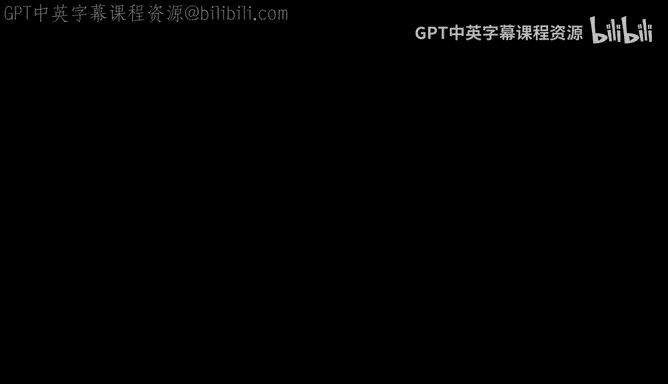
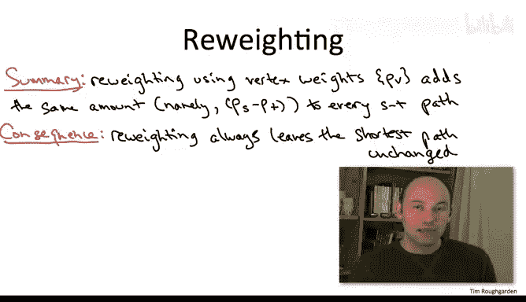

# 140：重加权技术

## 概述
在本节课中，我们将要学习约翰逊算法的核心思想——重加权技术。这项技术能够巧妙地将带有负权边的图转化为所有边权均为非负的图，从而允许我们使用更高效的迪杰斯特拉算法来解决原本需要贝尔曼-福特算法处理的问题。

---

## 从问题到思路
当我们开始讨论全源最短路径问题时，我们注意到，通过遍历所有可能的源点，该问题可以简化为多次调用单源最短路径子程序。运行时间取决于图是否包含负权边。如果图没有负权边，我们可以使用运行速度极快的迪杰斯特拉算法（时间复杂度约为 **O(m log n)**）。如果图包含负权边，则运行时间会显著增加（约为 **O(n²m)**）。

约翰逊算法令人惊讶地表明，即使图包含负权边，全源最短路径问题也可以通过一次贝尔曼-福特算法加上 n 次迪杰斯特拉算法来解决，最终达到 **O(nm log n)** 的运行时间，这与非负权边情况下的运行时间相同。

这听起来似乎好得令人难以置信。我们如何能将带有负权边的图转化为所有边权均为非负的图呢？接下来，我们将探讨这个关键的重加权技术。

---

## 简单的边平移法为何失效
一个很自然的想法是：如果图中存在负权边，为什么不简单地为每条边的权值加上一个常数，使其变为非负呢？例如，如果最负的边权是 -5，就给所有边权加上 5。

然而，这种方法并不总是有效。考虑一个简单的图，其中从源点 S 到终点 T 有两条路径：一条经过两个权值为 1 的边（总长为 2），另一条经过一个权值为 3 的边（总长为 3）。显然，最短路径是第一条。如果我们给所有边权加上 2，第一条路径的总长变为 6，第二条变为 5，最短路径就改变了。

**结论是**：只有当 S 到 T 之间的所有路径都包含相同数量的边时，为每条边加上一个常数才能保证最短路径不变。这通常不成立，因此我们需要更聪明的方法。

---

## 顶点重加权技术
现在，我们介绍核心的重加权技术。假设我们有一个图，每条边 `e` 有一个原始长度 `c(e)`。此外，我们为每个顶点 `v` 分配一个权重 `p(v)`，这个权重可以是任意实数。

我们利用这些顶点权重来重新定义每条边的长度。对于一条从顶点 `u` 指向顶点 `v` 的边 `e`，其**新长度** `c'(e)` 定义为：
`c'(e) = c(e) + p(u) - p(v)`

这个变换有一个非常重要的性质。

以下是该性质的推导过程：

考虑任意一条从源点 `S` 到终点 `T` 的路径 `P`。假设它在原始图中的总长度为 `L`。那么，在新图（使用 `c'` 作为边权）中，这条路径的总长度 `L'` 是多少？

`L' = Σ c'(e)` （对路径 `P` 上的所有边 `e` 求和）
`= Σ [c(e) + p(u) - p(v)]`
`= Σ c(e) + Σ p(u) - Σ p(v)`

在求和过程中，路径内部顶点的权重 `p(v)` 会作为一条边的头出现一次（带负号），又作为下一条边的尾出现一次（带正号），因此相互抵消。最终，只剩下路径起点 `S` 的权重（作为第一条边的尾，带正号）和终点 `T` 的权重（作为最后一条边的头，带负号）未被抵消。

因此，我们得到：
`L' = L + p(S) - p(T)`

**关键结论**：对于任意固定的起点 `S` 和终点 `T`，**重加权技术会将所有从 S 到 T 的路径的长度都增加完全相同的值**，即 `p(S) - p(T)`。这意味着，路径之间的长度排序保持不变，**原始图中的最短路径，在新图中依然是最短路径**。

---

## 通往非负权边的桥梁
既然重加权技术能保持最短路径不变，我们就可以利用它来“改造”图。我们的目标是：**找到一组顶点权重 `p(v)`，使得变换后的所有新边权 `c'(e)` 都成为非负数**。

如果能够找到这样一组权重，那么我们就成功地将一个可能包含负权边的图，转化成了一个所有边权均为非负的图。在这个新图上，我们就可以放心地使用高效的迪杰斯特拉算法来求解最短路径问题。

一个自然的问题是：这样的权重总是存在吗？答案是：**只要原始图中没有负权循环，这样的顶点权重就总是存在的**。计算这组权重并非微不足道，但代价并不高昂。事实上，**运行一次贝尔曼-福特算法就足以计算出这组权重**。

---

## 总结
本节课中，我们一起学习了约翰逊算法的基石——重加权技术。我们了解到：
1.  简单的全局边权平移会改变最短路径，因此无效。
2.  基于顶点权重的重加权技术（`c'(e) = c(e) + p(u) - p(v)`）能够保持任意两点间所有路径的长度相对顺序不变。
3.  只要图中没有负权循环，就总能找到一组顶点权重，使得变换后的所有边权为非负。
4.  这为我们提供了一条路径：通过一次贝尔曼-福特算法计算顶点权重，将图转化为非负权图，然后就可以用 n 次迪杰斯特拉算法高效解决全源最短路径问题。

在下一节中，我们将看到约翰逊算法如何将这些想法整合成一个完整、高效的算法。