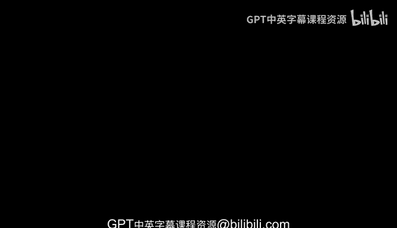
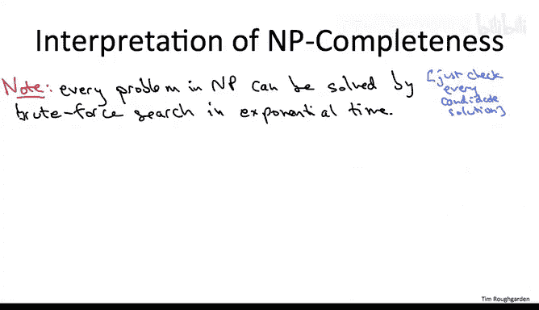

# 145：NP完全性定义与解释一




在本节课中，我们将要学习计算复杂性理论的核心概念之一：**NP** 复杂性类。我们将探讨NP问题的定义，理解其与“暴力搜索可解”问题的关系，并初步了解**NP完全性**这一重要概念，它用于证明某些问题在计算上是极其困难的。

## NP复杂性类的定义 🧩

上一节我们讨论了旅行商问题等难题的求解难度。本节中，我们来看看如何从数学上定义一类“可被高效验证解”的问题，即NP问题。

一个计算问题（例如旅行商问题，或本课程中讨论过的几乎所有其他问题）属于复杂性类 **NP**，当且仅当它满足以下两个标准：

1.  **解的长度是输入规模的多项式函数**：这是一个基本前提，它确保候选解的描述不会过长。
2.  **解的正确性可在多项式时间内验证**：这是关键属性。如果有人向你提供一个NP问题的候选解，你可以在多项式时间内验证这个解是否正确。

为了理解这个抽象定义，让我们看一些具体例子。

## 实例分析：旅行商问题 🧳

考虑一个旅行商问题的实例，它由一组顶点和顶点间的距离定义。假设我们想知道是否存在一条总长度不超过1000的旅行路线。

暂时搁置检查n!条路线中是否存在满足条件路线的问题。我们思考一个更简单的问题：**验证**一条给定的特定路线是否满足条件。

这个验证问题很简单。一条路线由访问顶点的顺序指定。这个顺序的长度显然是输入长度的多项式函数。你需要做的只是将路线中遍历的n条边的长度相加，并检查总和是否不超过1000。

这个论证表明，检查是否存在总成本不超过某个阈值的旅行路线确实属于复杂性类NP。你可以用多项式长度写出一个候选解（只需指定顺序），并且可以在线性时间内验证一个候选解（一条提议的路线）是否满足阈值。

如果你对我从计算最优路线问题转向研究“是否存在满足阈值的路线”这个看似更简单的问题感到困惑，请注意，前者可以通过对阈值进行二分搜索，转化为后者的多次询问来解决。

## 实例分析：约束满足问题 🔗

除了优化问题，另一类重要的NP问题是**约束满足问题**。

在约束满足问题中，你有一组变量（最简单的情况是二元或布尔变量）和一个约束列表。每个约束为变量的一个子集指定了允许的取值组合。

一个简单的例子是**3-SAT问题**。它涉及布尔变量（每个变量Xi可以是0或1）。子句可以看作禁止变量三元组的特定赋值组合。例如，一个子句可能禁止同时将x3赋值为1、x5赋值为0、x8赋值为1。问题是：是否存在一个对所有变量的0/1赋值，能同时满足所有约束？

这类约束满足问题也属于复杂性类NP。如果你有一个满足所有约束的变量赋值提议，你可以简单地写下每个变量的值。验证也很容易：只需逐个遍历所有约束，检查提议的变量值组合是否在允许的列表中。

## NP与暴力搜索的关系 🔍

在本视频开头，我提到NP类代表了像旅行商问题那样可通过暴力搜索解决的问题。现在让我们观察，基于“高效验证解”的NP定义，确实意味着这些问题可以用指数时间的暴力搜索解决。

以下是暴力搜索的基本思路：
```python
for each candidate_solution in all_possible_solutions:
    if verify(candidate_solution) is True:
        return candidate_solution
```
在这个过程中，NP定义的两个属性作用清晰：
*   第一个属性（解的长度是多项式）限制了可能解的数量。给定长度的比特串数量最多是输入规模的指数级。
*   第二个属性（多项式时间验证）确保你能对每个（指数多的）可能性，在多项式时间内验证它是否确实是正确解（例如，是否是一条短旅行路线，或是否是一个满足约束的赋值）。



## NP类的广泛性与NP完全性的意义 🌐

由于成为NP类成员的要求非常弱，所以NP类非常庞大。成为NP成员本质上只需要能够高效识别一个解（即“当你看到它时，你能认出来”）。可以想象，我们思考的许多计算问题都满足这个属性，例如几乎任何图问题、排序问题、大多数约束满足问题等。

当然，并非所有自然计算问题都属于NP。停机问题就是一个极端例子，它实际上是**不可判定**的（根本不存在算法）。在某些应用领域也存在一些既不属于NP也不可判定的自然问题（例如模型检查领域中的许多问题就比NP更难）。

NP类的广泛性意味着**NP完全性**是计算难解性的有力证据。回忆一下，一个问题对某个问题集是“完全的”意味着什么？它意味着这个问题和该集合中的任何其他问题一样难。集合中的**每一个**其他问题都可以归约到这个完全问题。

因此，假设你对**仅仅一个**NP完全问题拥有多项式时间算法。根据归约的定义，你将自动获得NP中**每一个**计算问题的多项式时间算法，即每一个你能高效验证解的问题。也就是说，在多项式时间内解决哪怕一个NP完全问题，都将意味着 **NP = P**（即NP中的每个问题都能在多项式时间内解决）。

如果P等于NP，其影响将是深远的。仅举一例，我们所知的现代电子商务将像纸牌屋一样崩塌，因为它依赖于RSA等密码系统的安全性，而这又假定了因数分解等问题的计算难解性。然而，即使是对最晦涩的NP完全问题的高效算法，也将自动意味着（至少在原则上）存在因数分解的多项式时间算法。

## 总结与展望 📝

本节课中我们一起学习了NP复杂性类的核心定义：**解可在多项式时间内验证**的问题集合。我们通过旅行商问题和3-SAT问题验证了这个定义，并理解了NP问题与指数时间暴力搜索的等价关系。最后，我们探讨了NP类的广泛性，并引出了**NP完全性**作为证明问题内在难解性的强有力工具：证明一个问题是NP完全的，就等于证明了如果存在该问题的多项式时间算法，那么NP中成千上万的其他难题也将迎刃而解，这相当于证明了P=NP。

在接下来的课程中，我们将深入探讨如何证明一个问题是NP完全的，并了解NP完全问题在现实中的普遍性。

