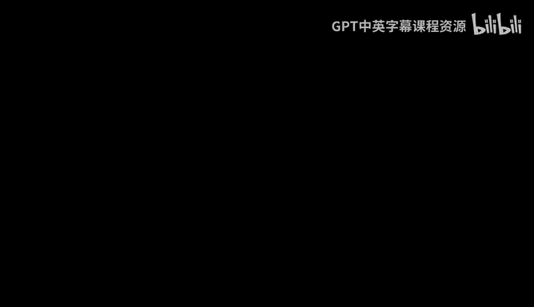
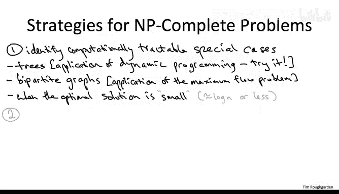

# 149：顶点覆盖问题

在本节课中，我们将学习一个被称为“顶点覆盖问题”的经典NP完全问题。我们将探讨其定义、应用场景以及处理此类问题的通用策略。特别地，我们会为顶点覆盖问题设计一个精确算法，该算法虽然在最坏情况下仍是指数级时间复杂度，但相比朴素的暴力搜索有显著改进。这展示了即使面对NP完全问题，算法设计依然大有可为。

## 问题定义

顶点覆盖问题的输入是一个无向图。目标是找出该图的一个“顶点覆盖”的最小尺寸，即最小基数。

**什么是顶点覆盖？**
我们称一个顶点的子集S为一个顶点覆盖，如果对于图中的每一条边，该边至少有一个端点（也可能两个端点都在）位于集合S中。

当然，总存在一个可行的解：你可以选择所有顶点，这显然是一个顶点覆盖。但困难的问题在于，如何以最节约的方式确保从每条边中选出一个端点。

## 应用场景

这个问题可以代表许多场景。例如，假设你正在组建一个团队（可能是程序员、律师或足球运动员）。将图中的顶点视为你可以招募的潜在人选，将边视为团队可能需要完成的潜在任务，而边上的两个顶点代表能够完成该任务的两个人。那么，一个顶点覆盖就意味着：雇佣足够多的人，使得对于每一个任务，你的团队中至少有一人能够完成它。

这个问题可以有各种推广，例如为每个顶点赋予权重（代表需要支付的薪水），或者将边推广为“超边”（表示超过两个人能完成一个任务）。但为了我们的目的，无向图上的无权顶点覆盖问题已经足够有趣。

## 一个小测验

为了确保问题定义清晰，我们来看一个测验。

**问题：** 考虑两个图：一个是有n个顶点的星形图，另一个是有n个顶点的团（完全图）。它们的最小顶点覆盖大小分别是多少？

**答案：**
*   **星形图：** 最小顶点覆盖大小为1。只需选择中心顶点即可覆盖所有边。
*   **团（完全图）：** 最小顶点覆盖大小为n-1。任何少于n-1个顶点的集合都会遗漏至少两个顶点，而这两个顶点之间的边将无法被覆盖；而任意n-1个顶点的集合都能覆盖所有边。

## 处理NP完全问题的策略

对于一般图，计算最小顶点覆盖是一个NP完全问题，除非P=NP，否则不存在多项式时间算法。这是一个坏消息。因此，我们需要回顾之前讨论过的处理NP完全问题的策略。

上一节我们介绍了顶点覆盖问题及其NP完全性。本节中，我们来看看应对此类问题的三种主要策略。

### 策略一：识别可计算处理的特殊情况

最理想的情况是，你在实际应用中需要解决的问题恰好落在某个可计算处理的特殊情形内。更常见的情况是，应用中的实例不一定属于这些特殊情况，但为各种特殊情况准备好子程序仍然有用。我们过去讨论过“混合方法”的潜力：或许你可以进行少量的暴力搜索，而在搜索的大部分分支中，剩余问题会落入一个可计算处理的特殊情况。

对于顶点覆盖问题，存在一些有趣的可计算处理的特殊情况，这与我们过去讨论独立集问题的思路非常相似。

以下是顶点覆盖问题的一些可计算处理的特殊情况：

*   **路径图、树、有界树宽图：** 与独立集问题类似，顶点覆盖问题在树（以及更一般的有界树宽图）上可以通过动态规划在多项式时间内解决。这可以作为一个练习。
*   **二分图：** 二分图（即没有奇环的图）上的顶点覆盖问题也可以在多项式时间内解决。这可以通过“最大流问题”来解决，这超出了本课程的范围。

在接下来的视频中，我将介绍另一种算法，它针对顶点覆盖问题的另一个特殊情况：当所求的顶点覆盖**很小**时（例如，顶点数量的对数级别或更小）。

### 策略二：使用启发式算法

第二种策略是放宽对正确性的要求，专注于设计**启发式算法**——那些运行快速但未必产生最优解的算法。

对于顶点覆盖问题，存在一些相当好的启发式算法。例如，可以使用贪心算法设计范式来生成一些启发式。我不会在这里详细讨论，因为我认为将时间花在讨论背包问题的启发式算法上会更好。但请注意，如果明智地做出贪心选择，可以为顶点覆盖问题获得相当好的近似保证。

### 策略三：设计改进的精确算法

第三种策略是坚持要求正确性。在这种情况下，除非你意图证明P=NP，否则你不应期望对一般实例获得多项式时间算法。

因此，虽然你预期的是指数级运行时间，但你仍然希望获得一个在**质量上**优于朴素暴力搜索的运行时间。这正是下一个视频的重点。我们将给出一个确实基于枚举的算法，但它是一种比朴素暴力搜索更聪明的枚举方式，从而获得更快的指数级运行时间，使我们能够解决更广泛的问题。

## 总结

本节课中，我们一起学习了顶点覆盖问题的定义及其作为NP完全问题的性质。我们探讨了它的一个直观应用场景，并通过小测验加深了对问题定义的理解。接着，我们回顾了处理NP完全问题的三种通用策略：寻找可计算处理的特殊情况、使用启发式算法以及设计改进的精确算法。我们特别指出了顶点覆盖问题在树和二分图等特殊情况下的可解性，并预告了下一讲将重点介绍一种针对“小规模”顶点覆盖的改进型精确算法。