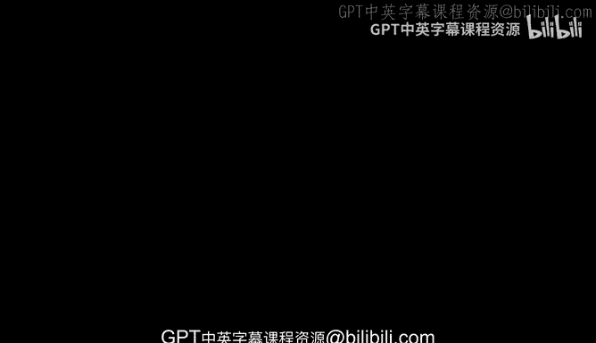
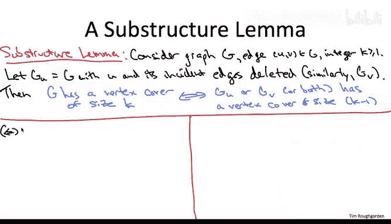

# 150：顶点覆盖的智能搜索（一）

在本节课中，我们将学习如何为顶点覆盖问题开发一个精确算法。该算法在最坏情况下运行时间为指数级，但相比朴素的暴力搜索，它在性质上更优。一个重要的推论是，当最优解规模很小（至多为对数级别）时，顶点覆盖问题在计算上是可处理的。

## 问题定义与动机

首先，让我们快速回顾一下顶点覆盖问题。输入是一个无向图 **G**。图的一个顶点覆盖是一个顶点的子集，它包含图中每条边的至少一个端点。顶点覆盖问题的目标是计算最小规模的顶点覆盖。

我们考虑该问题的一个变体：额外给定一个目标值 **K**（一个正整数），我们想知道是否存在一个规模为 **K** 或更小的顶点覆盖。从本质上讲，这并没有让问题变得更简单。如果你能解决这个给定目标 **K** 的版本，你就能解决原始问题（即找出最小覆盖规模），只需对 **K** 从 1 到 **N** 的所有可能值运行这个子程序即可。

我们之所以关注 **K** 较小的情况，是因为在实际应用中，我们可能只对规模合理的解感兴趣。例如，在组建团队的场景中，每个顶点代表一个潜在的团队成员，边代表任务，端点代表能执行该任务的两个人。你可能只愿意在能找到规模合理的团队（即小规模顶点覆盖）时，才承接项目。或者，你可能拥有领域知识，知道你的图确实存在小规模的顶点覆盖。

## 朴素暴力搜索的局限性

从算法角度看，关注 **K** 较小的情况是有用的。如果你要寻找一个仅包含 **K** 个顶点的顶点覆盖，你可以直接检查所有 **K** 个顶点的子集。子集的数量是 **n 选 K**，对于小的 **K**，这大约是 **θ(n^K)**。因此，只要 **K** 是常数，这种朴素的暴力搜索原则上可以在多项式时间内运行。

然而，在实际中，除非 **K** 非常小（例如 3 或 4），否则很难运行这种朴素算法。这自然引出了一个问题：我们能否做得更好？是否存在更智能的搜索方法？

答案是肯定的。接下来，我们将介绍一种更智能的搜索方法，它允许我们处理在性质上更大的 **K** 值。

## 子结构引理

这种搜索算法将基于一个引理来驱动，其精神类似于我们在动态规划算法中关于最优解的推理。我们称之为子结构引理。

考虑一个输入图 **G**，我们的算法任务是检查 **G** 是否存在一个规模为 **K** 的顶点覆盖。同时，考虑图中的一条边，假设是 **U** 和 **V** 之间的边。

与动态规划中的最优子结构类似，我们将考虑通过某种方式减少原始实例的规模。具体来说，我们将考虑两个更小的图：一个是删除顶点 **U** 及其所有关联边后得到的图 **G_U**；另一个是删除顶点 **V** 及其所有关联边后得到的图 **G_V**。

引理断言：我们关心的原始问题（**G** 是否存在规模为 **K** 的顶点覆盖）可以转化为关于更小图 **G_U** 和 **G_V** 的类似问题。具体来说：

**G 存在规模为 K 的顶点覆盖，当且仅当 G_U 或 G_V 中至少一个存在规模为 K-1 的顶点覆盖。**

### 引理证明

这是一个“当且仅当”陈述，因此证明包含两个部分。

**第一部分（右推左）：**
假设 **G_U** 或 **G_V**（不妨设为 **G_U**）确实存在一个规模为 **K-1** 的顶点覆盖 **S**。我们需要证明 **G** 也存在一个规模为 **K** 的顶点覆盖。

考虑原始图 **G** 的边集。它可以分为两类：与 **U** 关联的边集 **F_U**，以及不与 **U** 关联的边集 **E_U**。图 **G_U** 的边集正是 **E_U**。

由于 **S** 是 **G_U** 的顶点覆盖，它包含了 **E_U** 中每条边的至少一个端点。现在，如果我们取集合 **S** 并加入顶点 **U**，就得到了原始图 **G** 的一个顶点覆盖：**S** 负责覆盖 **E_U** 中的所有边，而 **U** 则负责覆盖 **F_U** 中的所有边（因为这些边都与 **U** 关联）。因此，我们得到了一个规模为 **K** 的顶点覆盖。

**第二部分（左推右）：**
现在假设原始图 **G** 确实存在一个规模为 **K** 的顶点覆盖 **S**。我们需要证明这必然反映在两个子图之一中：**G_U** 或 **G_V** 必须本身有一个规模为 **K-1** 的顶点覆盖。

考虑我们最初选定的边 **(U, V)**。由于 **S** 是 **G** 的顶点覆盖，它必须包含 **U** 或 **V**（或两者）。不妨设 **U** 在 **S** 中。

再次将 **G** 的边集分解为 **E_U**（不与 **U** 关联的边）和 **F_U**（与 **U** 关联的边）。集合 **S** 是 **G** 的顶点覆盖，因此它包含每条边的至少一个端点。顶点 **U** 是 **F_U** 中所有边的一个端点，但它不是 **E_U** 中任何边的端点。

这意味着，**S** 中除 **U** 外的其他 **K-1** 个顶点，必须负责包含 **E_U** 中所有边的端点。因此，如果我们从 **S** 中移除 **U**，剩下的 **K-1** 个顶点就构成了 **G_U** 的一个顶点覆盖。

这就完成了引理的证明。

## 从引理到算法

上一节我们介绍了子结构引理，它揭示了原问题与更小子问题之间的关系。本节中，我们来看看如何利用这个引理设计一个更智能的搜索算法。

该引理直接启发了一个递归算法：
1.  如果图 **G** 没有边，那么空集就是一个顶点覆盖（规模为0）。如果此时 **K ≥ 0**，则答案为“是”。
2.  如果 **K = 0** 但图仍有边，则不存在顶点覆盖，答案为“否”。
3.  否则，选择任意一条边 **(U, V)**。根据引理，原问题有解当且仅当在 **G_U**（删除U）或 **G_V**（删除V）中，存在规模为 **K-1** 的顶点覆盖。因此，我们递归地检查这两个更小的子问题。

这个算法的运行时间如何？在最坏情况下，它会产生一个深度为 **K** 的递归树，因为每次递归调用 **K** 减少1。在每一层，问题会分支成两个子问题。因此，递归调用的总数最多约为 **2^K**。在每个递归调用中，我们需要处理图（删除顶点），这可以在多项式时间内完成（例如 **O(n+m)**）。因此，总运行时间为 **O(2^K * poly(n))**。

这与朴素的 **O(n^K)** 搜索相比是一个质的飞跃。当 **K** 是常数时，两者都是多项式时间，但前者的指数底数是固定的2，而后者指数底数是 **n**。更重要的是，当 **K = O(log n)** 时，**2^K** 是 **n** 的多项式（因为 **2^{c log n} = n^c**），这意味着对于最优解规模至多为对数级别的图，我们可以在多项式时间内精确求解顶点覆盖问题。

## 总结

本节课中，我们一起学习了顶点覆盖问题的一个智能搜索算法。我们首先定义了问题，并讨论了关注小规模解 **K** 的动机。接着，我们指出了朴素暴力搜索 **O(n^K)** 的局限性。然后，我们介绍并证明了一个关键的**子结构引理**，该引理将原问题归结为两个更小的子问题。最后，基于这个引理，我们设计了一个递归算法，其运行时间为 **O(2^K * poly(n))**。这个算法在性质上优于朴素搜索，并且使得在最优解规模很小（例如 **K = O(log n)**）的特殊情况下，顶点覆盖问题变得计算上可处理。