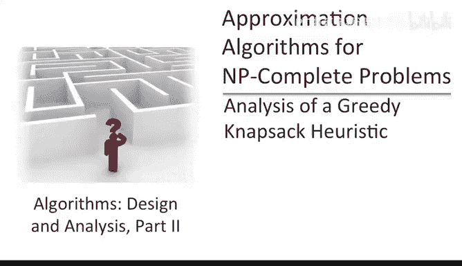
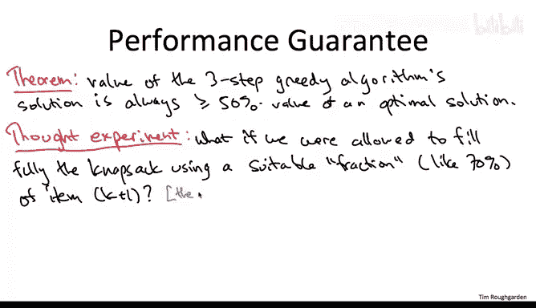
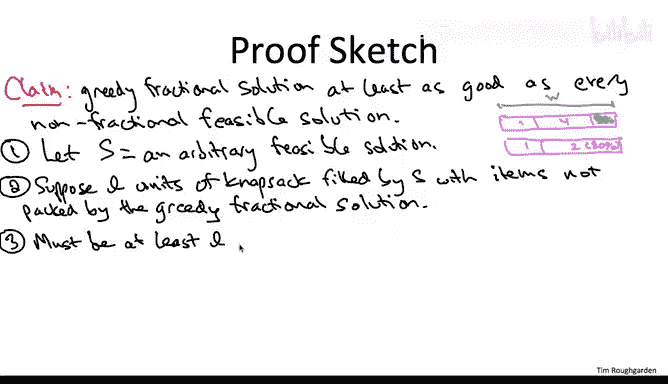

# 155：贪心背包启发式算法分析一

在本节课中，我们将要分析针对背包问题的三步贪心启发式算法，并解释为何它在最坏情况下仍具有良好的性能保证。

我们的目标是证明，这个三步贪心算法输出的解，其价值总是至少达到最优解（即满足背包容量限制的最大价值解）价值的一半。

## 分析的核心思想 🧠

分析的关键思想在于一个思想实验，我们使用一个“作弊”算法作为衡量标准。

回顾一下贪心启发式算法的第一步：我们按照“性价比”（即价值与尺寸的比值 `价值/尺寸`）的非递增顺序对物品进行排序。

在贪心算法的第二步中，我们按照这个顺序装入物品。可能前 K 个物品（对于某个 K 值）可以完全装入背包，但第 K+1 个物品就装不下了，此时我们停止这一步。

思想实验是想象我们的算法可以作弊，将第 K+1 个物品的一部分装入背包，从而完全填满背包。例如，如果我们装入了前 K 个物品后，背包只剩下 7 个单位的剩余容量，而第 K+1 个物品的尺寸是 10，那么我们设想取该物品的 70% 来填满背包。其价值也按比例计算，即装入 70% 的物品，我们获得其 70% 的价值。

我们将这个作弊算法的输出称为**贪心分数解**。

举一个非常简单的例子：假设背包容量为 3，有两个物品，尺寸均为 2。一个价值为 3，另一个价值为 2。在贪心分数解中，我们先考虑性价比更高的物品 1（比值为 3/2），它完全装入背包。接着考虑物品 2，它只能装入 50% 到背包中。解的总价值是物品 1 的完整价值 3，加上物品 2 价值的 50%（即 1），所以贪心分数解的价值是 4。

## 贪心分数解的性质 📊

在接下来的测验中，我们将探讨贪心分数解相对于背包实例的可行解具有什么性质。

正确答案是 D：贪心分数解总是至少和最佳的非分数解（即整数解）一样好，事实上，它可能严格更好。确实，在上一个简单的双物品例子中，贪心分数解严格优于每一个可行的整数解。当然，并非每个实例中它都严格更好，因为有些实例中贪心分数解恰好没有使用分数，只是用 100% 的各种物品完全填满了背包，那么它就不可能比最优的非分数解更好了。

我不会提供非常详细的证明，但会概述论证过程。

**断言**：对于任何背包实例，贪心分数解的总价值保证至少与每个可行解（即每个非分数解）的总价值一样大。

这个证明非常适合本课程的贪心算法部分。一种正式的证明方法是使用**交换论证**，我将在此进行高层面的概述，细节留作练习。这非常类似于我们证明“按比率排序能最小化单台机器上一批作业的加权完成时间之和”的贪心算法最优性。

我们如何证明贪心分数解和每个可行解（每个非分数解）一样好呢？固定一个这样的解，称之为 S。这是一个能装入背包的物品子集。

设想一个场景：贪心分数解装入了物品 1，然后物品 2 无法完全装入，但如果我们取物品 2 的 80%，就能完全填满背包。这可能就是贪心分数解。而我们考虑的非分数解 S 可能同样装入了物品 1，但它没有装无法完全放入的物品 2，而是使用了更小的物品 4，并且可能还留有一些未使用的背包容量。

有趣的情况是 S 装入了一些贪心分数解没有装入的物品。假设 S 通过贪心分数解未装入的物品，占用了背包容量中的 L 个单位。

另一方面，贪心分数解完全填满了背包，它使用了所有 W 个单位的空间。因此，如果 S 中有 L 个单位的物品不在贪心分数解中，那么贪心分数解中也必须有至少 L 个单位的物品不在 S 中。

这可能会让人觉得两个解是半斤八两，各装了一些对方没有的东西。但贪心分数解确实更好。为什么？因为根据贪心准则，所有未被贪心分数解装入的物品，其性价比都低于它装入的所有物品。因此，贪心分数解中缺失的这 L 个单位物品，其价值低于它包含的那 L 个单位物品。

由于贪心分数解中包含但 S 中缺失的 L 个单位物品，比 S 中包含但贪心分数解中缺失的 L 个单位物品能更好地利用空间，通过简单的代数运算可以证明，贪心分数解的总价值确实至少等于 S 的总价值。由于 S 是任意选取的，这表明贪心分数解在某种意义上优于最优解——它优于所有非分数的可行解。

## 思想实验的意义 🎯

此刻可能还不清楚我们为何要进行这个思想实验，它发生在一个允许分数化装入物品的幻想世界中。而我们真正关心的是我们的三步贪心算法，它存在于不能分数化装入物品的现实世界。这个思想实验有什么用呢？正如我们将在下一张幻灯片的分析中看到的，它提供了一个有用的衡量标准，一个我们可以用来比较三步贪心算法性能的假设基准。

---

**本节课中我们一起学习了**：分析背包问题三步贪心启发式算法的核心思想，即通过构造一个允许分数化装入的“贪心分数解”作为性能上界。我们了解到，这个贪心分数解的价值总是至少与任何可行的整数解一样好，这为后续证明原始贪心算法的近似比（至少达到最优解价值的一半）奠定了重要基础。下一节我们将利用这个基准来完成正式的性能保证证明。