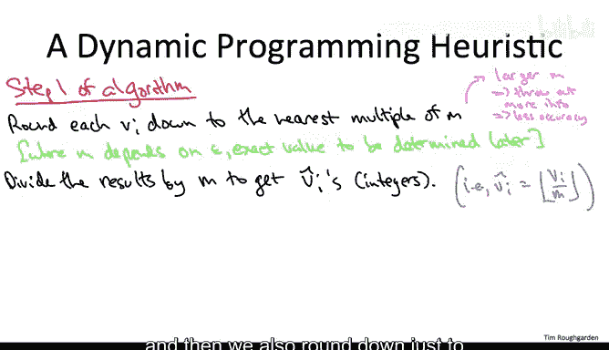

# 157：背包问题的动态规划启发式算法 🎒

在本节课中，我们将学习如何为NP完全的背包问题设计一个启发式算法。该算法允许用户通过一个误差参数ε来平衡精度与运行时间，最终得到一个保证至少为最优解价值（1-ε）倍的可行解。

---

上一节我们介绍了背包问题的贪心启发式算法，本节中我们来看看如何利用动态规划实现一个更强大的近似方案。

## 算法的高层思路 💡

我们无法为NP完全问题设计精确的多项式时间算法，但可以追求次优目标：一个任意接近最优解的近似算法。用户提供一个误差参数ε，算法则返回一个价值至少为最优解（1-ε）倍的解。

听起来可能过于理想，但存在一个关键点：运行时间会随着ε减小而增加。这为用户提供了一个精度与运行时间的权衡旋钮。对于大多数NP完全问题（如顶点覆盖问题），这种任意接近的近似被认为是不可能的，但背包问题是一个幸运的例外。

为了实现这一目标，核心思路是：对原始背包实例进行轻微“按摩”（变换），将其转化为一个我们能在多项式时间内精确求解的特殊情况。然后，求解这个变换后的问题。只要变换没有丢失太多信息，变换后问题的最优解就能很好地近似原始问题的最优解。

## 可计算处理的特殊情况 🔧

到目前为止，我们已知两种可利用动态规划精确求解的背包问题特殊情况：

1.  **物品尺寸和背包容量为小整数**：运行动态规划算法，时间复杂度为 `O(n * W)`，其中W是背包容量。若W是多项式大小，则算法是多项式时间的。
2.  **物品价值为小整数**：存在另一种动态规划算法，其时间复杂度为 `O(n² * V_max)`，其中V_max是最大物品价值。若所有物品价值都是多项式大小的小整数，则该算法也是多项式时间的。

出于技术原因（稍后会详细说明），第二种特殊情况——**物品价值为小整数**——更适合用于构建我们的启发式算法。

## 算法详述：两步走策略 🚶‍♂️🚶‍♂️

基于上述思路，我们的算法分为两个清晰的步骤：

**第一步：变换实例（舍入物品价值）**
我们将每个物品的原始价值 `v_i` 向下舍入到某个参数 `M` 的最近倍数。`M` 的具体值稍后根据ε确定。定义变换后的价值 `v̂_i` 为：
`v̂_i = floor(v_i / M)`
其中 `floor` 是向下取整函数。这样，所有 `v̂_i` 都变成了（可能较小的）整数。

**第二步：求解变换后实例**
我们使用上述第二种动态规划算法，精确求解变换后的背包实例。该实例的物品尺寸 `w_i` 和背包容量 `W` 均与原始实例相同，只有物品价值被替换为 `v̂_i`。

## 关键观察与参数M的作用 ⚖️

以下是关于算法的重要观察：

*   **可行性保证**：算法输出的解保证是可行的（即能放入背包），因为第二步求解时使用的是原始、准确的尺寸和容量。
*   **参数M的双重角色**：
    *   **控制运行时间**：动态规划算法的运行时间为 `O(n² * max(v̂_i))`。由于 `v̂_i ≈ v_i / M`，`M` 越大，`v̂_i` 越小，运行越快。
    *   **控制精度**：`M` 越大，舍入时丢弃的价值信息（低阶比特）越多，解的精度可能越差。
    *   因此，`M` 就像一个旋钮：调大它，运行更快但精度更低；调小它，精度更高但运行更慢。

接下来的分析将证明，我们可以为 `M` 选择一个“甜点”值，使其在保持多项式运行时间的同时，实现由ε指定的高精度。

---

本节课中我们一起学习了为背包问题设计基于动态规划的近似算法的核心框架。我们了解到，通过巧妙地舍入物品价值，将原始NP难问题转化为一个可在多项式时间内精确求解的“价值为小整数”的特殊情况，再结合对参数 `M` 的调控，我们有望在精度和效率之间取得完美平衡。下一节我们将深入分析，具体确定 `M` 与 ε 的关系，并严格证明算法的近似保证。