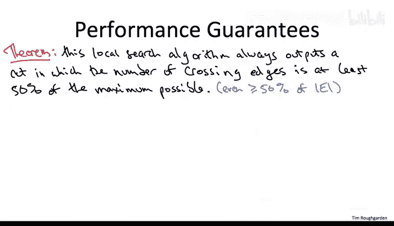

# 160：最大割问题与局部搜索算法 🧩

在本节课中，我们将学习如何利用局部搜索算法来近似求解最大割问题。最大割问题是NP完全问题，这意味着在一般情况下，我们无法在多项式时间内找到最优解。然而，通过局部搜索，我们可以高效地找到一个质量不错的近似解。

## 最大割问题定义

上一节我们介绍了课程背景，本节中我们来看看最大割问题的具体定义。

给定一个无向图 **G**，算法的任务是输出一个割，即将顶点划分为两个非空集合 **A** 和 **B**，使得跨越两个集合的边数最大化。用公式表示，即最大化 **|E(A,B)|**，其中 **E(A,B)** 是连接 **A** 和 **B** 的边的集合。

与我们在课程第一部分学习过的最小割问题不同，最大割问题在计算上是难处理的，它是NP完全的。更准确地说，其判定问题版本（即判断是否存在一个割能切割至少特定数量的边）是NP完全的。除非P等于NP，否则不存在多项式时间算法。

然而，对于某些特殊情况，如二分图，最大割问题可以在线性时间内解决。例如，使用广度优先搜索（BFS）可以高效地找到二分图的最大割。

## 局部搜索算法概述

上一节我们定义了最大割问题，本节中我们来看看如何使用局部搜索算法来近似求解它。

局部搜索是一种通用的启发式算法设计范式。其核心思想是：我们始终维护一个候选解（即一个割），并通过局部修改（即小的调整）来迭代地改进它。

以下是局部搜索算法求解最大割问题的步骤：

1.  **初始化**：从图的一个任意割开始，将顶点任意分配到集合 **A** 和 **B** 中。
2.  **迭代改进**：检查每个顶点 **v**。对于顶点 **v**，定义：
    *   **C_v(A,B)**：与 **v** 关联且跨越当前割的边的数量。
    *   **D_v(A,B)**：与 **v** 关联且**不**跨越当前割的边的数量。
3.  **顶点切换**：如果存在一个顶点 **v**，使得 **D_v(A,B) > C_v(A,B)**，那么将 **v** 从一个集合移动到另一个集合（例如，从 **A** 移到 **B**）将会增加跨越割的边数。净增量为 **D_v(A,B) - C_v(A,B)**。
4.  **终止条件**：重复步骤2和3，直到对于所有顶点 **v**，都有 **D_v(A,B) ≤ C_v(A,B)**。此时，算法停止并返回当前割。

## 算法性能分析

上一节我们介绍了算法的步骤，本节中我们来看看它的性能如何。

我们通常从两个维度评估算法：解的质量和所需的计算资源。

### 运行时间分析

该算法保证在多项式时间内终止。原因如下：
*   每次执行`while`循环迭代（即切换一个顶点），跨越割的边数至少增加1。
*   在一个简单图中，边的总数最多为 **O(n²)**，其中 **n** 是顶点数。
*   因此，`while`循环最多执行 **O(n²)** 次。每次迭代可以高效实现，故总运行时间为多项式时间。

### 解的质量保证

虽然该局部搜索算法不能保证找到最大割（鉴于问题是NP完全的，这不可能），但它提供了一个有理论保证的近似解。

具体来说，该算法返回的割所包含的跨越边数，**至少是所有边数的一半**。由于最大割的边数不可能超过总边数，这也意味着该解至少是最优解的50%。

**证明思路**：当算法终止时，对于每个顶点 **v**，有 **D_v ≤ C_v**。将所有顶点的这两个量分别求和，并利用每条边根据其端点被计算的方式，可以推导出跨越边的总数至少是总边数的一半。

## 总结

本节课中我们一起学习了如何应用局部搜索算法来近似求解NP完全的最大割问题。我们首先明确了问题的定义，然后逐步讲解了算法的流程：从任意割开始，通过反复将能够增加割边数的顶点切换到对面集合来改进解，直到无法改进为止。我们分析了该算法能在多项式时间内运行，并且其输出的解至少包含图中总边数一半的跨越边，即具有50%的近似保证。这展示了局部搜索作为解决难处理优化问题的一种实用且有效的启发式方法。