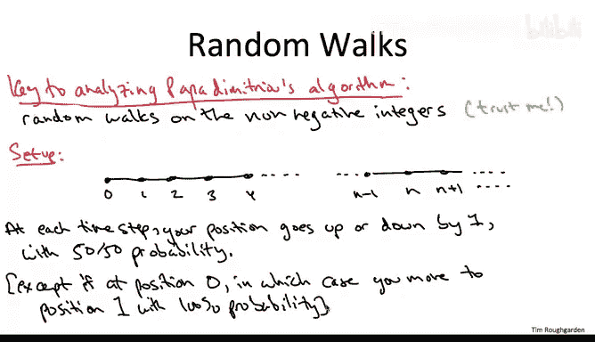
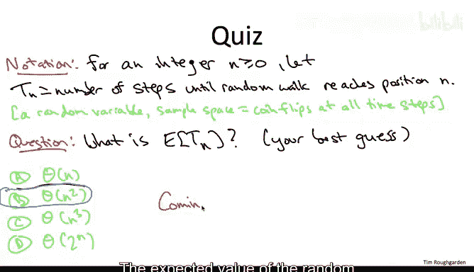
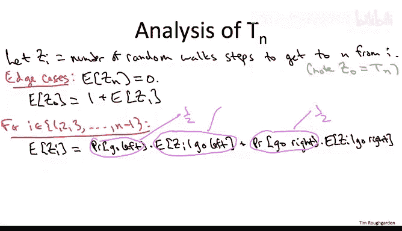
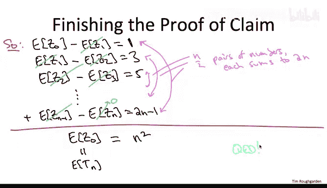
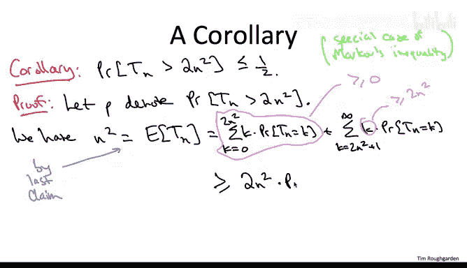

# 165：直线上的随机游走 🚶‍♂️

在本节课中，我们将学习非负整数线上随机游走的基本性质。理解这些性质对于后续分析帕帕·迪米特里（Papa Dimitri）的随机局部搜索算法至关重要。本节我们将专注于一个简单的随机过程，并探讨其核心统计特性。

## 背景与设定

上一节我们介绍了随机游走的概念，本节中我们来看看一个具体的模型。假设你刚参加完一场极其困难的考试（例如算法课），精神恍惚，完全不知道自己身处何方。你只能沿着一条直线跌跌撞撞地前进。在每个时间步，你有50%的概率向左走一步，也有50%的概率向右走一步。

我们将你的位置定义为距离街道尽头（一个死胡同）的步数，该点称为**位置0**。因此，通过在每个时间步随机向左或向右移动，你的位置要么增加1，要么减少1，每种情况的概率各为50%。

唯一的例外是当你到达位置0时。由于那是死胡同，你无法再向左走，因此在下一个时间步，你将以100%的概率向右踉跄一步，到达位置1。

我们假设你的考场位于位置0（即死胡同处）。换句话说，在时间0，你处于位置0。

## 核心问题：平均回家时间

关于非负整数线上的随机游走，有许多有趣的问题。我们感兴趣的是以下问题：假设你的宿舍距离考场有 **n** 步之遥，即你的宿舍位于位置 **N**。如果你头脑清醒，你可以沿着直线径直走，只需 **N** 步就能从考场回到宿舍。然而，你现在处于考后恍惚状态，只能随机游走。那么，平均需要多少步，你才能首次到达位置 **N**（即回到家）？

为了说明一个样本轨迹，假设你的宿舍仅在三步之外的位置3。
1.  在时间1，你必然从位置0移动到位置1。
2.  接下来，如果你幸运地向右踉跄一步，则到达位置2，距离家仅一步之遥。
3.  但不幸的是，你可能又向后踉跄回到位置1。
4.  接着，你可能再次向前踉跄到位置2。
5.  这一次，你的势头可能带你一路向前到家，到达位置3。

在这个轨迹中，你花了5步才到达位置3的宿舍。你可以想象更快的轨迹（例如径直走），当然也可能有更慢的轨迹（在最终到达位置3之前多次向左踉跄）。

## 精确定义与直觉

让我们精确地定义这个统计量，并检验你对其随 **n** 增长的直觉。

对于一个非负整数 **n**，我们用大写字母 **T_n** 表示该随机游走**首次**到达位置 **N** 所需的步数。**T_n** 是一个随机变量，其值取决于你每一步随机“抛硬币”的结果。一旦揭示了所有随机抛硬币的结果（即每一步是向左还是向右），你就可以计算出 **T_n** 的具体值，就像我们在上一个幻灯片的样本轨迹中所做的那样。

以下是一个非平凡的问题：**T_n** 的期望值 **E[T_n]** 如何作为目标位置 **N** 的函数增长？我们并不要求你现在就给出证明（这将是本节后续大部分内容的目标），只需做出最佳猜测。

正确答案是 **Θ(n²)**。事实上，更酷的是，我们将证明 **E[T_n]** 恰好等于 **n²**，对于每个非负整数 **n** 都成立。

## 证明思路：解决更一般的问题

在本课程中，我努力提供既不太冗长又能传授知识的证明。本节将展示一个巧妙的证明，表明到达位置 **N** 所需的期望步数恰好是 **n²**。

这个巧妙证明背后的核心思想是解决一个更一般的问题：我们不仅要计算从位置0到位置 **N** 的随机游走的期望步数，还要更一般地计算从每个中间位置 **i** 到位置 **N** 的随机游走的期望步数。这是一个好主意，因为它给出了 **n+1** 个我们试图计算的统计量，并且很容易从这些不同量之间的关系中求解出所有值。

以下是使其精确的符号定义：对于一个非负整数 **i**，用 **Z_i** 表示如果你从位置 **i** 开始，**首次**到达位置 **n** 所需的随机游走步数。根据定义，**Z_0** 恰好等于 **T_n**（从0开始到达 **n** 所需的步数）。

有哪些 **Z** 的期望值容易计算？显然，如果取 **i = n**，那么 **Z_n** 是从 **n** 首次到达 **n** 所需的平均步数，这将是0。

对于其他的 **i** 值，我们不会立即显式求解 **E[Z_i]**，而是将不同 **Z_i** 的期望值相互关联起来。

## 建立期望方程

以下是建立这些关系的方法：

1.  **从 i=0 开始**：我们不知道 **E[Z_0]**（这正是我们要计算的）。但我们知道，每条从0开始、在 **n** 结束的游走，都始于从0到1的一步，然后接着一条从1到 **n** 的游走。因此，这样一条游走的期望长度就是 **1**（第一步）加上从位置1到 **n** 的随机游走的期望长度，即 **E[Z_1]**。所以有：
    **E[Z_0] = 1 + E[Z_1]**

2.  **对于中间值 i (1 ≤ i ≤ n-1)**：我们可以将 **E[Z_i]** 与 **E[Z_{i-1}]** 和 **E[Z_{i+1}]** 关联起来。考虑从位置 **i** 开始的随机游走的第一步：
    *   有50%的概率向左走到 **i-1**，后续过程是从 **i-1** 到 **n** 的随机游走。
    *   有50%的概率向右走到 **i+1**，后续过程是从 **i+1** 到 **n** 的随机游走。
    因此，通过条件期望（或直观理解），我们可以得到：
    **E[Z_i] = 1 + 0.5 * E[Z_{i-1}] + 0.5 * E[Z_{i+1}]**

将等式两边乘以2并整理，我们得到一个更简洁的关系式：
**E[Z_i] - E[Z_{i+1}] = 2 + (E[Z_{i-1}] - E[Z_i])**

这个等式的解释是：考虑一对连续的起始点 **(i-1, i)** 和 **(i, i+1)**。从更靠近目标的位置开始显然有优势。这个等式表明，当你将这对连续的起始点向目标滑动一个位置时，优势会放大 **2**。也就是说，从 **i** 开始相对于从 **i-1** 开始节省的步数，比从 **i+1** 开始相对于从 **i** 开始节省的步数少 **2**。

## 求解期望值

现在我们有了这个庞大的约束系统，可以同时求解所有这些期望值，特别是我们真正关心的 **E[Z_0]**。

根据第一个关系，我们有：
**E[Z_0] - E[Z_1] = 1**

根据递推关系，如果我们把起始点对向右滑动一个位置，差值会增加2。因此：
*   **E[Z_1] - E[Z_2] = 1 + 2 = 3**
*   **E[Z_2] - E[Z_3] = 3 + 2 = 5**
*   ...
*   **E[Z_{n-1}] - E[Z_n] = (2n - 1)**

现在，让我们写下从 **i=0** 到 **i=n-1** 的所有这 **n** 个方程：
1.  E[Z_0] - E[Z_1] = 1
2.  E[Z_1] - E[Z_2] = 3
3.  E[Z_2] - E[Z_3] = 5
...
n.  E[Z_{n-1}] - E[Z_n] = (2n - 1)

将所有这些方程相加。左边会发生大规模抵消：**E[Z_1]** 到 **E[Z_{n-1}]** 都出现了一次正号和一次负号，因此全部消去。右边是 **E[Z_0] - E[Z_n]**。

我们知道 **E[Z_n] = 0**，并且 **E[Z_0] = E[T_n]**。所以左边就是 **E[T_n]**。

右边是所有奇数的和：**1 + 3 + 5 + ... + (2n-1)**。这个和等于 **n²**。（可以将首尾配对：1+(2n-1)=2n, 3+(2n-3)=2n, ...，共有 n/2 对，每对和为 2n，总和为 n²；当 n 为奇数时，中间项为 n，同样可得 n²）。

因此，我们完成了证明：
**E[T_n] = n²**

## 一个有用的推论：马尔可夫不等式应用

在分析帕帕·迪米特里的算法时，我们实际上不会直接使用关于期望的这个结论，而是使用一个简单的推论，该推论给出了随机游走步数超过其期望值两倍的概率上界。

具体来说，我们将使用以下事实：随机游走首次到达位置 **N** 所需的步数**严格超过 2n²** 的概率**不超过 50%**。这是一个简单而有用的不等式——马尔可夫不等式的特例。

**证明**：设 **P** 为我们感兴趣的概率，即 **P(T_n > 2n²)**。

我们从 **T_n** 的期望值出发，已知 **E[T_n] = n²**。根据期望的定义：
**n² = E[T_n] = Σ_{k=0}^{∞} [ k * P(T_n = k) ]**

我们将这个求和分成两部分：**k ≤ 2n²** 的部分和 **k > 2n²** 的部分。
**n² = Σ_{k=0}^{2n²} [ k * P(T_n = k) ] + Σ_{k=2n²+1}^{∞} [ k * P(T_n = k) ]**

现在，我们对右边进行一些粗略的下界估计：
*   第一个求和项 ≥ 0（因为 k 和概率都非负）。
*   在第二个求和项中，对于所有 **k > 2n²**，有 **k ≥ 2n² + 1 > 2n²**。因此，我们可以用 **2n²** 替换每个 **k**，得到一个下界：
    **Σ_{k=2n²+1}^{∞} [ k * P(T_n = k) ] ≥ Σ_{k=2n²+1}^{∞} [ 2n² * P(T_n = k) ] = 2n² * P(T_n > 2n²) = 2n² * P**

将这两个下界代入原式，我们得到：
**n² ≥ 0 + 2n² * P**

整理不等式：
**P ≤ 1/2**

这就完成了推论的证明。它本质上是 **E[T_n] = n²** 这一核心结论的一个简单推论。我们将在下一节分析帕帕·迪米特里的算法时用到这个推论。

## 总结

本节课中，我们一起学习了非负整数线上随机游走的一个关键性质：
*   我们定义了从位置0首次到达位置 **N** 所需步数的随机变量 **T_n**。
*   通过解决一个更一般的、从任意位置 **i** 出发的问题，我们巧妙地证明了 **T_n** 的期望值 **E[T_n] = n²**。
*   利用马尔可夫不等式，我们得到了一个实用推论：游走步数超过 **2n²** 的概率不超过 **50%**。

理解这个随机游走模型及其期望行为，是分析后续更复杂随机算法（如帕帕·迪米特里的算法）的重要基础。在下一节中，我们将看到这个结论如何被直接应用。