# 166：Papadimitriou算法分析 🧮

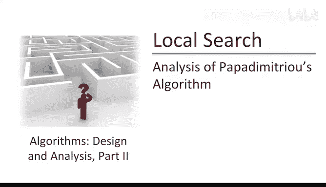

在本节课中，我们将学习如何利用对非负整数上随机游走基本性质的理解，来分析Papadimitriou算法。我们将看到，随机化的局部搜索如何为2-SAT问题产生一个多项式时间算法。

## 算法回顾 🔄

首先，让我们回顾一下Papadimitriou的2-SAT算法细节。考虑一个有 `n` 个布尔变量的2-SAT实例。该算法包含两个循环：

*   **外层循环**：运行 `log₂ n` 次独立的随机试验。
*   **内层循环**：每次外层循环迭代中，进行随机局部搜索。

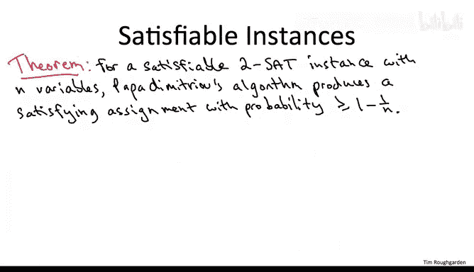

以下是具体步骤：

1.  **初始化**：从随机赋值开始。对 `n` 个变量中的每一个独立地抛一枚公平硬币，决定其初始值为真或假。
2.  **搜索预算**：获得 `2n²` 次局部移动的预算，试图将初始赋值转换为一个满足的赋值。
3.  **迭代搜索**：在 `2n²` 次内层迭代中：
    *   首先检查当前赋值是否满足所有子句。如果满足，算法结束。
    *   如果不满足，则至少存在一个（可能多个）不满足的子句。我们任意选取其中一个。
    *   由于是2-SAT实例，该子句涉及两个变量。我们以均匀概率随机选择其中一个变量，并翻转其布尔值。
4.  **输出结果**：如果在 `2n² * log₂ n` 次局部移动后，算法仍未找到满足的赋值，则断言该实例不可满足。

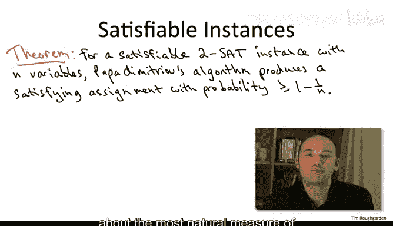

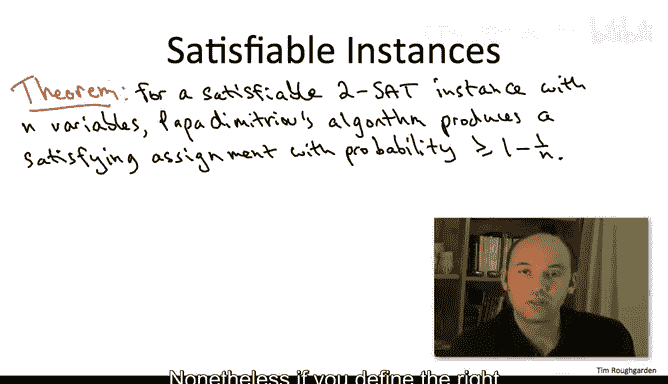

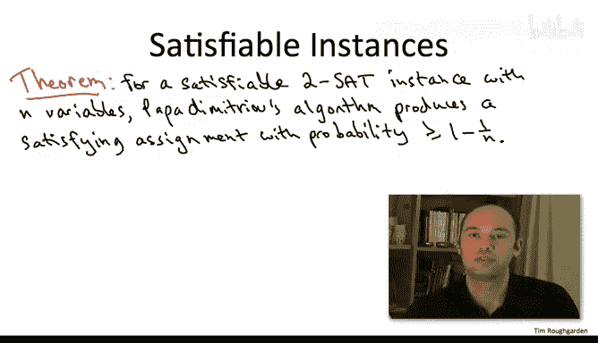

该算法显然在多项式时间内运行，并且当实例不可满足时总能正确报告。然而，当至少存在一个满足赋值时，算法成功找到它的概率并不显然。这正是本视频分析的主题。

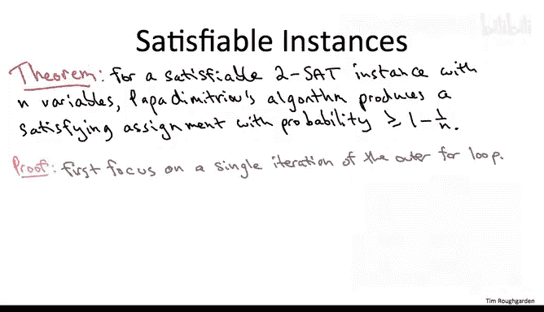

## 核心洞察：定义正确的进度度量 📈

上一节我们介绍了算法的流程，本节中我们来看看分析的关键。Papadimitriou算法最自然的进度度量可能是“当前满足的子句数量”。然而，当你翻转一个变量的赋值时，这个数量实际上可能会减少——你修复了一个子句，但可能破坏了其他多个子句。

尽管如此，如果我们定义正确的进度度量，就可以通过随机游走的类比来论证算法会随着时间取得进展，并最终找到一个满足的赋值。

让我们看看具体细节。

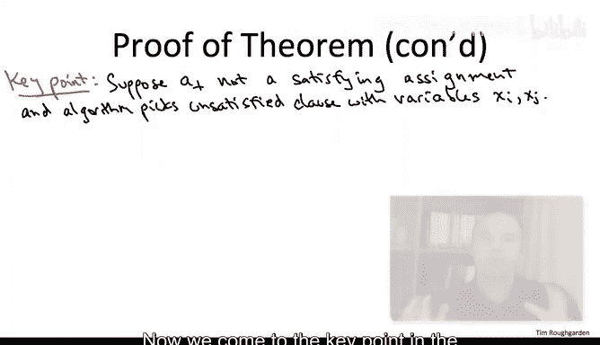

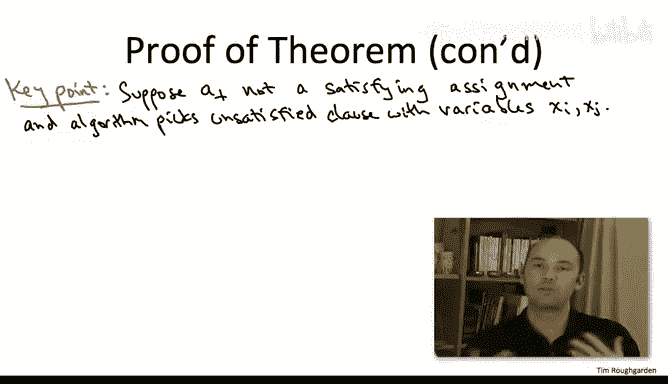

我们假设实例是可满足的，因此至少存在一个满足赋值。我们任意选取其中一个，称之为 `A*`。

我们用 `A_t` 表示算法在内层循环完成 `t` 次迭代后所考虑的赋值。`A_0` 是外层循环本次迭代开始时随机的初始赋值。

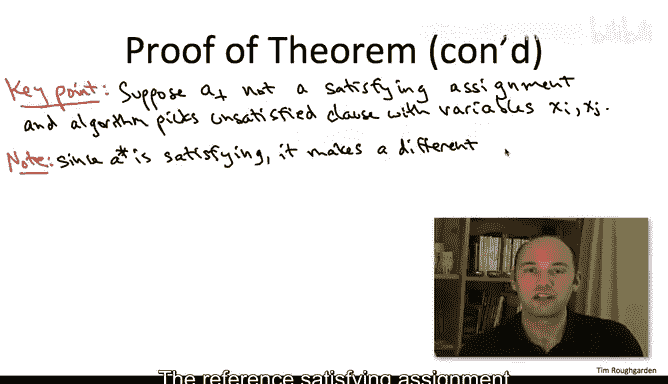

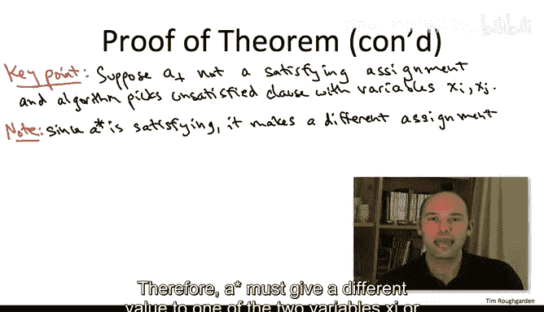

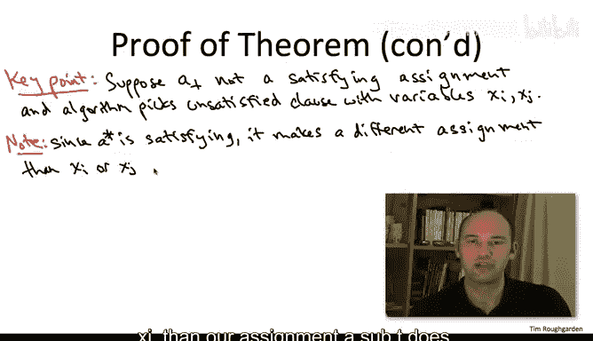

本次分析的精妙之处在于使用正确的进度度量：我们不去计算当前赋值满足的子句数量，而是去计算它与参考满足赋值 `A*` 一致的变量数量。

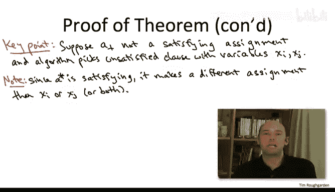

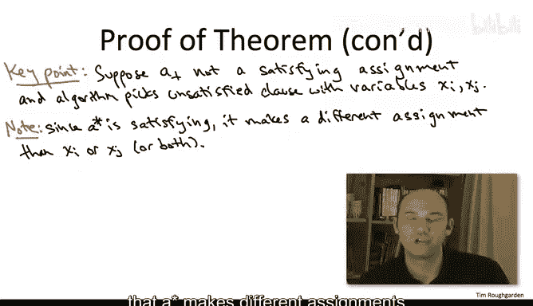

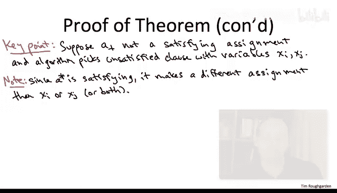

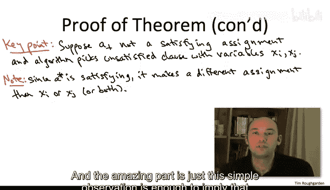

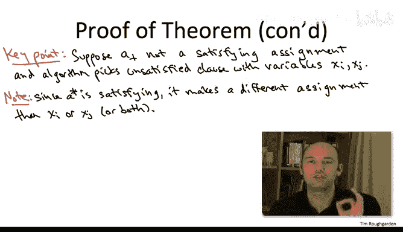

定义随机变量 `X_t` 为赋值 `A_t` 与 `A*` 取值相同的变量数量。显然，`X_t` 是一个介于 `0` 到 `n` 之间的整数。如果 `X_t = n`，则意味着 `A_t` 与 `A*` 完全相同，因此 `A_t` 本身就是一个满足赋值，算法将成功终止。

## 分析进展：与随机游走的联系 🚶‍♂️

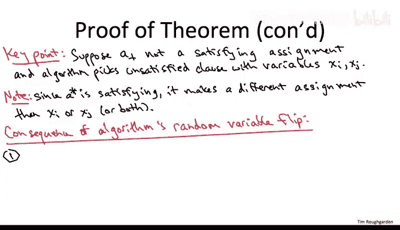

现在我们来分析算法如何在平均意义上取得进展。

假设当前我们查看赋值 `A_t`，并且它不是一个满足赋值。那么存在至少一个不满足的子句。算法任意选取其中一个，假设该子句涉及变量 `x_i` 和 `x_j`。

一个简单的观察是：我们的当前赋值 `A_t` 未能满足这个子句，而参考满足赋值 `A*` 自然满足它。因此，`A*` 必然对变量 `x_i` 或 `x_j` 中的至少一个赋予了与 `A_t` 不同的值。

Papadimitriou算法将以均匀概率随机选择 `x_i` 或 `x_j`，并翻转该变量当前的值。

以下是可能的情况：

1.  **情况一（有利）**：如果 `A_t` 对 `x_i` 和 `x_j` 的赋值都与 `A*` 相反。那么无论算法选择翻转哪个变量，翻转后我们都会比之前多一个变量与 `A*` 一致。即 `X_{t+1} = X_t + 1`。
2.  **情况二（随机）**：如果 `A_t` 与 `A*` 恰好对两个变量中的一个一致（例如，在 `x_i` 上一致，在 `x_j` 上不一致）。
    *   **幸运情况**：如果算法翻转了那个不一致的变量（`x_j`），则结果与情况一相同：`X_{t+1} = X_t + 1`。
    *   **不幸情况**：如果算法翻转了那个已经一致的变量（`x_i`），则翻转后我们会在该变量上变得不一致，导致 `X_{t+1} = X_t - 1`。

此时，我希望大家能联想到上一节视频中关于非负整数上随机游走的内容。在那里，我们也有一个随机变量（游走者的位置），在每个时间步，它都以50%的概率增加1或减少1。

然而，`X_t` 的随机过程与我们之前研究的标准随机游走并不完全相同。以下是三个主要区别：

1.  **移动概率**：在标准随机游走中（除非在位置0），总是50%左移或右移。在Papadimitriou算法中，有时向左移动（`X_t` 减少）的概率可能是0%（即情况一，100%向右移动）。
2.  **起始位置**：标准随机游走定义从位置0开始。而 `X_0` 通常大于0，因为随机初始赋值很可能与 `A*` 在某些变量上一致。
3.  **停止条件**：标准随机游走在首次到达位置 `n` 时停止。在Papadimitriou算法中，如果 `X_t = n`，算法必然停止（因为找到了 `A*`）。但算法也可能在 `X_t < n` 时停止，因为它可能找到了 `A*` 之外的另一个满足赋值。

## 从最坏情况到一般情况的分析 🛡️

那么，我们上一节对随机游走的分析还有用吗？令人惊讶的是，上述三个差异中的每一个都**只会有助于**算法。这意味着，在实际运行中，算法终止的速度可能比单纯从随机游走分析中推测的还要快。

我们可以这样思考：想象我们被迫在**最坏情况**下运行Papadimitriou算法：
1.  实例只有一个满足赋值 `A*`（无法提前因找到其他解而停止）。
2.  初始赋值与 `A*` 在所有变量上都相反（即 `X_0 = 0`）。
3.  每次选择不满足子句时，都“被迫”遇到情况二（即子句中一个变量与 `A*` 一致，另一个不一致），从而只有50%的概率取得进展。

在这种最坏情况下，`X_t` 的演化过程与从0开始、在 `2n²` 步内试图到达 `n` 的标准随机游走**完全相同**。

因此，在最坏情况下，单次外层循环迭代（即 `2n²` 步内）失败的概率，就等于随机游走在 `2n²` 步内未能到达 `n` 的概率。根据上一节的分析，这个失败概率**至多为 1/2**，即成功概率至少为 1/2。

对于任何**非最坏情况**（例如起始 `X_0 > 0`、存在其他解、有时遇到情况一），算法的成功概率只会**更高**。因此，在任何情况下，单次外层循环迭代的成功概率都至少为 50%。

## 整体成功概率计算 🎯

上一节我们分析了单次迭代的成功率，现在我们来计算整个算法的成功率。

单次外层循环迭代失败的概率至多为 `1/2`。算法独立运行 `log₂ n` 次这样的迭代。所有迭代都失败的概率至多为：
```
(1/2)^{log₂ n} = 1/n
```
因此，整个算法至少找到一次满足赋值的成功概率至少为：
```
1 - 1/n
```
这正是定理所声称的结果。

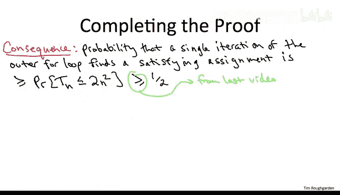

## 总结 📝

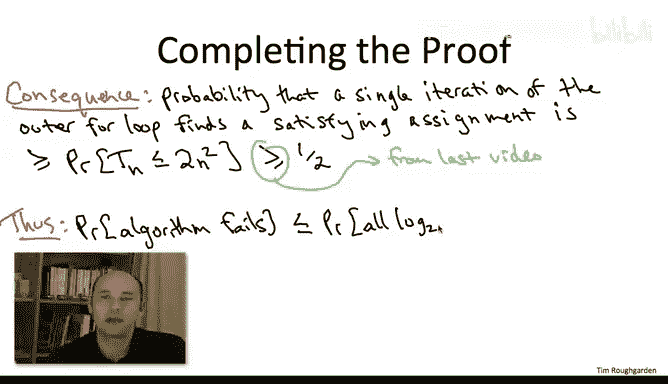

本节课中，我们一起学习了Papadimitriou算法如何巧妙地利用随机局部搜索解决2-SAT问题。通过定义与某个固定满足赋值之间的一致变量数量 `X_t` 作为进度度量，我们将算法的行为与一个非负整数上的随机游走联系起来。分析表明，即使在最坏情况下，单次搜索的成功概率也至少为1/2。通过独立重复 `log₂ n` 次搜索，我们将整体失败概率降低到 `1/n` 以下，从而得到了一个高效且高成功率的随机算法。这个分析展示了概率分析和问题结构洞察在算法设计中的强大力量。