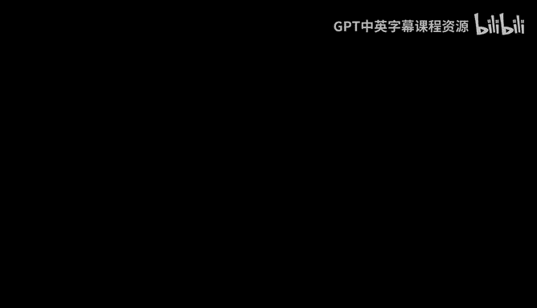
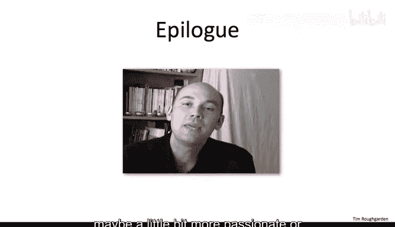

# 170：结语 🎓

在本节课中，我们将一起回顾整个算法课程的学习旅程，并对所学内容进行总结。

---

## 课程概述

我们的旅程至此结束，这门课程也迎来了尾声。

我已经教授这门课程材料多年，但它从未停止过带来乐趣，也从未变得乏味。算法研究是学习计算机科学中许多经典思想的绝佳途径。这门学科历史上许多最杰出的思想，都在这些算法课程中得以展现。

上一节我们回顾了课程的核心内容，本节中我们来看看学习这门课程的最终收获与意义。

---

## 学习成果总结

因此，你学习了许多优雅而巧妙的算法与概念。你掌握了一系列可以在自己的编程项目中应用的实用技术，并且这两者之间存在着显著且巨大的交集。

以下是你在本课程中获得的核心能力：

*   **掌握了经典算法思想**：你理解了分治、动态规划、贪心算法等核心范式。
*   **学会了分析与设计**：你能够分析算法的时间与空间复杂度，并运用所学设计解决方案。
*   **构建了知识体系**：你将图论、搜索、排序、数据结构等知识融会贯通。

我知道这并非总是易事。算法与数据结构的设计和分析领域的前沿知识是一个艰深的课题。在我们之前的计算机科学家们是富有创造力的杰出个体。

---

## 展望未来

现在，你已经能够站在这些巨人的肩膀上，在他们的思想基础上，将他们的理念应用到你自己的项目之中。

如果我想让事情显得更充满希望一点，我或许会期望这门课程让你有了一些改变。也许你对计算机科学多了一点热情，或者在求知欲上多了一点好奇。也许，比起我们刚开始的时候，你变得**更聪明了一点**。

---

## 课程总结

本节课中，我们一起学习了整个算法课程的收官部分。我们回顾了从经典算法到实用技术的丰富内容，认识到站在前人智慧之上进行创新的重要性，并展望了将所学知识应用于未来项目的可能性。

期待下次再见。👋