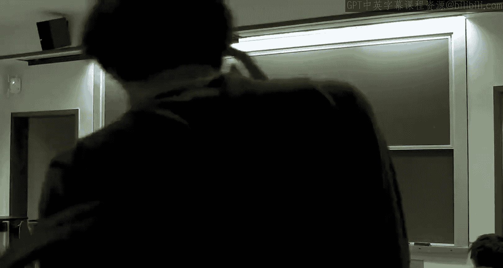

# 斯坦福大学《算法博弈论｜Stanford Algorithmic Game Theory CS364A, Fall 2013》中英字幕（deepseek） p08 -08-8_ Combinatorial and Wireless Spectrum Auctions).zh_en -BV1VmC2YzEXJ_p8-

So the plan for today。Is to talk about the case study of spectrum options， wireless spectrum。

And you know I hope you find this sort of lecture， you know self-contained and interesting in its own right。

 you know but just to be clear from a higher level。

 one of the reasons I'm doing this is to give you a flavor for how the theory that we cover in class is connected to what happens in the real world so the theory isn't always applicable straight out of the box you sometimes have to tweak it you sometimes have to modify it。

 but as we'll see the theory that we've been covering does indeed influence how people think about solving these very difficult but very important problems that are out there in the real world so keep that a month。

All right， so let me just briefly remind you of the formalism that we introduced last time。

So in a common auction， you have n bidders。 and again。

 you should think of these as perhaps people like AT and T and Verizon and so on。

You have a set capital M of little M different goods。Not in general interchangeable。

 so this might be a license that gives you the right to use some frequency in some area。And。

Each bidder has a private valuation。Known a priori only to itself。

For each possible bundle of goods it might get okay。

So private evaluation for all I and for all subsets of M。

We'll talk a little bit about what assumptions you might make on the valuations。

 We always assume that your value for the empty set is zero， why not。

 And generally you assume monoity。 So the more stuff I give you， your value can only go up。

 more assumptions to come later。Let me remind you we ended on Monday talking about the challenges of commercial auctions and actually implementing them in practice。

 as opposed to just say using the VCG mechanism to maximize surplus in principle。

 So the first challenge was， you know not just about the VCG mechanism。

 but about any direct revelation mechanism， which is that you know if the number of goods is even medium size because the number of private parameters is exponential in M。

 that's an absurd number of things to ask somebody to report。

 that's just way too many bids to ask somebody to submit。 that would be like a million bids already。

 if M was something like 20。 okay。So that motivates indirect mechanisms。

 which will be the subject of today's lecture。 Secondly， already in the single parameter world。

 we saw that surplus maximization can be computationally intractable。 So that's a second challenge。

 Third challenge， at least the VCG mechanism can have these weird revenue properties。

 you can have zero revenue and competitive environments， you can have revenue nonmonittononicity。

 So that was a concern。 And then the fourth thing was that when you go to indirect mechanisms that gives extra opportunities for people to game the systems。

 we talked about the concrete example of people using low order bids to sort of retaliate and colute。

All right， so。Again， maybe the most fundamental point from all of those challenges。

And the real nonstarer。Is that， you know the entire class。

 we've been talking only about direct revelation mechanisms， We even had the revelation principle。

 which justified our restriction to focusing on， at least in principle direct revelation mechanisms。

 But now we have an application where we have to just jettison that。 Okay， so for the first time。

 we have no choice but to talk about indirect mechanisms where we learn information about the bidders on a need to know basis。

 That's the only option。这样。So the question then is， all right。

 so we're not going to actually do direct revelations。

 You bid and ask everybody about their opinion about every bundle that they might get。

 What are we going to do， what other a format are we going to look at。And， you know， for starters。

 we can just， you know， we discussed in passing an indirect mechanism。

 You're all familiar with one from the movies from auction houses and so on。

 the ascending English auction， right， in that kind of setup， you could use a sealed bid。

 Second price auction。 You could use the victoryy auction。 In principle。

 you get exactly the same outcome as if an auction you S up there and kept raising the price And people raise their hands。

 And so there was only one hand left。 Both of those auctions if bidders follow their dominant strategy。

 Con with the highest valuation bidder being the winner paying the second highest valuation。

 But so that's an example of an indirect auction。 And mostly this lecture werere really just going to be looking at a bunch of those English auctions in parallel。

 so that's going to be the flavor of the indirect auctions that we're talking about。 in particular。

 I want to focus mostly people have added on bells and whistles to this。

But people have focused in practice mostly on the simplest solution to get around direct revelation。

 which is if you have M goods， just run M different single item options。

 sellll each of the items separately in its own single item options。There's a question？第是第。还会。

Conceivably， so the question is， could you ask bidders to write a computer program where the input to the computer program was a bundle S and the computer program computes whatever the value is。

 Okay， so there's an exponential number of things to compute。

 So it's not clear how accurate a program you'd be able to write。 But， yes。

 that's something you could try。So we're going to look at selling each good separately in a single item auction。

And there's various ways one could do this。 you might want to think about it。

 So even even if we're saying separate single item options。

 there's actually a number of knobs we can turn。 we'll go through some bad formats and conclude in the format that's actually used。

Let me just notice here from a practical perspective， you definitely could imagine running this。

 Okay you have M goods。You， M might be in the thousands。

 but whatever you have how many goods you have。 You're only asking people's opinion about some whatever subset of the goods that they want。

 Okay， in the worst case， a linear number of bids one for each good。

 So that's something you definitely could do if you wanted to。But。

So the whole point of these commator evaluations is that your value for a subset of goods might be something more subtle than nearly the sum of your values for each of the constituent goods。

So maybe if I give you a bundle of goods， it somehow there's synergies and your value is enhanced or maybe these goods are redundant。

 and your value is not as high as the sum of the individual items。

So we're not really letting people express what they want。

 They have all of this rich information in their head and we're only asking for a vanishing small fraction of it。

 So you would be right to ask， you know， even in a best case scenario， even in principle。

 could you conceivably get reasonable outcomes， say things that have nearly maximum surplus by using this very lightweight approach。

So could this ever work？喂。sorry， it should be a question， not the answering。So the answer depends。

let's start with the good news。Which is if the goods。Are more redundant than they are synergistic。

 So the technical term is if goods are substitutes。Or really。

 we're crossing our fingers and hoping the conclusion extends to mostly substitutes in some sense。

And I'm not going to give you a formal definition of this right now。

 Just think about the case of two goods。 So it would mean that。The value。

That a bidder has for a bundle of two goods， A and B。Is less， let's say less than or equal to。

It's value for each good individually。So the Her substitutes case would be maybe it's the case where in a given geographical area。

 you're selling a couple different licenses that are identical。 I mean， one is on one frequency。

 one is on a different frequency， but the bidder could care less， which frequency is on。

 It just wants a license in that area， but it has no use for two licenses。

 It just doesn't have that many customers。 So there's license A' license B。 It wants one。

 It doesn't care which， right。So then you'd have V equal to VB equal to V A B。

So that's an example of substitutes。 The goods are redundant or partially redundant。

 having one makes you want the others less。So， in this case。Then。Let's say maybe might work。

 There's a chance it could work。In principle， there's a lot of optimistic theory。

So a couple of the problems we discussed just evaporate when goods are substitutes。

 Surplus maximization is no longer that hard。 It's still， if you ignore incentive constraints。

 It's not an easy problem， but depending on exactly what definition of substitute you use。

 You can either solve it exactly in polynomial time。 or you can get close to optimal polynomial time。

 Okay， so challenge number two is not very severe when goods are substitutes。

 Chall number  three also goes away。 So all those weird properties of VCG。

 don't they don't show up when goods are substitutes。 So this is beautiful theory。

 I'll cover it one of the weeks in the advanced class in the winter。 But for now。

 we're just gonna to take this on faith。 that the problem seems easier。

 there's really theory explaining how the problem is easier when goods are substitutes in this sense。

So， on the other hand。If goods are compliments。Meaning having a good A makes you want a good B even more。

 so this would be the case if you don't just want one license， right。

 So maybe you want licenses in a bunch of adjacent geographic areas。

 or maybe you want multiple licenses in the same area。

 but you really want it to be a contiguous part of the spectrum。 Those would be compliments。So again。

 let me just define it for the two good case。So having one good。So basically synergies。

So having the goods in tandem is better than the sum of having each in isolation。

 and as we discussed， there are compliments naturally in occurring in wireless spectrum options。Then。

Let's say no。Frankly。You wouldn't expect such a simple a format to do well。

 if you have a problem that's pure compliments。 And actually， if you think about it。

 one thing I asked you to prove on problem set number one。 I think this was problem 5。

 was that that's where you had bidders and they really just were singlemined。

 There was the subset of goods。 there are these 10 goods and that's what they wanted。

 They got any subset， they had value 0。 And if they got the 10 goods that they had their mind on。

 then they'd get some private value v sub I， So if you think about it。

 that's sort of extreme compliments。 you have zero value for a good unless you get just the entire bundle that you want。

 And they asked you to prove that that's a hard problem。 Okay So reduction。

 I think it was from independent set。 which is a very hard problem。 So even just。Approximate。

Surplus maximization。Its very hard。 And again， it's hard for any polynomial time algorithm。

 let alone some kind of very lightweight a format。So this is a really important distinction。

 so it shows up people use this language all the time， both in theory and in practice。

 they'll talk about common auction environments where valuations are substitutes。

This partial redundancy versus ones where it compliments。 So this synergies。 Now， you know。

 in practice， a given environment is probably not likely to be purely one or purely the other。

 The dichotomy is useful for sort of thinking about how to approach a problem。So in practice。

 because the substitutes case seems so much easier， know， one thing people hope is that。

 say in a given spectrum a， that the valuations are hopefully mostly substitutes。

 So a solution designed for the substitutes case will continue to work。 okay。

 but the theory tends to focus the guarantees for environments that are just pure substitutes。

All right。One thing I want to point out So， so just to if you recall the example I gave you with the revenue nonmonetity of the VC G mechanism on Monday。

 It was a super simple example。 we started with just bitterder number one who wanted the bundle A B。

 And then there was a second bidder that just wanted the good A。

 And then we thought adding a third bidder that just wanted the good B。

 So that first bidder who only wanted goods A and B。 that was compliments。 And that's generic。

 So revenue nonmonetonicity and all of the other incentive problems they show up in the compliments case。

 And it turns out you can prove they don't show up in the substitutes case。Okay。Good， so。

Remember I asked the question。What are we going to do if we're not gonna do a direct revelation auction。

 And so I basically started by saying， well， let's it。

 let's take the simplest thing we could think of and see if we can make it work。

 at least in some interesting domains。 Basically the simplest thing we could think of is just separate single item auctions。

 And we just answered the question that when goods or substitutes or mostly so there's a chance。

 at least in principle it could work。Okay， so let's drill down on that。

 Focus on goods that are substitutes。 See if we can get something reasonable using the simplest possible format of separate single item options。

 Okay， so that's where we are。Allright， so now， as I mentioned。

 just because you've decided you're going to do separate single item auctions。

 There's a bunch of design decisions you have to make。

 There's more than one way you can tell a bunch of things in single item auctions。

And there's two such decisions I want to focus on because empirically。

 there seems to be a right answer and a wrong answer to these two questions， okay。So。

The first question is， are we're going to sell a bunch of things？You can do them at once。

 at the same time。Simultaneously， or you can do them once at a time， sequentially。

So it turns out rookie mistake number one for these separate sealed item auction。

 seal bit single item auctions is to do it sequentially。So this is not what you want to do。

And so let me just explain why this is not what you want to do。

 even in the easy case of totally identical goods。And even if each bidder only wants one。Okay。

So this is not a hard problem， right， I asked you to solve this problem。 My exercise set number one。

 you just use the obvious analog of the victory a where you charge everyone the K plus first highest price。

 and you can solve this problem。But suppose instead。

 you decided to sell these identical items one at a time。 O， Actually。

 let's just imagine that theres two items。And let's imagine that you want one。Okay。

And you're willing to say， pay 100 bucks at the most for it。 Okay， One a is going to be today。

 One a is going to be tomorrow。And let's even say， you know， you know you want this thing so badly。

 you're going to win。 Okay， So if you bid an auction and you bid truthfully you bit 100 bucks。

 you're confident you will actually be to win。Should you participate today or should you participate tomorrow。

Okay， so good answer。 But let's actually peel back the assumptions you're making when you make that answer。

 So let's actually assume that the same bidders will participate other than you in both options unless they win the item in which case they'll go away。

O， so there's no new arrivals in other words。 And let's also assume that all the other bidders are foolish enough to just bid their true valuations。

But that's good， that's totally the first step reasoning you want to do about how you should play。

 okay that's a good starting point。We you' like， okay， so everyone shows up on the first option。

 So I could bid I would win， and I would pay the second highest valuation， or I could sleep in today。

😊，Let the person with a second highest valuation overall win。 They go away on tomorrow。

The the selling price is just going to be the third highest valuation of the original set。 Okay。

 and I'll still win。 I'll go home。 I'll pay less，But now you realize， wait a minute。 I mean。

 why won other people reason in the same way， They're actually going try to probably avoid the auction I'm in so that they have a chance of winning and so forth。

 Okay so there's not a dominant strategy anymore for bidders about what you should do。 And therefore。

 you again， have to actually reason pretty carefully。

 You have to guess in effect about what other bidders are doing。

 You have to guess what's the expected selling price in each of these two options。

 And that's hard to do。So problem。Not DS SI。Need to guess。Selling prices。And this is hard。Okay。

So even if you have sophisticated bidders doing their best。

 it's not clear that best will be that accurate。Indeed。There was in March 2000。

A small optionuction for some spectrum licenses where they did sell three licenses sequentially。

And so what were they， there were two totally identical licenses。 which had 28 megahertz。

Weorth the frequencies。 And then last。They sold a block of spectrum， which was twice as big。不然。

So I did them one at a time using Vi auction， using second price option。

So the first one sold for 121 million。This is in Swiss fs。The second one sold for 1，34。You know。

 that's 10% variation， which is maybe more than you'd like， but not。Not that bad。 And then the the。

 the one that was double the size。 that went for 55 million。Okay。So these。

 there's no way these could be equilibrium bids for any reasonable notion of preferences。 You know。

 in fairness， I mean， this may have been further hindered by the fact that before the act before the auction。

 some of the companies involved strategically merged。

So that there'd be less competition in this auction。 that didn't help。 but you。

 sequential doesn't seem like a good idea still。So that's really a mistake number one to do it sequentially。

 So instead， it's done simultaneously。That's design decision number one。

The second thing I want to think about。Is now is you know each individual single item auction。

 what format do you want to use okay？And so the rookie mistake number two is to in each single item option to do its sealed bit。

And again， if you put yourself in the shoes。Of a bitterder in such an auction。

 it quickly becomes clear why this might not be a good idea and why you might have unpredictable outcomes and not great outcomes。

Let me just mention。 So I briefly alluded to the disastrous New Zealand spectrumrum auction on Monday。

So。In this auction， the goods were roughly identical。So they were selling broadcast TV rights。

 So you buy one of these licenses， and it gives you a right to to broadcast。

And they're all pretty much the same。Unlike the example here。

 a given bidder might want more than one such license。

So you might want to broadcast on multiple channels， for example。So we might want。More than one。

And what they did。So I mean， another， another design decision in these auctions is what's going be your payment rule。

 Okay， But so they use the second price rule， which seems fine。So they use simultaneous。

 so that's good。Second price， that seems fine， but then sealed bit。So victoryy a。So think about it。

 I mean， really， like， imagine， you know， just like we had the experiment with the first price auctions in the second lecture。

Imagine you were a bidder in this auction。And I'll make it easier on you。 right。

 Let's suppose there's 10 goods。 They're all the same。Because you want one， but you only want one。

They're being sold separately simultaneously in victory as。

 You have to write down 10 numbers on envelopes， one for each of the goods。 And you want one。O。

What should you do？That's， that's a reasonable strategy。

 So the proposal was to bid really high for one， target your favorite。

 even though they're all the same。And go for it， you know， like， for example， you。

 bid your full value for it。As you like， yeah。We'll get to that。

 we'll get to that that's a good comment so the comment is。P one of the tenant at random and say。

 bid your true value for it。And maybe hope that everybody's doing that， okay。So that's。

 that's a totally reasonable answer。 It's not the unique， reasonable answer。

 It's a totally reasonable answer。 Like， what else could you try doing。Good。

 so if your value is like， you know，100 million or something。

You could try bidding just 5 million on all 10。Maybe you'll get lucky， maybe you'll win the lottery。

 and you'll get one really cheap。Now， if you only bid 5 million and you wind up winning four by accident。

 you'll pay 20， which is still well less than your value， But if you bid 50 million on a bunch。

 and then you win three of them， then you'll pay 150 million more than your value。

So that's also totally reasonable。 Those are both reasonable strategies。And as a bidder。

 you have to trade off the risk of winning too many with a risk of winning too few。 Okay， And again。

 that's just not an easy problem to solve。And even if they do， you all use a sensible strategy。

 like pick one at random and go for it。It's not clear you're that happy about that as the seller。

 right， Like imagine there's just two goods and there's three bidders。Okay。

And you're using second price options。Okay。RightWhat's going to happen。

 So one of these licenses will have exactly one bidder。

So what's the second highest bid on that license？0， right。

 So you're gonna youre gonna give away one of the licenses。 I mean， you could have a reserve price。

 but then you're stuck with a reserve price， okay。Whereas if you think about。

 if you ran the normal victoryy auction to sell off both goods， Okay。

 say nobody wanted more than one， then both winners we charge the third highest price。 Okay。

 so there's no intrinsic reason why with two goods and three bidders。

 you should give one away for free。 Okay， that's not intrinsic to the problem。

 It's more competitive than that。So， that's the issue with。Seed bid auctions。

 And when that was tried in New Zealand， as I think I mentioned Monday。

 the revenue wound up being 36 million。 and so they projected 250。

 So it was basically like something like an eighth of what they were expecting。

 And if you look at some of the individual licenses， there's some pretty crazy examples。

 So theres one license where the high bid was 100000。 The second highest bid was 6。Not 6，000，6。Okay。

There was another one where the the high bid was 7 million and the second high bid was 5 K5000， okay。

For some reason， I guess they had disagreed upon previously for transparency。

 the high bids were made available to the public。So that was pretty embarrassing。

 so people could see how much money was left on the table。 So the next auction they run for some。

 for some reason， they were doing simultaneous。 They realized they'd done something wrong。

 But instead of switching shield bid to something else， they switch second price to first price。😊。

So they ran first price sealeded auctions， which you know。

 you're still going to have for exactly the same miscoordination reasons。 you're going to have know。

 efficiency problems。 You're going have revenue problems， surplus problems。

 but at least it's not obvious to an observer how much money is being left on the table。

 At least you can't see what their maximlineness to pay actually would have been。So。Guided by。

 you know， these you， trial and error， These are some of the errors。So guided by that。

The standard solution。It is simultaneous ascending。So just think again。

 like an English auction like youve seen in the movies， simultaneous ascending auction。Or essay。Okay。

And conceptually， you know， I'll tell you the exact format in a second。 But conceptually。

 you can just imagine that all of these ascending auctions are happening simultaneously in the same room。

So basically， you know， there's one audience and there's 20 auctioneers。 Okay， and。

 they all have their own price。 and you get to pick which ones you want to bid in at any time。

And the price is only going up in all 20， possibly at different rates。

And this is really the basis of the last 20 years or so of spectrum options。

 There's been a lot of kind of bells and whistles added。

 And we'll talk about some of those and the reasons why。 But this really is kind of the。

 the you know， foundation on which the practical auctions are built。Alright， so the exact format。So。

 each round。So it happens in synchronized rounds。Okay， so at any given time。

 you'll be in the round like 52， something like this。 And each bidder。

 these are all pre registered dinners。 You get to bid on any of the items that you want。

so you can bid on all of them or subset whatever you want。So， each round。And when you bid on an item。

 usually you go to the next increment， Okay， which is usually 5% to 10% more than whatever the previous bid was。

So there is usually a mechanism for so called jump bids where you go up a bunch of increments in the same round。

 But that's just a detail。So each bidder。Places bids。On any subset。Of goods at once。Generally。

 although you know， people have experimented with this， generally。

 it's transparent in the sense that in a given round。

 you know exactly who like the identity of the highest bidder is on a given item。

 and you know what the high bid is。So you can imagine that there's like a leaderboard。

For each of the items， if you like。 this is not without problems， knowing who， you know。

 the highest bidder is encourages the kind of retaliation and collusion that we talked about on Monday。

 So if somebody bids outbid you on something you really want， And then you know who it is。

 that's easier for you to retaliate than if it's some anonymous person who outbid you。

 But this is usually what they do。And if you have a round， where nobody。

Submits a new bid on any item， then the auction stops。So theres。

 there's one correction that I should make。 So I set it in a given round。

 you can bid on anything you want。There is a constraint on that， which is called an activity rule。

And the point of the activity rule is to prevent bidders from just kind of hanging out。

 watching things unfold。 And then at the last minute， bidding on stuff from out of nowhere。 Okay。

 so for those of you that did the exercise set one， this is called sniping in the context of ebay。

 So you want to avoid sniping like behavior in these options。So the activity rule， know。

 the real rule is a little more complicated。 But think of it as the number of items that you're bidding on should only drop as the auction proceeds。

 You can switch which ones're bidding on， right， But if you start out by bidding on 12 different licenses。

 you can't suddenly later up to 18 licenses。 Okay， that number should be decreasing over time。

 But again， you can maneuver if something's getting too expensive for you。

 you should feel free to switch that bit over to some other item， which better fits your budget。

Theres a question。你还有。Well， so in an English auction， there is no highest bid per se。

 if you think about it， right， So the auction， I mean。

 you don't actually know the highest bid any of a time。 Right or think about ebay， if you like。

 I mean， ebay，s so think of it， think of the interface as being exactly what you see on ebay。

Which is not what the maximum willingness to pay is of the high bidder。

 it's just kind of how much the proxy bidder had to raise their bid to beat on everybody else。

 so that's exactly what you see。And indeed， bidders are never actually asked for their valuation。

 because that's not how it works。 You just say， do you want to， you know， up it an increment or not。

 And people have the option to do that or not do that。因了。No。It does not。 So， I mean。

 you want the option to end。I mean， which oh， yes。Yes， yes， yes， yes， it does。So roughly。

 let's So a number of items on which you are bidding on or have an incumbent bid。

Should be dropping a ton。Okay。So let me talk about， you know。

 the the main win or let me talk about the pros and the cons of the basic simultaneous ascending a。

So， the big win。And also， the reason for this activity rule。Its for what's called price discovery。

And， you know， really， this mean， just means unlike a seal bit auction， which is one shot。

 unlike a seal bit auction。Bitders have opportunities for mid course corrections。 Okay。

 you really thought， you know， this license was gonna be a bargain。 turns out everybody wants it。

 You had no idea。 It's gonna be really expensive。 So you switch， or you thought this would be。

 you know， out of your league， but it turns out competition is low。 all of a sudden。

 you get more ambitious。 Maybe you want that license instead。

 or maybe you have a coordination problem。 right， Maybe you and someone else wants exactly the same thing。

 and there's two copies of it。 and you can kind of figure out who gets what， Okay， along the way。😊。

So let's just say allowsos。Mid course corrections。And also， with compared to the seal bid version。

 the coordination problems we talked about just aren't there。 if you think it through。

So go back to just the simple case where you have two goods and three bidders。Okay。

 and with the simultaneous steelboard auctions， you' basically wind up giving one of those away for free。

And in particular， the prices on the two goods are going to be very different。

 One of the goods will have two bidders。 So it'll be a non-ze price and the other good， which， again。

 is identical。 It's the same thing that will get silver price 0。

 And that's going to piss everybody off。Think about what happens when you have two ascending auctions in parallel for these two goods with three bidders。

Right， well if you have two goods and three bidders， someone's always going to be losing。

 Okay someone's always out in the cold。 right， the price is below their value。

 they're going to jump back in。RightSo which the two goods are you going to bid on if you got kicked out and you want to go back in the auction。

The lower price one， right， If ones sort of， you know， less expensive。

 you don't care which one you get。 So you'll just go for the lower one。

 So this will keep the prices equalized throughout the trajectory of this a。

They're going to get sold for the same thing。So fixes。Mi coordination problem。With smaller groupss。

So that's the number one reason。 is's basically， you know， So the the bidders。

 they can't talk in advance。 That's illegal。 But， and you don't want them to collude。

 but you still want them to somehow coordinate。 Okay。

 they need to figure out which are the competitive markets， which are the noncompitive markets。

 You know， what the prices are going to be。 And this gives them a mechanism for sort of on the fly。

 figuring out what the prices are likely to be， okay。And so again。

 and now I hope it's more clear why you always have this activity rule， right。

 So why sniping would be a disaster， right， So if everybody just sort of SAT there。

 And then everybody just bit at the end， it would reduce to essentially a sealed bit auction。 Okay。

 Similarlyly， you don't want anyone to just free ride on the price discovery that other people are doing。

 and then just sort of bid at the end with good price information。

 Everybody should contribute to the price discovery。 So everybody should be involved from the get go。

 That's the point of activity。So something related， which is also really useful。

Is so called valuation discovery。 Okay， So in general， in the theory。

 we just treat it as if people are born knowing their valuation。 Okay。

 they could just recall it from the top of their head。You know， if you think about it。

 that's probably not true， right， You go to one of these companies and you're like， well。

 how much you know， you asked the CEO， how much would you be willing to pay for， you know， licenses。

 A， B and C。You know， at the， you know， the very least。

 he's going to call his in-house experts and get the estimate。

 Maybe they hire a consulting firm to do a study to figure out， you know， exactly， you know。

 where the technology is right now and what are the projected， you know。

 revenues from that technology， if it works out， etc ceter， eta， et cea。 So the point is。

 it's not costless to evaluate your evaluation。 So the last thing you want to do is evaluate your evaluation for lots of different bundles。

But as the prices evolve， you can figure out which of the bundles you're likely to hear about。 Okay。

 So you only have to evaluate your evaluations on the ones that seem to be relevant。

 given the trajectory of the auction。 So that's another bonus。First question？

You want everybody in the auction the entire time。So that's the point of the activity rule。

 You want everybody to be contributing to price discovery。

As early as possible and for the duration of the option。Definitely， yeah。

 that be part of the point of the ascending format so that you can make those mid course corrections。

So you have to plan。 So like I said， the activity rule is more complicated than what I just said。

 So you， they do take into account if you know some things are sort of bigger or more valuable than others。

 that's part of the activity rule correction。 But you also have to plan for this。

 So you also have to bid aggressively enough at the beginning so that you can implement your contingency plans later。

2。So。Those are simultaneous sendinging auction。And it's a little bit， know， hard to know。Okay。

 so they seem to do， you know， reasonably well。 people using them for 20 years and variations thereof。

 Okay， so that's a sign that you know， they're， you know， getting reasonable performance。

They're not without flaws， and we'll drill down on that next。So what do I mean by work well？So。

It's believed。That they generally produce maybe not optimal surplus， but good surplus。

 much better surplus than the bad formats that we discussed。And， you know， you think about it。

 I mean， this is one of those assertions， which it's not really clear how you'd ever validate it。

 right。Becauseuse surplus references people's private valuations。 The surplus is。

 if you knew everyone's valuations， the， you know， the the biggest sum you could make， you know。

 the best allocation。 you don't know people's valuations。And as we've discussed， I mean。

 and as you'll see further， this auction is not dominant strategy and compatible。

Truth for bidding in every round is not generally a best response。 Okay， so it's， you know。

 you can't just take the bids and assume they're equal to the valuations because there are strategic opportunities。

So it's not clear how you would， you know， after the fact， looking at the data。

 evaluate this claim that you have neuro optimalmal surplus。 So what do they do。

 They look at various sanity checks。They say things like， well， you know， similar items。

 identical items sold for basically the same price。 That's a good sign。

 There was little to no resale。 That would be a good sign that speculators weren't involved。

 If there is resale， they checked that the prices are pretty close to what the price was that it was bought actually in the auction。

They look at the collections of goods that bidders got。 So licenses。

 and they see if they make sensible packages， right， So if they make sense together。

 So they'll check a bidder hopefully was able to piece together a bunch of licenses from geographically neighboring areas。

 if they were able to do that， there were synergies amongst those goods for that bidder。

 that's that's a win。 It says despite the fact that all the auctions were run in parallel。

 they were able to adapt adapt their bidding strategies so that they got the package that they want。

 So these are the kind of things that they look for in the data。

 sanity checks that they seem to be doing a pretty good job， at least。😊，So those are the good things。

Let's talk about the two main problems。With this sort of first cut format。So issues。So the first is。

 and these are both sort of very real phenomena。 Okay， so these are not just。

Kind of thought experiment problems。 They're real problems。

So the first one is called demand reduction。And this is this is an issue。

 even when goods are substitutes。 Okay， so even in sort of the the perfect world where the theory is as optimistic as possible。

嗯。Good。So。The idea of demand reduction is it may be that while in a surplus maximizing allocation。

 a bidder gets a lot of goods in a simultaneous asending auction。

 they might only target a fewer number of goods， less than how many they really want。

 so that they get those goods at a low price。 Okay， So basically。

 by lowering your own demand seeking out fewer of the goods。 You lower competition。

 which results in lower prices。 and that can be a win for you。 Let me give you a concrete example。

Alright， so two identical goods。Suppose we have one bidder。And if it gets one good。You know。

 knows what to do with it。 It can make 10 units，10 units of value of it。

 And if you give it a second good， it's twice as happy。On the other hand。The second bidder。

It doesn't know what to do with a second good， with a second license。

 It has no use or capacity for it。So it's value。For either one good or for two goods。

 let's say is equal to eight。So what you know so suppose if you knew these。

 what would be the surplus maximizing allocation， what would you do？Yeah， I mean。

 it's clear that you want to give them both to the first bidder， right， It has value 10 for each。

 and the second bidder only has value 8 for one。对。How about the so suppose you actually ran the VCG mechanism on this instance。

 Do you see what revenue you would get。Also one way to calculate the payments is you look at the surplus loss inflicted on the other bidders。

 So if we deleted bidder 1， then there'd only be bid 2 left。 So we get a surplus of 8。

 So that's gonna be the payment that bidder1 pays。But we're not running the V C G mechanism。

 We're thinking about running a simultaneous ascending auction。So imagine you're bitter too。Okay。

Which means you want one good。 You don't care which you're willing to pay 8 for it。Okay。

So my question is， at what point would you give up， you go home and stop bidding in this auction。

What would have to happen before you're ready to give up。

Both goods would have to be too expensive for you。 Okay， you're going to pay 8 for either one。 Okay。

 so if the price of one is less than 8， you got to shot a positive utility。 You're going to stay it。

 It's only when both prices hit 8， you're going to go home。Alright。So what that means。

 if you're bid one。And you stubbornly， stubbornly demand to win both goods。

 What are you have to pay in this simultaneous ascending auction。16， okay？In VCG mechanism。

 where you can actually express your full valuation， you get the sort of your rightful quote unquote。

 payment of 8。 But because there's no coordination explicitly between the simultaneous auctions。

 you have to pay 16。Okay， so its utility would still be positive， but it would only be 4。

So if you're a bitter one， what if you just said， you know what？Punt on the second good。

 We'll make do with one。What's going to be the outcome of the simultaneous sendingending auction if Bi one upfront decides that。

RightSo basically， one of the bidders will go for one good。

 The other bidder will go for the other good。 and everyone goes home happy except for the seller。

So both goods get allocated essentially for free okay。So better to target one good。In which case。

Both get sold。At price， roughly zero。Okay。So the surplus is worse。 It's dropped from 20 to 18。

 and the revenue is really dropped。 Okay， it's dropped from 8 in the VC G mechanism down to 0，right。

And again， this happens。 I mean， you， this is like this is a wellknow strategy。 If you are a bitter。

 you know， it's well known that this is something you should consider。

 But you might want to lower your demand why it lowers competition。 Therefore。

 selling prices are going be lower。 So the goods that you do get， you get cheaply。

There's not always a win， but it can be a win。So that's demand reduction。Even with identical goods。

 you can have that happen in simultaneous ascending options。Okay。

The second floor I want to talk about， it's going to be in a setting where we already discussed that simultous sending auctions were not necessarily going to work that well。

 namely compliments， And so I want to show you concretely what goes wrong。

 something called the exposure problem。So any questions before I talk about the exposure problem？

Right， yeah。sell。That's a good question。 Yeah， so。So the question is sort of。

 how do you interpret value。It's a subtle question。So on the one hand。

 you could think of a bidder's value， its willingness to pay， as you know， including， you know。

 whatever it expects to be able to get， you know， resale。So somehow that's money。

 it's going to get later。On the other hand， when we talk about maximizing surplus。

 that's sort of not what we mean。 we don't really mean， you know， the value they get。

 It's just like cash money from selling it to somebody else。

 We really need some notion of greater good。 So with a spectrum option。

 why do we want to maximize surplus because we want this scarce resource of the spectrum to be used by the firms who have the capacity to sort of you know。

 do the best technology with it。 That's really what we want wanted it to be utilized in the best way。

So， you know， that's one， I mean， so that's one reason why auctions that are subject to resale。

 where you do see significant results afterwards， are viewed as failures。Okay， so it's sort of。

 it is a， you know， criterion for judging these things in practice。

 It's not very sharply captured in the mathematical models I've been giving you。O。去。

So exposure problem。And again， this shows up when you have compliments。But because in spectrum as。

 you do have compliments。 Again， think about geographically nearby or within the the spectrum nearby frequencies。

 you do have compliments。 So it is an issue。So， again。Easy to explain with a simple example。

Two goods， different goods this time。And whenever you want a nasty compliments， you know， example。

 just use one of these bidders who only wants a set or wants nothing。So Bi 1 only wants A and B。

 doesn't want either one individually。Let'd say it's going to pay 100。For both。

And Bider2 just wants either one。Doesn't care which。Saggnostic。And it's willing to pay 75。

For either one。Okay， but it doesn't want more than one。So same exercise。 What's the max surplus here。

Hundred， right。You can only get 75 from the second bidder。 You can get 100 from the first bidder。

 and they're mutually exclusive。So you should give it。

The big bidder what it wants and the VCG revenue in that case。Yeah， just 75。

 basically like a second price auction in this example。Okay。But。Let's reason just like we did before。

 If you're bitter number two， when are you going go home。Again， just like before。

 only win both goods because you're happy with either one。Only when both goods hit a price of 75。

Again， this in a simultaneous sending auction we're talking about。

So in a simultaneous secent auction。Number two。Go home。Only when both prices。Or at least 75。

So Bi1 is the rightful winner from a surplus perspective。好的。

But if you're a bitter one in the simultaneous sitting auction。What， what should you do， What's。

's should， what's your plan， your best course of action。嗯， yeah。You should run away。Okay。

To actually get the bundle that you have positive value for。You have to pay 150。

 your value is only 100。And so， you know， and then the only other option is you get exactly one of the goods。

 which is maybe even more of a disaster because you have value 0。

 and you have to pay something for it。Okay。So you should just get out of this auction as quickly as you can。

 That's， of course， assuming that you knew this was a 75。 right， What makes this hard is for all。

 you know， this is a 40。And you should go for it。Or it's a 75。 And going for it。

 you're gonna be host negative utility。O。And so this， as you can imagine。

 like from the bitter perspective， this is scary。 And this leads to you know， low bidding。

 So non aggressive bidding， especially early in the auction before you've had much price discovered。

So this is， this is a real problem。 It's exposure problem。 And it's just， you know。

 if you have compliments， it's just something you got to deal with。Allright。

 so those are the two main issues with this simplest format。

So let me just make a couple comments about sort of the bells and whistles。

 the sort of add ons that these two drawbacks。Have motivated and which are actually used in the practical。

 practical sort of A FCC auction that have been used。

But I'm just going to make some brief comments because I want to talk about the option that's probably going to run next year。

 Okay I want to bring you up to the cutting edge before time's up。So a question is， you know。

 what should we do with？What should we do about demand reduction in the exposure problem。

So one answer， which really was kind of the policy until about 2007， was。

Don't fix what a broken too badly。 Okay， so the simult sending auctions， you know。

 especially compared to some of these other super scary， you know。

 bad formats that have happened in the past。 They're doing fine。 You。

 the revenue almost always met the projections。 You know this identical goods were going for the same prices。

 You know， there was some weirdness。 you could see demand reduction。 You could see a little bit of。

 know， collusion emerge。 You know， over the over the rounds。 But it didn't have any kind of。

You know deal breaker kind of flaws。 and any modification to the format is's a little harder predict what's going to happen。

 especially if make， if you make the auction more complicated。On the other in the last five years。

After， you， people know propose some new formats， they did a lot of theoretical analysis suggesting why these formats might perform well。

 They did a lot of laboratory experiments， meaning just sort of computer simulations with know。

 people like undergraduate students being the bidders and this kind of thing。

 suggesting that maybe these would do well would do better than the straightforward you know。

 S implementation。 They had been experimenting with so-called package bidding。And by a package bid。

 I just mean a bid， which is on more than one good。Okay， you don't say I want good C at price 10。

 You say I want good C and E and I'll pay 2 for it。 Okay， that's all the package it means。 Okay。

 it's a set of more than one good。And。Let me just briefly mention kind of the two。

Main ways that have been experimented with of introducing package bids。

So the first way is to add one final round。So called proxy round。

And so what this works is you do the simultaneous sitting a just as described now。 and eventually。

 it ends。And then every bidder gets one final chance to submit any number of package bids at at once。

Okay， so the old individual item bids are still valid。 So in effect。

 you view for each of the M items， the winning bid in the first phase as a bid for that individual item at a given price。

 And then bidders also submit these subsets。Then you have to figure out， okay， what's the allocation。

 So what you do is you do a surplus maximizing computation， you know。

 with the bids being prox as values。 So that's an MP hard problem。 But often。

 these are sort of small instances that you can still solve。

So you figure out the surplus maximizing valuation allocation， assuming bids are are correct。

 And then there's a frankly， fairly complicated pricing rule at the end of it。Okay。

 the reason the pricing rule was complicated is because， as we observed， when you have compliments。

 which is the whole point of these package bids， When you have compliments。

 the VCG payments are a disaster。They can be zero， even though you have a seemingly competitive environment。

They have these nonmodity properties that encourage all this weird collusion。

 Okay so they do not use the V C G payment rule。 They use something else which cannot be dominant strategy incentive compatible because if you use the V C G allocation rule。

 the only way to get D S IC is to use the VC G payment rule。

 So they relaxed D S IC has some other weaker incentive properties。

 But they're more aggressive prices。 Okay， to get higher revenue。嗯。So that's the gist。

1 final round with a kind of VCG computation on steroids to figure it out。

 And it's kind of complicated。 Okay， they've experimented with it。 There's nice theory。

 but it's really not fully understood。 My sense is is some people are still a little bit scared of the complexity of this format。

 Okay， but it has been used so。So that's the first one。 Second one。

Is rather than delegate the ability to propose package bids to the bidders as the designer up fronts。

You decide on which subsets of goods are allowed to be bid on。Okay。

 and you decide on the allowable package bids in a way that keeps the allocation real simple。

 that keeps the payment real simple。Okay，Also， you want these packages to be sensible。

 So what are they concretely， So you can still bid for individual licenses。

 But maybe there's a cluster in the same region。 Okay， it's like the mid Atlantic region。 Okay。

 so that'll be a subset of bids。 that'll be an allowable package。

 Everybody knows that's an allowable package up front。 Okay。

 then there maybe it will be a nationwide bundle。 Okay。

 if you want to get coverage across the country。So they it'll have this nice hierarchical structure。

 which enables things like polynomial time algorithms to maximize surplus and compute suitable pans。

 Okay， so either you can let the bidders propose the packages themselves at the end of the auction or up front。

 you can say which ones are allowable。😊，And I think this second format seems to be the one that's been being used more recently over the past few years。

It's called hierarchical package bidding， HPV。So predeefine。Allowable package bids。Yeah。

So I should say even this， it's not obvious。 It's a good idea。Because it， you know， you。

Using it assumes that you as the designer， the mechanism designer have correctly identified in advance the packages that are going be of interest to the bidders。

 And if you got a wrong， if some bidder really wants goods， C， D and E。

 and you put C And D in one package and in a different package。

 You've argu made the problem even worse for the bidder。 It's like， oh， man。

 I really want these three goods， but maybe I have to actually buy four goods。

 two pairs so I can cover the three than I want。Okay， so even here， it's not obvious whether。

 whether it's a win。 although the fact that the FCC seems to be using it lately suggests to me that it is at least some kind of win over the vanilla simultaneous setting a format。

So， that's。So that sort of catches it up to the present。

I want to conclude the lecture by talking about the future。 any questions about that。对。Yes。

 items are always available。 So you should think of it really， I mean， computer scientist。

 it makes tons of sense because it's really just like a tree。 And so basically， you have your leaves。

 which are your individual items。 And then you're gonna have。You know， the next level of your tree。

 which sort of know， so this will correspond to the subset of these three items。So I'm saying。

 it's like hierarchical。 And then， you know， up at the top， you have， like， said， nationwide plan。

Yeah， so it， it gets， it gets interesting。 So， so a couple things。 So first of all。

If memory serves when you oh know， that's for， that's for the first format。 Yeah， so， I mean。

 in some sense。I mean， it gets interesting。Like what's right way to say this？

It's almost like you wind up having these different coalitions of bidders。Kind of figuring out。

 you know， trying to bit high enough。 So imagine， you know， imagine that。You know。

 these were all the licenses。And there were， you know。

 the high bids on the individual licenses say all 10 of them， you know， was 100 million or something。

And there are these two big companies。 One was bidding on the first five。

 that was bidding on the second five。So the surplus， you know， the allocation is going to be chosen。

 Well， if the， you know， the bid on the first five and the bid on the second five。

 if that sum is bigger than 100 million， that'll get chosen。

 if it's less than 100 million than all of the individuals。 I guess。

 you could choose one of the five。otherwise， you're sort of competing to sort beat out all of these individual bidders。

 So now you have this interesting problem where these two companies， theyre in sum。

 they need to get higher than 100 million。 And the question is。

 which one of them is going to kind of be the one who bids high enough to be the tipping point where they get chosen instead of individual bidders。

 So you have like these weird， almost sort of， coalitions are emerging as the auction proceeds because you want you and these other people to be chosen in the final in the final round。

 So it starts mattering sort of how you fit with other bidders like who you conflict with。

Other questions。Could you repeat the question？是。Well， I mean。

 you can always be a way that gives you negative of utility you' can gonna only bid on individual items in the first phase。

So， so so in that one， when you bid on a package， you have to make sure you beat out the sum of the high prices for individual items。

So if you bid on a bundle， you need to actually be a higher bid than what's implied by the individual high bids。

呃。そいた。Yeah， I'm not falling， maybe I' come to class。All right， so。So I want to talk about。

An auction that maybe will happen next year。With this shutdown， I have no idea anymore。

 I tried to go to the FCC website to prep for the lecture， and it was down so。嗯。All right。

 so this is going to be a double option。Alright， so one thing you might be wondering is like。

 you know， where does the spectrum come from anyways， You know， Does it grow in trees， You know。

 the government just keeps selling it off in auction after auction after auction， right。Well。

 maybe you remember like five years ago， you might remember like analog television went away。

 became digital。Why did they do that， They did that to free up spectrum to repurpose it for modern technologies。

 So that was the whole point of doing that。They're doing something similar now， okay。

So it's going to be a double option。Meaning， they're both buyers and sellers。And the new part。

Is a reverse auction？The only time you've seen a reverse auction is on exercise set number one。

 Okay that's when I talked about hiring a single contractor。

 And I asked you to give an analog the V reaction for hiring a single contractor。

 So that's what that's a reverse a。 Can you want stuff and you're buying it from people as opposed to selling it to people。

So what would the government want to buy， Well， it wants to free up spectrum to resell。 O。

 Who has the spectrum。Okay，So TV broadcasters， think like UHF channels， like in the 40s。 Okay。

 These are the TV broadcasters that are being targeted。 and the government's going to buy them out。

And then reuse that spectrum and sell it back to companies that can develop new technologies with it。

So a reverse auction。To buy out TV broadcasters。To free up some new spectrum。

And then sort of the same old stuff in the forward auction。So resell。To know， telecoms， et cetera。

And so so far， you know， basically， in this lecture。

 I've given you everything you need to know to understand how two is going to happen。 Okay， So two。

 they know how to do。 They have tons of experience。 This is new。Another twist to the problem。

So there's going be some option to figure out which TV broadcasters to buy their station from them。

And it may be that， you know， in some places， the person was on Channel 39， somewhere else， you know。

 in the neighboring geographic location， the cheapest person turned out to be Channel 47 and so forth。

And that doesn't really work。 You really want sort of the same frequencies to be made available across the country。

So in addition to buying out a subset of the TV broadcasters。

 they're going to repack what frequencies they're broadcast on。

So the way you want to think about this is sort of， you right now before this auction happens。

I forget the exact channel range， but let's say it something like channels 38 to 51。

 All this stuff is UHF TV。And what's going to happen is some of the channels are going to be freed up。

 and some will stay TV， so。You know， maybe 38 to 45 is still going to be TV。But then。

The rest of the channels are going to be freed up。Okay， and again。

 the plan is not to only buy out television broadcasters who broadcast on these channels。

 The plan is to sort of buy out as many TV broadcasters as possible as， you know。

 as cheaply as possible。 and whoever's left change their channel as it were。

 repack them so that they're all in the same part of of the spectrum。

So that's that's what's going to happen。Well I should say that's sort of the plan。 Okay， I mean。

 this is still under discussion。 Everything I talk about today you know is sort of at the proposal stage。

 and it might get modified what actually gets run。 Who knows， Okay。

 but based on the meetings that I've SAT in， you know， people discussing the various proposals。

 this is my best understanding of what's most likely to happen probably next year。Okay。

So let me talk some about the reverse auction。And what's super cool。

Is this reverse auction that's going to be used。 It's basically a single parameter greedy allocation rule。

 just like the ones we've been talking about。 Okay， when we talked about， for example。

 Napstack auctions。 that seems to be the leading proposal for the style of mechanism that will get used for this reverse a。

So it's likely to be a killer application of this greedy algorithmic mechanism design paradigm。

So here's the model they're using。So a bitter eye has valuation V I。

 And so this is their value for a good that they currently own。Okay。

 not something to trying to acquire something they have。 So that is to buy them out。

 you have to pay them， at least visa buy。 If you like。

 this is a minimum willingness to accept rather than a maximumness to pay。Okay。So need to pay。

I would used VI。To buy out。All right， so。So it's single parameter。 Okay， that's an abstraction。 Okay。

 we're sort of assuming there's one strategic agent per TV station。 In reality。

 people can own multiple， but this is the first cut abstraction。 Now， what are the outcomes。

 What are the feasible outcomes。So a set as of winning bidders。 And hereby winning， I mean。

 they get bought out。 Okay， Those are the ones that win。So what's feasible。

 So remember what we're trying to accomplish， we're trying to buy out so many people that who's left can be repacked in some target number of channels。

 Can say 8 channels， okay。So it's feasible if the people who are left can be repacked into the target。

And another thing that's cool is so this， this proposed format。

 is's very algorithmic on really two different levels。 So， first of all， Az you're see。

 the allocation rule itself， as far as who gets bought out and who doesn't。

 that's going to be a greedy algorithm。 The second thing is， even this feasibility checking。😊。

So I give you a subset of， you know，373 stations。 You want to know whether or not they can nationwide be repacked into a given part of the spectrum。

 That's a really difficult problem。 Okay， that's you it's MP hard for sure。 and it's medium size。

 So it's not， you， you can't just solve it with bru force search。

 So basically one of the things they're trying to figure out is you know what what is the best technology for actually solving this repacking subroutine in a reasonable amount of time。

 So as far as I know， basically the latest S solvers and the latest in of programming solvers is sort of battling it out about which is more appropriate to solve this problem。

So we're gonna have this outer loop， which is greedy algorithm and then an inner loop。

 which is this sort of solving this nontri MP hard problem。So let me tell you the allocation rule。

It's it's going to be familiar to you， or at least the general structure。

So we're used to thinking about forward auctions where you're less likely to be feasible the more wind bidders there are。

Remember here， a set is feasible if whose left can be repacked。

So the trivial feasible set here is not the empty set like we're used to。

 The trivial feasible set is everybody， The whole set B。 If you buy out all of the TV broadcasters。

 well， then surely you freed up all the spectrum that you want， okay。

So we're going to start with a trivial feasible set。And now we just delete bidders。

Until we can't delete bitters anymore subject to to feasibility。 Okay。

 so feasibility is an invariant of the solution we maintain。So while there exists remaining bitter。

Such that we could get away with deleting it。And don't forget checking whether S minus I is feasible。

 What does that mean， That means checking whether B minus this set can be repacked。

 So this is this empty complete problem that has to get solved in every iteration of this greedy allocation。

So while there exists something we could delete。Deelete some such I。

So that's underspecified at moment。And then， when you have。

A set from which you can't delete anybody without breaking feasibility， you return what you've got。

So it's really just your canonical greedy algorithm。So star， like I said， is underdetermined。

So the question is， how should we pick。When there are multiple people eligible to be deleted。

Who should we pick to delete。And this is something you know。

 any student of algorithms is well positioned to come up with lots of great ideas for。Okay。So。

So again， so we're basically trying to sort of minimize the cost， right。

 So we're trying to pay as little as possible， buying people out。 but differently， you know。

 if we're gonna to take away stations from people， were want to take them away from the people who value them the least。

That's the surplus maximizing thing in this context。So。When you get deleted。

 that corresponds to not being bought out。Okay， the winners get bought out。 So if you don't win。

 you don't get bought out。 So they should be the people with the highest values。

They be the ones left。So naturally rules would be。High is bidder。WIt's feasible to delete。

But there's also a lot of other things you could try。You can look at highest。

Bid over the population size。So different TV broadcasters have licenses covering different areas。

 different populations。 You look at per capita。 So basically。

 people are experimenting with all of the kind of obvious greedy rules you'd come up with to see which one seemed to work the best in the sense of getting closest to the optimal surplus。

So et cetera。The one thing that is important， whatever greedy rule that you choose to implement is it should be the case that's the less you that you bid。

Okay，The less that you value your TV station， it should only become more likely that you get bought out。

 Okay， that you win。 Okay， so monoity goes the reverse way because we're now in a reverse auction。

 So monoity says low， as you lower your bid， you're more likely to win。Okay。

That is you're less likely to get chosen in the distribution step。 All。

 But all the natural greedy worlds have that property。So I'll put this on the next exercise set。

Provided the greedy rule。Has the natural monotonity。So does the allocation rule。

So you can use critical bids。Which in this context is the smallest number that a wter could have bid and continued to be bought out。

 Okay， so you remember in the exercise set number one， when we did the simple reverse auction。

 you give it to the lowest bidder， the minimum cost contractor。

 But you pay them the second minimum cost。 So it's the same thing here。 The critical bid is the。

Highest bid at which the bidder would still win。And this gives。A DicC mechanism。嗯。I suspect this。

 you know assuming this actually gets used。 and again， I think it was the leading candidate。

 I don't expect them to do a direct revelation version。

 I don't expect people to be happy with sealed bids。

 but it's quite straightforward to implement this instead as a descending auction。

 so you start with the prices being super high。 Everybody's willing to be bought out at a billion dollars and then you bring the price slowly down and then people drop out。

 people are no longer to be bought out， no longer willing to be bought out as you bring the price down and that corresponds to this deletion step。

So that's where we're going with FCC spectrum auctions。 And it seems that you。

 the work that's being done in computer science， I think is really more relevant than ever。 Again。

 it's both in the inner loop with this kind of empty completele solution algorithms being used and in the outer loop。

 obviously motivated by lots of work you've seen even as an undergrad on greedy approximation algorithms。

 So that's it for spectrum auctions。 I'll see on Monday。

