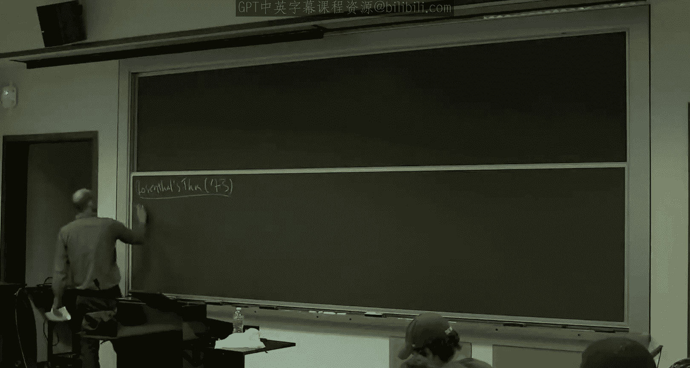
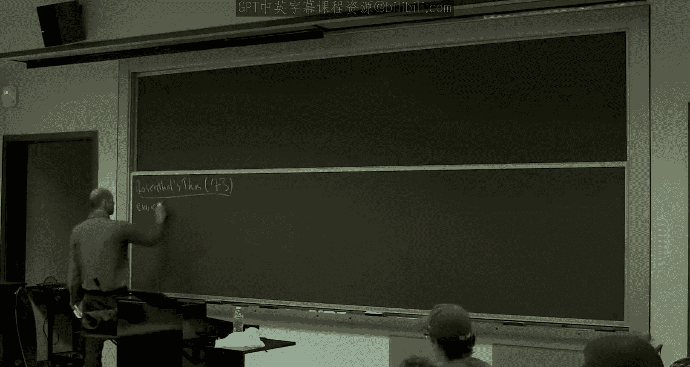
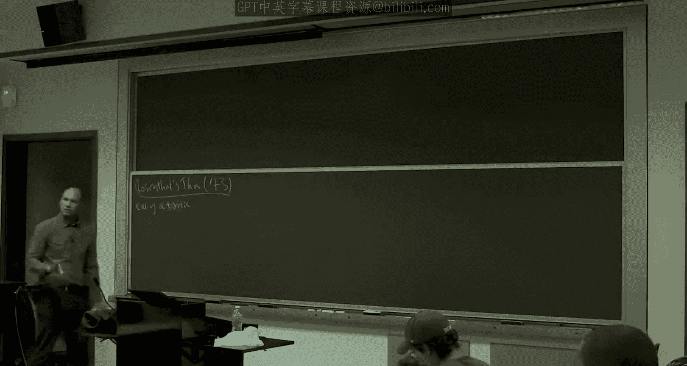

# 斯坦福大学《算法博弈论｜Stanford Algorithmic Game Theory CS364A, Fall 2013》中英字幕（deepseek） p13 -13-13_ Potential Games; A Hierarchy of Equilibria).zh_en -BV1VmC2YzEXJ_p13-

All right， so I'm going to go ahead and get started。

So we've been in the course for about six weeks and most of that six weeks。

 we've know whether we made a big deal of it or not been talking about equilibriumria so the whole time we were discussing mechanisms。

 we were discussing what are called dominant strategy equiria last week when we were talking about routing games。

 you we talked about equilibrium flows， both the nonatomic and atomic models but I don't think I've even really ever written the definition of an equilibrium on the board I haven't been treating them as first order objects and today we're going to change that so today we're really going to talk about equilibriumria。

 a bunch of different flavors of them when they exist and so on。So to begin。

 let me just remind you where we left off at the end of Wednesday。

 so last week we talked about the price of anarchy and routing games and the last result that we gave is we looked at atomic selfish routings。

 remember atomic is where you have a finite number of players each of nonnegligible size and we proved that when you have aine cost functions of the form Ax plus B the worst case price of anarchy in those networks is exactly 2。

5 so I showed you a lower bound that was a by-directed triangle with four players where there was indeed an equilibrium that was 2。

5 off from optimal and we proved an upper bound that held in general networks so there can be multiple equilibrium but every Nash equilibrium of every atomic selfish routing game with aine cost functions is no worse than 2。

5 times the cost of Opimum。Okay， but。If we sort of really scrutinize what we proved。

 every single equilibrium， and there may be many is within a small constant factor of optimum。

 there's still something we should be worried about， which is how do we know that in every instance。

 there's at least one equilibrium。 We know therere going be more than one。

 but how can we be sure that sometimes there isn't zero。 And if there's no equilibrium。

 then these price of energyarch bounds would be vacuous。And on Wednesday。

I was focusing on what are called pure or deterministic Nash equilibrium。

 that is when we talked about what a player was allowed to do。

 it had to pick a single path to route one unit of traffic。

 and we looked for a collection of paths so that nobody could deviate and strictly decrease their cost。

 So that's that's an equilibrium with no randomization。

 And we know there were games where there are none of these pure Nash equilibrium。

 Does anyone remember one， like maybe from lecture 1。Good。

 rock paper scissors is a very simple game where there's no pure strategy N equilibrium。

 You have to randomize to be at an equilibrium。 right if you always play scissors。

 then the other player will always play rock and so on。

So atomic selfish rounding games are a remarkable class of games。

 in that the existence of these pure equilibriumlibria is guaranteed。 so that's not obvious。

 it's not hard to prove， but it's not obvious。 and that's the nextroussal I want to discuss Rosenthal's theorem。

So this is an old result 40 years ago。

So in every atomic selfish shuting network。

And not just with Iine cost functions， with any functions you want。

Has at least one。Equilibrium。And we already know there can be more than one。Yep。Right就。Yeah。

 they're pretty they're different in the sense that in routing games。

 if more people pick your strategies， it's always bad for you。Whereas in rock paper， scissors。

 there theres in that property。 So you don't have the same kind of monoticity。So。I mean。

 in some sense， just by virtue of Rosenthal's theorem， we now know that that can't be true。

 but more directly， there's sort of a consistency in people's preferences and routing games。

 which is what gives rise to this result。是中那个。Correct。So the plan for the proof。

As I'm going to show that every selfish routing network is what's called the potential game。抖。

And potential games always have Schernash equilibrium。And at a high level。

What you do in a potential game is you show you basically anthropomorphize all of these players and you show that they can be they act as if they are trying to collectively optimize a single function。

 which we call the potential function。 And then what we'll see is that at the global optimum of this potential function that people are inadvertently trying to optimize that has to be a Nsh equilibrium So there aren't a lot of techniques for proving the games are guaranteed de pure equilibriumria in part as many games do not have pure equilibrium and this is probably the most useful one so there's very few tools for proving existence of pure equilibriumria and this is the number one that you should know。

So let me show you what the potential function is。So the potential function assigns a real number to every possible flow。

 and a flow is just a choice of a path by each of the K players in the selfish routing network。

And the potential function is the following。It looks quite similar to the edge based expression we had for the total travel time。

 but it's a little different， but we again swim over the edges。And on a given edge。

 recall F subB is the notation for the number of players that choose a path that includes the EG。

So we're going to sum from Michaels1 to the number of players using that edge。

Of the cost function of that edge evaluated at I。So it is a little weird。

 so I letm me show you a picture。So on an edge where FCB was three， where three players are using it。

The sum， you just。Evaluate the cost function at the， at the values up1，2， and 3。

And you would just add up。The area under the corresponding rectangle。Okay。

So on a given edge with three players， that's what you'd get for this sum。

Just to help you relate to this。 that's compare and contrast it to that edge based expression we had for the total travel time。

 So one way to count up the cost of a flow is you sum over the edges， and then on an edge。

 you look at the number of players using that edge F sub B times the common cost they all incur C sub B times F sub B。

So instead of this sum， which has F subB sum ins， right so if there's five players here ratting up five things。

 it would be five times just the cost when all five players are there。

 so but differently for the total travel cost function。

 for the total travel time rather than this blue staircase。

 we would be paying attention to its bounding box okay。To its pink。屁。

So this is what we were concerned with on Wednesday。 We wanted to minimize this。

 The potential function is a bit different。 It's the staircase instead， okay。Now。

 I haven't told you why why you care about this definition。And here's the surprising。Property。

So get是。S property of the potential function。There's a sense in which this potential function simultaneously tracks。

The costs of all of the players。So if a player eye deviates。Say it was using half P P。

In the original flow F。And suppose it deviates to a different SITI path。Let's say P hat I。

And let's call the new flow F hat。So F hat is just。The old flow F， but with I reassigned。

So the claim is that we look at this deviation by player I， the change in the potential function。

 So the difference between p of F hat， the new flow and P of F， the old hat。 sorry， the old flow。

Is exactly the changing costs that I itself incurs in these two flows。So that's the click。

So the claim is this should hold， no matter where you start from， no matter what F is。

 no matter which player I you're allowing to deviate and no matter which path P had either they're deviating into。

So in this sense， this single function fee， which notice is defined independently of any player eye。

 it's a single global function， it's simultaneously tracking the sort of possible changes in cost faced by all of the players okay so that's the key claim。

So let me prove the claim for you， and then I'll explain why the claim implies Rosenthal's theorem。

 okay。So proof of claim。So once you've actually guessed， once you know。

 you've pulled this potential function fee you know， the rabbit out of that hat。

 it's easy to verify this property。So what is the left hand side？Well。

 Phi is defined as this sum over edges。For any edge。

 which is in neither its old path P I nor its new path P hat I。 of course， it doesn't change。

This part doesn't change for any edge， which is in both the old path and the new path。

 it doesn't change。For any edge which is in the new path and not in the old path。

 So an edge which player I newly uses， we're going to pick up an extra term in this sumand。

 Okay so if there used to be five players using it and now player I is the sixth player once it switches to it。

 we pick up a sixth sumand， which is cease to be evaluated at6。Similarly。

 for any edge that player eye is abandoning。Then we shed the final summan。

 So if it used to be one of five players， this is going to shed the fifth summan CEO of thought。

So in other words。The change in the potential function value。You just look at all the edges。

Better in its new path than not its old path。And you pick up a C of F plus1。

 the plus one is because I is now， remember， this counts how many players were using it F。

 this is because I is a new player using it。You look at all the edges that it's abandoning。

 it used to use， and now it doesn't。And you shed the final summonmman， CEOE of FOB。

So that's expanding the left hand side。And now， if you think about it。

 this is actually exactly the right hand side here， too。From player eyes perspective。

 how does its cost change when it switches paths， Well， edges in neither path don't matter。

 Es in both paths。 It pays the same before and after。

Any edge which it uses now and it didn't used to， it has to pay its cost。 Okay and again。

 if there used to be five players， it's the six player， it pays like the other five players。

 the cost when there's six players on the edge and anything it abandons。

 it used to pay C of F subB and now it's on its path， so it doesn't。

So this sum is just the right hand side。Right。So that's the proof of the key claim。

That from any flow， from any deviationviator I and any deviation， P hat I。

 the change in the potential function is exactly the same number as the change in cost that this player I incurs if it switches to the path P hat I。

So let me explain why the key claim implies of the theorem。So， now。

What the key claim is saying is that these players。Little little beknownst to them are， in effect。

 trying to minimize this global function fee。Okay。So let's consider the outcome。

 which actually has the absolute smallest fee value。不。

So there's only a finite number of possible outcomes in this game。

One of them has a smaller fee value than any other。 Call it F。

Since this has the smallest fee value of them all， there is， of course。

 no deviation by a player that leads you to an outcome of smaller fee。 There isn't such an outcome。

Well， by the key claim， the change in your cost when you deviate is exactly the change of the potential。

 So if every deviation can only make the potential go up。

 then every deviation can only make the cost of the deviator go up。

But that is exactly the definition of a N equilibrium。So why is there a national equilibrium。

 It's because， First of all， there exists a potential function。 That's the really nontrial part。

 There exists a potential function。 You can look at the global minimize with a potential function。

 and that has to be an equilibrium。 Okay， so one exists。Alright。

 so at least there are some classes of games， in particular。

 the ones we were obsessed with last week where purequilibria are guaranteed Rock paper scissors。

 no routing games， yes。Questions。Exactly。Yep， finite number of players。

 each has a finite number of the paths in this finite network it could try。

 so one of them has at least as small a fee value as anything else。Al right。

So I gave you this argument just for。Atomic selfishvage oututing games。

 but it's actually a flexible argument。So let me just pause and mention some notable extensions。

Which relates to。Either things we've talked about before， or things we'll talk about in the future。

So whenever we've talked about routing games， we've made this sort of natural assumption that cost functions only go up。

So the more traffic there is on an edge， the higher the cost is for everybody。

This proof actually doesn't need that hypothesis。 If you look at this proof。

 the cost functions can be literally anything。 doesn't matter。So proof still works。If the Cs。

Are not non decreasing。We'll make use of this fact next week when we talk about a model called network cost sharing games。

The second thing to notice is， I mean， this whole theorem and its argument has nothing to do about networks per se。

Okay， so these strategies， piece of eye， if they were just sort of arbitrary subsets from some ground set。

 rather than paths in the network， it wouldn't matter The exact same proof would work We never referenced the fact that there was network structure。

So in this sort of more abstract setting， these are called congestion games。

 and that's a word you see a lot in this part of the woods。

So it wasn't important that E represented the edges of a network。And it wasn't important that the Ps。

 that the strategies。We're half in a network。And third， and finally。

I want to make a couple remarks about the nonatomic model。

That we discussed last week on Monday in the first part of Wednesday。

 So remember in the nonatomic model， that's where we had Pgu's example， and braces paradox。

 that's where we had negligible sized players like cars in the highway。

 and we looked at fractional flows。And back then， I ask you to take it on faith that equiria exists and are unique。

I'm not going to give you formal proofs。 You can find formal proofs in the AGT book。

 but I'll give you sort of the moral reason why both of those two facts are true。 And basically。

 it's because of a potential function like this。There's a question。We。一。You reachach any equilibrium。

Therefore is a any given system like。Yes， the answer is yes。

So that and we'll actually discuss that explicitly in about two weeks。Yep。

 but you're absolutely right。So the comment was， it seems like potential functions should have implications not just for existence。

 but also for dynamics。 and indeed， they do。 Okay， And we'll talk about dynamics at some length a little later in the course。

Question。啊，这里一个。在这个。That that's not the case。 So it is important that the cost functions are anonymous。

Yeah， so the， the model where cost functions depend on the players is an interesting model。

 but some of the properties break down。Yeah。Including， including this one。All right。

 so for anatomic svage routing， you use basically the exact same potential function。

 It doesn't quite type check at the moment because this is for a finite number of players。

 So for an infinite number of players that are small， you should just replace the sum by integral。

Right。So you just consider the potential function。Where you sum over the edges and instead of counting up one。

 two， three all the way up to F subB， you just integrate from zero to F subB。Of the cost function。

Okay。So that's the relevant potential function。Now， when I introduce nonatomic selfish routing。

 we assume that the cost functions were continuous。

 I didn't really ever tell you why that was important。 And there was even a question about that。

 But now we see why it's important。So fee is continuous。Anyways， so fee is a continuous function。

And for that reason。It has some global minimizer。 Okay， there is some。 Its not。

 It's no longer true that there's a finite number of outcomes。

 but because fee is a continuous function in the space of all flows is a compact set。

 fee does achieve a global minimum on it。And just。Like the global minimizer of the discrete potential function was a N equilibrium。

 So too， here is the global minimizer of this potential function in equilibrium flow in a nonatomic sense。

 Okay， that requires proof， but it it is true。So that covers the existence in the nonatomic model。

 So what about uniqueness。Well， we also were assuming that the cost functions were non decreasing。

So if you integrate a non decreasing function， you get a convex function。 Okay。

 so this potential function fee is convex。So what that means is that fee。

 this potential function has no local minima that are not also global minima。

 that's a standard property of conx functions。 You know。

 think about like a parabola defined on conx sets。And since equilibrium flows turn out to correspond to local local minima and the only local minima or global minima and global minima are essentially unique。

 so too our equilibrium flows essentially unique in this nonatomic model okay。So again。

 the basic reason for uniqueness is convexity the potential function。

 which just comes from the form of the potential function and the non decreasing cost functions。

 Okay， so that's morally why you have uniqueness here。So the global minimizer。Is the only。

Equ to flow。对。啊据。Like push flat then curves out。No， it wouldn't be convicx。Well， all right。

So the key point is that the potential functions con。2。O。So this was all very good news。

 Dave this was all。Saying that the games that we were obsessed with last week。

Have even more nice properties than we thought， equilibrium are guaranteed to exist So all of our nice price of anarch bounds are non vaculuous really。

 they're talking about objects which are there。So that's good。But as we know。

 not all games are so nice。So there's still the question looking ahead as we want to reason about other application domains。

So what about games with no？Equiilibrium。Okay， no pure equilibrium， all right？So as we said。

 Rock paper scissors is one example。But there's actually games very closely related to the games you've already been analyzing where you also lose the existence of pure equilibrium。

So for example。One minor tweak I can make to the atomic selfishage shing model is to allow players to have different control different amounts of flow。

 On Wednesday， every player controlled a single unit of flow。 What if there's like two players。

 one of them has one unit of flow and the other has two units of flow。

Turns out you already lose the guaranteed existence of pure equilibrium， even then。Yeah。

So it's not hard to come up with an example。But I'm not going to spend class time on it。

 I'll just refer you to the AGT book。It's example 18。4。And it's an example that just has two players。

 one has one weight， unit weight， the other has weight two， and the cost functions are  quadratic。

 and there's no pure equilibrium in a very small selfish routing network example。So Rosendll's serum。

 you know， it's great when it holds， but the question remains， what do you do when it doesn't hold。

So the fact that there's no pure equilibrium in a model like this。

 that doesn't change the fact that we want to reason about it。

 We want to understand the usual questions。 When is the price of anarchy small。

 When is the behavior by strategic players likely to lead to an outcome。

 which is not too far to optimal。 but because there's no pure equilibrium。

 we have to take a somewhat different attack。 for have a meaningful price of anarchy bound in a model like these。

 We have to enlarge the set of equilibrium to recover guaranteed existence so that we can have meaningful price of anarchy analyses。

 Okay so that's the plan from here on。Cion。Is not what？嗯。I see what you're saying。

I don't think it's equivalent。I mean， they're not unrelated。

 but I don't see an equivalence in either direction。I mean。Yeah， I mean。

 I understand your question and yeah， I mean， they're not unrelated。

 but I don't see a specific technical connection。It's a question， yeah。

Because in Rosenthal's prove all the players have the same weight。Yeah。

So when a player moved to an edge， we knew it was plus one， it was never plus two。Yeah。

So there's really kind of a phase transition between whether all players have exactly the same weight or not。

 at least there's a phase transition with respect to the existence of pure equilibrium what we don't know at the moment is whether there's some phase transition in terms of the price of anarchy and in fact once we develop richer equilibrium concepts we'll see that there isn't we'll see that exactly the same theory applies to both the unweighted and the weighted case but to do that。

 we really need to talk about more general equilibrium concepts and that's the subject for the rest of this lecture。

Okay。Yeah。Scus the of minimize。That implied it was a national equilibrium。OkayYeah。I mean， not。

 I mean， in a convex function， if it's strictly convex， the answer is just no。

 And if it's weekly convex， you have this flat bit at the bottom， which are all optima。

 and all of those will be equilibrium。 and it'll be essentially the same equilibrium。I I just。我不。Yes。

 that was for the nonatomic model。Where we we're talking uniqueness。 So as we know。

 we do not have uniqueness in the atomic model。 So it's an interesting extra feature of the nonatomic model that you have uniqueness。

 And the reason you have it is because of conxity of the potential function。

So I hope the motivation of where we are right now is clear。 Pu equilibrium have gotten us， know。

 as far as as they have。 We began with a model nonatomic selfish routing。

 which was special in that we had both existence of equilibrium and uniqueness。

 So it's very clear what the price of anarchy should be。

 Then we graduated to atomic selfish routing where we still have existence of pure equilibrium。

 but we had multiple equilibrium。 So we had to redefine the price of anarchy in terms of the worst pure equilibrium。

 So now that we're pushing it even further。 we lose existence of pure equilibrium。

 And we need to move on to more permissive equilibrium concepts。

 I'm going to show you three in the rest of this lecture。 One， you already know。

 mixed strategy a equilibrium。 But I'm still going to talk a little bit about it。

 Two are probably new to most of you， correlated equilibrium and course correlated equilibrium。

 And the focus will be on。😊，So each of these will be， in some sense。

 a strict superet of the previous one will be more general， more permissive。

 and the focus is going to be on when do we have guaranteed existence and a subtext will be when do we have computational tractability of these equilibrium concepts。

All right， so to discuss these equilibrium concepts simply。

 let me just kind of formalize the games we've been talking about in the last week。

So a cost minimization game。And just go ahead and think about， you know。

 selfish routing as a canonical example。 That's fine。So the ingredients are you have players。

 finite set， K players。Each player has its options， so a strategy set。

These are also going to be finite。A1 through Ak。So in a routing example。

 these would correspond to S ITI pairs。 these would just be S ITI paths in some network。

 And then for every player， I have to tell you what is the cost it incurs in a given outcome and again。

 an outcome is just a choice of a strategy by each of the players。So for all I。

I tell you a cost function， C。Where're here S， the vector S。Is。Called。

Either a strategy profile or an outcome。Okay， so this is just like a traffic pattern。 Okay。

 and this would be the cost that I incur when it picks a given path in a given traffic pattern， okay。

So。We already。Just for the record。You already know what a pure as equilibrium is。

 but just to compare it to the other three concepts I'm going to tell you about。

How would we write it in this notation？Well， so no player can be better off by unilateral deviation。

 So S is a pure actually equilibrium。 if for every potential deviator。Every potential deviation。

If I look at its cost after deviating。So I hope you remember this notation from mechanism design。

 this is just holding the other player strategies fixed。

 player I deiates to something else S prime I， and it can only be worse off by deviating。

That is the cost should only be higher。Then in the equilibrium， okay。

 and this is true simultaneously for all I。And these are great when you got them。

But it need not exist。So to track the progress in this lecture。Let's use a sort of running diagram。

To keep track of our four equilibrium concepts。Each one more permissive than the previous。

So the smallest set is going to be the pure strategy in N equilibrium。And the first big issue with。

Is that you need not exist。So。Let's move on the mixed strategy in National equilibrium。

We talked about these in rock paper scissors in lecture1 have the only way to have a sensible pair of equilibrium strategies in rock paper scissors。

Is to allow both of the players to randomize uniformly。Over the three available strategies。

So in general。The candidates for mixed strategy in Ash equilibrium are each player rather than picking a single action deterministically it picks a distribution over its actions。

 The assumption is that then players pick at random a strategy independently each from the distribution that they've chosen。

 and then it should be at an equilibrium in the sense that this exact same inequality should hold。

 but now an expectation where expectation is over the random choices made by all of the players。

So a mixed equilibrium。So now， instead of a vector of strategies。

We look at a vector of distributions over strategies。And these form a mixed Nash equilibrium。If。

 again， for all potential deviators。For all potential deviations， S prime I。

The deviation only increases your expected cost。Okay。So add equilibrium， again。

 how do we evaluate your cost， All players pick a strategy at random independently。

So I'm going to write sigma for the product distribution。And then over here， I look at your。

Expected cost。If you deviate， that's an S prime。So on the left hand side， in general。

 all K components of this are random because each player is choosing S I at random from Sigma I。

In the right hand side， these K -1 components are again random。

 They've chosen just as before from those players mixed distributions。 This is deterministic。

 This is a fixed pure strategy S prime I that we're considering as a deviation。Now。

 perhaps you'd think about an alternative definition。Well， if players are allowed to mix。

 why not allow them to mix when they deviate。Here I forced them to deviate to a pure strategy。

So you could。 You can write down the definition where you could actually deviate to a sigma prime I。

 You get exactly the same definition。 Okay， so I'll ask you to work that on the exercise set。

 So it doesn't matter whether you check just the pure deviations or the mixed ones， Either way。

 that's a mixed nash equilibrium。2。So what I hope is obvious is that the pure Nash equilibrium are exactly the mixed Nash equilibrium when each sigma I is a point mass。

 plays a single strategy with 100% probability。 Okay。

 so I hope it's obvious pure N equilibrium are a subset。Of the mixed Nash equilibrium。

Rock paper scissors shows us it can be a strict subset， as well。So the mixed Nash equilibrium。

Contain the pure Nationalia， and possibly more。Now， by virtue of being a bigger set。

 it's conceivable that we' have recovered existence。 Okay， we know this might be empty。

 might be non empty。 This can only be bigger。 So a highly non obvious question is whether that set is always not empty。

 whether a mixed equilibrium is guaranteed to exist。So we're not going to talk about the proof now。

 we'll talk about the proof in a few weeks。But indeed， Nash's theorem from 1950。Says that in。

Every finite game， there is indeed at least one mixed Nash equilibrium。Okay。

So while the innermost set need not exist。This set is guaranteed to exist。So that's the good news。

The bad news is a much more recent development， really a 21st century development。Which is that。

 despite its universal existence。It can be as hard as finding a needle in a haystack。

So it can be computationally。Intractable。We'll discuss at some length。

 probably in the last week of the course， the sense in which computing a a equilibrium is computationally intractable。

 It's okay。 if for now， you think of it as something like NP hardness。

 but you should know that the truth is rather more complicated。 And again。

 I'll explain what I mean by that at the end of the course。So that's the bad news。

We know when Ashli is out there。But in a precise sense。In general。It's hard to compute。

So don't forget our mission when we started on this strategy of cataloging equilibrium concepts。

 We were bummed at we're concerned about price of anarchy analyses that were vacuous。

 So when we moved to mixed Nash equilibrium of what's happened。Well。

 because we've recovered guaranteed existence， at least the price of anarch is well defined for the mixed Nash equilibrium of a game。

 There's at least one。 You can just take the worst case over however many there are。 Okay。

 so it makes sense to define the price of anarchy。Given that it's hard to compute one of these equilibrium。

 though， in general， it's not clear that that bound is meaningful。

 If you prove that every mixed match equilibrium is within a factor two of an optimal solution。

 but it's hard to even find one of those equilibrium， Maybe I don't care that much about the bound。

 If there's no reason to expect players to have found one of these equilibrium solving this intractable problem。

 Maybe it's not so interesting to have a bound on their quality。Okay。

So that motivates going even beyond the， know， very wellknown mixed N equilibrium concepts and looking at still more general equilibrium concepts to recover。

 we're going to have existence from here on out。 But now we want to recover computational tractability。

 And the flips out of that coin is sort of behavioral plausibility。

So here's the third equilibrium concept。This one is the most subtle of the four。

So we'll allow some time for it。It's called a correlated equilibrium。

I was just curious who's heard of a correlated equilibrium before？F you。

So I'll give you the definition。Then I'll give you some proposed semantics for the definition。

 which are also kind of the original semantics proposed by Almonman， proposed it back in '74。

Around the same time as Rosenthal's theorem， as it turns out。

And then we'll look at a very simple example。 And usually it's the simple example at which point people really kind of get the concepts okay。

How。So。So for pure Nash equilibriumlib， we were talking about a vector of fixed strategies。

For mixednatch G， we talked about a vector。Of distributions over strategies。

 And then we discuss the product distribution that induced over all of the outcomes in correlated equilibrium。

 we work directly。With a distribution， not necessarily product distribution。

 the distribution over all of the outcomes of the game， all of the strategy profiles。

So distribution sigma。On the space of all outcomes。Okay， so like in rock paper scissors。

 we have a two by3 by three matrix。 This would be a distribution over 9 things。

 the9 possible outcomes of rock paper scissors。So distribution sigma on the outcomes。

Is a correlated equilibrium。If， again， for all players I。

 but now differently for all pairs of strategies。SI and SI Prime。

So let me just write the definition and then we'll talk about the semantics。If。The expected cost。

Of a player。Under the distribution sigma。 So Savar looks familiar。

 But here's what's different conditions。On SI。Okay。

So sigma is a distribution of all the outcomes of the game。

 like the nine outcomes in rock paper scissors。S I is some particular strategy， like maybe rock。

So if you're the row player in three of the outcomes， you're playing rock and six of the outcomes。

 you're not。So this is saying， look at your conditional cost in the subset of outcomes in which you're playing the strategy S。

 where S is fixed。And this cost should be no more than the analogous conditional expected cost if you deviate to SI prime。

Okay。So let me tell you one way you can think about this。No。Yeah， condition on S。

That's why I'm about to tell you， as I said。So why。

 under what situation might a player I actually be reasoning about these two quantities？

There's a couple answers， but here's the original answer。And again， I'll give you the semantics。

 and then I think it'll really。Hit home once I give you a simple example。

 but let me just go through the semantics for now。So imagine， if you will。

That this distribution sigma is publicly known。all players know what it is。

Imagine there's some trusted third party， trusted by all the players。

And the trust of their party has two responsibilities。

The first responsibility is to draw a sample from Sigma， privately。Does it like this？

Pix a sample from Sigma。 for jar as it doesn't tell anybody。Now。

This trusted third party is going to have a private conversation。

 or actually monologue with each of the K players separately。And it's monologue with player I。

It's going to tell player I， I think you should pay play the strategy S sub I。

 Can't give player I some friendly advice。The other K -1 players do not hear this As a player I。

 you hear only the recommendation by the trust of your party to yourself。

 not to any of other the K -1 players。Furthermore， you're given this advice。

 but you're actually free to choose whatever strategy you want。

 You can either follow the trusted third party's advice and play S I or you can play some other strategy S prime I。

 if you prefer。Trus the third party now goes away， disappears。And as a player。

So what this is encoding。Is for player eyes， it's saying given the information。

 all of the information that I has available to it at the time that it has to pick a strategy。

 it should be in I's best interest to follow the recommendation of the trusted third party。 Okay。

 could do whatever it wants。 But given what it knows。 And let's review what it knows。

 It knows the distribution sigma。From which this outcome， S was drawn。

And it knows the Ih component of the sample。 Okay， we have a distribution。 We have a realization。

 If you're a player I， you know the distribution， you don't know the realization。

 but then you learn the I component of the realization。And now， of course。

 you have a posterior distribution on S minus I。 You don't know the rest of the realization， but。

You can do a bay update。 Okay， you know， conditionally on being told that the I component is S I。

 You know some conditional distribution S minus I。 That's the information at your disposal at the time you make a decision。

 And this is just saying。It's in your best interest to actually play S I， not something else。

So again， the two assumptions we're making。So any rational players should condition on S sub I。

 That's part of the information it's got。 So when you do this computation of expected cost。

 you condition。On knowing the I component of the realization。 And then also， you know。

 because your cost depends on the action taken by the other K -1 players。

 you have to make some assumption about what the other K -1 players do。

 And the sensible assumption in a correlated equilibrium is you assume the other K -1 players indeed follow their recommendations。

 So you assume they're actually going to play S - I， not just be recommended S  I。

 but take their recommendations and play S - I。Okay。So， let's proceed。So the simple example。

Which will hopefully make all of this clear。So believe it or not。

 an everyday example of a correlated equilibrium is a stoplight， traffic light。And this is true。

 in surprisingly， literal terms。Okay， so what's the game I'm talking about？

While you're going east west， someone else is going north south。 It' is an intersection。

And your two strategies are to stop or to go。Let's normalize it so that if you stop your payoffs zero。

Obviously， it's better if you get to go， given that the other person stops。So。So that。And obviously。

 it's pretty bad for both players if you both。Oh。Same minus5， minus5。

Let's say it's low speed accident。Good。So what are the okay。

 so let's think about this game for a second， let's start simple。

How about pure National equilibriumria。 Does the game have any pure National equilibrium。

What will be a pure na equilibrium？But we know it has a mixed na liver because it's the game。

But does it， in fact， have pure equilibrium？That's right。 So if one player goes the other stops。

 you know， what are you gonna to do， The player who goes is happy， The player who stops， you know。

 would'd rather go， But given the other persons going， you're stuck。And then， of course。

 there's a symmetric。 So there's two symmetric pure national equilibrium。

 There's actually a somewhat bizarre third mixed national equilibrium， too。

 but we won't really need to talk about it， okay。So。The P National equilibriumria。go stop and stop。

 go。Now， one issue with games that have multiple equilibrium is the players kind of have to figure out they have to coordinate on which one to be in。

And that can be hard， And you see this in real life。

 situations where there's multi equilibriumria and there's friction because different players are sort of angling for different ones of those equilibrium。

So you can think about a traffic light as a coordination device。

 which basically tells the players which of these two equiria they should be in。So in more detail。So。

 consider。The distribution over outcomes。So this is a distribution with four entries because there's four outcomes of the game。

And let's say it it just randomizes 50，50 between the two purenaache equilibrium。

So sigma is going to be 50% here。50% here and zero on each of those two。So one thing that's。

 two things that are very clear。 First of all， this isn't a purena equilibrium because coins are being flipped。

 Can't be a purena equilibrium。Secondly， it can't correspond to a mixed Nash equilibrium either。

Because this is not a product to distribution， right？ So sometimes the row player plays go。

 and sometimes it plays stop Similarlyly for the column player。

 But none of the time is it the case that they both stop。

So it's not a product distribution can't be mixed Nash Libia。I claim， however。

That it is a correlated equilibrium。嗯。So the two players are symmetric。

 So it's just a reason about one of them。 Let's say we're the row player。Okay。

So let's suppose that we're recommended。To stop。Okay， that is。

 suppose when we drive up to the traffic light， we see red。Right。Well， we know Sigma。

 we know this distribution。 We know these are the only two outcomes。That are ever selected。

We know we were told to stop。 We know we see a red。 So we know the other player is told to go。

 The other player sees a green。Okay。Assuming that that player takes their recommendation and goes。

We definitely better stop。Our expected to cost is definitely less by stopping。Similarly， if。

Did I start mixing up the two cases。 I forget。 So if we're， I just did red， if we're shown red。

So if we're showing green， then we know with certainty that the other player is shown red。

And if you think about it， we do this as drivers。 We assume then that they are， in fact， stopping。

 that they're doing what they're told。And given that， of course， our cost is less。

 Oh this is payoffs。 Our payoff is higher if we go。

 We get pay off one instead of payoff  zero from stock。So we know Sigma， we know the realization。

 And then given the update that we do， given given the realization， indeed。

 we should just follow the recommendation。Okay。So thats that's a little bit about co equilibrium。

 questions about quality。There a few more things I want to say about it， but this is a good time to。

See if there's questions is about the definition。There know。What do mean。Okay， so first。

 first thing is， it's a good question， so。嗯。It is the case that correlated equilibrium are only more general than mixed Nash equilibrium。

So again， we should always go back and say， okay， do these things， I mean， fine。

 You showed me this two by two game。 What about in general， do these things exist。Well， in fact。

 the mixed Nash equilibrium of a game correspond precisely to the correlated equilibrium of a game where this distribution sigma happens to be a product distribution。

 Okay， that's certainly， you know， a necessary condition。

 mixed Nash equilibrium of by definition of product distributions。four product distributions。

 the mixed N equilibrium condition coincides with a quality equilibrium condition。Soll again。

 be on the next exercise set。Correspond to CE。That our product distribution。And so what that means。

If we return to our chart。Is that this correlated equilibrium of the game subsume the mixednch equilibrium。

 And as we just observed， they can be strictly larger。Okay这。

So that means we don't have to worry about existence。

 Mi Nash equilibriumli are already guaranteed to exist。

 So certainly quality Lib are guaranteed to exist。 But don't forget about our motivation for going beyond mixed Nash Lib in the first place。

 Mi Nsh equilibriumli are hard to compute。So quality equiria by virtue of being an only bigger set。

YouTologically， it can be only easier to find one， but maybe it's still hard。

So let me address that question。So in fact， we will prove this。In a couple of weeks。

Is that correlated equilibrium actually are computationally tractable。That is， they can be found。

Efficiently。So that's a good thing。In fact， for those of you that know linear programming。

 this isn't a hard fact to establish。 It's fairly straightforward to reduce the problem of computing equilibrium equilibrium a game to solving a particular linear program。

 So what's much more interesting And what we'll focus on in the coming lectures is that you don't need the heavy machinery of linear programming to compute co equilibrium。

 Actually， if you just endow all of the players of a game with reasonably simple learning algorithms and let them try to learn what to play over time。

Suitably chosen learning algorithms will guide joint play to the set of correlated equilibrium。 Okay。

 so it's tractable not just， you know， for some big laptop with Cplex on it， solving linear programs。

 but also for uncoordinated players playing in a game。 So that's what's more interesting。

 And that's what will， will prove a little bit later。😊，Okay。So this is already。

 we're now already pretty happy with respect to the original goal of looking at bigger equilibrium concepts to have meaningful price of anarchy analyses。

 So bounding the price of anarchy of correlated equilibrium。

 we now know is sort of always an interesting thing They're guaranteed to exist and their plausible behaviorally。

 at least with respect to the litmus test of computational tractability。

But we're going to be even a little greedy。We're actually going to even just because we can。

Consider still more permissive concepts。It has the same type as quality equilibrium。

 It's just a joint distribution directly on the outcomes of a game。

And it's a coarse correlated equilibrium or CCE。If and this is actually simpler to understand in the co equilibrium。

If for all players， I。Now we're back to the usual for all deviations S prime I。And basically。

 it's the correlated equilibrium condition， but with the conditioning dropped。So there's just no SiI。

So you just look at the unconditional。Expected cost。Versus。The unconditional expected cost。

Under a deviation。So this is exactly what we wrote down for mixed naash equilibrium。

 except now sigma need not be a product distribution。

 That is the only difference between this definition and the mixed Nash equilibrium definition earlier。

 So again， here， all components in general of this outcome are random。

 We're choosing this outcome from some joint distribution of outcomes。Over here。

 S minus I is random and distributed the same as before。

 S prime I is some fixed deterministic deviation by player audit。Okay。

So in terms of the original semantics， one way to interpret this equilibrium condition is that now a player has to ponder deviations under less information。

For colatetic equilibriumria， I told the trusted third party。 Well。

 you knew Sigma up front because that was one piece of information you had。

 And the trusted third party told you the I component of the actual realization of sigma。

 So this is like， if you know sigma and nothing else。

You are not told the I realization and you're pondering whether to then you know。

 commit right now to doing whatever you're told， know， once you're told later。

 what action to follow by the trusted third party versus deciding right now to always play some fixed action S prime I。

 So that's the semantics for the course correlatedltic Lib。

Another way to think about it is that to be a correlated equilibrium， you have to， in some sense。

 protect against all possible conditional deviations。

 So a deviation by a player who knows this realization， Where here。

 you only have to protect against unconditional deviations。 deviations。

 which are independent of the I realization。So that's all I meant to suggest。

And I'll ask you to prove it formally on the exercise set。That， indeed。

 cose correlated equilibrium are more permissive than correlated equilibrium。

It's only easier for a distribution to be a CE than it is to be a CE。And as I'll ask you to verify。

 the inclusion is in general stricts。So we're already pretty happy with correlated equilibrium。

 but as we'll see， the learning algorithms required to guide joint play into the CC E set are somehow even simpler and even more lightweight than those needed for the correlated equilibrium。

 So let's say even easier。😊，这个脾气。Okay， so it's therefore even more plausible that behavior in an actual game would be in this super big set compared to this reasonably big set。

 Okay， so it's only better to have guarantees for the bigger set。All right， so questions about that？

Yep。いっぱいいアめに。快 guys。Well， I mean， there's no free lunch。 I mean， if M M and E is hard to compute。

 it's hard to compute。 So if it's a situation where the M and E is hard to compute。

 there's the only cor thatliia。I mean， you get a contradiction， right？

So M& E is hard to compute in general。 C is not hard to compute in general。

 So that's another sort of proof if you want that they can't be the same set。 So will， of course。

 be special cases where they coincide， just like with any hard problem。

 there will be special instances which are easy to solve。

 So that's going to be equally true for M& E is any other， say， and be hard problem。

You clear up front。I mean， not in any sense， like if you look at a traveling salesman problem since it's clear if it's an easy one or not。

 I mean， you can try to solve it， see if it works， but yeah， generally you can't certify hardness。

So I mean， a heuristic for computing mixed straginac equilibrium would obviously be to compute a correlated equilibrium and cross your fingers。

Right， but。嗯。It might not work in。The instances that you care about。Alright， so as far as where。

 So sort of to tie all this together and explain you know， where we're going next。So note。

On Wednesday， we saw for the first time multiple equilibrium that have different objective function values。

 And for the price of energyarch， by definition， we focus on the worst equilibrium。

 The reason we do that is because we don't want to be， you know， if we can get away with it。

 we don't want to make predictions about which equilibrium will actually be realized。

 that would require further justification。 We'll talk about that some next week。

 But if we can get away with worst case bounds that apply to all equilibrium。

 that's the best case scenario。Now， when you take worst case over equilibrium and you start changing the equilibrium set。

 as we have in this picture。So as you make this equilibrium more and more permissive。

 what's going to happen to the price of anarchy in any fixed game。It's only to get worse。

 There's only more equilibrium， and you're taking a worse case over everything。

So the price of energy only grows with the equilibrium set for a fixed game。没有。So so far。

 we've just been talking about the price of anarchy of pure naturalria。 That's what， for example。

 our 2。5 proof applied to。And then if you look at， you know。Mixed equilibriums don't even get bigger。

And so on。So the good news is， as you go to the right， is that you know， the plausibility of the。

 of what you're bounding is increasing。😊，Okay， so the kind of meaning of your bound gets stronger and stronger。

 But the quantitative， know， approximation factor might get worse and worse。

So what we're going to talk about on Wednesday is a general theory for proving bounds of this type。

Okay， so the strongest possible upper bounds on the price of anarchy are at the far right。

The strongest possible lower bounds will be at the far left。

 the lower bound here implies the same lower bound here。

 and upper bound here implies the same upper bound here。

So we're going seek out the strongest possible upper bounds on Wednesday。

 We'll also see that in a lot of the models we've been talking about， like atomic selfish routing。

 there's a remarkable collapse of this hierarchy。 And so， in fact。

 even though we've already seen a lower bound on the pure price of energyarch of 2。

5 in selfish routing games， we'll prove a matching upper bound of 2。5。

 even for the coar quality Gria of arbitrary games。 So that's on Wednesday。 See you then。😊。

