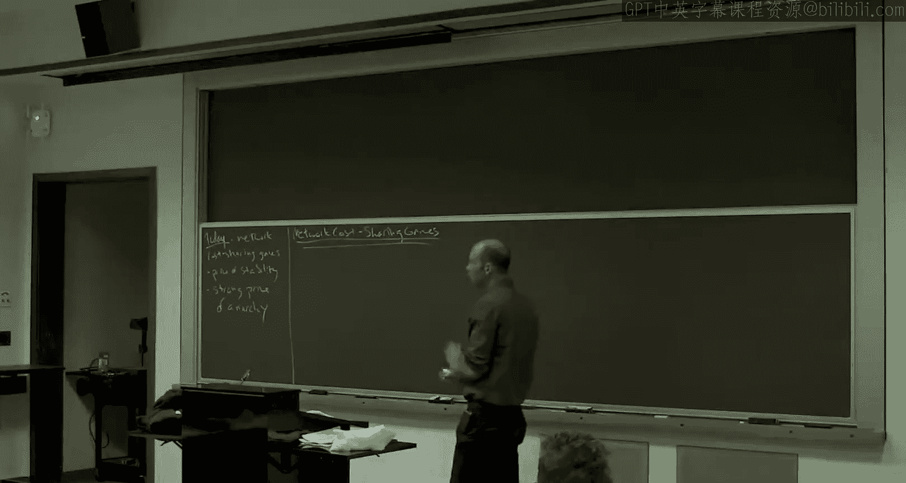

# 斯坦福大学《算法博弈论｜Stanford Algorithmic Game Theory CS364A, Fall 2013》中英字幕（deepseek） p15 -15-15_ Best-Case and Strong Nash Equilibria).zh_en -BV1VmC2YzEXJ_p15-

So this is going to be the last lecture， which really focuses on quantifying the efficiencyfici of equilibrium per se。

 And the point of today's lecture is to。

Change basically two things in the games that we've been looking at so far。

The first thing that's going to change is we're gonna switch from a domains with negative externalities to domains with positive externalities。

 So externality， that just means in general， that's sort of the aspect of the social cost or social benefit which an individual is not taking into account。

 when an individual makes its own decisions according to its own objective function。

 there's usually some difference between that and what you care about globally and the externality and effect is that difference So in the examples we've looked at so far。

 like routing games， the externalities are negative So when you drive on a road。

 you don't take into account the fact that you make everyone else's lives worse。

 and the location games， when you colocate near somebody。

 you don't really care about the fact that you take some of their profit away。

 So from the player's perspective sort players near you were a bad thing and routing in location games。

 But if you think about it， there's other application domains where there are positive externalities So if you join something like campus organization or a social network or whatever。

 hopefully not only do you get benefit， but you enrich other people's experience by being there。

 so again， that's something you're not really directly。Acounting for yourself。 but in this case。

 it's a good thing for everybody else。 So I want to talk about a model again be a network model which explicitly has positive externalities。

 and we'll see what changes。 And then the main thing that's going to change。

 at least in this particular model is they'll be multiple equilibrium。 Okay， we're used to that。

 We've seen examples with multiple equilibrium。 But here actually。

 some of them will be wildly better than others。 And so it's going to motivate wanting to select down and discuss only subsets of the equilibrium。

 which is something we haven't done so far。 We've always looked at worst case equilibrium。

 So we'll talk about a couple ways that you could look at particular subsets of equilibrium。

 Okay so those are those are the main takeaway points for the day。

So the model I want to illustrate these points with is called the network cost sharing Games。

So we're still going to have a graph。To be undirected or directed。

The description of the model is the same either way。

 although technically it seems to behave differently。

 depending on whether it's an undirected network or not。Now。

 instead of a cost function that like we've been having in the routing games。

 we're just going to have a fixed cost on edge。 So basically。

 for an edge of this network to be built or to be formed。

 there is some fixed cost which gets incurred by everybody。 So you might think about， you know。

 building a trench， digging a trench。 You might think about， know， installing， you know。

 some really fast internet to a neighborhood。 There's some fixed cost from which many people benefit。

So'll call it gamma E for this fixed cost。Player' objectives are the same as in the routing games。

 each player we're going to assume has a source and a destination。

 and they're going to want to pick the path that has the smallest cost for that player。

So we're going to say player I。Needs to connect。A source for TSI and a sync tiI。By a sum path。PI。

And she。And then given these choices of paths。Some subset of this graph gets formed。

 So namely the edges that are chosen by at least one person。So network。

The union over eye of the paths gets formed。So this is one type of what's called the network formation game。

 and that's a whole area in its own right。 So for example。

 Professor Matt Jackson often teaches a course on that over in the Econ department。

A lot of the models， including this one are pretty ad hoc。

 It's actually a really hard topic trying to get sort of good game thetic models of how networks form。

 but this is going to be the one that we discuss today。Now， what are the payoffs？

So the assumption is。So you pick a path that comprises all of these edges。

And just like in routing games， a given edge might also be picked by other people。

 They might be at other people's paths。 There's some fixed cost to gamma E that has to be paid jointly by everybody。

 So we're just going to do the simplest model and assume it's split equally amongst all of the users。

 Okay， so cost gamma E。Of an edge that's in at least one path。Slit equally。Among users。

And so hopefully now what I you see what I mean when I was talking about positive externalities。

 right， if there's some edge and at costs 10 and you're the only one on it。

 you have to pay the full 10。 If you're one of two people， then you only have to pay5。

 If you're one of five people， you only have to pay two。

 So here you really want to be joined by your comrades。All right。And then as usual。

 players pick paths。To minimize。Their cost， and again， the cost。

 as in routing games is just the sum over the amount that you pay on each of the various edges。

So hypothetically， if we had full control over the system， what would we want。

 we'll argue we'd want everybody to get connected and we want the overall cost to be as small as possible。

So minimize the total cost。Of the formed。No。So that's the formal description。

 Let's develop our intuition for the model with some examples。

So one thing that can happen in these games of positive externalities is you can have miscoordination problems。

So here's an example。I call this the VHS or beta example。

 which gets more obscure with each passing year。 This was even kind of like when I was a kid。

 So basically before Dvds， if you can imagine that civilization actually existed then before Dvds you know were just starting to be able to rent movies this is like mid80s early 80s。

 and there are two technologies， there was VHS and beta max and at least all the nerds the beta max was better。

 that was sort the consensus among the kind of gearheads Yet you know VHS just sort of got a lead in the market share and it just kind of took over because you needed coordination。

 you wanted the know liquor store down the corner you wanted to have whatever something compatible with the most convenient place to pick these things up。

 So VHS took over and dominated for a while till whenever it was early 90s or something。So。

How would that play out in a network cost sharing game？Well， imagine that there's K players。

 so you can think of these two links as different technologies that could be chosen。They're sort of。

 you know， accomplish the same task。 They go from the same start node to the same end node。

 but they have different qualities。 And particular。

 one is way more expensive for society than the other。

So imagine all K players just want to connect S&T。And let's look at the pure equilibriumria。

But first， let's look at optimal。So what's the optimal solution？No prizes， it's the optimal solution。

嗯。We want to minimize， right， Yeah， So it's a cost minimization version。 Yeah， yeah。

 not If it was payoffs， we'd want the bottom， but we want to minimize costs。 So we want the top。给。

So that's all on top。For a cost of one plus epsilon。有。

WhatpsilonSo K is so K is the number of players， epsilons any positive number and as usual I'm labeling the edges with their costs Now here the cost remember these gammas so these are the fixed cost of an edge so if anybody uses an edge with some cost gamma E。

 then the collection of users split that cost equally。So when all K players are on the top edge。

 they're all paying basically one over K， they each pay their fair share of that。

And that's an ash equilibrium， where a unilateral deviation would multiply your cost by like K squared。

 so that's not a good idea。But unfortunately， if everybody miscoors。

And we can get a second National equilibrium。So if all K players choose the bottom link。

The fixed cost is K。 It splits evenly among K players。 So each individual cost share is only one。

 And if you deviate unilaterally at the top， and then you're solo， you're flying solo up there。

 you play cost one plus epsilon。That what you don't want to do。So， I mean。

 this is an extreme stylized example to make the point。 But， of course， you know。

 it's not hard to think about examples of this in real life where people could have coordinated on you know。

 option A or option B， One of them is a little bit better。

 but people coordinate on the one that's a little bit worse。

 I encourage you to think about real world examples of that。 Okay。

 so here's a very sort of stark illustration。So another。Pure strategy N equilibrium。

Everybody is on the bottom。And so that has cost K。 So this is sort of a disaster。 I mean。

 this is kind of the simplest kind of example you can think about。

 And so what we've just proven is that the price of anarchy with these network cost sharing gains。

 Remember， the price of anarchy is the worst of all of the equilibriumria。

 So this can grow as quickly。As linear in the number of players。Which is not so good， right？

It's also quite easy to prove that it can't be higher than the number of players we'll put that on the next exercise set。

Now， I don't know about you， but I look at this example and I get a little angry。 you know。

 I kind of feel like we were trying to model something very sensible。 You know。

 we have this nice nasty equilibrium concept。 and somehow， you know。

 we have this nice price of anarchy concept， which is guided as well through many applications。

 and we don't get very， you know， interesting insight into this model。

 And what's holding us back is this kind of stupid equilibrium that we probably don't believe anybody would really play。

 There was really such a stark difference between the two outcomes okay。So。It's sort of back。

 not back to the drawing board。 But we' got to take a step back as modelers and ask， well。

 we still believe this is a model worth understanding。

 And we'd still like to somehow measure the inefficiency of equilibrium in some sense。

How are we going to do it， Okay， The price of energy is not the right concept。

 It's too sensitive to pathological， worst Nsh equilibrium。Alright， so issue。How to focus。

Only on the reasonable。N， she's equilibrium。Okay。Yeah。This委。Yeah， that is a good question。

 or that is jumping ahead。 So that'll be the the back half of the lecture。

 we'll talk about coalitional deviations。 I mean， one thing to point out is， you know。

 if I made that a little bit smaller than K。 and two people switched then So if I made that K over two。

 then two people switching wouldn't help。 So it doesn' doesn't go away as soon as you allow sort of small deviations。

 But we'll talk about once you allow sort arbitrarily large coalitions， what happens here。

 that'll be one of the two that'll be one of the two solutions that we talk about for addressing this point。

So just to sort of， you know， So I want to point out， contrast with last week。

So last week when we talked about routing and location games， that was sort of a big success， right。

 because we had the set of pure National equilibriumria。You know。

 and we kind of made fun of the Pynaic Librias being so small。 They might not even exist。 You know。

 there are all these bigger concepts。 we care about much more。 And， you know， we were just spoiled。

 right， We have the arbitraryrarily greedy it felt like last week。

 we could just keep big and said bigger and bigger and bigger。

 And we kept cutting this great constant bound。😊，So the story is a little different in this model and you know。

 other models as well， which is already the set of pure natural equilibrium is sort of too big to reason about inefficiency of equilibriumlib。

 and we're trying to pick some subset。Okay， a so called refinement。

Of the pure Nash equilibrium that we're hoping has two properties。

 two properties that are actually pretty hard to satisfy simultaneously， as we'll see。

 So the first property being plausibility， meaning we can tell some convincing story about why those equilibrium are more important than the others。

 numberumb one， and two that actually we can prove much better worse case bounds on this subset of national equilibrium than we can on all pure N equilibrium。

 Okay， So that would be the that would be the dream We're not really gonna fulfill that dream today。

 But I'll show you kind of the best we can do。 The best we know how to do。Good， okay。

So to make sure we understand。嗯。Sort of what we might hope to accomplish。

 Let me show you example number two， which is shows a sort of more robust form of inefficiency that can arise in these network cost sharing games。

Example number two。So that was the VHS or beta example。 is the。Optting out example。

So all the players are going to have the same destination now。

They're going to have different sources。Kay players。Also， unlike the previous example。

 it's going to be crucial here that the graph is directed here。

 It doesn't really matter if it's undirected or directed。 here， it matters。So。Remember。

 with positive externality， sharing is good。So， the。Players。We'll have a way to rendezvous。In fact。

 they'll be able to rendezvous。At a personal cost of zero。

And then share the remainder of the route to their common destination， T。

Where the joint cost of T is one plus epsilon。 So if everybody took it。

 they'd each pay a little bit more than one over k。Now， if this was the network。

 there'd be nothing to do because everybody only has one strategy。

 So let me give people an opt out strategy。So they can be antisocial if they want and just go straight to T instead of sharing the ride with everybody else。

 You can tell your own story about cars in public transit if you want。

So what's the cost of opting out？Well， it's going to vary with the individual。So let's say。

It's cheap for SK to opt out。costs one over k because they really like their car or they live close to work or whatever。

1 over k -1 for the player K -1。And so on。So the cost is one third for the third player。

 one half for the second player。And one for the first player。So， let's think about。

How players make decisions。In this， in this game。Actually， first。

 let's start the same way we did before。 let's ask what the optimal solution is。

So from a societal perspective， what do you want people to do？Yeah。

 you want them all to rendezvous right， because then all you need to do is pay the one plus epsilon from V to T。

So opt is one plus epsilon。So is that a na equilibrium？Why is it not a national equilibrium。

 who wants to change？S K wants to change。 So when everybody is sharing the V T link。

 everybody pays slightly more than one over K。 In particular。

 player K is paying a little bit more than the cost of its opt out option。Actually。

 if you think about it， player K has a dominant strategy to go straight to T。So， given that。

So given that it's a dominant strategy for S K to go to T。That means that in any Nash equilibrium。

 it has to be the case that player K is going directly to T。That means in any national equilibrium。

 there can only be at most K -1 players。Ronez doing a V to go to tea。

That means in any national equilibrium， each of the first K -1 players has to be paying at least one over k -1。

But player K -1 is unwilling to pay this slightly more than1 over K -1。

 because it has an opt out option。 That's only one over K -1。

And so that's how the dominoes start falling。And of course， inductively， this oneravels completely。

At the only N equilibrium by this process that we did。

 which is called the iterated removal of dominated strategies。

The unique remaining outcome that could。Potentially be a Nsh equilibrium is with all players taking their direct routes from their source to the sink。

 And that is indeed a N equilibrium。So while the issue in the first example was multiple equilibrium。

 that is not the issue here。 Okay， There is only one equilibrium in this example。 Okay。

 so the price of anarchy per se is not what's giving us problems here。

 It's really more fundamentally about equilibrium in efficiency。So。Unique pureshed in NA equilibrium。

All players opt out。So the cost is the sum of everybody's opt out options。

So that's just the sum of I equal1 decay k。Of one over i。

I'm going to use the notation script H subK for this， the K harmonic number。

This is essentially the natural log of K。Plus， a constant known as oiler constant。

 which is less than one。Okay。So this is where things stand at the moment in these network costuring gamess。

 You can have inefficiency。 You can have crazy inefficiency。

 linear inefficiency for intuitively stupid reasons。

 and you can have logarithmic inefficiency for what feel like more robust fundamental reasons， yeah。

The all togetherThat's right。Okay， so now。Let's。So these are lower bounds in effect。

Showing that equilibriumlibria can be bad in various senses。So let's switch it up or bounce up。

Can we say anything positive？About equilibrium and network cost sharing games and we can。

I'm going to offer you two results。So here's the first one。So this is an old theorem。

Fanial Levich and many others。So here's the statement。

 and then we'll sort of talk about what the statement means。So in every such game。

It doesnn't matter what the network is， doesn't matter if it's undirected or directed。

It doesn't matter what the edge costs are。The claim is， first of all。

There exists a pure strategy in a equilibrium。 So that's already a nontri statement。 remember。

 we know models where there are no pure strategy in a equilibrium。So， first of all。

 there always is at least one true equilibrium， but also of those。There is one。

Whose cost is not too far from an optimal solution。So what do we know is not true。 We know。

 it's not true that every Nash equilibrium is at all close to an optimal solution。 You know。

 we can be off for a factory K。 if we wanted a bound that held for every equilibrium。

 We also know that even for the best equilibrium， there's only one equilibrium in the opt out example。

 So the best possible approximation ratio we could write right here is H sub K。

 the lower bound provided by that example。And that's what we're going to get。

So in every network cost sharing game， first， there exists at least one naash equilibrium。 Secondly。

 one of those equilibrium is a logarithmic factor away from the optimal cost。

And we know that for a statement like this， this cannot be replaced with any smaller number。

So there's a name for this。It's called the price of stability。

And so what this theorem is asserting is that the price of stability in network cost sharing games。

Is it most logarithmic。Now， I said when you are trying to when you're trying to you know restrict yourself to a subset of pureash equilibrium。

 what you want are two properties， right， one property is that you get a significant benefit in terms of the worstcase upper bound that you can prove。

And you do right， So in contrast to this linear bound for arbitrary equilibrium。

 we get a logaric bound for this best case， if you will， equilibrium。Roberty， too， was。

 there should be some convincing story， some narrative that makes it plausible that you care about these equilibria and not others。

 Okay， And frankly， that story is a little weak with respect to the price of stability。

 And when you have multiple equilibriumria。You know， some might be good， some might be bad。

 And this doesn't really provide an explanation about why this is the one that players will play as opposed to some other one。

That said， you know， there are situations where the best equilibrium makes sense。

 particularly places where as a designer， you get some opportunity to suggest sort of a norm。

 sort of the initial play of the game。 we touched on this topic when we talked about correlated equilibrium last week。

 this idea of a mediator with this known distribution where once this trusted third party has picked this distribution。

 it's stable， no one wants to switch So similarly， you maybe you're designing a piece of software and there are some parameters that are can be free to set by the user like for example。

 how aggressively you decrease your rate once you have network congestion in a network。

 And you can envision initial default settings of those parameters that you ship the product with as perhaps an equilibrium that wanting to initialize people And so then if you're in a position to kind of set the default parameters in some situation。

 then it makes sense to focus on the best of all of the equilibrium。 so you want it to be stable。

 subject to that you want。To be as good as possible in some sense。

So those are some of the reasons why people think about the price stability。 But again， know。

 I don't want to oversell it。 It is a much weaker guarantee than the price of anarch。Okay。So。

For the proof。Let me jog your memory。About Rosenthal's potential function。

Which is a key tool in both of the two proofs we're going to do today。

The first time you saw Rosenthal's potential function。It was last week， a week ago。

The context then was we were talking about atomic selfish rout in games and we said， well。

 we're proving these bounds about the price of anarchy about pure naturallyria at that point。

 And we wanted to know， you know， are these vacuous bounds or not， do equilibria exist。

And I showed you a proof that， in fact， cur equilibriumlibria do always exist。

An atomic selfish routing games。 And the proof applies equally well to these network cost sharing games。

 So let me just remind you the potential function。So Rosenthal's potential function。

So the definition。So it's defined on outcomes of the game。 Okay。

 so last week this corresponded to paths in a self routing network。

 Now this is just paths in one of these network cost sharing networks。And how is this defined？

You sum over the edges。And on a given edge E， you look at how many people are choosing paths that are using it。

So were using the notation F subB。 And then what you do is you look at the cost function on that edge。

 I'll explain what this is in our context in a second。 So in self shroing。

 this was just the usual cost functions。 and you evaluate the cost functions with one player with two players with three players and so on up until the number of F subB of players that are actually using it in your outcome。

So this is exactly what I wrote on the board， exactly when we could go。Now。

 I commented at the time that in the proof， we use nothing about the cost functions whatsoever。

 The proof of the existence did not depend on the cost functions being non decreasing。

 It could have been anything。 samee proof would work。So in network cost sharing。

So network cost sharing games。What is C， E of I， How should we interpret this。

 Remember that in the routing context， this was the per player cost on an E E when there were I players total using it。

So what should this be a function of in the network cost sharing context？Yeah， exactly。

 gamut E over I。So network cost sharing games。This is。庭有没异议。Over eye。So again。

 let me just remind you that the semantics。This was the purr。Player cost。

A network in a network sharing context， the joint cost， gamma is fixed。

 independent of how many people use the edge， and it's split equally。

 So that means the per player cost is just the fixed cost divided by the number of players。

So let me just write this further。而。So， I'm just going to replace this by this。 Okay。

 everyone okay with that。So in the current context。This is。The gamemut is independent of eyes。

 so I'll put that over there。And then one over eye。

So that's just the definition we had instantiated in the current context。

So let me remind you what the key property， why is it called a potential function？

AndWe approved this last week。The key property is that it， in some sense。

 simultaneously tracks the incentives faced by all of the players。So if you look at。

The change in potential。I guess I was using hats。So here this is where。When I deviates。

From its path in one outcome， P I to its path in a new outcome P I hat。

 So F hat differs from F only in that player I has switch paths from P I to。PI hat。

So if you look at the change in the potential function value， that's exactly the。Change in eyes cost。

So with the change in nice cost， you just look at its old path， you look with its new path。

 edges in both don't matter， edges that are neither don't matter， the new edges and its new path。

 well， it pays it' new fair share on that， given that it's the FE plus one player on it。

 and then the edges it's abandoned， obviously it no longer pays for that。So that was the key。

 that was the one line proof that we did。Now， at that time。

 we use this to prove that Nash equilibriumlib exists， and that proof applies equally well here。

 The proof is just among all of the finite many outcomes of this game。

 Look at the one that has the smallest potential function value。

Any other outcome only has bigger potential。 So any deviation by any player only leads to an outcome with bigger potential。

By this defining inequality， this is that implies that any deviation by any player only leads that player to have higher cost。

 Okay， that's the definition of an ash equilibrium。So the reason in national equilibrium。

 pure equilibrium has to exist， in particular the global minimizer of fee has to be one。

So that's sort of the review， and。This also establishes this part of An Levit's theorem。 Okay。

 that there does exist a pure equilibrium。 I still have to argue， why is there one that's good。 Okay。

 but are we O up to there。The second part will also use the form of the potential function。

 that's why I wanted to remind you what it looks like。Good。So proof。So。

We're going to consider the global minimizer of fee not only to prove that there exists some na equilibrium。

 but actually， we will argue this bound。For that national equilibrium， for the national equilibrium。

 which is the global minimizer of feet。 That will be the one we single out to prove this better than worst case bound for。

So， proof。What。You're a global minimizer。We do have hat。Global minimizer。Of the Rosenthal potential。

We just argue that F hat is a pure natural equilibrium。And the claim。

Is that this particular pureina equilibrium。Is it most the case problematic number times odd？

The reasons for this are actually quite elementary。 Last week。

 when we talked about the Rosenthal potential function。 we talked about how， you know。

 it's not quite the same as the objective function we actually care about。

 but it's not too different either。 And's a problem on the exercise set sort of making this more precise。

 So the Rosenthal potential function corresponded to the area under a staircase。

 whereas the objective function we cared about was just the bounding box。

 So I've been trying to develop the intuition through this that， you know， well， obviously。

 the objective function， the potential function aren't generally exactly the same。

 They're not that different either。So if we have an outcome。

 which is the global potential function minimizer。 If it's inadvertently optimizing this function fee and。

If fee， the potential is a good approximation for the objective we already care about。Well。

 then shouldn't it be that this equilibrium is actually a pretty good approximation of the optimal solution。

 That is by exactly optimizing the wrong function， or an almost correct function。

 shouldnn't it be almost correct for the right function。Let's make that precise。So。

So here's the related claim。So what I want to do is I want to compare the potential function to the cost that we actually care about。

Let let me just remind you what's the cost we care about。Well， remember。

 everybody picks their paths and the union of those paths get formed。 So in other words。

 in the objective function， we pay gamma for an edge provided at least one person uses it。So。

 it's the sum。Over the edges。Such that。F fee is at least one。Of Gama citybi。Okay。

So this is our objective function。We giving collection of paths。

This is the Rosenthal potential function for a collection of paths。So let's just stare at these。

Fix an outcome F。 And I claim the answers to the questions I'm about to ask don't depend on which outcome F we're talking about。

 Which of these two numbers is bigger for a fixed F。The yellow number or the pink number。

The potential is bigger， right？So both are some over the edges。If an edge isn't used by anybody。

 it doesn't contribute to either one。And basically， here。

 we pick up the first sumand of the yellow one。Right，We pick up the one gamma times 1。

 Here we pick up a gamma times 1。 plus if there's more players a one half， a one。

 third or one fourth， and so on。So。What we just observed was this。

So a fee can be bigger than the cost。What's the largest factor it could ever imagine will be bigger than the cost to buy。

H sub K。And this is just true edge by edge。 So F edge E。 This is gamma E times 1。

This is gamemy E times something which at its largest is when all the players were using it。

 And then it's exactly H of K。So this is the sense in which phi is almost the correct function。

 And it's exactly what the naash equilibrium is optimizing。 So therefore。

 to be neuro optimal for the real objective。Sorry， thank you。Thank you。So。

This to make sure that's crystal clear。So let's take F hat。

 F hat is a global minimizer of this potential function， in particular national equilibriums。

 in particular a candidate。For this bound。Well the first inequality， we can bound this above。

By its potential function value。So as usual， let F star be an optimal solution。

 one that minimizes the objective function we care about the cost。By。Definition of F hat。

 it has smaller potential than anybody else， in particular， smaller than F star。

And the potential of F star can be upper bounded by H of K times its cost。对's a proof。

So it always exists。TheN equilibrium， a pure s equilibrium。

 the way we prove it is the Rosenttht potential。 And then basically as a bonus。

 the national equilibrium， we were arguing existed anyways that already conforms to this H of K bound。

 So evidently， and unsurprisingly， in that VHS or beta example。

 the silly na equilibrium with everyone on the K。 Yeah， it's a national equilibrium。 But no。

 it's definitely not the global minimizer of the potential function。

 the one where everybody's on the one， that's the global minimizer of the potential function。

Because we chose have have to have minimize feet。So nothing's better than that。Yeah。Good。O。So。

So that's a canonical application of the price of stability。Showing that network cost sharing games。

There always exists something which is within logarithmic of optimal。There's a sort of well known。

Open question here， just to tell you about。So again。

 the reason we know we can't do better than H of K is because of the opt out example。

Unique equilibrium。And it's H of K far from multiple。Now。

 I'll ask you to think about this on the exercise set。 If you make this network undirected。

 this doesn't work。This bad example breaks down。 It's no longer a bad example。

 if you throw away the directions。And it's actually unknown。

 what's up with the price of stability in undirected networks。 It can only be better than H of K。

 And the thinking is at least a little bit better than H of K。 But by how much。

 And we really don't know a lot about that despite a lot of effort from a lot of people。 There was。

 you know， the latest progress just appeared in the Fox conference a couple weeks ago in Berkeley。

 which is one of the top theory conferences。 So people are slowly， but surely making progress。

 but that's still。You know， really not very well understood。So， open。Good。Don't do that。All right。

Questions， yeah。不。Kin just means that any of the source stuff could go over。Okay。Exactly， exactly。

 exactly。So you'd have a killer， na equilibrium。And that network。What does he here。

 The positive externalities is， right， He's like， I mean with the model， he only gets better， too。

 right， So， it's one over K squared now， not even one over K。surprise of。Yes， that's right。

 So I guess I never， yeah。 So the formal definition is the best case。So。The best。

P in Ash equilibrium。Now， generally， when people prove bounds on the price of stability。

 it's hard to get your grubby little hands on the actual best naash equilibrium。

 It's an MP hard problem to compute， for example， generally。

 So usually you kind of single one out for your proof。 And so often you get extra information。

 So here， for example， we're showing that the global function minimizer is always with an H of K of amount。

 which is a stronger statement。 And it is its a strictly stronger statement。

 So I'll ask you to prove on the problem set， I think I already did on the current problem set that the best naash equilibrium actually need not be the one that minimizes the potential function。

 In many cases， it is。 but in some cases， it isn't。So this really singles out。

And as equilibrium to prove the bound about。Yeah。どかり。物を。こびで。That's right。 So。

 so when we talked when I talked about the potential function。

 I basically used one direction of an equivalence between potential function minimizes in national equilibrium。

 I said， well， if something is a global minimizer of the potential function。

 then it has to be a N equilibrium。 And we know that the converse of that statement's false because we know that there are nationalsh equilibrium。

 which are not global minimizers of fee。 However， because we have that that condition of potential functions。

 which says unilateral deviations correspond to changes in the potential。

 it does say when you have a national equilibrium。It does correspond to a locally minimum solution to the potential under the local neighborhood of unilateral deviations by players。

 So in that sense， there's a bijection between the local minimum of fee and the Nash equilibriumlibria of the game。

See it again， I'm sorry。有机。Unique， uniqueness of。So以 been。Yes。ThatThat's on the problem set。

I'm not sure I'm seeing the proof。 I know a couple of proofs。 I'm not。

 We can talk about it afterwards。 I'm not seeing。So that's correct。If。

 if you think that falls immediately from something I've said here， I'd be curious actually。

 because that would be a simpler proof than the ones I know， which would be great。

 So let's talk afterwards。Okay。All right， so the rest of lecture。

 I want to talk a little bit about strong N equilibrium。All right， so okay， so good。

So we're gonna look at a different way to。Restrict ourselves to a subset of the pure National equilibriumlibria。

 The goal， again， is exactly the same as before。 We want to get rid。

 We want to not have to reason about stupid equilibriumlib， like in the VHS or beta example。

 and we're hoping we can prove better worst case bounds。 And then there's again。

 going to be the question of is there a good story for why they're important。Okay。With the sweat。So。

Strong Nash equilibrium to Nash equilibrium。Say that nobody can do better by unilateral deviations。

 that is you think about k minus1 players doing what they're doing and one player is switching。

It's also very natural， there was a question earlier in lecture。

To think about groups of players deviating in a coordinated way。

 And I've asked you to think about this notion some on the problem sets。So。

Let me define it for cost minimization games。So strong na equilibrium just means that no coalition of players can do better with a coordinated deviation。

So， you know， there's a little bit of verbiage here because I have to say there's different notions of what can do better could mean。

嗯。So a beneficial deviation。Of a coalition C or4 coalition C。Means that nobody should get worse off。

 So in a costization context， no one's cost should get strictly bigger than before。

 Okay because otherwise， they wouldn't want to be in this coalition， okay。Furthermore。

 someone should be strictly better off。 if everybody changes and know if everybody moves and the cost don't change。

 that's not interesting。We're not worried about that。So a coordinated bid S sub C for coalition C。嗯。

Is such that。The cost can only go down for people in sea。With everyone outside of sea held fixed。

This this is for all。Webody in the coalition。With strict。Inequality for at least one person。

For some eye on the coalition。Okay， so that's a beneficial deviation。 Somebody gets better off。

 Nobody gets worse off。And then two。S is called a strong。Nash equilibrium。

If there's no beneficial deviation for any coalition。Sound good， yeah。你哋前咩买。

they split a different places it。So if they never constantly games。

 when you're not allowed to change what your strategies are。Okay。

 so all you're allowed to do is change how you playing the game。 So like a network con sharing。

 the S I is im mutable。 the TI is im mututable。 You're stuck with the S I T I paths。That said。

 you can pick any path you want。 So in this definition。

 everybody can pick any path they want for their own S I N T I。被后。Yeah， I mean。

 it's it's just for all big vectors of the coalition。So it's。

 it's silent on how exactly they would do the coordination。 We're not going to worry about that。

 We're gonna to say， we don't care how they coordinate because however they coordinate。

 they're not gonna do better。Okay。Good。So this is a refinement of Nash equilibrium in the sense that if you are a strong Nash equilibrium。

Then of course， you're also a na equilibrium。AN equilibrium is exactly saying there's no beneficial deviations for coalitions of size one。

And again， a good motivation for why you might think to talk about these。

And network cost sharing games is as was pointed out。The VH S or beta example。

 So for the one plus epsilon and K， even if two players form a coalition。

 then this will no longer be stable。 Okay， they'll want to both switch simultaneously to the one plus epsilon where they pay only roughly one half as opposed to the one they were paying before。

And if， in fact， you know， in strong nalib， you even allow arbitrary size coalitions。

 and it's clear that then with an arbitrary size coalition。

 everybody's going want to go to the one plus epsilon。 And in fact。

 it'll ask you to prove on the exercise set that in fact。

 whenever you have a common source and a common destination， strong nalib are actually optimal。

 In other words， the price of anarchy for strong nalib is one。

 if you have a common source in a common sink。So that's why， so it's clear it's a stronger notion。

 the story is reasonable， but if there really are strong incentives for groups。

 at least for small groups say， to deviate， you might expect them to do it。

 you really might not expect national ecleic this to be stable and coalitional deviations is a reasonable story for why。

All right。So let's turn to what can be proved about them。So this is a slightlyneer theorem。

So here's how I'll phrase it。So if you have a strategy。That's a strong na equilibrium。

Of a network cost sharing game。Then。The cost of this strong as equilibrium。Is the most HK。Time's out。

So there are two differences between the way I stated this theorem and the way I stated the first theorem。

In the first theorem， which was about the price of stability。

 I made I took care to assert that there exists a pure national equilibrium。

 and then were cost sharing games。If you look at this theorem， I'm fnaling that point。

I just say if there's a strong na equilibrium， then it's near optimal。 And indeed， if there's time。

 I'll prove this to you， there are network cost sharing games without strong na equilibrium。

 there are subclass of them where they are guaranteed。

 But at the level of generality we're talking about， you might not have any strong na equilibrium。

 And that's a major weakness in this result。So there are instances where it's saying nothing。

 There are other instances where saying something good。The second thing is。In the first theorem。

 I took care to say that there is one equilibrium that's good。Here。

 I'm agnostic as to which strong national equilibrium you pick。

 That is I'm asserting a bound for every single strong national equilibrium。So in the first theorem。

 we kept our definition of an equilibrium， still pure strategy as equilibrium。

 But instead of taking them the worst of them， we took the best of them。Here。

 we're really doing what's called an equilibrium refinement。

 We're shrinking the set that we're calling equilibriumria。

 and we're taking the worst case over this smaller set。

So this is sort of backward from what we did last week。

 where we kept taking the worst case over bigger and bigger sense Here。

 we're sticking with worst case， but looking at a smaller set。So， this is called。

So I would call you hear this called the strong price of anarchy。

 I would call this the price of anarchy of strong N equilibriumlibria。

Restricted to instances where they exist。Is it most h subK？

So that's to compare and contrast this result with the previous one。Before we talk about the proof。

 let's talk about， should we be happy with this result。

We already discussed one reason why we might not be that these things might not exist。

 But what about just the approximation factor， H chip K， that same H of K again。Well， that H of K。

 if you think about it。We actually need for the exact same reasons that we needed it in theorem1。

So if you think about the opt out example。What you might hope is that with coalitional deviations。

 the optimal solution where everybody rendezvous and jointly pays the multiple epsilon。

 You might hope that that would then be a strong a equilibrium。But no， it's not。

And the reason is that actually， remember S K's incentive to opt out was very strong。 This was。

 this was a dominant strategy。 Okay， so， you know， there's nothing some coalition can do for you。

 to make you not clear your dominant strategy。Unless they were able to pay you or something。

 which is outside our model。So there's not going be a strong na equilibrium in which S sub K goes straight to T。

 Oh sorry， which S sub K rendezvous。 Given that there's not going be a strong nat equilibrium in which S K -1 participates。

 Given that there won't be one with S K -2 and so on。

So the unique N equilibrium in the opt out example is， in fact。The unique strong Nash equilibrium。

 nothing else is a strong Nash equilibrium。So this is an example where strong na equilibriumic deeds exists。

 and it is indeed a factor of H of K away from optimal。So this is the best we could hope to prove。

So let's prove it。So the argument will be a little bit reminiscent of the price of energyarch analyses we've been studying。

But it has a couple of extra clever ideas。It's not wrong though。

One clever idea is it actually really， and you'm probably not surprised by this。

 given that the answer at the end of the day is H K。

 it will use the potential function in the argument。

And our other arguments about the price of anarchy did not。Okay。

The analyses took place in games that had a potential function。But we never talked about it。

 We never used it in the proof。wasn't relevant。Yeah。All right， so proof。All right。

So how did it work with the naturally equilibrium proofs， The first thing we did was like， okay。

 well， we have this naturally equilibrium。 Let's figure out how to use it。

AndWith the national equilibrium， we got to say unilateral deviations only make people worse。

 So that gives us an upper bound on the equilibrium cost。Now， here， the hypothesis is stronger。

 now we're assuming we start with a strong Nash equilibrium。

 So the hope is we could get somehow even better upper bounds on people's equilibrium costs。

 At the end of the day， right， we want to prove something which is not true for general Nash equilibrium。

 So how do we use the fact that it's robust， not just under unilateral deviations。

 but under coalitional deviations。Well， the obvious place to start， maybe as well， know。

 somehow the most powerful coalition feels like it's everybody。Right， so let's， you know。

 for any potential deviation by the whole group， somebody becomes worse okay。So again。

 we have this problem。 Okay， well， what is this hypothetical deviation We're going to apply the equilibrium hypothesis to。

 But again， you know， let's just do it for the optimal solution。Why doesn't everybody。

 instead of being in this strong national equilibrium。

 just coordinate and all pick optimal strategies。So since S。So S starby Os。So since S。

It's a strong ash equilibrium。What we're gonna to want to compare is we're gonna want to compare。

We want an upper bound on the equilibrium payoff of somebody。By something else。

And what we're used to doing is here where we think about a unilateral deviation by I。 Now。

 let's think about a coalitional deviation by the full set of players。

So imagine every deviates in a coordinated way to the optimal solution。Now， in general。

 when we do that， some people might be better off and some people might be worse off。

 All the strong a equilibrium hypothesis guarantees us is that some player is no better off than before。

So there exists。Player I。Such that this holds。So this is by the na equilibrium hypothesis。

 strong national gl hypothesis。那的。Make sure the notation doesn't get out of hand。

 let's just rename this player I as player K。Okay。So it is the alphabetically last player that is worse off if everybody deviates in a coordinated way。

 maybe other K minus players get better off。Yeah。Yeah， we're not going need it， though。Yeah。

 there's also that， I mean。The reason I didn't write strict is because there's this annoying thing where maybe everybody's cost stays exactly the same。

That's allowed。And this is all we're going to need anyways。So say it， say it's a Ca player。

 And's let's actually say。Now， remember， you know， how the price of energy analyses went。

 We had an upper bound on the equilibrium cost of all K players。

 And that was important because then we sum them。 And then those left hand sides became the equilibrium cost。

 which is what want a upper bound。 So it's not good enough to just have an upper bound on the equilibrium cost of this one player K。

 We needed it on the other K -1 players as well。ほれ。So the question is， now， how do we do that。

 How do we sort of get more upper bounds on equilibrium cost。Well， we've already taken care of K。

 So let's not worry about it。 Let's just be happy with this upper bound on K's equilibrium cost。

And let's say， well， since we need an upper bound on the other K -1 players at the moment。

 we'd be happy with any of them。We're just gonna let all of those K -1 players deviate。Again。

 to what， again， in our mind， is a thought experiment。

 we think of those K -1 players deviating to what， well。

 to the solutions that we want the strategies we want them to play in the optimal solution。 A S star。

So iterating。And again， renaming players every single time。

 So I'm going to iteratively apply this strong national gl hypothesis first to a coalition of K players。

 then to a coalition of K -1 players， the ones they don't have an upper bound run yet。

 then to the K -2 players。 they don't have an upper bound run yet and so on。

 And I'll get a sequence of K inequalities of the following。So in the second iteration。

 there exists some player I， which I'll rename K -1。

That would block the first K minus1 players deviating to their optimal strategies。So C。Okay。

 so remember， in the second step， the coalition involves only players K -1 through K -1。 Okay。

 so S sub K， we leave the same in both sides。So this， again。

 is a strong national gl hypothesis to the first K minus1 players。

Then we do it again with the remaining players we don't have an upper bound on yet。

Sorry it should became minus-1。And so on。I guess the final one looks like。

A national equilibrium deviation。And again， why did we do this， Well。

 we need an upper bound on the cost of equilibrium。

The sensible way to connect that to the equilibrium hypothesis is to get an upper bound on each player using the equilibrium hypothesis。

 And this integrated way is how we do it。 So that's sort of clever idea number one。Questions。So now。

 the next thing we want to do is we want to sum。And then the left hand sides will just become what we care about。

 equilibrium cost，Now in the price of energyarch analyses。

 what we did is we just sort of summed up the right hand sides。 We got this entangled term。

 and then we had the smoothest arguments to charge it back to other things。Here。

 we're going to do something smarter， actually。Which I hope you're sort of breathing a sigh of relief。

 because if you want to think about trying to sum these right hand sides and then directly try to disentangle。

 it looks a little scary。So this is the part of the argument where we're going to use the fact that network cost sharing games have a potential function。

So the， the use， just jumping ahead a little bit， will be to express these right hand sides as the difference in the potential at two different outcomes。

 And then we'll get a nice telescoping sum。 not unlike what we had for location games。

 And that'll give us the bound that we want。All right， so pick an arbitrary inequality。And let's。

Notice that we can express one of these right hand sides。As。As a difference in potential。

AndSo let mewrite this a little bit further。ちなち。Cost of lots。So if I delete those， good， yes。

All right， so here's a question for you。To make these right hand sides a little bit simpler。

To's do the following thought experiment。So the right hand side here says。What does player K -1 pay。

 so what's at some of its cost shares in all of its edges when the first K -1 players play these paths and the case player plays some other path。

Suppose I deleted playerer K。Would player K -1。 So if this was the initial state of the world。

And we're taking where adopting player came minus one's perspective。And then I deleted player K。

 If you're player K -1， are you happy that I just removed player K from the network。

 or are you sad that I removed player K from the network。You're sad。

Because there are positive externalities， right， And people's presence only makes you better off。

 Remember， your cost share is decreasing with the number of people you share an edge with。So。

 if I delete。These， I guess in some ways， this is the way I'm gonna elude the entanglement is if I take these terms。

 which are mixed up version of S star and S， and I just delete the parts corresponding to the equilibrium。

By only removing players from the system， I only make these upper bounds， even bigger upper bounds。

 They only make the cost share as high。So now we're going to apply the potential equality。

 and then we're going to go to telescope and some of them we get the bound。So next。

Since fee is a potential。And I say， great， good。Let me actually let me sum up。 So a story so far。

So we sum up the left hand sides。We get that。The equilibrium cost。Is bounded above。

By the sum of the players。Of the cost share。The player I would experience。

If the entire world consisted only of the first eye players。And all of them were playing。

According to their optimal strategies。That's what we think。So， the claim。Is at the right hand side？

Can be equally well written。As。Let me write it this way。So I claim that the I summonmans。

Can be written as the difference。Between the potential。

When you have the first eye players and they're playing the strategies in S star。

Versus when you only have。The first time minus1 players。And they're playing。Strategies in S star。

Okay， whoops。Didt对 that。So why is that true？So what's the difference between the value of fee？

When you take one strategy profile and you just tack on one new player。

 That's what that difference is。 It just says， how much does the potential fee go up If I just throw in this one new player who's playing this path at star I。

Well， this is what the potential is。And so how much does that go up with one new player。

 Well on each edge of that player's path， you're going to pick up one extra sumand here。O。

 and if that's the 10th player using that edge， you're gonna pick up a gamma E over 10 on that edge。

 And that's going to be true in every single edge of its path。What， on the other hand。

 is the cost of the player I。In this outcome。Well， if it's one of 10 players using some edge。

 its cost share is just the fixed cost gamma divided by 10。 Okay。

 so its cost in that outcome can be written as the difference in the potential value。

When you delete it or not。So but differently， the cost incurred by a player is precisely the increase in the potential function value that its presence causes。

 very much in the spirit of one of the properties of location games。Good。

So now we're pretty much home free。So so if we just combine these two things。So the cost。

Is it most some。I equal in the K。So this is a telescoping sum。In some ways。

 all of these maneuvers have been to get to this point。

So what remains when the death settles is just the final positive turn。

Which is the potential function value。Of the optimalimum solution。Minus the last negative term。

 which is the potential function value of the empty set。Also known as zero。Now。

 we don't really care about the potential function value of the optimization as star per se。

 We care about its cost。But in our proof of the price of stability， what did we use， We use that。

 yeah， the potential function value might be bigger than the cost of something。

 but it can't exceed the cost of something by more than an H of K factor。

They're using that exact same fact here。This is the most。H of pay。Times the cost of S start。

So that proves that in network cost sharing games。If you have a strong na equilibrium。

If you have multiple strong as。Then all of them are no more than a logarithmic factor more expensive than an optimal solution。

 and again， the opt out example shows that no better result is possible。So questions about that？2。

So I would find this as a super satisfying result if it were the case that strong na equilibrium always existed。

 so I think the story for strong nalib is pretty good。

 Okay why do you care about them more than regular nash equilibrium。 Well。

 these are in a precise sense， a more robust subset of naash equilibrium。

 and the price of anarchy bound of logarithmic。 we've done better。

 but know the opt out example kind of shows that that ballparking efficiency seems pretty real in this model。

 So it doesn't seem like the logarithmic cost doesn't seem like an artifact of how we're measuring equilibrium cost。

 seems like something fundamental about the model。 So I'm pretty happy with that as well。So。

 the only issue。The strong equilibrium need not exist。Again。

 if you make extra assumptions about the graph， then they can be guaranteed to exist。

 There's some nice work on that。um。Maybe I'll just I'll say a few minutes about this。

 I'm not going to go through all the details about why this is true。

But I will show you the nature of the example。Just because it is an important part of the story。

So you only need two players to show this。Okay， so we have best one。T1， S2， and T2。

And the costss are as shown。So the claim is even this network does not have any strong Nash equilibrium。

 Okay， now again， it has this potential function。 So we certainly know it has some Nash equilibrium。

 That's not the problem。 So the issue is just that if every one of its Nash equilibrium is not strong。

 Okay， Ken is does admit beneficial deviations。So in this network， the claim is actually。

 there's only one Nash equilibrium。 So if you drop the strong hypothesis， we know there's one。

 but actually， there's only one。So how do you see that？Well。So here's S1。Okay， it has to get to T1。

Okay。So let's think about what's up in the first triangle。 right。

 So one one decision that S1 has to make is which way around this triangle does it go。Sure。Now。

 so the， now， remember， the cost share of a player in one of these edges。

 Either it's going pay the full cost if the other guys not there or it'll pay half the cost if the other guy is there。

So the worst case on this edge is going to be two。Right。In fact， this is always going to be。

 This is going to cost two。And。If there's no reason for one to go the other way around the triangle。

 because then it would pay the full cost of this edge 1。

 P would have to pay half the cos of this edge， which would be three/2alves。

 So it would pay five hals going around going this way and only two going this way。

So S1 is going to hop straight to this node。In any national equilibrium。And then actually。

 if it has to go to T 1， there's only one way around this triangle that works。Okay。

So that's where S1 goes。And then the story for S 2 is similar。It has to go there。 No choice。

 And then。Again， it's gonna be。I think I mixed up these labels， actually。No， I didn't Yeah。

 That's right。 So over here， that's going to be the unique na equilibrium。So unique na equilibrium。

And then to make sure I finish on time， I'll leave as an exercise。Again。

 all that's left to prove is that from this unique national equilibrium。

 you just have to prove that this is not strong。 That is there exists a beneficial deviation。

 There's some way for these two players to switch strategies in tandem so that one of them doesn't get worse off and the other one gets strictly better off。

So that's a story about strong Nash equilibrium。 When you've got them， good worst case bounds， not。

 they don't always exist。 If you're happy with Nash equilibriumria and you have the luxury of seeding the game with one of them。

 then again， you can get pretty close to optimal solutions。

 But there are bad Nash equilibrium out there in these games with positive externalities。

 Next lecture， will'll segue a bit and start talking about dynamics and games。 See you then。😊。

