# 斯坦福大学《算法博弈论｜Stanford Algorithmic Game Theory CS364A, Fall 2013》中英字幕（deepseek） p16 -16-16_ Best-Response Dynamics).zh_en -BV1VmC2YzEXJ_p16-

So this lecture will be a segue of sorts into part  three of the course。

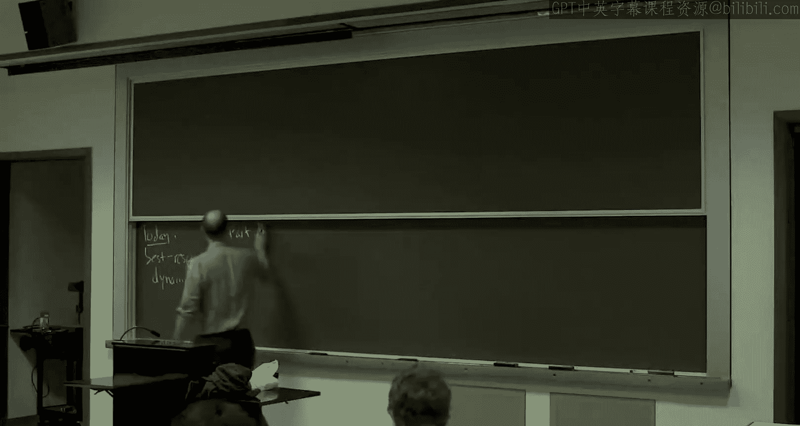

We will still talk a little bit about price of energyarch style guarantees for the end of lecture today。

 but we're really going to shift our focus now to the question。

 We've been talking about equilibria for seven weeks。 where did these equilibria come from。

 Do they grow on trees， How do players find them。

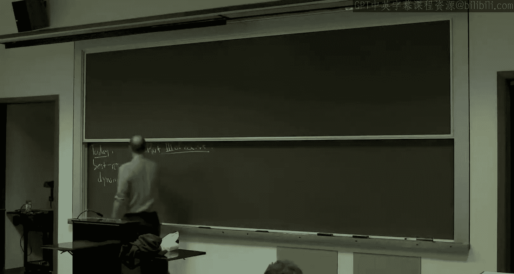

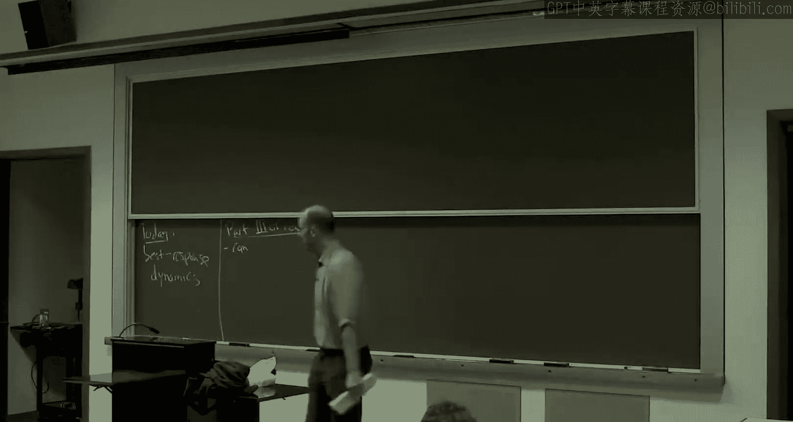

So can players reach an equilibrium。For starters， even just in principle。

 even just forgetting about know computation and how do they coordinate and so on。

 How would they find an equilibrium。 This has been studied a little bit in economics， but not。

 in my opinion enough。 But as computer scientists， we really want more than this。

Players should reach an equilibrium not just eventually， but in our lifetimes， quickly。

 polynomial time。 And this is something that really， unsurprisingly， maybe was。

 was not studied at all pretty much until you know， computer scientists took up the issue。And。

We'll see in the final in week 10 that there are actually some complexity theore barriers in general to computing equilibrium quickly。

 not just decentralized by players， but even by centralized computation。

 But in the happy cases where you can compute equilibrium quickly， at least in principle。

 Then the question is， how does this actually happen？

 So what are the learning algorithms or learning procedures by which players might plausibly reach an equilibrium in a game that they're trying to figure out how to play。

So why do we care about these kind of questions？You know， well， we've been， like I said。

Reasoning about all of these systems， auctions， networks and so on。

 We've been reasoning about their equilibrium。 essentially。

 we're sort of assuming that that's the operating point of these systems and drawing conclusions from it。

 So， you know， giving a constructive argument about why these systems are going to be at equilibrium that justifies all of this equilibrium analysis in particular。

 just as one example， the last couple of weeks we've been talking about efficiency properties at equilibrium。

 So this is going to justify the price of energy analysis we've been doing for the last couple of weeks。

But if you're reasoning about some other properties of equilibrium。

 maybe not their objective function value， but something else。 again。

 these questions are what justify focusing on just the equilibrium。Now。

 a reason about these questions， do players reach an equilibrium， If you think about it， we。

 we fundamentally need a model then for how players behave when they're not at an equilibrium。

 So so far， pretty much all we've assumed is that an equilibrium persists。 if players reach there。

 they'll stay there and sort of intuitively， if you're not at an equilibrium。 It shouldn't persist。

 Something else will happen。 So the question is， what else is gonna happen。

 And we need to pin that down to start making formal statements。

So when people talk about learning dynamics， this is really what they mean。

 They're sort of positing some way by which player behavior evolves over time。And so to be clear。

 our goal will not be so ambitious as to， you know。

 posit some model that seems to literally describe how people might actually learn in a game。

 Okay that's ambitious， kind of any specific model is going to probably seem not fully convincing。

 So rather， what we're gonna to strive for is simple and natural models that give us predictions to tell us about whether we'll have convergence or not。

 what things will converge to how quickly and so on。 And then ideally。

 we'd like to draw the same conclusions from multiple different learning processes。

 multiple different dynamics。 So if we can have different models thatll lead us to the same conclusion that lends plausibility and confidence to the conclusion that these models are predict。

So that's what we'll be looking at， simplistic learning dynamics that we can reason about with an eye toward hopefully kind of replicable results across different choices of the dynamics。

We'll talk about mostly two different styles of dynamics in this class。

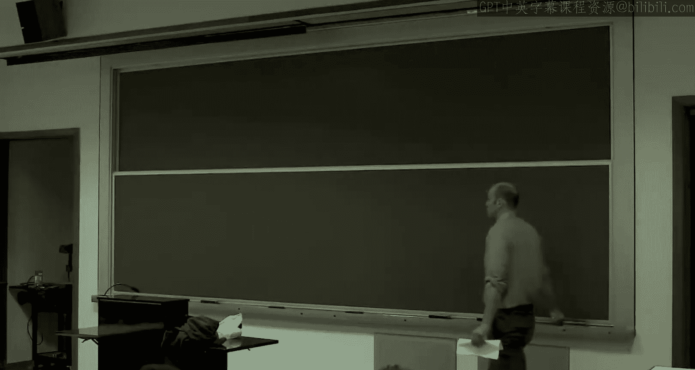

Today is going to be devoted to best response dynamics。

嗯。The idea is very simple。 This is just a process and iterative process by which players might strive for a pure strategy。

 national equilibrium。

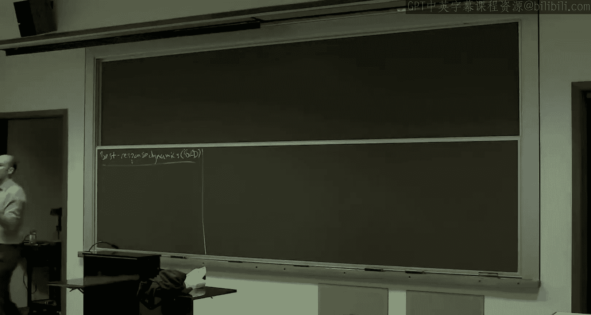

So at all times in this process， players will be playing pure strategies。

 the other dynamics we'll look at that will not be true， but for today all pure strategy。

So if you had now come， to here's our model of what players do out of equilibrium。

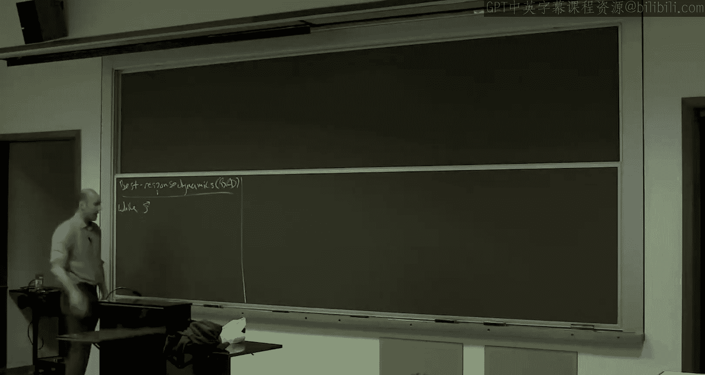

So while a outcome is not a pure strategy genetic equilibrium。

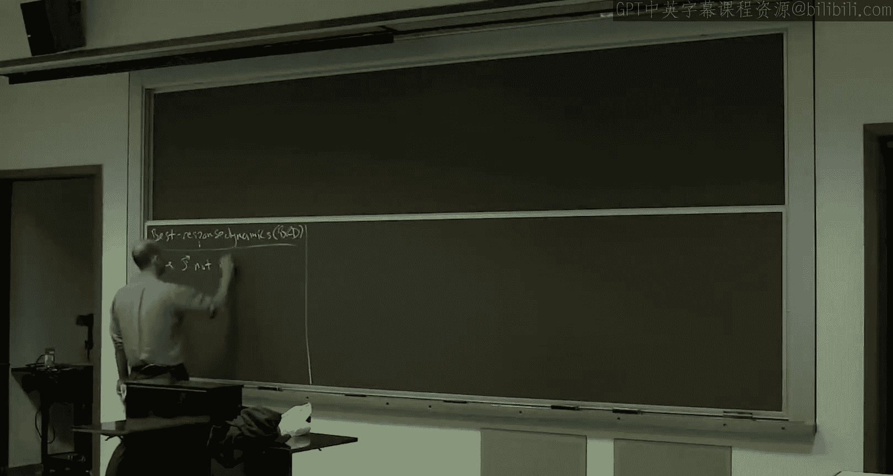

That means there's some player with a beneficial unilateral deviation。

So we pick one of them for now， it's arbitrary， and we just let them pick an beneficial deviation。

 Again， for now， arbitrary which one they choose。

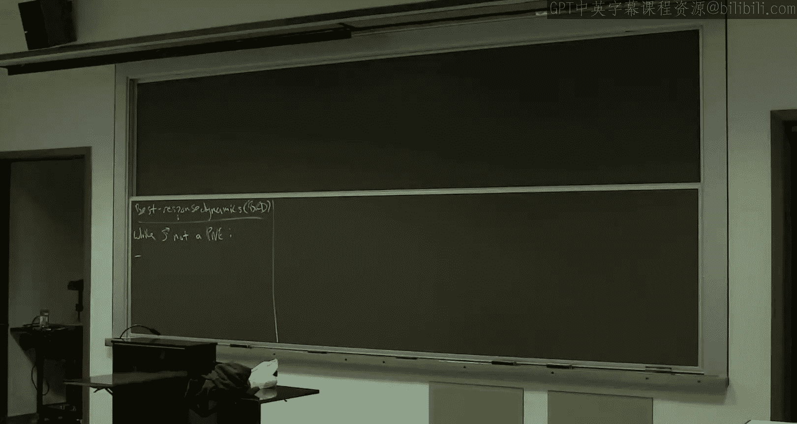

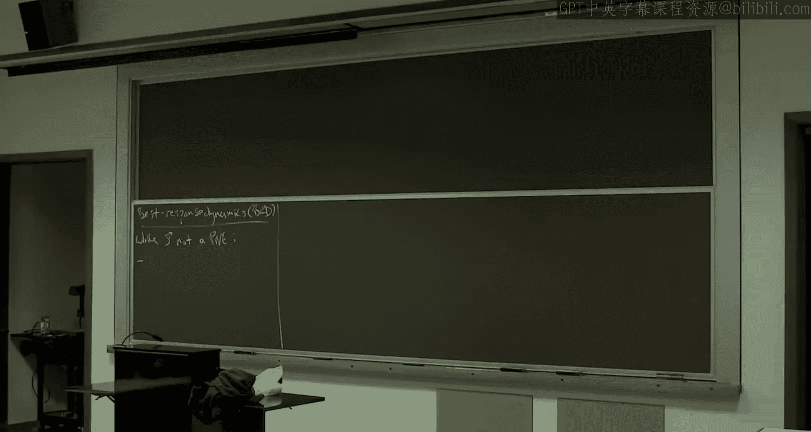

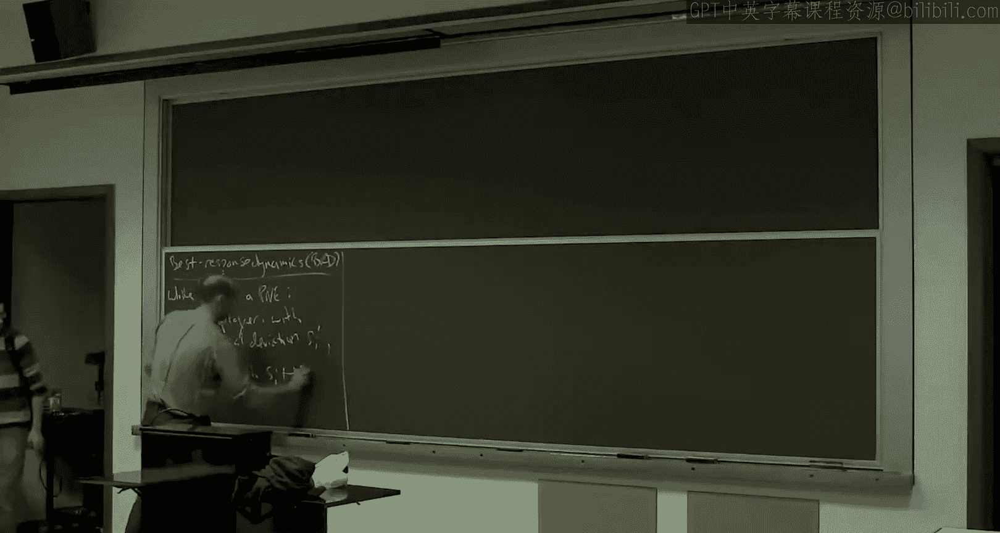

So before the player was playing its strategy S I， its cost decreases or its payoff increases If it switches to S I prime。

 and we just let it switch。 We keep S minus I fixed。So in each iteration。

 exactly one player will update their strategy， the other K minus1 players will stay fixed。

So this is underdetermined， right， I'm leaving which player you choose if there are many underdetermined。

 I'm also leaving which deviation， improving deviation you to choose， if any underdetermined。

 We'll specialize those only as needed through the lecture。

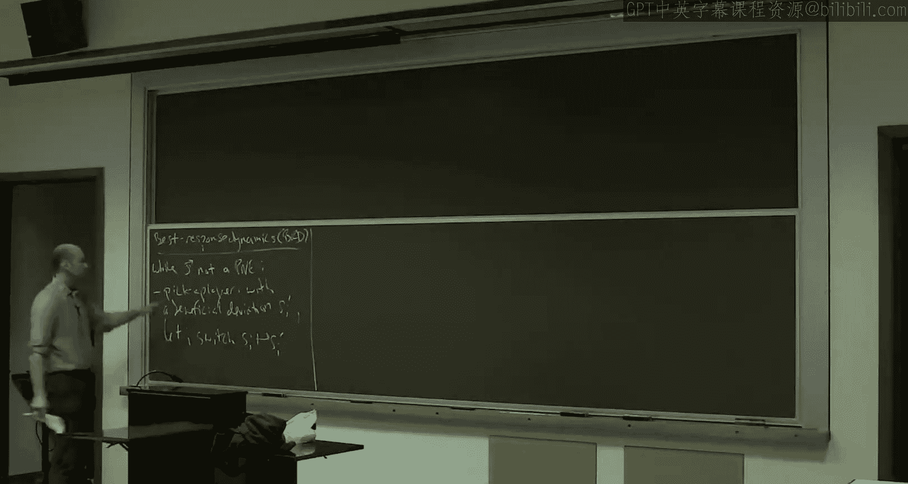

So if this process converges， if it halts。What kind of outcome is it going to halt at。

And we just look at the stopping criterion， right？So the only way this thing will halt is if it finds a purena equilibrium。

 and conversely， if it finds one， it will halt。So， note。If that's， of course， a big if。

Best response converges。It is。To a pure strategy， Nash equilibrium。

So the contrapoitive then says in a game with no pure natural equilibrium， of course。

 best response dynamics will not converge。 It will cycle。 As you'll see on the exercise said。

 best response dynamics might even converge in the presence of a pureac equilibrium。

 And just because there isn't one doesn't mean that the procedures automatically going to find it from an arbitrary starting point。

But where best response dynamics do really well is in potential games。

 which includes almost all of the applications we've been studying for the last few weeks。So recall。

A potential game， so we discussed。Potential functions。

 We used them a couple different times on Monday， and we introduced them last week to prove existence of pure equilibriumria and routing games originally。

So， in general。It's a game that admits a potential function。Which I've been calling fee。

With the property that attracts the deviations by all players simultaneously。

 So a meaning for all starting states， S。For all players Iye。For all deviations。

 beneficial or otherwise that I might take。The change in fee。

It's exactly equal to the change in cost incurred by that player， the deviating player。Okay。

So if player number 7 deviates from some outcome and its cost drops by 10。

 the potential function value also drops by precisely 10。Okay。We've seen a number of examples。

 So the first one was atomic， selfish routing games。 Then there were location games。

 Those were also potential game where the surplus was the potential function。 And just last lecture。

 we introduced network cost sharing games， which are also potential games okay with the Rosenthal potential。

So most of the examples from the last couple weeks fall into this class。

We've mentioned a couple of times that potential games always have pure strategy in N equilibrium。

 the outcome that's the global minimizer， the potential function fee has to be a N equilibrium。

 all deviations only make the potential bigger， so they only make the deviators bigger。

 that's a Nash equilibrium。But if you think about it， even more is true。

There's a rather more constructive proof that every potential game has a purena equilibrium， namely。

Pick any starting state you want。We pest response dynamics run。

It's going to stop and pace equilibriumbri。So this was really articulated by Manin Chapley。

So in a potential game， it should be finite， like the ones we've been talking about。

Best response dynamics。Converges。To a pure an ash equilibrium equilibrium。The proof is one line。

 what's the proof？Why does best response dynamics have to halt in a finite potential game。Yep。Can。

Right， that's the key point。 In every iteration， some player moves。

 They switch to a' a beneficial deviation。 So their cost drops。

 But the defining property of a potential function。If the cost drops， the potential drops。

 so you can't cycle。 It's strictly decreasing every time。 It's a finite game So you run out outcomes。

 It's gotta stop。Good。So， that's cool。So remember we were saying。You know。

 thinking about equilibrium， can players reach equilibrium。

 So this is basically a yes to the first question in principle。 Sure。

 they just follow best response dynamics。 If you're in a potential game， you will converge。

 How about the second question， How about quickly。So what can we say about the speed？Of。Convergence。

嗯。Well， it sort of depends how strongly we want to define what it means to converge。

 So we're going to talk about sort of three different notions of what it means to converge。

 The first one only briefly， The first one is the strongest。

 which is you get to a purena equilibrium。 It's of the obvious definition。

That's actually that need not be fast。 We'll understand that more why it has to be slow in the last week of the class。

 when we talk about the complexity of these problems。 So， you know。

 you could make some strong extra assumption。 So like if you assume that this potential function fee was integral。

 And if you assumed it was polynomly bounded。 then you'd be fine。 because then every iteration。

 if the potential drops， it has to drop by at least one because it's integral。

 it's polynomialally bounded and non negative， then you run out of potential in a polynomial number of iterations。

 And there are examples which satisfy those hypotheses。 But in general。

 if the potential function is not polynomly bounded。

 it can take an exponential number of iterations to reach a pure equilibrium。

 So that's all Im going to say about that strongest notion of convergence。

 but revisit revisit it in a couple of lectures。So the other two notions I'm going talk， you know。

 the rest of the lecture about。 So I'll talk about both of them at length。So。

So the next idea to the first of the two main approaches we'll discuss。Would be， okay。

 maybe we don't want to。 Maybe it's not important we get to an exact Nash equilibrium。

 As long as we're at almost a Nash equilibrium， that's good enough。So。Can we reach？

An approximate purestraginac equilibrium。And a polynomial。Number。A iterations。

And that would be a pretty good positive result if we could do that by an approximate purena equilibrium。

 we mentioned this briefly last week。 This just means that you might have a deviation that could decrease your cost。

 but not by very much。 Okay， so in this lecture will use the definition， an epsilon na equilibrium。

 you can only go down by， you can only get multiplied by one over one minus epsilon factor。

So you might want to think of epsilon as like 0。1， something like that。

 that I would say that any deviation， your cost is going to be at least 90% of what it is now。

 so that would be a 0。1 approximate purena equilibrium。Now， one reason， okay， so why so intuitively。

 it seems like being at an almost Nash equilibrium should be basically as good being in a N equilibrium。

 And I even asked you on exercise set to work out sort of a formalization of that idea。

 which is at least if you're in a smooth game， you just proved that epsilon pure N equilibrium have price of anarchy almost as good as exact pure N equilibrium。

 so if you care about the price of anarch。 It's a smooth game， like all of the examples we've seen。

 then you really don't care if it's an epsilon Nsh or a real Nsh。

 Okay So we'd be pretty happy with this result。😊，Good。So， Roso。Out of respect to the epsilon。

 I'm going to change the dynamics a little bit。In the obvious way。

And this is really the key to the speed up。 Okay， so I'm going to show you a positive result for Epsilon purena。

 which does not hold for exact national。 And the reason is that we can insist in best response dynamics on deviations that actually help the player。

 not just a tiny bit。O， doesn't just save you a penny but that helps you a lot。

 And we're only going to focus on deviations that offer a significant improvement。

So that's epsilon best response D。So while there exists a player。That can decrease its own cost。

By at least one minus epsilon factor。So again， if epsilon was 0。1。

 this would say if you can cut your cost to 90% of what it is now， then you're eligible。

So I'll call this an epsilon move。If it multiplies your cost by one minus epsilon or less。

So Wald is a player that has an epsilon move。Let one such player take an arbitrary such move。Okay。

Yeah。Yeah， right so can。So， let's say。With deviation。Such that new cost。

Is at most one minus epsilon old cost？So good。Thanks。So I'm still leaving underdetermined if。

 so if there are many players that have an epsilon move， you pick one of them arbitrarily。

 If the player has multiple epsilon moves， any one of them， I don't care。

 The thing you're not allowed to do is take improving moves that improve only a tiny bit。 Okay。

 and that's key to the speed up。Alright。So this thing。

And epsilon best response dynamics fits naturally with epsilon purena equilibrium because if this thing converges。

 the stopping criterion is nobody has an epsilon move。

 So nobody can multiply their cost by 1 minus epsilon or less by deviation。 Okay。

 so that's our definition of an approximate na equilibrium for today。😊，So if it converges。

 it converges to。An epsilon move。And if it's in a potential game。

 and that's all we'll be talking about today's potential games。 again。

 every one of these decreases the potential。 So there can't be an infinite number of these。 Okay。

 We're even hoping there's not。 We're even hoping there's only a polynomial number of these。

 but it's clear there's only a finite number of these。So it converges to an epsilon。

 whoops if you showed geneticastic equilibrium。In a potential game。So finite convergence is clear。

And what's interesting to think about and which we'll be talking about for the next hour or so is how fast。

Are there interesting conditions under which we can get a polynomial time guarantee on the number of iterations of epsilon best response dynamics before we converge necessarily to an approximate pureashsh equilibrium。

Any questions about the setup？So here's， we're gonna spend a lot of the lecture on the following theorem。

By Shennon Sinclair。2007。So what Chason clear do is they identify some conditions on a routing game that are sufficient for a polynomial time guarantee for Epsilon best response dynamics。

So they're not going to prove it for every single routing game。

 and it's not going to be true for every single routing game。

 but they identify a nice class where you can get this really quite strong result that you get convergence in polynomial time to one of these almost equilibriumlib。

So here's what they say。So consider an atomic selfishfishshire adding game。

It need not have a find cost functions。 but if you want to have that case in your mind。

 that's perfectly fine。So that。So let me tell you what the assumptions are。

So here's the big here's the biggest one。The biggest one is the assumption it's going to be a symmetric game。

 That is every player has exactly the same source and exactly the same sync。 So in particular。

 every player has exactly the same set of strategies。 gave the S T paths。Other than that。

 the network topology can be arbitrary， be an arbitrary network。 So that's good。So， here's。

Non trivial assumption， but it's less severe。We're going to call this the alpha bounded。

Junk condition。Sort of aipchitz condition on the cost functions。

Which just says when you add one new player to an edge。

 the cost doesn't totally blow up like crazy by most in alpha factor。So for all edges。

For all possible load amounts， X。The cost of an edge with one new player。

 Well so we're in the routing context， we're only talking about routing games。

 So these are non decreasing。 We're back in that world。So the cost only goes up。

And it goes up by it most in alpha factor。Okay。So that's the alpha Ba jump condition。

And most cost functions you care about are going to satisfy this with some。

 at least semi a reasonable value of alpha。 The one thing that it excludes。

 which you really do want to exclude for these kinds of results。

 is that you can't be 0 and then suddenly jump to something positive。Okay。

 so that would violate this for any finite alpha。 Okay。

 so you want to think about cost functions that are positive already with one player。

 But that's a reasonably weak assumption。Okay。So，3。As I've sort of discussed。

 we're only going be talking about epsilon best response dynamics， not best response dynamics。

 It's important that we disallow minuscule improvements to get the fast convergence around。And 4。

4 is not essential， but I just have to precisely specify some dynamics。

 There's a lot of choices I could make in this theorem would be true。 The choice I'm going to make。

 I'm only gonna to prove one version of the theorem。

Is the way I'm gonna pick a player in an iteration when there are many players that have an epsilon move。

 Again， remember， an epsilon best response dynamics。

 we identify the players that have an epsilon move， a way to improve their cost by a lot。

 And then over here， we just pick an arbitrary one to move for the proof I'm gonna to give you。

 I'm not gonna pick an arbitrary 1。 I'm going look at all the players that have an epsilon move and of them。

 I'm gonna pick the one who has the most to gain。 who in an absolute sense。

 its cost would drop the most。 So if one person has an epsilon move that drops 100 and a different one iss 200。

 I pick the one with 200。So it's an absolute drop， not relative drop， absolute drop。

So max gain dynamics。So a player。With the biggest。Absolute。Improvveement moves。And more。

 I ask that that player indeed chooses the strategy that realizes that maximum possible decrease。

 Okay， so the player with the biggest drop will pick its best response，right。All right。

 so so these are the assumptions。 So what do you get。But you get polytime convergence。 That's nice。

So then。Converges in。So it is polynomial time。 Well， it's linear in the number of players K。

It's linear in this lipstitz condition， alpha。It depends linearly on one over epsilon。 So epsilon。

 again， is like this 0。1。 That's how close to equilibrium we want to be。And then， it's logarithmic。

In the potential function value。So。This will become more clear as we do the proof。

 But routing games have a potential function。 Al write it back on the board。

 if you've forgotten the form， that's fine。 We have to， we have to seed best response dynamics。

 We have some starting point。 So S not is the place where you're going start the dynamics that has some potential function value。

 The potential has some minimum possible value。 That's the denominator。

So it's log in the ratio of this， which is polynomial only the input size。

So that's the guarantee you're going to get for selfish routing games， single source。

 single sync alphabe junk condition for the max game dynamics。So something which I want you to know。

 but it's far from obvious， is that if you relax the assumptions one through three。

 then this theorem becomes false。 so the first three assumptions are really important for polytime convergence。

 multiple sources， multiple sinks。 you don't have it。

 If you throw out the alpha bound jump condition， you don't have it。

 And if you don't disallow tiny improvements， you don't have it。Okay。

 so you really need one through three。 Well， you'll see in the proof。

 but the theorem is actually false without them。For a zillion variants still work。 Okay。

 so this conclusion is very robust to varying how you implement epsilon best response dynamics。

 And that's a good property。 Okay， because again， we don't really literally believe in any of these instantis of epsilon best response dynamics。

 So really looking for conclusions that hold for lots of different instantis。 And you get that here。

 Really， all they need is sort of a minimal， no starvation condition。 the exercise said。

 I'm going to ask you to kind of reprove the theorem for one variation。

 where instead of the biggest absolute gain you pick the player with that gets the biggest relative gain in each iteration。

So that's what we're going to prove。Is the statement clear。好。给 players。呃。0。No。

 that is only for every exit。 at least one。 Ponomials are fine， actually， right。

 So like imagine you go from 4 to 5。Right in you're squaring。from a million to a million in one。

 with that raise or cost by a lot。Well， but remember this's alpha times your original cost。

So no that was going to be like two per square。Or a two to the two or something， right？Alpha timess。

 let me think about this。Yeah， right， just do the expansion， right， Take x plus1 squared。

 x squared plus 2 x plus 1。 It used to be x squared。So you're fine。Yeah， so polynomels are fine here。

And we're not for those we don't care about 0 either because we only need it for x at least one。

 I the cost functions are essentially undefined 0。Other questions？Yeah。你す个。This。By don time。呃。

In the finite game。Yeah。Other questions。All right。So let me tell you the plan。

The plan is two les and then the proof of the theorem。

 but tell you's something more useful than that。So。Essentially。Alright。

 so what was the argument that we just converge in finite time？ Well。

 we know that the potential goes down。Okay， which precludes cycles。So the whole goal is to say。

 all right， well， with all these assumptions， and in particular with Epsil and best response dynamics。

 since we're only making significantly improving deviations。

 shouldnn't it be true that in every iteration， the potential goes down by a lot。Okay。

 so decrease is not just。By some positive amount， but significantly。And if it does。

 if we can prove that the potential goes down by a lot every single iteration to say， you know。

 by 1% of iteration。Then it just can't， we can't have that many iterations because we make so much progress in each iteration。

So how would we prove that the potential goes， and that is where we're improve and prove the potential goes down by a lot。

 every single iteration。So how would we do that？Well。

What we're sort of wishing were true is remember in epsilon best response dynamics。

 It means someone whoever deviates their cost goes down by a lot。

 So the good case is where we pick a player whose cost is huge。

RightSo if we pick a player whose cost was like half of the total cost and its cost went down by a lot。

 That would be a significant improvement。 Our concern is just that we wind up picking some player with tiny cost。

 therefore， its， itss high relative improvement。 Epsilon for it is too small。 Again。

 we get slow conversions。 So the technical meat this proof is just arguing that。

As we do Epsilon best response dynamics with the max gain and siation。

 we may not be picking the player with the biggest cost of the mall right now。

 but we'll pick a player whose cost is sort of sufficiently close to the average that every single iteration will give us a big drop in the potential。

Okay， so that's the plan。Alright。So。The two lemmas say the following。The first lemma， which is easy。

 is going to say at every iteration， there exists a player where if that player。

 if we picked that player to do an epsilon move， then wed bid get a big decrease。 Okay。

 so at least there's one player out there who would give us a big decrease in potential。

 Lemma2 will say， well， we may not pick that player。

 but the player we pick is almost as good with respect to convergence。All right， so Lema1。

 is our warm up？So in every outcome。Of this selfage routing game with common source and common destination。

There was always a player。Whose cost is large。So there's some player out there。

So what do we mean by large？Well， we're actually going to prove that it's at least a k fraction of the total cost。

 but what's more relevant for us is that it's a k fraction of the potential because the potential is what we're going to use to track our progress。

So fee。The potential function value of the current outcome over k。Okay。Now。

 what this lemonma tells us is that in a given iteration， there is a player out there。

 namely this player I， where if this player is the one chosen to make an epsilon move， we're stoked。

Okay， why？ well， its cost is at least a K fraction。 Don't worry about this K。

 So the cost of this player is proportional to the current potential。

If this person makes an epsilon move， its cost is going to drop by a lot by like 10%。

What's the definition of a potential function， It says whatever the drop in cost。

 the devitor experiences， that exact same amount， the potential drops。Okay。

 so if this person's cost drops by 10%， then the potential is also going to drop by a significant amount。

 Okay， so that's what this is saying。 There exists a player out there。 player I。

 whose cost is so big that if it made an epsilon movie。

 make big progress in decreasing the potential。 Now。

 this limit does not say that we pick this player I。 That's the problem。 That's why we need limit2。

 But first， let's just prove this。All right， so let's remember， actually， you know。

 this potential function is obviously playing a crucial role。 You've seen it a couple times。

 but it's the whole way that we're measuring progress。 So Let's just remember the form of it。

And actually， let's more specifically remember how it compares to the cost。Okay。So， the potential。

Roosendll's potential。For all these kind of games has this form？So F CB， as usual。

 is the number of players who are picking a path that contains edge E。And。

We evaluate the cost function at each value of I。 So if there's five players using an edge。

 we look at the cost function of that edge evaluated at  one at 2 at 3 at 4 and at 5。

So I'll draw you a picture that I've drawn for you once before。So on a given edge。

 you can think of the potential as just basically integrated。 the area under a curve。 Okay。

 So if this is sort of a cost function。Then。Here's your potential function value。Whereas。The cost。

In itself if you're outing game， it's just a sum over the edges rather than a sum over these FCB things。

The number of players using the edge times the cost each of those players experiences on the edge。

So that would be the bounding box。Of this curve。嗯。Recall in the routing context。

 we assume that cost functions are non decreasing。 Okay， so this curve is going up。 So indeed。

 the bounding box will subsume the area under the curve。All right， so what we have。Is。That okay。

 I just argued geometrically。The cost of any outcome in a selfish share outing game is lower bounded by the potential。

 This is the flip direction from Monday and Monday。

 because the cost functions were decreasing and that were cost sharing games。

 The potential only overestimated here only underestimates because cost functions are not decreasing。

So this is just the cost。OfS。And this is the potential function of S， okay。

So the upshot being recall。And we'll to use this a couple times today in routing games potential only underestimates cost。

And routing games， potential only underestimates cost。So now back to Le1。

 why is there a good player out there， a player with high cost relative to the current potential function value？

Well。So remember。The cost of an outcome is just the sum of the players' costs。

So the average player cost is just the total cost cost of S divided by K。

 That's the average cost of some player picked at random。

 So the player with the highest cost is at least that average。So this player eye。

Whose own personal cost is at least as high as the average cost。Which is lower bounded by。不健楚。

That's it。 That's the one。So really， Lema 1 is just recalling that the potential underestimates cost for routing games。

 That's really what Leno 1 is。一さ。Any thoughts？Okay。在。Okay， but how about for this proof。

 I don't add a million。 and I use this potential function。对生海的。Well， I mean， so if you like。

 one thing to notice is if I added any constant to this potential function， the inequality be false。

 So in some sense， this is the largest potential function that point wise lower bounds the cost。

 In that sense， it's the obvious one to use。 If you have this proof approach in mind。

Because notice that if there's exactly one player on an edge， then the two things coincideside。

So I can't raise the potential anymore。Okay， so limit 2 all right。

 So this tells us that if we are so lucky as to choose player I for an epsilon movement iteration。

 we're good to go。 you'll see the detailed calculations a little bit later。 Okay。

 but that player has high cost comparable to the potential value。

 So if we get a high decrease in its cost， we get a high decrease in the potential。 The problem is。

 is what if we pick some other player J。 Our criterion is not that we're picking the player with the highest cost。

 That's not how we define the Epsilon best response dynamics。

 We define it that we're picking the one with the biggest drop。😊。

 it was the most beneficial deviation available。 You'd expect that to be sort of correlated with who has the highest cost。

 but it need not actually be the player with the highest cost。 It turns out okay。

So Israel number 2 says。So， now。We're happily running uppson best response dynamics。

 And in some given iteration， some player I gets chosen。So in some outcome， S。

SI is going to be what player I was using before。And then when player I makes its epsilon move。

 that's going to be to the other strategy， S prime I。Then。For all players， Jay。The claim。

Is that if I look at the drop？Okay， so what this left hand side is。

This is how much playerized cost decreases when it switches to its old strategy to its new strategy。

 Okay， it's going down。 And remember， it's an epsilon move。

 So it's actually going down by a significant amount。

 So this is not going to be the limitma statement， but just sort of for comparison。This inequality。

This inequality is just the definition。Of it being an epsilon move。

So you shaved your cost by at least an epsilon fraction of what it used to be。 All right， So this is。

 this is not the statement。 Okay， this is just true for any epsilon move。

So what I want gonna to do here instead is I'm gonna write something in terms of the other players J。

 we already know this。 We know that the decrease is large with respect to I cost。 But again。

 the problem is that I might not be the player with the biggest cost。

 But what I'm going to say is that the decrease in I cost is even large relative to the cost of everybody else。

 in particular， the player with the largest cost overall。So instead of Epsilon C I S。

 which we just know。I'm going to write， at least。CJS。It's still an epsilon。

 but I're going to lose an alpha factor。Okay。So I changed the J to an sorry， I changed the I to a J。

 So it's some other player now。 and I weakened the statement。 Okay。

 I'm not claiming an epsilon fraction， claiming an epsilon over alpha fraction。

 Alpha remembers the bound to jump condition。 And that's at least one。 Okay。

 so this is a weaker statement。 but it applies to other players as well。Okay。So thislemma。

 the proof isn't that long。 But this is where the action is。

 This is the only place where you really use the single source single sync assumption。

 And this is the place where use the alpha bound to jump assumption。 Okay。

 so once we have this lelemma done， we'll be pretty much home free for the theorem。Okay。All right。

So proof。Fixed player J。So let me dispense with an easy case。 So remember。

 I is who actually gets chosen and Epsilon best response dynamics。 By definition。

 that means this player had the most to gain of everybody who had an Epsilon move。 Okay。

 that's how we're choosing the play。So now there's this other player that we want to say we're doing at least as well as with this relative improvement。

So， if J also。Had an epsilon move。Available to it。So if J had some strategy， S prime J。

 whereby it could have accomplished an epsilon decrease in its cost。 Well。

 then we can conclude that I was chosen instead of J， right， Both had epsilon moves。We picked a eye。

So I's absolute gain was bigger than Jays。Okay。So that means， actually。That we have this inequality。

 the one we're asserting even without the alpha。Okay。So imagine， okay。

 so think about an epsilon move。And if J has an epsilon move。

 then the following is true for some deviation S prime J。 If I just make all these eyes Js。

Then it has some move by which it would realize that left hand side。

 That's the definition of Epsilon move。 If I change all the eyes to Jays， O， because we chose I。

I is realizing an even higher drop in its cost。So in particular。

 it's at least the drop that J would have experienced had it taken its epsilon move。 Okay。

 so for a player J that actually had who is actually eligible to be chosen by Epsilon industrial Smartdynamics。

 the Lemma is a stronger version of Lemma is true if I hide the alpha。Okay， so that's the easy case。

So FG also had an epsilon move。Let's call this star。And Star holds。Since I。Chosen。Over J。And again。

 without the alpha even。So the work is just， you know， what if it turned out that Jay。

Had high cost and sort of no means by which to decrease it a lot。 Okay， and therefore。

 it wasn't eligible when we were picking our player to make an epsilon move。

So this is where we use the key hypotheses in the theorem。Soposed player J。Has no epsilon move。

And the current outcome， S。Yeah。So what does it mean that you don't have an epsilon move。

It means that。No matter which deviation you take。Your cost is not going to go down by very much。

 Your new cost is going to be at least one minus epsilon times your old cost。

 that's going to be true， no matter which deviation you try。

And I'm interested in that statement for a particular deviation that J could take。

And this is where I really use that there's one source and one sink。So I， player I。

The one that actually got chosen。So it had this， you know， awesome deviation available。

 It switched to S prime I， and its cost drops by a ton。😊，So the question I want to ask is， well。

 you know why， why， Why isn't this good for Jay。Okay， so I and J， these players have the same source。

 the same destination。 They have the same set of available strategies。

 So any deviation which I wants to take， it's an option。 It's a feasible option for player J as well。

 Okay， If they had different sources in syncs， this would be wrong just because I have a good path。

 you don't have a good path if you don't have my source and destination， okay。

But I can take Is deviation as prime I。 And as a thought experiment say， well。

 what would happen if Jay tried that himself。So that's what we're gonna do next。 So Jay， remember。

 has no epsilon move， nothing。Drives its cost below 1 epsilon times its current cost。 In particular。

 S prime I does not drive its cost below 1 epsilon times what it is right now。So since J。

Has no epsilon move。If it tries to copy。Play your eyes deviation， so take care here。S prime I。

 but S minus J。 Okay， S prime I is the deviation that player I actually takes in this iteration。

 As a thought experiment， player J is thinking about copying it。 Okay。

 with all the other K -1 players staying the same。Okay， so J is playing S prime I。

 The other players are doing what theyre doing in S。Because it has no epsilon move。

 this deviation in particular。Has costs bounded below。By Jay's cost right now。Question。Player aye。

I'm sorry。And。No， that's why it's S prime I and S minus J。 So in particular。

 I is one of the players in minus J。And is it the cost of Virginia bus？Thank you， It's Je Co of J。

Okay。On the other hand。Remember， S prime I is an excellentps improving move for I。 Okay。

 so this was our original hypothesis。So let me write that。This way。So， this is。Let's call this A。

Call this be。So now here's where I want to use the alpha bounded。

 So I've already used the one source， one sync hypothesis。 Okay， right。

 that hypothesis is just to say that this outcome makes sense。

This outcome wouldn't make sense without the one source， one sync hypothesis。

Let's use the bound to jump hypothesis。 So note。Consider the outcomes。Basically。

 consider this outcome and this outcome。Okay。So， K paths are being chosen。And these two outcomes。

 each this's K pass and one' K pass the other。How many paths are in common to both of those two outcomes。

Out of the K players。So forget about the paths being ascribed to particular players。

 Just look at sort of the set of paths that get chosen in each of those two outcomes。

 K got chosen and the first one， K got chosen the second one。

The intersection of those paths has Carinality， at least what？K minus-1。 That's right， okay。

S prime I is chosen in both by different players。By I in one case by J the other。

 But it's chosen once in both cases。 And S minus I and S minus J have K-2 players in common。 Okay。

 the players other than I and J， and they' are all just fixed。

So K 1 out of these K paths and these two outcomes are exactly the same。

The only difference is one gets moved to somewhere else。So if I think about the load of an edge。

 like， like， suppose there's some edge which is used by five players here。

What are the possible numbers of players that might be used by here？4，5 or 6。

 it's going be off by one at most because we only switched one path going between the two。

So the loads are almost identical in the two outcomes。

So now we're right in the wheelhouse of the bounded jump hypothesis。 right。

 We changed the load by one。 We changed the cost by most alpha。

 You can see where that assumption came from now。So by the bound to jump condition。So in particular。

 the way I want to do it is I want to say that in the outcome where J switches。Where J switches。

The costs are most an alpha factor， higher。Oh。So in both cases。

 I'm talking about the player that's actually taking the strategy S prime I。 Okay。

 so these are outcomes。 The loads are almost the same up to plus -1。On the left hand side。

 I'm thinking about J's cost because it's the player on that outcome that's actually choosing the strategy S prime I on the right hand side。

 I'm thinking about I's cost because it's the one who's actually choosing that exact same path as prime I。

So that's seat。So A comes from the fact that J has no epsilon improving move， in particular。

 S prime I is not one。 B comes from the fact that I had an epsilon improving move， namely S prime I。

 C comes from the bound to jump condition and the fact that these two thought experiments involve almost identical edge loads okay。

So now， how do we put these together or like， what can we derive。

So here's what I claim A B and C implies。A， B， and C implies。That。Well player I。

 the one that got chosen and Epsil on best response dynamicss。You know。

 maybe it wasn't the player with the highest cost， but its cost can't be that far off。

 It can't be much smaller than that in J。Okay， so the assertion。

 which is going to fall from A B and C when we stare at it long enough。

Is that J's cost in the original outcome， S is at most alpha times。

The chosen players I cost in the original outcome， S。Okay。So why is that true？

So we want an upper bound on J's cost in S， right？ So imagine we start from here， okay。

We start from the fact that we know that I has this epsilon proving move S prime I。 Okay And。

 the right hand side is at least the left hand side。

 And so the worst case for the proof is when these are equal。

 So even go ahead and think of this as an equal sign for the moment。

And so now imagine I change both the left hand side and the right hand side at the same time here I switch to J's cost。

 if it's the one instead using that deviation S prime I。

 And here I switch to J's cost and its original outcome。So if they start equal。What C says。

Is that the left hand side goes up potentially， but by it most in alpha factor。 Okay。

 So we start with two numbers that are equal。 Left hand side gets bigger。

 but by it most in alpha factor。And inequality， A asserts at the right hand side。

Let's see if you do have this right？Most an alpha factor， and that has to be bigger。Yes， yes， good。

So this goes up from its original value by most alpha。

 And this has to wind up smaller than whatever this became。 Okay So I started with two numbers。

 They're both 100。 maybe alphas 5。 Then that says this is the most 500。

 which means this side being less than this has to have gone up by most alpha and most 5。 Okay。

 so if this is 100 That's the almost 500。 That's the almost 500。

 The factor difference are most alpha。So that's the way to think about。

 Think about this starting equal。 We have a upper bound on how much this side could go up。

 and this has to be the bigger side。 So that same upper bound on how much this goes up。 U bound。

 how much this side could go up。So that's why A， B and C implies that while the chosen player eyes cost may not be the biggest。

It's off by only an alpha factor。Okay。So now we just put this together with B。And we get that。

So because this was an epsilon move for I。We know this was at least。An epsilon。

 the decrease was at least an epsilon fraction of I's original cost。

 J could have had cost and alpha factor。 So if we want to actually have a bound in terms of J's cost。

Then we have to lose the alpha。And that was。Asked Clinton。Okay。And again。

 all of this work and where the alpha comes from just says， you know。

 if we had a coincidence between the chosen player I gave the one with the max gain Epsilon proving move and。

The player with the biggest cost of everybody， we'd be good to go。 and we wouldn't be the alpha。

 And the problem is is those two criteria can choose different players。

 There might be one player I who gets picked because it has the max gain。

 a different player J with a max cost。 but there can only be a difference of alpha between their costs。

 So that was the point。Alright， sore almost home free。

 Question are ready for the proof of the theorem。Should remind you what the theorem is。

So we're trying to prove that this epsilon best response dynamics converges in at most dis many iterations。

 linear in the number of players， the the jump bound alpha。

 one of Repsilon Repsilon is the approximation and logarithm of the potential ratio， okay。

So this will follow quickly from Lemmas 1 and 2。Yeah。And remember the plan all along。

Was to argue that every single iteration of epsilon best response dynamics decreases the potential by a lot。

 As long as that's true， it's sort of clear， it just can't happen them many iterations。

So let's see why that really is true。So an iteration。Where some player eye moves。So again。

 say from I。To its epsilon improving move， S prime I。So remember。

 we're tracking our progress via how rapidly the potential function decreases。

 So let's bound from below how quickly it's going to decrease in this iteration。Well。

 what's the whole points of a potential function。 The whole point is that it tracks the change in the cost of the deviating player。

 So by definition， because this is a potential function。When player I deviates from S。To S prime。

The change in the potential is exactly polarize drop in cost。

 That's what it means to be a potential function。Now， what do we know about this。Well， like。

 we knew from the get go just by being an epson improving move， that we had this statement。

With an eye。 that's what it means to be an excellentps improving move。

 But we did all this work in limit， Too to kind of say， well， figure out eyes cost。

Show me your favorite player J， or even decreasing by an epsilon over alpha fraction of that player J's cost。

So I'm going to use limit2 to lower bounds。How much player eyes cost goes down。Bye。

Epsilon over alphapha。And because this holds for every single player J。

 I may as well take the largest of all of those lower bounds。Yeah。So this is Lema2 right here。

Do I still have101？No， okay。Lemma 1， that was the easy Lemma。

 That was really just because the potential underestimates the cost。 So Lemma1 just said， look。

 there's some player out there whose current cost is at least a k fraction of the overall just by averaging。

 and that's going to be lower bounded furthermore by the a k fraction of the potential。

So we're going to use little1 now。To say that there exists a player with whose cost is big。Okay。

 so notice we're taking the largest cost over any player。 And so， again。

 this is at least a case fraction of the average cost。

 which is at least a ca fraction of the potential。去。对。So that's number one。So this is great。

 What this says is that every single iteration that we run epsilon best response dynamics。

 we're getting a relative decrease in the current potential function value。😊，Okay。So in particular。

 let's think about， you know， after L iterations， epsil best response dynamics。

So every time we do an iteration， we hammer the potential function value by a factor。

1 minus epsilon over alpha K okay。So。So fee current， let's say。Well， we started with some initial。

Outcome as' not。Every iteration。We get epsilon1 minus epsilon over alpha K factor multiplied by it。

And that just keeps happening over and over again。So every iteration its multiplied by 1 minus epsilon。

Over alpha to decay K。Okay。So one way to think about this， right， So this means that every L， sorry。

 every K alpha over epsilon iterations， it gets knocked down by a constant factor。 something like2。

So， if we just。Add a log of the ratio between the initial potential function value and the smallest potential value you could ever see。

 It's got a halt。So the fact that it's decreasing so rapidly。Means that it halts。Within L。

K alpha over epsilon。And so every this many iterations， it gets。Divided by a constant factor。

And so that can only happen。Log of the ratio。Of the initial value and the smallest possible final value。

And that's the proof。Questions。So this is great。 Okay， this really kind of says， you know。

 whatever it was you cared about Eria， it's meaningful So whether it was the price of anarchy。

 or it was some other property of equilibrium or really， know， Epsilon approximate equilibriumria。

 then it makes sense in these models， selfish out in games， one source。

 one sink bounded junk conditions。 Okay if you believe in the best response dynamic story，😊，Alright。

 so that's the more ambitious goal is to really prove that dynamics make it all the way to an equilibrium or almost all the way to an equilibrium。

And because that's an ambitious goal， we needed some nontrial hypotheses。 Okay like I said。

 this theem was false。 For example， even if you just look at multiple sources or multiple destinations。

 So there's lots of models where we've studied and proven good bounds in the price of anarchy of pure equilibriumlib。

 say。That this theorem doesn't cover。 And where， in fact， this theorem is just false。

So what I want to do now is weaken the goal， but we'll be able to get much greater reach。

 We'll be able to cover essentially all models that we've discussed so far in the course。

So for this weaker goal， I'm going to assume that the reason you care about equiria is because you care about the objective function value of your system。

Okay， so in other words， I'm gonna make the assumption that you don't care about being at equilibrium per se。

And you'd be happy with a guarantee that just says， well， you know。

 players may might not be at equilibrium， but wherever they are right now。The cost。

 So the performance of the system is as good as if。They were at an equilibrium。Okay。

 so that's a weaker statement than saying you're adding equilibrium approximate equilibrium just saying the cost is as small as if。

You were at an equilibrium。 And that turns out to hold much more generally。

 That turns out to hold basically for all smooth games in the sense we talked about last week that have a potential function。

 And all of the games we've talked about thus far meet both of those hypotheses。So second approach。

So we're going to approve now。That you reach a low cost outcome。In poly number of iterations。

And again， by no cost， low cost， I mean， as low as if you were actually at an equilibrium。

 You may not be at one， but the cost is just as small as if you were。And again。

 the two hypotheses will be smoothness， as we define last week and having a potential。Okay。

 so here's the formal statement。So this is the third application of the smoothest condition we've talked about after co quality and approximate pureash equilibrium。

So consider a land a mu smooth game。 And again， go ahead and think about if you want selfish routing with aine cost functions where lambmbda is five third and mu is one third。

 But it's a more general statement。So consider a smooth cost minimization game。

With a potential function。F。That， like in the routing example， underestimates the cost。你看。

So if you like， think of this， you know， as a special case。

 just think about the routing names we were just talking about。

 but with multiple sources and destinations allowed。

 That would be one case where this theorem is going to behold and the convergence theorem will not hold。

So， again， we're going consider a sequence generated by。Best response dynamics。

It's an arbitrarily long sequence。It's going to be almost the same。Dynamics is before。 So again。

 we're， we're gonna to use the maximum gain rule， But again， it doesn't really matter much。

 So amongst all the players and looking at their beneficial deviations， you just pick the payer。

 the deviation who realizes the biggest cost drop。 It's actually no longer important that we only use epsilon improving moves。

 Youre use whatever moves you want for this theorem。 But again。

 the way we break ties amongst players who have a beneficial deviation。

 You pick the one with the best deviation。As usual， S star is going to be the minimum cost outcome。

And the claim is。For all。But it's basically the same。Bound here， except there's no alpha。

 because we're not actually making the alpha bound to jump assumption。

 So linear and K in what of wraps an epsilon and the ratio and potential values。So for all。

 but this many states or time steps， if you like。It will be the case that。

The cost of the outcome is as small as if you were at a national equilibrium。Okay。So cost。

Of an outcome and the teeth time step。Is it most lambda。Over  one minus mu。What's gamma。Times， okay。

Let me make this gamma， actually。Is the most land over 1 minus me plus gamma times cost of optimal。

Okay， and what I want you to remember is this a lambda over 1 minus mu。

 So when we're talking about exact equilibrium， this was the bound we were getting。 Okay。

 so like when lambda was five third and mu was one third， we were getting a 2。5， This is a 2。5。

 So the interpretation here， you know， you can forget about the formula。

 It's just saying you're as good as if you're at a national equilibrium up to this gamma error factor。

 which you can think of again， gamma， think of as 。1 or 001。😊，Small as you like。

So this is not arguing convergence。 This is just saying that， you know。

 if you take the number of time steps long enough， significantly better than this number。

 then at almost all time steps， your cost will be as good as an ash equilibrium。 Okay。

 so there's some number of days on which no promises。 cost might be big。But outside of this。

 linear number of days。The cost is always going to be small。Okay。Did makes sense。

Let me show you the proof。This proof is easier。So just to remind you briefly what smoothness is。

That's this disentanggling。Condition kind of says if you give me a mixed up version of two outcomes。

 S and S star。I can bound it above by a linear combination of the costs of the two outcomes。

 And lambda and mu are the coefficients in that linear combination， okay。So。So proof。

 so consider a bad state。 So here's the plan。When were doing our convergence result and looking at epsilon best response dynamics。

 our plan was to say that every single iteration， the potential dropped by a lot。

 We're not going to make that statement now。 There might be iterations where it doesn't drop by a lot。

 But we're going say that whenever you're in a bad state。

 one that has high cost cost higher than what you have at equilibrium。

 every bad state immediately leads to a big drop in the potential。So therefore。

 because youd only have so many big drops in the potential， you can only have so many bad states。

 So that's the goal。 If you ever violate this bound on the cost， this guarantee。

 then you immediately get a big drop in the potential。That's going to be the proof。So。

Call a given state S T bad。If the condition fails， meaning。Cost of S T， greater than。

Land over 1 minus mu plus gamma。Times cost the best star。对。

And so we're gonna prove is that the only way that the cost can exceed that of national equilibriumria is for some player to have a massive incentive to update strategy。

 So you only have really bad cost when you can have a massive drop in the potential。

 which basically means there's some player out there that can have a big cost drop in its cost。

So here's the derivation that shows that。So at the beginning。

 we're really just going to copy the exact same proof we use。

 but we introduce smoothness as an upper bound technique for the price of anarchy。

So let me just write out the same derivation。The cost of， so， again， in our mind， originally， we had。

 we were thinking of S as an equilibrium， But now S is an arbitrary outcome。

So the assumption in constantization games is that we have an upper bound in terms of the number of players。

And so now， remember， smoothness involves this entangled version of two outcomes。

 So I need to apply the hypothesis。 I need to think about mixing up S And S star。

 as star is the optimal solution。So I'm going to write this。

 which is going to be true just by a definition。Okay。

So I'm going to think about walking up to player I。Enforcing it to deviate。

 forcing it to deviate to what I wish it was doing on the optimal solution as star I。Now。

 by virtue of S being not necessarily a national equilibrium， but any outcome。

 if I force it to deviate， its cost might go up， it might go down。

So I'm just going to define Dlta to be the change in its cost when I make it switch to S star I。

So by definition， we're going to have。So again， this is making as a thought experiment。

 player I switching to its strategy in the optimal solution。

 So now let me just write plus Delta I of S。Where I just define this to make the equality whole。Okay。

 so this is just equal to。The costs drop when it switches。Okay。

 so this is how much I's cost drops when it switches to S star I could be positive， negative or 0。

 if it were a Nsh equilibrium， this would definitely be non positive。

 you definitely wouldn't get better。 Okay， but in general， this could be anything。

 so that's just by notation。And again， why did I do this。

 I did this Because sum of these terms is exactly what the smoothest hypothesis applies to it。

 So I can upper bound this by the linear combination of as stars cost and S is cost。So by smoothness。

Lambda times cost of a star。Plus， mu times cost of S。

And then I've got these Delta terms hanging around。

So the way to think about what I just did is I just sort of copied the lamb over 1 minus mu priceive anarchy proof。

 But allowing for an error term。 These deltas are an error term。 Okay， So if this term wasn't there。

We'd be done。 we would just， as usual， subtract the mu term from both sides and divide。

 We get our bound of lamb over 1 minus mu。 So this just says we're getting that bound up to this error term。

 Moreover， this error term has a nice meaning。 Okay， This error term is just how much players。

 how much their cost would drop if they actually deviate it。

 so this is somehow saying the error in the price of anarchy bound is exactly。

The the cost you'd realize by switching to optimal strategies。 In other words。

 the only way your cost can be big for is for some player to have a strategy by which it can decrease its cost a lot。

 And that's the whole point here。So。Rearranging。This is what we get。Plus1 minus mu times the sum。

Of the Dltas。Such just rearranging that top inequality。Now， suppose S star is bad。Ning。

We're at one of those。Days T， so that the cost in the game of this day， T does not。

Conform to our guarantee。 Okay， it is not almost as good as an actually equilibrium。

 The cost is higher The land over on minusM plus gamma times the optimal cost。

What this says is the only way that can happen。 Okay， the only way your cost and an outcome。

Can be bigger。The land over1 minus mu plus gamma times cost the optimal solution is if。

This final term。Is at least this gamma times this cost。So this must be。At least， epsilon。

Times cost of a star。If。S T is bad。Okay。Again， the only way that your cost can be high is because players can realize a massive drop in their cost by a suitable deviation。

Well， in a bad state， if the sum of the deltas， the sum of these deviations is at least epsilon times cost as star。

 there exist a player whose deviation is at least the average。 So that loses the factor K。

So there exists I。With Delta I S。At least epsilon over K。Times the cost of S star。Actually。

 let me remind you what Delta ISK is。So with。The cost drop。Okay。Now。

 what are our dynamics amongst all the players with a with a beneficial deviation。

 We picked the one that realizes the biggest deviation。 I've just argued that in a bad state。

 there is a player out there。Who if it deviates。To its best strategy， heck。

 even if it deviates just the S star I strategy in its optimal in the optimal outcome。

 even that deviation will realize this massive drop in cost。 Epsilon over K times the optimal cost。

So surely， that means when we pick the best player and its best at deviation。

 its cost will drop by at least that amount。So， next move。

A move following a state in which this guarantee is violated。Oh I should say this is also。

We want to write in terms of the potential function because again。

 we're going to track progress in terms of the potential function。This is lower bounded。

By the potential。The optimal solution。对。So next move decreases potential。By least， sorry。

 my epsilons became Gunaanas。Wops times feet。Im speed。So。Let me just wrap up。

So you get this factor decrease。After L iterations。RightSo again， every time we have a bad state。

 we multiply the current potential value by this one minus gamma over k factor and the other iterations。

 the potential is only going down。 So again， every time we have k over gamma， bad states。

 the potential drops by a constant factor at least。

 and that can only happen a log of the ratio potentials number of times。在问。嗯。M responses statement。

Well， but it's not true。 the cost is decreasing。 That's exactly the point， right， So consider。

 consider an iteration in which。There is no you know， in which your cost is good， right。

 supposeupp you're not at a na equilibrium。But the cost is actually good。

 and now you take some player and it updates its cost。 It updates its strategy。 Certainly。

 its cost drops。Right， but in general， when some player changes its path。

 it might get worse at the expense of others。 So you have monoity and the potential function fee。

 which you do not have in the cost。Okay。So we're really using two things。

 We're using that in every bad state， we get a massive drop in the potential and in every other state。

 we get at least some drop in the potential。 So we can't undo the drop in the in the intervening iterations。

So we get a。We multiply by one minus gamma over K， every bad states。 So every K over gamma。

 bad states， We drop the potential by a constant factor。 And again。

 it's only going down over all the iterations。 So how many bad states can we have。K over gamma。

Times log of the ratio。And again， so what's the point， The point is we weaken the hypothesis。

 We did not insist on converging to an approximate ash equilibrium。 And in general， we're not。Okay。

 so we might be in say， a selfish round again with multiple sources and multiple destinations。

 And it is not true that after so few iterations will be to approximate as equilibrium。

 What the last term in this class， the point is， if you only cared about being at an equilibrium equilibrium so that the objective function value would be in near optimal。

Well， and actually， if you just focus on Na rather than conversion to equilibriumria。

 you can get much wider reach。 Okay， So actually， any smooth potential game you do just as well。

 it's as if you had converged to equilibrium。 Okay， so sorry for going over。 I'll stop there。

 See you next week。😊。