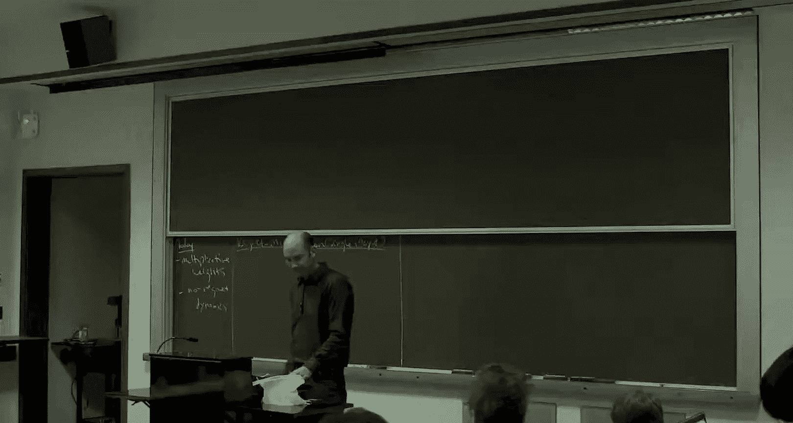
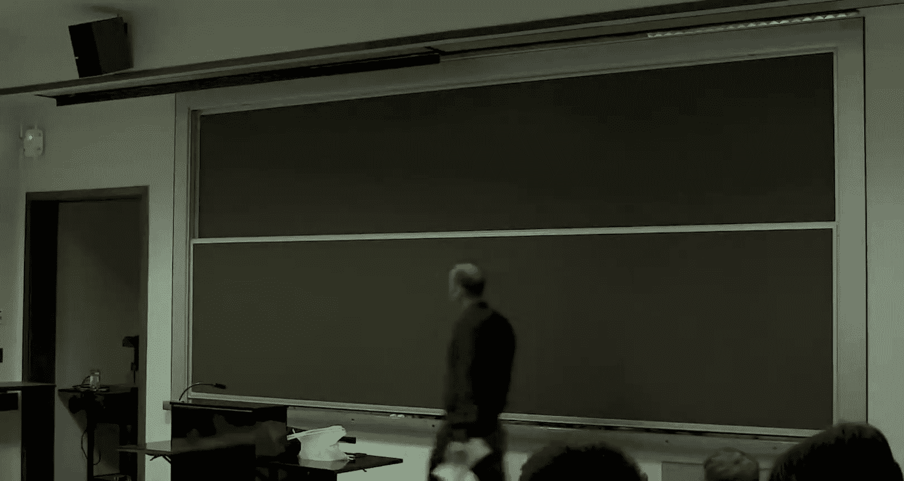
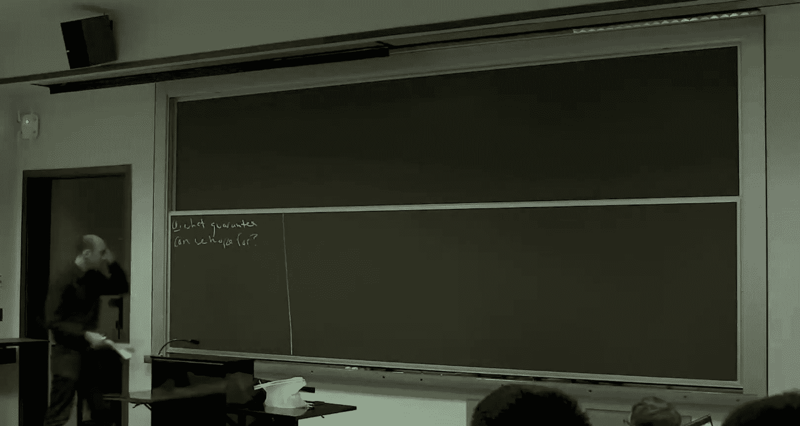

# 斯坦福大学《算法博弈论｜Stanford Algorithmic Game Theory CS364A, Fall 2013》中英字幕（deepseek） p17 -17-17_ No-Regret Dynamics).zh_en -BV1VmC2YzEXJ_p17-

Something going to remind you where we are in the course of topic we started on Wednesday。

 we started asking the question do players actually reach equilibrium in games we've been spending all this time assuming that systems are an equilibrium and when and how can that be justified and not only can they reach an equilibrium in principle but can they do so quickly and again the reason we're doing that is to justify equilibrium analysis so one special case of that。

 know when you care about the objective function value。

 that's a price of anarchy analysis of course there's other reasons you might care you might focus on equilibrium as well so on Wednesday what we did is we talked about one very important types of dynamics。

 best response dynamics that's where players take turns going one at a time while you're not at a pure Nash equilibrium a player updates to its best response given what the other came out as when players are currently doing so best response dynamics make a lot of sense and potential games that was the focus on Wednesday with a guaranteed to converge eventually to pure Nash equilibrium and we studied when do they converge quickly and when you converge to outcomes that are almost as good as Nash equilibrium。

And so today the plan is to discuss a second equally important type of learning dynamics called No regret dynamics so these dynamics also make very good sense beyond potential games。

 potential games cover a lot of the applications that we care about but not all of them so no regret dynamics have very broad sweep and we'll also see that a bonuses that converge to an approximate equilibrium very quickly now it's not going to be a Nash equilibrium it'll be something else we mentioned in passing and we'll talk about again today called course correlated equilibrium so those are some of the reasons to care about no regret dynamics。

Now the sort of foundations of regret minimization happen first just in a single player context and so the bulk of the lecture we're just going to be thinking about there's one player trying to make decisions playing against an adversary or' playing against nature so at the end of the lecture I'll tie in all of this single player discussion to the meaning in games where you have lots of players playing against each other okay。

 but for the next 45 minutes plus we're just going to focus on a single player。So here's the setup。

So there's a set of actions。And for this entire lecture， N will denote the number of actions。

 And these are always the same。Over time。Even the binary case is interesting。

 so at times in the lecture， if you like， think about there even just being two actions。

And so then this player will have to make decisions， meaning pick an action from a over time。

So there's going to be a time horizon capital T in this lecture we're going to think of capital T as known to the player on the exercise set。

 I'll ask you to extend the guarantees today to where the time horizon is unknown as well。

 but for today think of capital T is known。And here's what happens at each time step。

So you have to pick an action a strategy。 You are allowed to randomize。 And as we' see。

 it's essential that you randomize。 So at each time step， you pick a mixed distribution。Yeah。Say PT。

Over the actions A。And then， an adversary。Having seen the distribution that you've chosen now picks a cost vector。

Which indicates for each action that you might have chosen or that you might choose randomly what costs you'll incur for that action。

 Okay and we're going to assume that the costs are bounded in particular for today。

 we be always assuming that the costs are real numbers between0 and one。

 So if you want to think about a routing game or something like that。

 imagine we've scaled all of the payoffs。 Ex me all of the costs so that they lie between0 and one。T。

So， then。And action is chosen at random。From the mixed strategy that you committed to。

And then your cost is as promised， just the。Part of the cost vector corresponding to the action you end up picking。

So the freedom， of course， is how do you choose the mixed strategy PT at each time step？

How do you even reason about what a good strategy might be？

Now right so what are some examples So you know you can imagine these actions being sort of different investment strategies。

 maybe even in the binary case for a single stock， it could be to buy or sell a stock and the cost indicates how much you win or lose。

 depending on which action that you chose， you know if you want。

 you can imagine these actions is being routes from home to work and these are different sort of ways you might drive to work in the morning and the cost indicate the delays during rush hour traffic that particular morning Eventually when we go back to the multiplayer case with games。

The action said it's just going to be the strategy set of a single player and this cost vector is going to be induced by the strategies S minus I chosen by the other K minus1 players so eventually that's how we'll instantiate this in the game setting right。

So， you know， the first time you see this， I think you might rightfully think， wellow。

 this is a game。 It seems a little unfair。Seems a little stacked against us， right。

 So we've got to go first。 which is kind of annoying。

 right So we go first and the aversary goes second and can penalize the strategies we're likely to take。

So we need to understand it， what can we even hope to try to accomplish in this regret minimization setting。

Question。W why the advers are imagesists。

So we'll get to it。So what can we hope to prove？

So。3 observations that govern the best case scenario for what we might be able to accomplish。

So the first observation is that what's not realistic as a comparison is the best sequence of actions we could have taken in hindsight。

 or if you like the best sequence of actions， meaning minimum cost sequence of actions。

 we could have taken had we known all of the cost of vectors in advance。

So I'll let you think about while I write on the board， think a little bit about。

 if we wanted to prove a statement that says we have an algorithm that does almost as well as if we knew all the CTs up front。

 why does that seem hard to pull off？So that is。some overall time steps。Oops。On each time step。

 we look at the minimum。Over the options。Of the costs。

So I claim this is way too strong a benchmark to measure the performance of our algorithms， which。

 of course， do not know the future。 Do not know the cost vector now or later when it has to make a decision。

So it seems like anyone have a sort of simple suggestion of why this would be hard to do or impossible to do。

So if there's only like two actions。Yeah， I mean， isn't part of it that the adversaries like the cost is dependent。

Sure， so concretely。So what I'm looking for is like how could the adversary make this really small and yet every algorithm could be very big。

 have very big costs。I mean， so the example where all the costs are won all the time is actually an easy example in a sense。

 because there's nothing you can do。 everything is equally well。 So I mean。

 if the input is a bad input， you'll never regret any decisions， right all decisions were bad。

 So what you worried about with an algorithm is that there was some awesome way to make decisions and you totally missed it。

 you blew it。And so if this is our benchmark， then there will be examples where that's the case。

 no matter how smart you are in crafting your algorithm。

 you can be very far away from the best action sequence in hindsight。

So imagine there are even just two actions okay on every day。

 so you have two ways of going from home to work and every day there's going to be a traffic jam on one of them and not the other。

 Okay， so one will have cost zero and one will have cost one。And the rub， of course。

 is you have no idea which is which。And you can imagine that the adversary even just flips a coin。

So every day the adversary flips in if it's heads， the top route has a traffic jam and house cu costs one。

 if it's heads， then the bottom route costs one， and the other route is always zero。Okay。

So any sequence of cost vector generated in this way always has a0 on every day。

 So this is going to be0 at everyday T。 Okay， There was always an action in hindsight with cause 0。

 right。But as an algorithm designer， there's nothing you can do right So you have to make a decision。

 The cost vector is equally likely to be 1，0 or 0，1。 So actually， no matter what decision you make。

 your expected cost will be one half every day。 So your cost overall T days in expectation will be T over 2。

 But in hindsight， there was something with cause 0。So the reason。Is it the adversary。

Can enforce simultaneously。This very strong notion of opt 0。But your cost。As at least t over two。O。

And we want to do a lot better than that。 so that' we're not going to be satisfied with being T over two away from some benchmark。

So。Here's， heres really， a really important。The most important definition of the lecture。

Which is that of regret。 It's a kind of regret called external regret。

And the idea is basically to exchange this sum and this minimum。

So rather than comparing to the optimal action sequence in hindsight。

 which can optimize separately for each day T， we're going to compare ourselves to the performance of the best fixed action。

So someone who has knowledge of all of the cost vectors。

 but plays exactly the same action day after day。对。So we're going to look at the time average。

 although that's not especially important。And we say， well， let's look at how well an algorithm does。

So this is your cost。And then with the benefit of hindsight。

So I notice it's the mins on the outside now。Let's ask， how well could we do。With a fixed strategy。

Okay。So this quantity is called the regret。Of an algorithm。On a given sequence of cost vectors。

 Okay so the adversary generates the CTts。 Their algorithm generates the actions， the A Ts。

And this difference， the extent to which your cost is higher。

Then the best fixed action is called the regret。This is the only whenever I say regret in lecture。

 this is what I'll mean。 Let me just mention a couple of modifiers。

So there various notions of regret。 We'll look at a different one on on Wednesday。 This。

 This version is called external regret。And obviously I'm time averaging。

And I'll do that throughout the lecture。You could also speak about the cumulative regret if you wanted by hiding the normalization factor。

 but it wouldn't make a big difference。So rather than comparing to this overly strong benchmark。

 we're going to compare the goal is going to be to get the regret as low as possible， idealally。

 very close to 0。Now， you might ask， you know， why is this a good thing to do。

 Why is this a good definition， a good benchmark， There's a few reasons。 First of all， it's just。

 it's sort of， you know， the sweet spot where it's tractable。 Okay。

 I'll give you an algorithm that achieves very low regret gr today。But secondly。

 it's really nontrivial and we'll go through a couple more lower bounds governing what we could hope for。

 and we'll see that there's a sense in which you can't do much better than getting close to this benchmark okay so it's the right benchmark for giving you algorithms to make smart decisions in the face of an unknown future okay。

Yeah， question。Action。有居民的。Disimity action or like a fixed disagree。So in this minimizer。

 without loss， you can focus on a pure action by linearity。So you could make it mixed strategies。

 but it wouldn't change the definition。All right。So this is the benchmark。Second thing is。

In our algorithm。Even for this weaker benchmark， we're going to need to be randomized。

So deterministic algorithms。By which I mean。Choosing the distribution PT T to put all of its mass on a single action。

 that's not going to work。At it's not going to work as well as we'd like。In fact。

 it's deterministic algorithms that really kind of expose how harsh this model is to the algorithm designer。

So if your algorithm' is deterministic。RightSo that means you broadcast。

 you're going to play action 3 at this time step。So it's actually pretty obvious how an adversary should respond with a cost vector。

Well， if you're going to play3， I'm going to make the cost of action 3，1。

I'm going to make the cost of every other action zero。Okay。

 so Im going to ensure that you pick the unique worst action every single time step。

That'll result in the cost of the algorithm being T。You pay one every single time step。Now， again。

 that wouldn't be a big deal if the benchmark was also T， but it's not。

Because all but one action is going to have cause 0 every single time step。 If you have n actions。

 the largest this could possibly be is T over n for n action。So even for the binary action case。

 you're going to be off by at least a factor of of two。

 you're going have one half time average regret。Alright， so。So summarizing。

Adverse area can force your cost。To be equal T。While best fixed action。I's no worse than T over n。

Okay。And again， thats we're not going to be happy with guarantees of that form。

 We're going to want to actually get that thing very close to zero。Whereas here。

 it's much closer to and。All right， so last。Observation governing what we might hope for。

 even if we just try to compete with external regret， and even if we use randomized algorithms。

And this is sort of the sense in which I meant that this benchmark is nontri。

 It's not too easy in a certain sense。So I claim it's actually impossible。For any algorithm。

 So I claim every algorithm suffers regret。First of all， positive regret in the worst case。

And it grows。Like the square root of log N and remembers the number of actions。Over capital key。

 where T is the time horizon。Now to be clear， this is not that bad。As t grows large。

 this quickly goes to zero。Okay， which is great。 And that's we're going to be shooting for。

 But it just still points out that even with respect to the regret benchmark。

 even using randomized algorithms that we're going to， you know。

The best case scenario was to have that go to zero。

 and this governs how fast we could even possibly hope for it to go to zero。So let me suggest。

 I'm not going to prove this in detail， but let me just give you the idea。

And I'm going to give you the idea for the binary strategy case， but exactly the same idea。

 So for the binary strategy case， we're only shooting for an omega of1 over root lower bound。

 that's we're going to give you。And， but the exact same idea for general N gives you the。

 the more general lower bound。So。And it's actually exactly the same ideas in the first observation。

 where we're going to think about the adversary， again， binary strategies。

 And the adversary is just gonna pick cost vectors at random。 It's either 1，0 or 0，1， Okay，50。

50 each。So we argued before that any algorithm has expected cost T over 2。

Because you don't if the cost factor is 0，1 or 1，0。 Now。

 before the reason that killed us is because our benchmark was too strong。 And in hindsight。

 there is this optimal action sequence with cause 0。 And that's certainly not true anymore。 Okay。

 so now that we have a more sensible benchmark， that's fixed action in hindsight。

 It's not the case that the right hand side there is 0。 Certainly not。Okay。

But it's not T over two either。Theta is going to be smaller than t over2。Allright。

So because what am I doing， I'm basically just flipping a sequence of capital t coins。 If it's heads。

 the cost vector is 1，0， if it's tails， the cost vector is 0，1。Now， if you flip T coins。

 you're very unlikely to get exactly T over two heads if I got exactly T over two heads。

 then both action 1 and action2 would have cost T over two。

 each fixed action would actually be bad T over two。But if you flip T coins。

 there's a standard deviation involved。 The expectations to over。

 There's a standard deviation involved。 and it's basically a root T。Okay， law of large numbers。

 binommial approximations。 everyone you want to think about it。

 So you're gonna to get T plus minus root T heads when you flip T coins。

So the better of these two actions。 So you have t plus root T of one of them and t minus root of the other。

So if you have t minus root T tails only， that says the action corresponding to the tails being zero。

 that will have cost in hindsight only t over 2 minus root t。Okay。So the right hand side。

 the better of the two possibilities will be with high probability Ro T better than the expectation to over two。

 which is。Ex the cost of any algorithm。So adversary randomizes。CT equals 10。Or zero1。

The expected algorithm cost。'T over two。Expected best action cost。

Equals t over 2 minus theta of root T。So inside the bracket， it's going to be theta of root T。

 then once we divide by T， we get theta of 1 over root。So that's going to be the regret。不。So。

 that's why。We're not going to do better than this benchmark。 And indeed。

 our regret is not going to approach 0 any faster than at this rate， this function of n and T。

All right。So questions。So that's on the lower bound side。 Let's switch to what we。

 That's what we can't do。 Let's switch to what we can do。So。

An algorithm and to satisfy this definition， is necessarily， as we now know a randomized algorithm。

It's calledNo regret。If。No matter what the cost vectors are。

The expectation where the expectation is over the coin flips in the algorithm。

 It's a randomized algorithm。So if the expectation。Goes to zero。Sorry。

 the expected regret goes to zero。As tea grows large。

So this is not ruled out by any of our three observations。 Okay。

 so if we have a randomized algorithm， and we use regret。

 It's conceivable that our regret goes to0 as quickly as this with T to be no regret。

 you just need to all it insists is that this is the low of one。

 that this is going to 0 as t goes to infinity。Okay。So， in fact。

 I've stated this for a fixed set of cost vectors that the adversary in some sense。

 chooses up front before anything before the ball gets rolling。 In fact。

 the no regret guarantee I'm going to show you holds even if these cost vectors are chosen adaptively by the adversary。

 having seen what you played in the past。So that's our goal to design no regret algorithms in this sense。

So here's the main theorem。It's a theorem that's been。Discovered many different times。

Many different people in many different communities。So certainly one key name is Hanan。

 who was a game theorist。Study this in 57。Another key。References little stone and Warmouth。

 and there are many others。So the conceptual takeaway here is actually， you can achieve this goal。

 Okay， there are algorithms for which the regret goes to 0 as you play the game sufficiently long。

Moreover， they're simple。Very lightweight， easy to implement， easy to think about。

And something which I don't necessarily expect you to remember a month from now。

 but at least for today is extremely cool， is that you can even get an optimal regret bound with one of these simple algorithms。

So， even with。Regret。Going to zero as the square root of the logarithm with the number of actions。

Over the time， horizon tea。And I will give you an algorithm that does indeed。Achieve this。again。

 let me remind you when I say regrets， right， So this is that expression there。 It's time averaged。

 and it's this notion of external regret with respect to the best fixed action。Also， don't forget。

 n is the number of actions for this whole lecture。So maybe a better way to think about this is Well。

 suppose you had some target on the regret。 suppose you wanted to know wanted to know how long you have to play a game and experiments before your regret is meeting some guarantee that you had in mind。

 some epsilon。So immediately from the form of this is if you want you regret to be at most epsilon。

Then you actually don't have to play the game that many rounds at all， considering。

As soon as you play it， log n， logarithic in the number of your actions over epsilon squared。

 your regret will have dropped to epsilon。Okay。So need T。So I'm going to drop the constant。

 but basically log in。Over epsilon squared。To get regret at most epsilon。And as a bonus。

 the algorithm itself is very natural。Very simple。Okay。So it's an algorithm that has。

A lot of applications outside of algorithm game theory。 Some of you may even have seen it。

An algorithms course。It' nowre called these days。 You hear what a lot of people call them multiplicative weights。

Of an AMG sometimes here or hedge， randomized。Weed majority。I mean essentially。

 almost all no regret algorithms follow two key principles。The first is， well， look。

We know it got to be randomized。But it's clear， you know。

 we shouldn't just choose an action uniformly or random every day。 That'd be kind of stupid。

 You want to somehow be sensitive to how well actions have performed in the past。

So you're going to choose different actions with various probabilities。 And in some sense。

 the obvious thing to do is the the better something's done in the past。

 the lower its cost in the past， the higher the probability you're going to play that with now。

OkayAnd it turns out many reasonable implementations of exactly that idea play with probably higher as the past performance is better work and gives you a no regret guarantee。

Okay， so that's point number one。 Okay， pay attention to past performance to figure out what to do right now。

Point number 2， which is important not to get no regret per se， but to get the optimal bounds。

That we're going to strive for today is。Guys。When an action turns sour。

 if it used to be good and suddenly it's bad， punish it aggressively。O。

 start playing it with probability decreasing exponentially in how many rounds in a row it's performed poorly。

 Okay， that's not necessary for no regret， but that's necessary for the optimal balance。

 So the algorithm I'm going to show you multiplicative weights is， you know， one of the simplest。

 most natural implementations you could think of of those two principles。Okay。So with each action。

 we will maintain a weight。Okay，And at all times， we're just going to be choosing actions with probability proportional to the weights。

 So the bigger in actions weights， the more likely you are to pick it。

So think of the weight as a sort of credibility。 Okay， Initially， we know nothing。

 So all actions are equally credible as an action suffers cost over time， its credibility erodes。

 We decrease its weight and therefore decrease the probability that're going to pick it at the next time step。

So the superscript notesotes the day， so on day one。Everything has weight one。Okay。

So remember the setup。First， we pick a property distribution。

 Then we find out the cost factor that the adversary chose。So at a given time。We just choose A。

I sort of conflating the first and the third steps now。 Okay。

 so the probability distribution is just the weights rescaled。 So it's a probability distribution。

 And then， of course， at the end of the day， we're going to sample A T from that。

So proportional to the weights。And then afterwards， when you're given the cost vector C T。

You update and the updates always decrease the weights。You decrease the weights by setting。

Forgiven A A。It's its old weight times。1 minus epsilon。Raised to the cost。

That it incurred on the previous day or on the current day。Okay。Sorry。Alright， so a couple things。

 So epsilon's a parameter。 We'll choose it later。It's between zero and 1 half to think of it as a constant 0。

01， 0。1， something like that。So certainly， the algorithm is not very long。 can't be that complicated。

 but let's get a little feel for it。So think about a fixed steps along。 Okay。

 we figured out how to choose it。And let's just imagine the costs for either  one or 0。

 Imagine a really simple case。 Remember， assuming the real numbers between 0 and 1。

 What if theyre either  one or 0。Well， so then everyday tea。What happens？Well。

 the actions that suffered zero loss retain their weight from the previous step。Right。

Any action that had a cost of one has lost some credibility。

 So it multiplly as weight times 1 minus epsilon。Every time you incur a cost of one。

 your weight is going to get hammered with this one minuspsilon factor。

 So your weight will be decreasing exponentially quickly with the number of ones that you've incurred over over time。

So this is， one way to interpolate to real value 01 cost from that simple idea of you。

 you keep the same weight or you multiply by  one minus epsilon。

 depending on if it's cost0 or cost one。So that's one piece of intuition。

 Let's think a little bit about epsilon。And the role that it plays。

 So that gives us a nice knob to tune in this algorithm。Exttrapolating between on the one hand。

 just sort of randomly flailing around。And doing what has been exactly the best thing in the past。

 deterministically。If we set epsilon to be equal to 0。Then the weights will never change。

so we start with the uniform distribution， we'll always have the uniform distribution。

 so that just says play randomly till the end of time。 so that's one extreme Epsilon zero。

If epsilon is one， this isn't defined。 But if epsilon is very close to one。 So this is tiny。

Then essentially， what this algorithm is doing is it's deterministically playing the action that has the least amount of cost to this time。

Okay， so that's going completely with past performance。

 and epsilon equals 0 is completely ignoring past performance。

 and Epsilon gives us a knob to tune between the two。So the closer。

 the smaller epsilon is the more we do exploration， the closer epsilon is to one。

 the more we just do exploitation of actions that were good in the past。Okay。So obviously， this is。

 this is a very simple algorithm to implement。So pretty much if you ignore bit complexity issues。

 it clearly runs in linear time， linear in the number of actions for each iteration。

 you just have to maintain the weight， one weight for each action。All right。

And so the claim is this algorithm， in fact。Is no regrets with the optimal regret bound。

So that's next that's the next step to prove that。Yeah yes， so remember the setup。

 it's probably not on the board anymore， you pick an action A， you pick a p distribution。

 the adversary shows you the cost vector， and then the action gets chosen。

 shows you the whole cost vector。Yep， so， you know， if it's an investment situation。

 you basically look at the， you look at the returns on everything and you figure out what you would have got。

 had you done any of your other investment strategies， if you're driving from home to work。

 you listen to the traffic report， Figure out what the travel times were of the other roads。

And you update weights for everybody accordingly。There is a model which is also important。

 We may talk about it Wednesday。 if I can fit it in。 we'll see called the bandit model。

 which is where you only learn the cost of the action that you played and you do not learn the action of the other you do not learn the costs of the other actions。

 It turns out there are no regret algorithms， even in the bandit model。

 the rate of convergence is worse。 You have another n here。

 but it's still pretty amazing that even just learning the cost of the action that you played you can still get a no regret guarantee。

But today， every time step you learn the cost， the counter， sort of the counterfactual。

 what would have been the cost， whatever else you might have done。So under the proof。

The proof is actually really slick。Very pretty proof。Basically。

 what happens is we you're going have two simple ideas。And then to reconcile the two simple ideas。

 we just do a little computation， and we'll be done。The trick， as always。

 with these kinds of guarantees。As we have to relate what seemed like two very different things。

 apples and oranges， On the one hand， the cost incurred by our algorithm。

 which is sort of making these decisions adaptively without knowing the future。

 And that's the left hand side here。We have to relate that somehow to this， you know。

 different kind of object， the best fix action in hindsight， knowing all of the cost factors。

So the question is， how do we get those two objects in the same room？

So these first two simple ideas are going to introduce a proxy。Namely。

 the sum of the weights at a given time step that we can relate to each of the two quantities。So。

A very important function to keep track of。 I'm going to call it gamma， capital gammas of T。

This is the sum of the weights at time tea。Because every action initially has weight1。

 This is initially n on day one， and it's only going down over the course of the algorithm。

Action by action。 It's only going down。So a simple idea one。In in some， what are we worried about？

What's the sort of scenario under which our regret might be really big。 Well。

 a necessary condition is that there's some action， which is really good。

 If all the actions are terrible， basically， there's nothing to do。

So then there's no way we can't do well with respect to the benchmark。So。If there's a good action。

 meaning one that has a low cost over time。 Well， then evidently， you know。

 it hasn't incurred much cost over time。 We haven't decreased its weight very much。Okay。

 so there's going to be this one really good action that itself has pretty big weights。

 And that obviously is a lower bound on the sum of all of the weights。That's idea one。

 I'm get to read it that formally though。So if there exists。A good fix action。A star。Then。

 gam of tea。At the end of the day is big。Again， just because A star's weight all by itself has to be big。

So reason。So we define opt。To be the cumulative cost。Of this best fixed action A star。And。

At the end of the algorithm。 So capital gamma on the last date， capital T。

It's lower bounded by the weight of a star， at the end of the algorithm。And if you look at this。

 right， So what happens。 So every time this action A star incurs some cost。

 we multiply its weight by 1 minus epsilon raised to the cost that it incurred。

So it gets multiplied by this factor every single day。So if we just take all of those exponents。

 these all get multiplied together， so the costs just add in the exponent。

So this is just going to be equal to。The initial weight of a star。

Time is the product of all of these terms。It is just one minus epsilon。Rised to this。Okay。

Maybe I'll do this in two steps to make it more clear。So product over T，1 minus epsilon， CT8 star。

This becomes the sum。The initial weight remember is one。So this is just one minus epsilon。

Rraised to the opposite。Any questions about that。 That's step one。So again。

 the two things we care about。 We care about opt。This is what we're shooting for。

 That's the right hand side。 And we care about our algorithm。 Okay。

 What I've done is I've related one of the two things we care about opt to this intermediate proxy of some of the weights。

 So I still have to relate our algorithms cost to the sum of the weights。Good。All right。

So conceptually， the idea of step 1 was this。Here， and this is really the key point。 Okay， so this。

 this would be true。 I mean， we've used sort of nothing about the algorithm or almost anything in this first part。

 So here's what's important about multiplicative weights。

So we know the weights are always decreasing， right So action by action， they're always decreasing。

 So gamma is certainly always decreasing， but。When multipo of weights suffers large cost。

 it must be the gamma decreases rapidly a lot。So what I want to do now is introduce a connection between the cost incurred by our algorithm at a given time step。

And the decrease， the rate of decrease。In capital gamma and sum of the weights at that same time step。

 they're very intimately connected。So gamut of tea。Decases exponentially。Fast。

And the expected cost of our algorithm。Of multiplicative weights。So here's what I mean exactly。

So think about a time step T。Well， so we look at the distribution with which it picks the various actions。

we look at the cost of that action。So expanding using how these probabilities are defined in multiplude of weights。

 namely just proportional to the weights。This is just， again， So its expanding the probability。

So it's just the weight to time T of action A。 and again。

 we normalize so it's a probability distribution， What do we normal by。

 we normalize by some of the weights。Okay， so that's that。Whereas。Okay。

 so what I'm saying up here is about gamma decreasing。

 So let's think about gamma on day T plus 1 related to what gamma was in the day before。

 Let's look at how rapidly it decreased。 And hopefully， we're going to somehow be able to connect。

The rates of decrease with this， This is the expected cost of our algorithm。 Okay。

 so this is what we want to relate to this proxy gamma。Allright， so。So by definition。

Some of the weights。And we know how weight's evolved。あ。

RightSo the weight of an action A at time T plus1 is just as weight of the previous day times。

One minus epsilon raised to whatever the cost was。On day tea。Some。You， just graphing a few functions。

 looking at the graphs convinces you that we can take the cost down here as a multiply on the epsilon instead of the exponent。

So I'm going to ask you to fill in the details of this。The next exercise set。

 but those are elementary considerations。We can get the costs out of the exponent。And now。Again。

 the whole point here has been to relate gamma T plus1 to gamma of T。

Gamma T is just the sum of these weights。Okay， so what we want here。

Do you want that the new sum of the weights is the old sum of the weights multiplied by some factor less than one。

 or the extent to which that factor is less than one is somehow related to the cost that multiplative weights incur at this time step。

So this one， so that's the sum of the weights。 So that's just the gammus of T term。

So the question is how much below one are we， and so how rapidly is gamma decreasing？Well， okay。

 let's squint a little bit here。 So we've taken care of the one term。 that's that one there。

So let's look at the second term。The weight of an action， the epsil is just a scalear。

 So take that out。 weight of an action times the cost of the action。All right。 Well， that does。

 that is starting to look like what we care about， the expected cost of our algorithm。

 Here's the expected cost of our algorithm。Its exactly some of the actions weigh times the cost。

 except for this normalization factor， gamma。Okay， so the only difference between these terms。

And this term is we have an extra epsilon， and we're missing the gamut of tea。So， that means。

There's the gamness of tea。And whoops， yeah。Right， good。Good， so Epsilon game is of T where。

I'm just defining this to be this thing。Or gamut of tea is the cost。Expected cost。Of MW。At time tea。

Okay。So what we have here is gamma times epsilon times little gamma。Okay。

 little gamema is this thing， so the big game is cancel out。And here's the C's and the W's。

 so that verifies this equation。So， again， the high level point is just that， you know。

 we already knew that some of the weights had to be decreasing。

 What's really cool here is that the rate of decrease is intimately linked。😊。

To the rate at which our algorithm experiences cost。 Okay。

 so this introduces a fundamental connection between our algorithms cost and the sum of the weights。

 And we already know how to relate the sum of the weights to the optimal。So。Those are the two。

Ma ideas。So now we've related the two things that we care about。

The two sides of the regret benchmark。So what this says is that the only way our algorithm。

Can be incurring a lot of cost is for the sum of the weights。 And in particular。

 each individual weight to be dropping extremely rapidly。From part 1。

 we know that if there's a good fixed action， then the weight of that action alone has to be big。

 So if the total weight is small， it can only be that all fixed actions are bad。

 So the only way our algorithm incurs a lot of cost is if all of the fixed actions are also incurring a lot of cost at a high level。

 That's what we've just established。O。ButLet's actually get let's actually figure out the bounds。

So what have we just done， Okay， so from part1。We argued that the weight of a single action。

Single handedily lower bounds with sum of the weights at the end of the algorithm。And。

The culmination of 0。2。Was that this is how the sum of the rates evolveds。 each time step。

 it gets multiplied by 1 minus epsilon times little gamma of T times what it was before。So。

That gives us this。Okay， where this is by one。And that's by two。

This is the sum of the weights at the beginning of the algorithm。Every action initially has weight 1。

 So that is n。So we don't care about this， but we definitely care about these two sides。 Okay。

 This is the cost of our algorithm expected at time T。

 So what we want to upper bound is the sum of these little ga is summed over T。

And this is what we want to bound it by。All right， so clearly we want to take logs。

Since Op is up here。And so that splits this up。So this corresponds to the gamma one term。

And then we get a log of1 minus epsilon gamma T reach A T。So， now。

We just need a defs little tailor approximation， and we'll be good to go。

So if you do the Taylor expansion log of 1 minus x。This is what you'll get minus x。

 minus x squared over 2， minus x cubed over 3， and so on。

And we want to use this expansion twice to get rid of these annoying logs。

So here we want an upper bound。 Okay， so we want to replace this by something that's only bigger。

 So this will be very easy。 I'll just throw away all of the terms after the first one。

 If those are all negative terms。 that'll give me something only bigger up here。On this side。

 I want something to lower bound log of 1 minus epsilon。 So these are all negative terms。

 So it might seem I need them all。 But now using the epsilon is at most too， actually。

 I can get away with just taking the second term， doubling it。

An extra x squared over  two is bigger in magnitude than all the rest of the stuff combined。

So I'm going to lower bound this by minus epsilon， minus epsilon squared。

 I'm going to upper bound this by minus epsilon gamma T。So we have act。Again。

 the lower bound of this。Minus epsilon， minus epsilon squared。And again， the upper bound here。

Minus epsilon gama T。Maybe you thought majoring in computer science。

 you were off the hook from Taylor expansions for the rest of your life。You are wrong。O。So， but now。

 now we're in great shape。So let's just reorganize a little bit。 So let's move。 So remember。

 our algorithm costs is in some of the gammates。 Let's put that on the left side。

 We want an upper bound on it。 We'll move the opt term to the right side。So， some。

T equal1 to T gamma T。 And again， remember， this is the expected cost of our algorithm。

 This is what we care about。So this is the most。Log in over Epsilon。Plus。

So I'm dividing through by an epsilon here。One plus epsilon。Now， things are looking really good。

 This is finally kind of。Something we can relate to， have a cup of coffee with。

Algorim on the left hand side opt plusmer terms of the right hand side。Allright。

 I'm gonna be so the question now is how to pick epsilon。 Okay， So the smaller we make epsilon。

 the better this term， the worse that term， there's going be some sweet spot。😊。

So let me actually write this this way。So this is a very slap inequality。So here's that opt。

 This epsilon opt。I'm gonna just gonna， I'm gonna upper bound opt by capital T。That's sloppy。

 It's true， but it's sloppy。 Remember， costs are bounded between 0 and 1。

So now I'm just going to pick epsilon to equalize the two error terms。

So that involves setting know that equal to that or epsilon squared equal to log n over T or epsilon equal to root log n over T。

Which gives us。Ot。Plus。Two times square root。T log tea。So right， T login。Okay。

Without choice of epsilon。This is the place where I'm using the assumption that capital T is known a priority。

Okay， and the analysis。So where epsilons of parameter and multiplicative weights。 Okay。

 so I set the parameter Epsilon using knowledge of capital T。

 The exercise set will show you how to go beyond that。So dividing by T to get the regret。

We get it the most。Two times the square root of log over T。Which again。

 this is no algorithm can do better beyond a constant factor on this term， as we discussed。And again。

 another way you might want to interpret this is if you have a target of regret Epsilon。

 then you need to play the game for log n where N is strategies over epsilon squared rounds。

 which again is really super reasonable。 We might have even been happy with polynomial and N。

 And indeed， the initial algorithms from the 50s， That's what they gave us。

 They give us polynomial on N regret。 But we can even get a logarithmic in the number of strategies。

 So even if you have an exponential number of strategies in some sense， This is still a reasonable。

 reasonable bound。Okay。So that's the theorem， simpleim algorithms that are not merely no regret。

 but have regret going to zero very rapidly and as rapidly as the simple information theoreticaloretic lower bound would suggest。

So questions about that。 That's everything I had to say about the single player case。Yeah。国家是。先在问嘅。

No， you don't want to think maybe about the following example。So top road is always congested。

 Botom road is always uncongested。So there's a fixed action which has zero， always by bottom。

But I random Ill get you tea over two。So you do definitely need to be sensitive to which algorithms perform better in the past。

just seems like if you have an adversary， try to do。Like you give a distribution。Well。

 it's a little more complicated than that if you're an adversary trying to optimize。

 if you're trying to produce a worst case upper bound。

 you have to trade off the cost you force the algorithm to incur right now versus first of all。

 how much it's going to incur later。But secondly， I mean， as you said， I mean。

 you also have to worry about the benchmark， right， I mean。

 if I just want to maximize the algorithm's cost subject to nothing。

 I can just have all costs always be one。But I mean。

 we've very sensibly defined our performance to be， well， that's an easy case。

So we're only worried about missing out on a smart strategy。

So for the adversary to give us a bad example， it has to plant a smart strategy in there。

 But this algorithm will always adaptly find it if there is one。O。Any other questions about the。

Single player case。One thing I should say is there's a lot of neurogrid algorithms out there。

 I showed you， you know， possibly the most ubiquitous one， Multi bit of weights。 Arguably。

 if you only knew one， this would be a good one to know on problems at number4。

 the last problem steps you through a different， really conceptually very different neurogrid algorithm that also has optimal bounds。

 which is also a very cool algorithm。 So I encourage you to。

 to try that last problem on the problem at four as well。 And there's others， there's others as well。

😊，Okay， so。Let's get back to games now。So now that we know what no regret algorithms are。

 and now that we know that we exist， they exist and make sense to define no regret dynamics。

So you know at a high level， it's dynamics in the same way。 best response dynamics were dynamics。

 So it's two main differences。 were best response dynamics we thought about the players going one at a time or taking turns here。

 we're gonna to go ahead and each time step thinking about every player getting to move。

 that's not an essential assumption， but we'll use it for today。

 So there's synchronous decision making and no regret dynamics。 And secondly。

 you know as the names will suggest， rather than doing a best response。

 when it's your turn to move you play in action as advised by your favorite personal。

 no regret algorithm。So each player。哎。Independently。She uses a strategy。So， S I at day T。

Using no regret。Algorithm， A sub I。We're not going to care which one。

 We're not going to care if different players use different no regret algorithms doesn't matter。

 It just matters that every player somehow figures out how to get itself in no regret guarantee。Now。

 for a player to be running a no real regret algorithm。So， for example， multiplicative weights。

 it has to be evolving。 It has to somehow feed cost vectors into this no grid algorithm。

 So that's what a no regret algorithm is， By definition。 It takes as input。

 The cost vectors is up to this point， and it returns to you a distribution of actions。

So what cost vectors do we feed in， does player I feed into its neuralred algorithms sub I， Well。

 at a given previous day T， it just looks at what the other players did on that day。That induces。

 Let's think about cost minimization games， like routing。

Knowing other players actions that now induces a cost on each of your possible actions that you could have taken。

 given what the other came minus this one players played， okay。

So the cost vectors you feed in are just those of your strategies given the actions chosen by the other K minus1 players。

So or if you like， you can think about it in in neurougural dynamics。

 After choosing an action at day T， player I is given a report。

About what cost each of its actions would have been。And now that we know what everybody played。

on cost minimization game， terminology。It's your cost function indexed by your own strategy。

 and given。The actions is played with everybody else on day T， okay。

 as advised by their own no regret algorithms。So this is now enough for each player to run their no regret algorithm。

 So this is now well defined dynamics with respect to the AI。Alright， so now I want to talk about。

 you know， what guarantees can we state about neuro dynamics。 Is the definition clear。康始派对。我说了。

Absolutely does。 So you look at what the other K minus1 players did。Okay。

 so at the beginning of day T， everybody independently chooses an action。 Okay。

 then after everybody's chosen their actions， now I can go back and ask， oh， well。

 given what they all did， what cost would I have gotten for each of my actions。

 That is the cost vector。And again， as dynamics go， remember。

 these these are potentially very lightweight。 Okay。

 So if you're a player and your only responsibility is maintaining these weights on every action。

Not very burdensome in most， in many situations。All right。

 so that means it would be cool if there were any guarantees， you could state on these。Dynamics。

 and there are。 In fact， we're going to be able to relate。No regret dynamics to。

What we introduced a while back is a static equilibrium concept。

 an equilibrium concept for one shot games， coursear correlated equilibrium。

So let me now make a connection。Between the outcomes that result。From no dynamics。

 when a game is played over and over and over again。

To a course quality equilibrium of the game when it's played only once。So theorem。

So run no regret dynamics。 and suppose the outcome sequence that results over capital T days is S 1 up to S T。

So each of these， again， is just one outcome。 Okay， it's a particular strategy profile。

Here's how I get a distribution。Okay。I just look at the empirical distribution of these outcomes。

 So in other words， I'm going to define sigma as the uniform distribution over these outcomes。

So it's clear what I mean if the outcomes are all distinct， right。

 Uniform distribution over these outcomes。 If there's multiplicities。

 I just pick with proportional to the frequency。 Okay， so if one outcome appears once。

 another outcome appears two different times and two different days。

 I pick the latter outcome with twice as much probability。So stigma。Is the uniform distribution？

Over the multi set。Of the outcomes。So that's a distribution over outcomes。

 So this is the kind of thing we were saying could be a correlated equilibrium or could be a coar correlated equilibrium。

 I'll remind you the exact definition in a second。So the point is， given a sequence of outcomes。

 I can define a distribution of outcomes in this natural way， using frequencies。So， then。

I'll just say it informally sort of for now。Sigma。Is an approximate。Course， correlated。Equiilibrium。

So I'll state the formal definition in a second。 But just to remind you。

 we have this Venn diagram picture。We had our hierarchy of equilibria。Purure equilibrium。

 mixed equilibrium， correlated equilibrium， and the biggest set of all。

So the most permissive at all was the course quality equilibrium。

So we're not arguing that no regret dynamics is， in any sense convergeging to a ash equilibrium。

 We're just saying the empirical distribution of joint play。 Well， at least it's not arbitrary。

 It does at least lie within this biggest set， this coarse quality equilibrium set。

As far as the formal definition of an exact。Of courseourse quality equilibrium。And this for all I。

 basically， it looks exactly like the nasty equilibrium condition。

 except you have this joint distribution sigma。 So you think about every possible deviating player I。

 every possible unilateral deviation， S I prime。And it should be the case。That the expected cost。

When an outcome is chosen at random from the distribution of our outcomes。Is it most。That。If。

The player in all cases deviated the S prime。嗯。So this is the definition of course。

 quo equilibrium from lecture 14。 Again， maybe you were thinking it at that point as the biggest set in our hierarchy。

This is also the equilibrium concept for which we proved that the price of energy guarantee of smooth games extends automatically out to this equilibrium concept。

 The lamb over one minus mu， even though it seemed like it was about pure equilibrium。

 the smallest set， we give a proof in lecture 14 that it holds to every equilibrium of this type。

All right。So because of that。And the details of this， I'll prove this theem in a second， simple。

But because it is connection， because。The sequence。

 the outcome sequence generated by no regret dynamics。

 is essentially a coursear correlated equilibrium up to some small error。

 And because we know that our price of energyarchy guarantees， at least for smooth games。

 which covers everything we've ever seen in this class。

 extends automatically to coar correlated equilibrium， It says that whatever it is。

 no regret dynamics generates， again， at least in a smooth game， actually， this。

 the price of energyarchy bounds we've been talking about automatically apply， always。Right。

So this is under a lot less assumptions than we had on Wednesday for best response dynamics。

 when we were talking just about potential games。 here。

 we don't have any assumption of potential games。 An example of a non potential game that we might care about would be routing games where different players have different weights。

Those don't have potentials。And but they are smooth games。 It turns out。 And so again。

 no regret dynamics automatically gives you outcome sequences whose cost is as small as the bound that we prove for Nash equal dea。

All right， it's a corollary。Smooth PoOA bounds。Apply。Approximately。So no regret dynamics。 Okay。

 So it's in the spirit of the result we finished Wednesday's lecture with， saying that when you use。

Best response dynamics， or at least a particular version of best response dynamics。

 the max gain version。 And you have a game which is both smooth and a potential game。

 It's as good as being at an a equilibrium。 Here， we're saying if you have a game that's smooth。

 doesn't have to be a potential game。😊，Any form of neuro dynamics， without any further conditions。

 Then again， the objective function performance is as good as what we've been proving for Nash equilibrium。

For smooth camps。All right， but again， the formal statement will on exercise， not set9。So rather。

 I want to wrap up the lecture just with the short proof of this theorem， frankly。

 it's really just writing down the two definitions and noticing that they're the same。

 But it's an important point。 So I want to make sure you all get it。So。Consider player I。Okay said。

 we're back。 We're back here。 We're thinking about this game。It was played over capital T time steps。

 Each of the players was using its own favorite， no regret algorithm。So suppose player I has regrets。

RI at the end of the day。By which I mean the time average cost it actually incurred over capital T days was perhaps as much as RI more than that of the best fixed action。

 fixed strategy in hindsight。So what does this mean？Right。

So this is just writing the definition again。Let me write it this way。

Right so this is just the definition of regret。 Okay， that's all this。 the definition of regret。Now。

 remember， what is it that we're trying to argue is a corresponding cortic equilibrium or almost。

 it's this distribution sigma， which is just we look at the capital T outcomes S1 through S capital T。

 and we just look at the uniform distribution over them。So if you look at this。Another name for this。

Is just for this definition of sigma。The uniform distribution over the capital T outcomes。

For that distribution， sigma， this is just the expected cost of player I。

With respect to that distribution。Second thing。Because it's just the uniform distribution of the capital T outcomes。

 It's literally just doing a time average。 Okay， This sigma is literally just doing a time average。

Similarly。嗯嗯。For a fixed S I prime。 and imagine the one over， you know。

 with the one over T normalization。This is just equal to expected value。

If I choose S at random from the capital T possible outcomes。Of how well。

Player I would do with that particular deviation。Okay。

 so the correspondence here is in the regret benchmark a fixed action independent of the day T is translating over here to a unilateral deviation which is independent of the sample from sigma。

 so there's an exact correspondence between how in course co Lib。

 you only look at fixed unilateral deviations。 S I prime unconditioned on anything else。

 So that's different than correlated， where you can condition your deviation on your recommendation。

 So here there is the correspondences between these fixed these single unilateral deviations unconditional and course qualitytic。

 and the fixed actions in the external regret benchmark。So the upshot， then。嗯嗯。

Is that the regret experienced by one of these players over this outcome sequence is exactly the approximation error in the equilibrium condition。

So。Star holds。Up to an error。Of R I。And because everybody's running a another good algorithm。

The regret eye going to zero。Possibly very quickly。If you're using multiple bit weights， for example。

As t goes to infinity。So the takeaway here is that this gives a very strong argument for。

 at the very least， Co qualitylyria being a plausible and robust prediction of player behavior really in any game。

So players can use these very lightweight algorithms， linear time per iteration， and very quickly。

Even just with log over epsilon squared iterations。

 all players have regret at most epsilon that translates to joint play being very close to a coursear quality equilibrium。

 So unlike the intractability of things like Nash equilibrium， which we'll talk more about next week。

 This is a strong tractability result for coursearqui equilibrium， as a consequence。

 price of anarchy bounds for coursear quality equilibrium。

 like those we talked about a few lectures ago， are very robust you don't need assumptions of convergence beyond just the neuralre guarantee for that price of anarchy bound to be valid。

To more on regret on Wednesday， See you then。