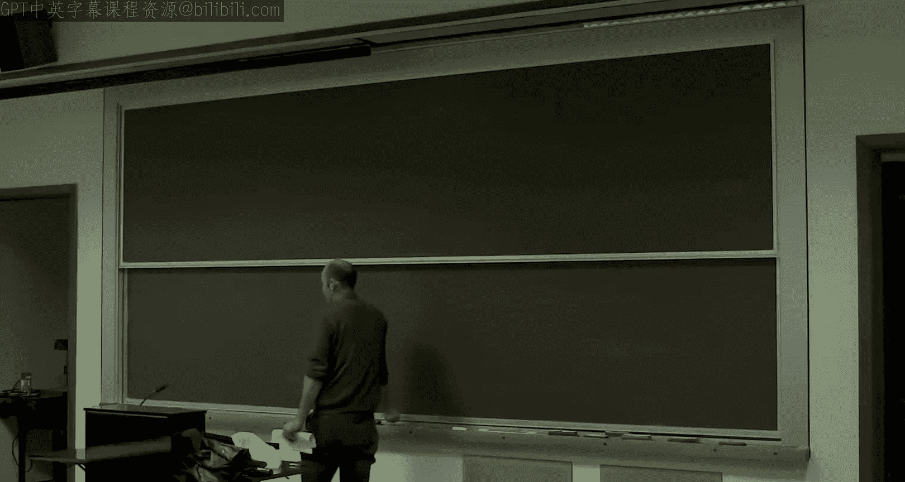
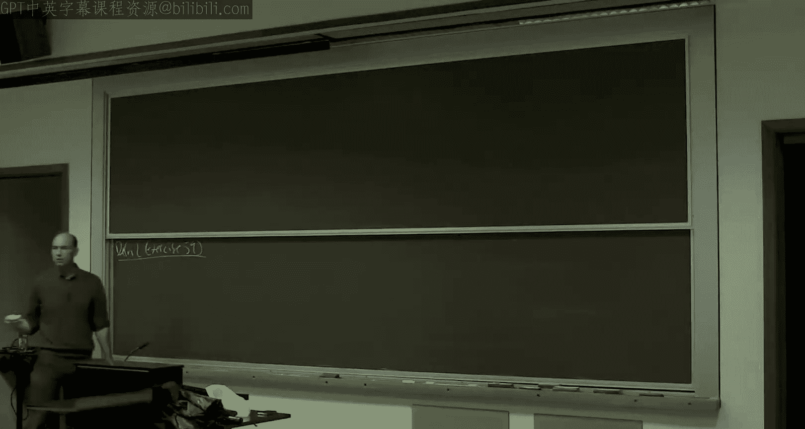
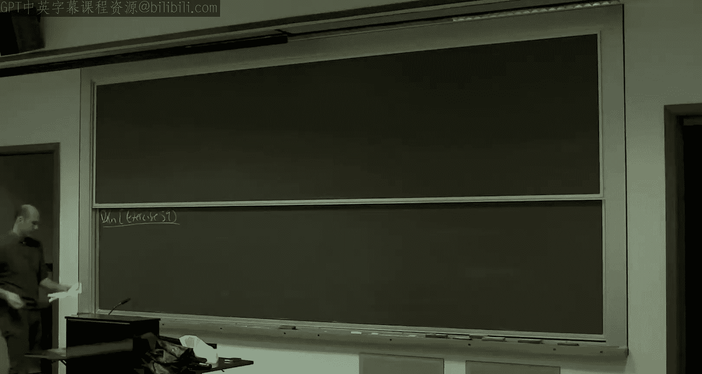
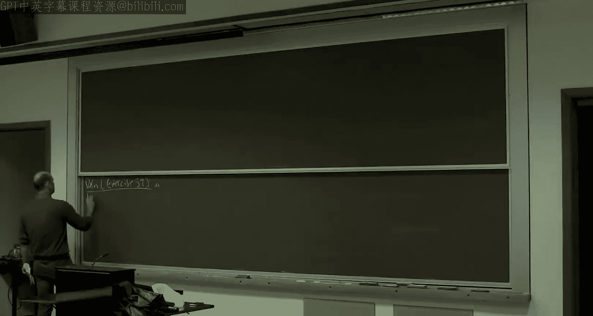
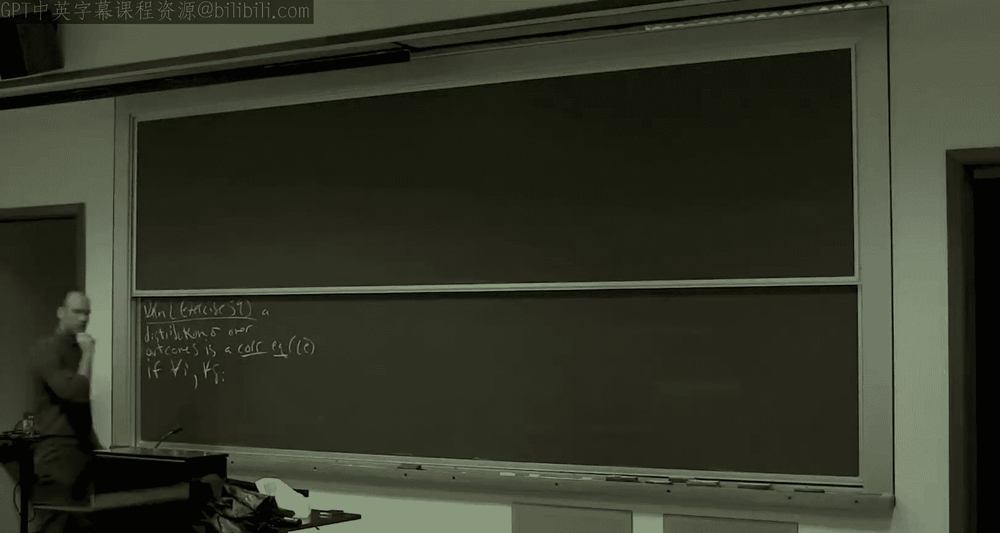
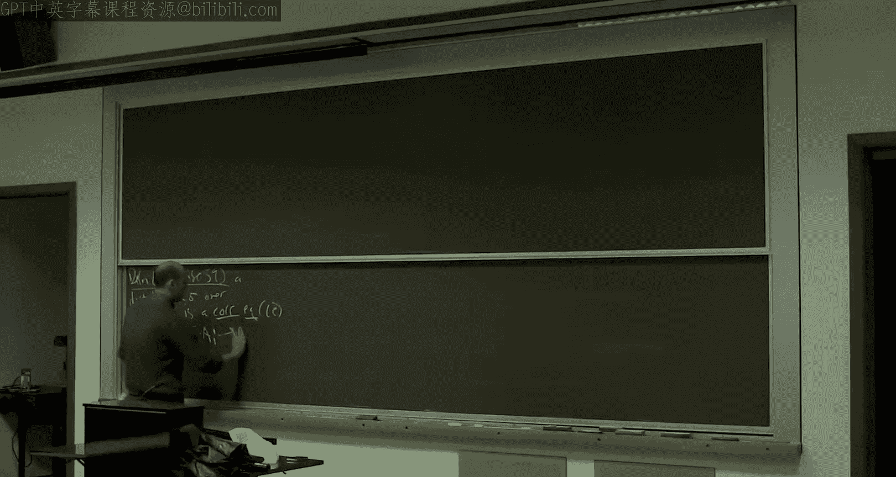
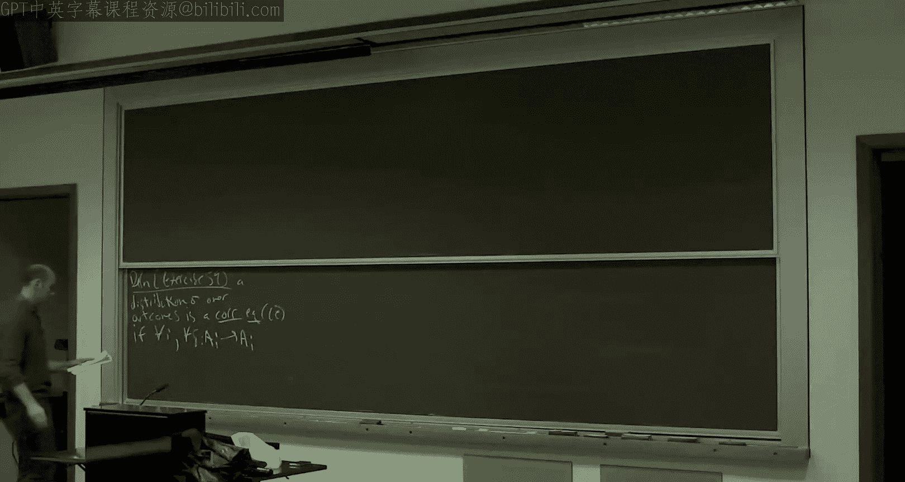
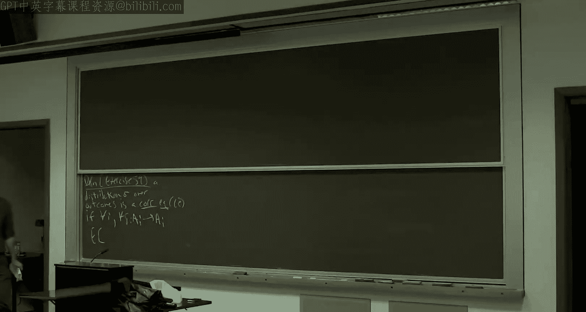

# 斯坦福大学《算法博弈论｜Stanford Algorithmic Game Theory CS364A, Fall 2013》中英字幕（deepseek） p18 -18-18_ From External Regret to Swap Regret and the Minimax Theorem).zh_en -BV1VmC2YzEXJ_p18-

So as far as the lecture。I'm going to remind you what we did last time。

So we're in the middle of learning dynamics， and we had this really cool result last lecture。😊。

Which is that coarse correlated equilibriumlibria。Are tractable。

And theyre tractable in a very satisfying sense in the sense that there are simple。

 certainly computationally efficient learning algorithms。Specifically。

 we looked at multiplative weights on Monday。 And if all players use a no regret algorithm like multiplicative weights。

 then the history of joint play will converge to the set of course correlated equilibrium。

 the biggest of the four sets in the equilibrium hierarchy that we've been discussing。 Okay。

 so last time we proved in here。😊，That's easy。Right。Now， you know， the bigger an equilibrium concept。

 the more things there are to find， the easier it is to find one。

 So if any of these four sets of equilibrium are going to be computationally tractable。

 it was going to be the course quality equilibrium。 Okay。

 that's a necessary condition for anything else to be tractable。 So today。

 I want to look inward a little bit， I want to get greedy and ask。

 are any of these more refined equilibrium concepts also tractable。

And so I want to cover two results today。 The first result is we're going to get an analogous tractability result for correlated equilibrium。

 Okay， so the next smallest set。 And I'll remind you what these are in a second。Okay。

 so the first main result is correlated equilibrium are tractable。 Again， the sense will be similar。

 So they are again going to be learning algorithms。 They're not going be quite as simple。 Okay。

 we're gonna have to work a little bit harder， but they'll still be not too bad。

 They'll certainly be polynomial time。 and the convergence will be in the same sense。

 If all players use these sort of more refined what are called no swap regret algorithms than the history of joint play will。

 in fact， converge not just to coursearqui， but to the smaller set of correlated equilibrium。 Okay。

 so that's the first result I want to talk about。One quick aside。

 if you wanted to just establish polynomial time tractability。

 you don't actually need to resort to learning algorithms for course quality equilibrium or correlated equilibrium。

 you can formulate them as linear programs which we can solve in polynomial time so that has the benefit you even get an exact equilibrium which you might recall from Monday we only got approximate course quality equilibrium it'll be similar today but the drawback is know solving a linear program doesn't really bear any resemblance to actual behavior of players in games。

 whereas the learning dynamics we're discussing while not maybe exactly how people act。

 they at least bear some resemblance to actual behavior so that's sort of the tradeoff between the linear programming approach and the learning dynamics approach we're talking about this week。

So looking ahead a little bit， we will talk some about a special case of Nash equilibrium today。

 But next week， we're actually going to talk about intractability of mixed Nash equilibrium and pure N equilibrium。

 So that's just to give you a little appreciation for， It's really cool。

 We can get tractability results for these slightly bigger sets or nontrivily bigger sets。😊，Okay。

 so let me remind you of what a correlatetic equilibrium is。

And I'm not going to give you the definition I gave you in lecture。

 Rather I'm going to cite a definition that you proved as equivalent in an exercise a couple weeks ago。

So this was exercise。59。So the original definition was in terms you think of a player sort of conditioning on its recommendation from a mediator and then switching and kind of do better condition on its recommendation。

 This is the definition in terms of a switching function。

So a distribution。

Sigma over the outcomes of a game。

I'll again use the notation for cost minimization games。

So is it correlated equilibrium or just a CE？

If for all player eye and for all switching functions， so I'm going to use Dlta for that notation。

 this maps actions or strategies of player I。

Back to strategies of player I， it need not be a objection， just maps actions to actions。

Sorry if for all switching functions。Player eye is no better off switching than it is just following the distribution sigma。

So on the one hand， we look at eyes expected cost。According to the distribution， sigma。

And that should be no more than。Ies expected cost。 if every time it's supposed to be playing some strategy。

 S I instead plays the strategy Delta of S I。

Okay。So this is the definition of quality equilibrium that maps most naturally to learning algorithms。

 Another thing just to remember about Qtic Lib。 So if you just want a concrete example。

 this was the traffic light example。 Okay， where we had the stop go game and it had two pure National equilibrium。

 And we observed that you could implement a 50，50 mixture of the stop。

 go and the go stop outcomes using a traffic light。 That was essentially the mediator。

 which would recommend strategies via a green light or a red light whether to go or stop respectively。

 Okay so that's the equilibrium concept we're going to talk about in the first part of this lecture。

😊，Alright， so last time。When we were talking about course qualityli。

 we made this connection to these no regret algorithms。

So let me just remind you sort of what was the online learning setting we were talking about on Monday。

 So remember this is where we have this knowntime horizon capital T。 And then on every day。

 little T from one up to capital T。 first， you have to pick a distribution。 So again。

 we're just thinking about a single player at the moment。

 the single player has to pick a distribution over its actions。

 And then after deciding on the distribution and adversary reveals a cost vector C sub T And then the goal is to minimize your cost relative to some benchmark and the benchmark we used on Monday was external regret。

 meaning you want to do at least as well as the best fixed action in hindsight。

 there's a connection between competing with the best fixed action and course quality Libria。

So the motivating question for this first result is， all right。

 we have this refined equilibrium concept， co equilibrium， is there an analogous notion of regret。

 analogous to external regret so that we again get this connection between the static equilibrium concept and a no regret notion。

 And there is， that's the next definition it's called swap regret。 And again。

 the point of this is so that minimizing this regret notion via dynamics will lead us to this equilibrium concept。

So definition。So an algorithm， and here， when I say an algorithm I'm talking about you know。

 in this online decision making setup that we talked about on Monday。So an algorithm has。

No swap regret。If。For all cost vectors。That the adversary might throw at us。

And for all switching functions。So here A is the set of actions of this fixed player。

 this one player that we're thinking about。The expected value。Of how well you do。K。So again。

 we're going to look at a time average。So how about you do is just the cost vector on time T。

Evaluated the action you play at day T， which is drawn according to this distribution that you chose the beginning of day T。

Now， previously， what we did is we looked at the best performance of any fixed action Here。

 We're gonna look at the best performance under any fixed switching function， Delta。😊。

 so we have a delta fixed。And we think about。How well we would have done if every time on someday we played a given action。

 A sub T， we instead played the alternative action， Delta of a sub T。

So this is a random variable because our actions are chosen at random from the distributions that we pick each day。

 Remember our algorithms are randomized。 But， you know， it has some expected value。

 and it should be the case that the expected value of this quantity is going to 0 for every switching function Delta。

 Does't。 I forgot to say that goes to 0。As t goes to infinity。So this is only more stringent。

Then the notion of external regret that we discussed Monday。

External regret corresponds to needing to worry only about a subset of the switching functions deelta。

Namely， which ones？The constant functions， okay， the functions Delta that no matter what the input is。

 always outputs a fixed action。 case of Dlta is a constant function， this is always the same action。

 So this is just saying your cost should be competitive with that of every fixed action。 Okay。

 as the time horizon goes to infinity，right。So， notes。If you have an algorithm with no swap regrets。

 meaning it vanishes， the time average vanishes in the limit。

 then it also has no external regret in the same sense。So no swap regret means no external regret。

And basically， this definition is。Engineered to make the following theorem true。

RightSo this is talk right so last time external regret was about competing with all fixed actions。

 Co qualityticlibria is just about not having any unilateral deviations that help you Here we're talking about competing with all switching functions。

 Co delib is just talking about no switching function can help you So the same theorem connecting the two holds today。

 So I'm not going to prove it again， but I'll state it informally because it is important but the argument' is exactly the same。

So theorem。So I， you know， what's what's not at all obvious is whether any algorithms of this type exist in the world。

 Okay， for all you， there could be an impossibility result saying this is impossible。

 But suppose for the moment that there did exist such algorithms。

And all players of now a multiplayer game used them。So if all players use。No swap or grid algorithms。

Then the history of joint play is indeed converging to a co of equilibrium。So then sigma。So again。

 this is the same as on Monday。We just pick it as a uniform distribution。Over the T outcomes。

Is an approximate。Correated equilibrium， okay？And the regrets。

 which is going to0 as t is going to infinity。 The regret with respect to a given switching function in the learning algorithm just corresponds exactly to the error in the corresponding equilibrium condition for the exact same switching function。

So as the regret is going to zero， the extent to which the error with respect to the cortic equilibrium conditions is also going to zero。

Good。So。They do exist。No swap or good algorithms。And what's great is we're going to be able to piggyback on the work that we already did on Monday。

so I'm not going to show you the first ever no swap or good algorithm。 There's some cool ones。

 but I'm going to show you a more recent， meaning last decade reduction。

And so we're just gonna to prove that if there exists no external regret algorithms。

 And I gave you one Monday， Multiplative weights。 If there exists a no regret。

 external regret algorithm， then there exists a no swap regret algorithm。 Okay。

 so it's gonna be a black box reduction from minimizing external regret to minimizing swap regret。

So this is by Blum and Mansur。05。Black box reduction。From no。Swap regrets。So no external regrets。

Okay， so a problem we don't currently know how to solve to a problem that we do currently know how to solve。

Alright。So in particular， there exists。No regret， no swap regret algorithms。

 This reduction will be polynomial time。 multiplicative weights is polynomial time。

 So there's even computationally efficient such algorithms。Thanks for Corrollary。

There exists polylytime。No swap regret。Algorithms。And combining this corollary with this theorem。

 we conclude that co are also tractable in the same sense as course co。 Okay。

 there exist computationally efficient learning algorithms。 So basically。

 those that are output by this theorem。And if all players use these computationally efficient。

 no swap or good algorithms， then we converge， the history of play converge to the set of correlatedlibria。

So this is this is the big picture。So there's a few moving parts here。

 but you should know all the details for everything except for the proof of this main theorem。 Okay。

 so I'm asking you to remember from Monday that we know that there exists no external regret algorithms。

 specifically multiplicative weights。 I showed you the full description， the full proof。

And then you should understand the connection。 You should understand that no swap regret。

 if players use them as learning algorithms lead to correlated equilibrium in this sense。

 Okay' in the same sense。 And with the same proof is on Monday。 Okay。

 so that's why we get this conclusion。 If we can prove this main theorem。

 then we attractability of correlated equilibrium。 Okay， so that's where we are now。

 Queions about that。No， no，'s a fixed game。So it's the same same story with the number of actions。

 So we think of the number of players and the number of actions each of each player。

 meaning the game。 that's a fixed thing。 It's being played over and over again。

So you might recall from multiplative weights。 We asked， you know。

 how long does it take to get down to regret Epsilon。

 And the answer was log of the number of actions n over epsilon squared。

But we think of n is fixed and then t growing large。And then the question is。

 how large does T have to be as a function of the other parameters before you get a target regret？

Okay， then let's let's do the reduction。It's a cool reduction。 It's， it's really sort of。

 it's something that you would hope would work。 And so it's really cool that it does work。

 It does need one kind of great trick at the very end， okay。😊，But the high level idea， I think。

 is very， very natural。 It's sort of what you would want。

 It's the proof that you would wish would work。So here's how it goes。So like last time。

 man is the number of actions。And so remember， a hypothesis is that no external regret algorithms exist。

 Just think multiplicative weights。 I'm going need n copies of them。 Okay。

 N totally separate instantis of a no regret algorithm。So M1 to MN。Are different instantis of。

 if you like multiplicative weights， but it doesn't matter which one。你看。Intuitively。

The J Noragri algorithm， M J， you can think of it as being responsible for protecting against deviations from action J to other actions。

 Remember， a switching function specified。 So we need， what do we need to do to minimize swap regret。

 We need to say that our cost is at least as good。As it would be。

 if you applied any switching function to the actions that we took。 Okay。

 And so switching switching function takes as input in action and it outputs in action。 Okay。

 so there's sort of n squared things going on。 And the J nore algorithm is in some sense responsible for paying attention to the switch the switches from the J action。

 That's sort of an intuition to keep in mind。😊，All right。Let me describe this reduction。

Now remember how a neurogate algorithm works， what its input and what its output is。RightSo。

 you know， something like multiplicative weights， it spits out a distribution over actions。

 Then you feed it in a new cost vector。 It changes its internal state。 Like， for example。

 it modifies the weights。 It spits out a new distribution， You feed it a cost vector。

 It spits out a distribution and so on。 Okay， so that's how we're gonna be interacting with these M1 through M N black boxes。

All right。So these are subroutines at our disposal。And1 up to M N。

 so they minimize they have no external regret。Now， at the same time。We're designing this master。

No swap regret algorithm， which is responsible for outputting distributions over actions and receiving cost vector。

So。At the beginning of a time step。We ask all of our no regret algorithms， the external ones。

 for their opinion。What do you think we should do right now， Tell us a distribution of our actions。

So we're going to get at a given time step T， an opinion from the first No good algorithm。

 This is a distribution over the actions。 This is what M1 thinks we should do。

And 2 will give us its opinion。And so on。Okay， so Q1 T through Q N T。

 each of these is a distribution over the N actions。 We have N distributions over the N actions。

So we receive distributions。Q T1。The QTN。From M1。Up to M， N。The next step I am going to。

 until the end of the proof， leave under specified， underdetermined。So the problem is， you know。

 all these neurogate algorithms have their own opinion about what we should do about the distribution from which we should pick an action。

 And in general， these are not going to be the same distribution。 They have different opinions。 But。

 you know， we're designing this master， No good， No swap or good algorithm， hopefully。

 And so we're responsible for outputting a single distribution over actions。

 So we have to somehow take these end distributions that are different and compile them into some consensus distribution over actions。

 which we then report back。Okay。So it's not clear how to do that。

meanYou can think about various ways， but it's not clear what the right way is。

But that's the key trick is the right compilation procedure。So for now， there's just。

 there's going to be some method by which we take these end distributions and compute a consensus distribution PT。

So， in our。Master algorithm。 This is the central processing unit。 if you like。 It takes as input。

 the end distributions， and it will somehow。Figure out the distribution from which an action eventually gets chosen。

So this pink box is the actual no swap or good algorithm。 Okay。

 so its job is to spit out distributions and accept cost vectors。Okay。So， you know。

 time1 is's just going to do something like pick an action totally random。So then， you know。

 we find out a cost vector。And now， of course， each of our subroutine no algorithms and through Man。

 they're also expecting a cost vector。 right， That's how these guys work。 So M sub J。

 it's unaware of anything else in the world。 It doesn't know it's part of this big machine。

 It just is expecting to get a cost vector spit out a distribution。 It's Q T。

 get a new cost vector and so on。So the next step in our reduction is to take the real cost vector from nature。

 from the adversary and apportionate amongst。These no regret algorithms and one through M。

So after we say what our distribution of actions is PT。We receive a cost vector of CTt。Okay。

 and to the outside world， this is all that the outside world sees。 Okay。

 We're outputt a distribution of reaction B T， And then it gives us a prospect of C T。 Okay。

 everything else is internal to the guts of our algorithm and how we're interacting with our subroutines。

Okay， so what do we do now， we're gonna take this cost vector C T。

 and we're gonna feed this into all of the neurogri algorithms。 Okay， well not quite。 Okay。

 we're gonna， we're gonna split this。 We're gonna to portion it according to the probabilities that we chose our different actions。

 Okay， so if we pick the given action with 10% probability。

 Then the corresponding No good algorithm gets 10% of the cost spec。So give the cost vector。

Let remember， PT is a distribution of actions or consensus distribution。

 maybe action J we pick with 10%， so we just multiply the real cost vector。By 10% and we give that。

To the Jith， no regret algorithm。So in this picture。Overall， algorithm gets CTt as a cost vector。

And now。It's going to feed in。So this is going to be。PT1。行 c t。That's going to feed in PT2。Time CT。

PtN。Times CT。And that's the entire reduction。So you have these n neuro algorithms。

 each sort of responsible for switches from a corresponding action。

 the master algorithm is responsible for outputting a distribution and inputting a cost vector。

 So what's missing is to specify the interaction。 Okay， So how do you connect。You know。

 the outside world to your end neuro algorithms internally。 Okay， and going outward。

 there's this magical box， which has a consensus distribution PT from Q T1 through Q N。

 And then going backward， I' told you exactly how we split up the cost vector to go back。

 Okay just according to the probabilitybabil that we play the different action。😊，Question。はい。

That's it。有。Right。So。白。我就卖。B box。S。Roughly。Roughly， that's the rough intuition。

So you could think about MJ as sort of paying attention or sort of guarding against switching functions that do really well by switching action J to any other action。

 which is one of the things we need to worry about for swap regret。be。

This we' going to give you is the one。Well， they don't really know， frankly。I mean。

 if you really think about just the IO behavior of one of these nerve algorithms。

 they literally just spit out a distribution and give you a cost vector and it just goes back and forth。

 And as a function of the cost vectors that you tell it。

 it's going to modify what it tells you to do accordingly。So。I mean， so you're right in that。

 So I mean， you're correct in saying that this is fictitious。 I mean。

 so these are not the actual costs。 We， we're in effect。

 lying to each no regret algorithm about what the actual costs were。

 And it's not clear that's a good idea right now。But I guess， I mean。

 one thing that does seem sort of natural。 perhaps。 I mean。

 another thing you could try is just feeding in this entire cost at each of the neurogrid algorithms。

 but it also seems natural to kind of have the overall cost that you face to be reflected kind of in the superposition of the neurogrid algorithms。

 Okay to split up the cost vector between them。 And then the probabilities that you were playing the various actions is a reasonable way to split that up。

 I'm not saying that's the only way you could do it。 But I think it's reasonably natural as well。

Okay。So。Let's just take stock of what we've got。 And once we've actually figured out what we've got。

 we'll realize we just need one key trick and we'll be done。

So this reduction works for a suitable implementation of how to compute PT from the QTs。All right。

 so's just so let's take stock。Allright， so first of all。What is the expected cost of our algorithm？

And again，'m always going to do time average costs as usual， okay？Well。You know。

 we incur cost every single day。Days from T at one up to capital T。And then right expected costs。

 So's a probability we play the various outcomes。 and the probability that we play the various outcomes on a given day T is。

 by definition， this distribution PT T。 okay， that's what our algorithm decides to do。

So we look over all of the actions。We look at the probability that we play given action。

 if we play that action， we just look at what cost we get。So that's what our algorithm。

 that's just its expected cost。Now。We want to say this is good。 We want to say this is small。

 We want to say it's small， though remember relative to some benchmark。 Okay。

 so relative to the expected cost under some switching function， Delta。 Okay， that's our competition。

 So let's try to understand what those are。So what would our expect would our expected cost have been。

With some particular switching function， Dlta。Okay。Well it's almost the same thing。

 let me call this expression2 dot Dlta because it's with respect to a particular delta。

So if every time we were supposed to play in action， k， we instead play Dlta of k。

We just do the same sum。We just say， well， for any， what was the， you know。

 look at the probability their action。Sorry that our algorithm played action I。

 we're doing the counterfactual where instead of playing I， what if we had played Delta of I？

So over here， we just look at the cost。If instead of playing I， we play Delta a I。

So that's the expected cost of our algorithm。If you applied。

The switching function deelta to its history of chosen actions。Now， just to make sure。

 all right so we're trying to prove that this master algorithm has no swap regret。

So what we're trying to prove。So saying that our algorithm is no swap regret is exactly the same thing as saying that for all switching functions。

 Delta。Our expected cost。Is it most the counterfactual expected cost under particular switching function。

 Delta plus some little o of one term。 getting here by little O of 1。 I just mean this is going to 0。

As T is going to infinity。Okay， so for multi of weights， we had an expression like know。

 square root of log n over square root of T。 But the point was there was a T on the denominator。

 So when T got big， that thing went to 0。So this is， by definition。

 what it means to be no swapper grid。 that's what we're trying to prove。Allright。

 so that's what we want。What do we have？Andt remember。

 we're trying to piggyback on the fact that we have these no external regret algorithms。Okay。

 so there're each providing some kind of guarantee。

 but with respect to these fictitious cost vectors。

 So let's look at what we just have already sitting on a silver platter for us。Okay。So。

 let's now zoom in。And adopt the perspective of a neurorego algorithm， let's say M sub J。

M C J knows about nothing else in the world。 It's just spitting out these suggested distributions over actions。

 The Q T Js。 And it's receiving back these sort of scaled versions of the real cost vectorors。 Okay。

 so it's getting back P T of J times the actual cost vector of C， T。 that's all MJ Cs。

It's no regret with respect to that data， okay because it's no regret algorithm。So since MJ。

There's no regret。U。It's the case that for all actions， whoops。To hold on。 sorry。 Allright。

 so let's do the same exercise。 So let's first think about MJ。

 What does what's its cost or what does it think its cost is。

 And then we'll think about deviations okay。So。MJ perceives。It's expected cost。As。Okay。

 so this is an expression indexed by J， so I'll call it 3 dot J。Well， what does it think' going on？

Okay， so it's the same computation we didn't one except we're doing it with what the distribution that MJ thinks actions are being played with and with respect to what it thinks the actual costs are。

 And MJ thinks actions are being distributed according to QJ。

 and it thinks the real costs are these scaled versions of the C Ts scaled by PT of J。So。

MJ perceives its cost。To be the following。Again， you look at each day T。

 you'll get a given an action。呃，I。And it thinks action I is being played on day T。

With probability Q JT of I Q AT is what its is what it's suggesting is the action distribution。

And then what does it think the cost is when action I gets played on day T。Well， this is going to be。

The scaled version of the cost。Okay。So remember， nograde algorithm J gets the real cost of vectors scaled by the probability with which it was chosen in the consensus probability distribution。

So， again， that's exactly the same computation as in one。Except with different data， okay。

So that equation would be true， no matter what the algorithm MJ was， no regret or not。

So the no regret hypothesis comes in when we argue that this is small relative to things that MJ could have done。

Yeah不。So because MJ has no external regret。Its perceived cost is no larger than what it would have been had to taken some fixed action every single day。

What I do。Oh yes， some of these， let me see。Yeah， the CT should be I， I think。

This should be an enough。That should be a joke。Right so we're talking about action I getting played。

 That's why we look at the I component of the cost vector。 But this remember。

 this is just the scaling factor we're using on the cost vector。 Yeah。

 so that's indexed by J because the newer algorithm is E sub J， Thank you。Good。All right， so。Yeah。

Now， because MJ is no external regrets。For all fixed actions Kaia could have taken every single day。

It's cost under the data we gave it。Is it most that what it would have gotten playing K every single day。

 plus some regret term， which is vanishing。So let me call this now4 do j a K because it's got to be indexed by both the inrate algorithm J and the particular fixed action it's comparing its cost to。

Alright， so if from MJ's perspective， if it played K every single day， what would happen， Well。

 it would just get the K component of what it was told the cost vector was。 Okay。

 so we just replaced that with a K。So it's going to be PT。Jy。C t。Plus some R sub J。

Which is just the regret term， which is going to zero。So again， for multiplicative weights。

 this R J would be root log n over root T。All right。So again， don't forget the goal。

The goal is to prove that the master algorithm has no swap regret。

 So the goal is to prove that one is at most to Delta， no matter what Delta is。

So what I'm not going to do is I'm gonna to sum this inequality。 Okay。

 so we agree that the 3 J the perceived cost of MJ is it most this， no matter what K is。

So I'm going to choose a particular K， and I'm going to sum over all of the neuro algorithms。

 And we're going be very close to the goal once I do that。All right。So again， remember。

Eyes on the prize。Go up there for every deelta， one is the most2 dot delta。 So fix some delta。So。

 some。The inequality。Right， so we have this inequality。Over。The choice of the alternative fixed。

Delta jet。 So remember， I'm considering a fixed switching function。

So what I'm doing is for each neurogri algorithm， M sub J。

 I'm considering now a particular fixed action， name delta of J。 Okay。

 exactly the action suggested by this switching function。So now it's sum， right。

 So we know that this。Is it most of this plus the， you know， plus the regret term。

 I'm just gonna sum those over all all J。So what do we get？All， on the left hand side。

 I get some of these things。Allright， so I'm going to go ahead and sneak the sum of J inside。

It doesn't matter。And what do we have， We have same stuff。2。JI。Yeah。Okay， so that was harmless。

Just sum the left hand side over all the neuro algorithms。And we have that this。Is in most。

This with K now replaced by Delta of J。And then plus。All these regret terms。

And because each of the R Js is going to 0 with T。 and we regard n as fixed as T goes to infinity。

 the sum is also。Going to zero。As t goes to infinity。Now， have we made any progress。 Okay。

 so what did we do， We just stated what we wanted。 That was one and 2。 and we stated what we've got。

 That was 3 through 6， and。So exasperating all right， so check out six do Delta。And 2 dot Dlta。

 which is a little bit hidden。Okay。So two dot delt on the left，6 dot delt in the middle， okay。

Those are the same thing， okay up to this little of one term。So we stated what we wanted。

 and we stated what we have， and the right hand sides are exactly the same。Okay。

So if we can make the left hand size exactly the same， we're done。Okay。

 that just means the reduction works。 Okay， it's just a consequence of the no external regret algorithms then went through M N that the black。

 the big black box， the master algorithm has no swap or good。 Okay。

 so we just got to make the left hand sides the same。 The left hand sides are one。And fought。Okay。

If one in five happened to coincide， we'd be done。 Everyone agree。What's that some typos？Oh。

 did I Oh， okay。Some over Jay， okay， good。Right， that was the whole point。All right。

 so now to one and two of the same。One's an I， one's a J， but that's okay。Okay。

 so all we got to do is， so everyone agree， if one in five happened to coincide， we'd be done。

We literally just be able to piggyback on no external regret of M1 through M And and conclude no swap regret for the master algorithm。

Okay。Alright， so， you know， I still haven't told you how to compute the consensus distribution piece of T from all of the suggestions。

 Q T1 through Q T N。 Okay， so the final trick in the proof is to notice or to prove that there's a way of computing the consensus distribution PT T so that one in 5 become exactly the same number。

Okay。All right。So how do that？So again， remember， definition of P is under our control。 Okay。

 so everything we've derived is a generic derivation in terms of P。 And we can pick P。

 however we want okay。The cues are given。 Those are just popping out of the black boxes and went through M in。

 the P， we get the computer whatever we want。Okay， so how do we match one with5。嗯。Okay， so。

If we can choose。The PTs。 remember， we choose one of these every day。So that one equals five。

 we're done。And we're gonna do this in sort of the most， you know。The way that you'd hope would work。

 right， So this is just the sum of the days T， sum of the day I for each sum end。

 there's just sum cost of this action I on this day T has some coefficient P T I。

 We don't know what it is。 We have to figure out what to make this。 Okay。

 so C T I has some coefficient。Over here。Same deal， okay？For everyday T for everyday I。

 we have a term， the cost of that action， I on the day T。 And it also has a coefficient。

 It's a little more complicated。Or whatever。Oops。C TI also has this coefficient involving the sum of a jet。

So let's just see if we can compute PTs actually just even independently each day。

 So let's just try to on each fixed day T， compute PT so that these coefficients match for every single action I。

So sufficient。Preach tea。Compute the consensus distribution， PT。So that the coefficient in one。

Equals the coefficient in5。And that should be true。For every eye。So this is the great trick。

 And actually， probably， I wouldn't be surprised if a couple of you see the great trick。😊。

This equation you've seen anywhere else。What's it？Yeah， good。Is it maybe even a specific kind of。

Steady state of Markov chain。Dingo。So here's the great trick。So at x be a Markov chain。

OkaySo I just mean like a directed graph or at a given node。

 it specifies probabilities of which nodes you go to next， and it's memoryless。

 So you need to know about where you're going next is where you are now。So Markov chain。States。

Are just one， two at the end， the actions。And then the transition probabilities。

Are given by the Q Js。 So going to remember， P's is what we have control over Q Qs we don't。

 Qs are just sort of popping out of the neurogo algorithms。

 So the Q Js are going to supply the transition probabilities。

so for giving arc from a state J to a state I， that's going to be labeled。By QJ of I， this day T。

So basically， what we do。 So remember， a neurogrid algorithm and a day T， So the neurogrid algorithm。

 J gives us Q J。 And that's a distribution of reactions。

 So we just interpret that as the transition probabilities out of action J， okay。

 to all the other actions。あ。So， our goal。Our equation in the Ps is nothing more than the equations governing steady state distributions of Markov chains。

So with this markov chain with the states of the actions and the queues supplying the transition probabilities every。

Stationary distribution。Pi。OrEvery stationary distribution of x。Satisfies star， whereby star， I mean。

 that yellow equation。And many of you will have studied this， but just to remind you。

 so every Markov chain has a stationary distribution， at least one。

 and you can compute them in polynomial time。 It's just an eigenvector computation。

 So this is something you can actually do in a computational efficient algorithm。

So going back to the algorithm， how do you actually compute the consensus。

 You form this markup chain， use these as your transition probabilities。

 compute your favorite stationary distribution， and you spit that out as PT。

Because that satisfies that equation there， one in five coincide。

 so the external re guarantees immediately give you the no swap regret guarantee for the master algorithm。

ま。Questions。I mean， maybe sort of， you know， in hindsight。嗯。You know， I mean。

 once you have the reduction idea and you follow this argument。

 it becomes clear that this is exactly what you need。 just to make the proof go through。

 But you know， if you think about， you know， what are ways you could try to take a bunch of property distributions and compile them into consensus distribution。

 in hindsight， Maybe this isn't so unreasonable。 Okay。

 what does this really mean that we're setting PT T in this way。

 given the Q Ts It basically means okay， so we're trying to figure out which action to play at day T。

And we start from an arbitrary sort of expert， if you will， an arbitrary neuro good algorithm。

And we say， what do you think， What do you， what do you think we should do。

 And if you imagine this algorithm MJ sampling from Q J， It's Q J this day T， maybe it says。

 I think you should play action 17。And now we iterate。

 So now we go to the 17th Negrid algorithm and we say， what do you think。

And it's going to sample a recommendation from its distribution。 Q17。

 This says I think you should play action 23。 We go last 23 for its recommendation and then we go and we go and go go and go。

 So the limit of that process where you iter ask people for advice and you sort of chase pointers。

 according to who they say you should play or what they say you should play。

 that process is trying to converge and it will converge in anergoic Markov chain to this distribution piece of T。

 So that's the consensus distribution， you just iterly ask people for advice where the Qs sub Js or the distribution specifying what advice you'll get from a particular expert or particular no regret algorithm。

So。Again。The high level point here。What we just proved。Is that the set of correlated equilibrium。

Is also easy。So again， the algorithm obviously isn't as simple as multiplicative weights。

 but it's not that bad。 It's polynomial time。 and it again。

 converges in a polynomial number of iterations to something with as small regret as you like。

 as close to an a corretic equilibrium as you like。

So what I want to do next is I want to zoom in even further。

 so the good theorist is never complacent， always greedy， always wants more。So what about the set？

Can we get tractability here？So in general， the answer is gonna to be no。

 and we'll talk about the sense in which the answer is no next week。

 But what I want to do in the remainder of this lecture is talk about a special case where the answer is yes for mixed Nash G。

 So I want to talk a little bit about two player zero sum games。

So we chatted a little bit about zero sum games， even all the way back in lecture 1。

We talked about rock paper scissors。So zero， sum games are sometimes called games of perfect competition。

 There where players always want the opposite things。 For example， one wins， the other loses。

So rock paper scissors。You could describe as a matrix。Where in each entry。

 you actually need to bother to write one number， not two。 There's two players。

 but the second players payoff is just going to be the negative of the first one。

So I'll write it so that it's the row players payoffs in here。 So because paper beats rock。

 for example， that's a。One， scissor loses through rock， so that's a -1 and so on。And in general。

I'll use the notation AI J， the an matrix to be the payoff that the row player gets。 Okay。

 so the negative pathoff of the column player。And it's been a while since we've talked about just mixed strategies that weren't correlated。

 So just to remind you。When we're talking about mixednash equilibrium。

Each player is just responsible for picking a distribution over its strategies。

 and now the players randomly choose their strategies independently。

Some mixed strategies are just going to be。And x and a Y， X is a distribution over the rows。

 Y is the distribution over the columns。And then as far as just writing down expected payoffs of players under a given set of mixed strategies。

That's often convenient to write a matrix notation。So， the expected payoff。Of the row player。

 for example。呃。So the chance， the probability that a given outcome IJ occurs by independence of the random choices。

It's just the product of the probabilities。That row I is chosen and that column J is chosen。

Times A AIJ， whatever the payoff of the role player is in that particular entry。

So you might want to think about the matrix A。And as the distributions X and Y over the rows and matrix format and in general。

We can write this。As x transpose， a， where a is the matrix of row player payoffs times y。对。

That's just a little。Convenient way of discussing expected payoffs in zero sum games， Allright。

So I want to talk about the Minm theorem， sort of famous， awesome result。😊。

Suppose it's a zero sum game， you know， Rock paper scissors or something else。 like wherever you win。

 the other person loses and vice versa。Typically， you think about these kinds of games being played simultaneously where both players would move at the same time。

 like in rock paper scissors。What if players have to move sequentially。Okay， but to make it nontrivi。

 So in rock paper， scissors， if I make you move first。And I if you pick a deterministic strategy。

 obviously all is lost。So what if I make you move first。

 But I only I only force you to commit like in online learning setting。

 I force you to commit to a distribution。Okay。So you commit to a distribution。

 and then the second player presumably is going to respond in some optimal way to make them as well off as possible news as worse off as possible。

So if the players have to go one at a time in a zero sum game， would you rather go first or second。

You want to go second， right？ I mean， if you have to go first。

 you you got to do something And whatever it is you do， you could still do if you went second。

And maybe you can do something better。 if you go second。

 Maybe you can adapt to what the other person did when they did something first。So。

It's clear that there's only a first mover disadvantage in zero sum games。Or rather。

 if either player has an advantage， it's going to be the second player。So the Minm Max theorem。

Actually says that it doesn't matter。It's kind of amazing。I mean。

 it's amazing enough that the mathematician Brell， who you might know from the Measure theoreticaloretic foundations of probability。

 when he realized the existence of N equilibriumria in these games was equivalent to the minim theorem。

 which was obviously false。 it caused them to sort of abandon the study of N equilibrium in these games。

 It was clear they couldn't exist because the the mini Max theorem had to be false。😊。

So it's very counterintuitive back then and now。So what do I mean， it doesn't matter？I mean。

 say you're the rope player。And say I make you go first as you're trying to have your expected pay off as high as possible。

So you're going to assume， of course， that the column player who goes after you will do the worst thing for you。

 minimize your payoff， given that you do the best thing possible。

That's exactly the same as if you get to go second。So I meaning the column player goes first。

 plays optimally knowing that you'll respond。In your own interest。And you get the same number。

 This is the sense in which it doesn't matter who goes first in a zero sum game。 Okay。

 where the X and y here， all these maximums and minimums are over probability distributions over the respective action set。

Svaon Neyman originally approved this。In the 1920s。Using relatively heavy machinery。

 given what we know now using Brower's fixed point theorem。

He proved it again in the 1940s using arguments which are basically equivalent to strong LP duality。

 That's why when a very nervous George Danzig went to von Neumman with his then very new simple algorithm。

 Von Neummann was able to just stand up in the middle of the meeting and give him an impromptu lecture on LP duality。

 which he just indented。So he bridge it again in the 40s using that。These days。

 and what I'll show you now。Is we can actually just deduce the min max theorem。

As a consequence of the existence of no regret algorithms。

 actually merely no external regret algorithms。 So that multiude of weights proof。

 that's sufficient to derive miniax theorem， as I'll show you now。As we discussed。

 one side of the equation is clear。It's only worse to go first。Because whatever you do here。

 you canly well do there。So I'm going to focus on。The reverse inequality。So proof。

Take your favorite zero sum two player game。Just to have both the row player and the column player play their favorite。

 no external regret algorithm。Play them long enough so that the brick gets down to epsilon。 So。

 for example， for multi of weights， play for log n over epsilon squared steps。

 Okay where n is the number of strategies of the players。So until the expected regret。And again。

 external regret is fine。The most epsilon。So， let。P went up to PT。

And Q1 up to Q T be the distributions that these players nugate algorithms tell them to play actions from。

 So， for example， if they're running multiplicative weights。

 the P's and Q's are just proportional to whatever the current weights are and multiative weights at that stage。

So just to be clear， so no regret algorithm， I guess a couple of things。 So first of all。

 when I talked about no regret algorithms and multiple of weights in particular。I did it for costs。

 There you can equally well do it for payoffs。 That's gonna be an exercise set number 9。

 in particular multiplude of weights。 You just tweak it slightly。 It works equally well for payoffs。

 That's the version I'm gonna to use here。 Never regret with respect to payoffs。

The second thing is the nogri algorithm。 What does it do with outputs a distribution。

 It accepts a cost vector。 in this case， a payoff vector goes back and forth。 So just to be clear。

 what are the payoff vectors that these players feed into their noragri algorithms to get advice about what to play at the next step。

 They just look at what the other player play to day T。And then they just think about， okay， well。

 if I had played my various actions， what would have been my expected payoff given the mixed strategy that the other player played at that time step on that day。

 okay。So where。Again， for the purposes of defining the neural red algorithm。The payoff vectors。

At time T。So for the row player。So remember， A is just the matrix payoffs。

So if the column player randomized according to QT at dayT。

 then after dayT you look back and you say， oh， what would my expected payoff have been of each of my rows given that the column player randomized according to QT？

So that's what you feed in the。Don a great algorithm for the row player。And similarly。

The column player。After the dust settles on day T， It says， oh， that's how the row player plays。

 That means this is my expected payoff of my various columns。

 That's the payoff vector you feed into the column player's No good algorithm。Okay。Good。So。

So now I want to argue that just the time average P's and the time average Qs。

 those form basically a min Max pair up to a small error。

 they're going to basically prove up to two epsilon this equation。

So these neuro good algorithms just basically hand us certificates of this equality。So that X hat。

Again， this is just sort of the time average mixed strategy that the row player uses over these capital T days。

Similarly， why hat is just。In some sense， the time averaged strategy used by the column player。Also。

With we。Deote the expected payoff。Of the row player。Sorry actually time average expected payoff。

Let me actually just write down the formula。Yeah。对。So on a given day tea。By definition。

 the row player randomizes according to PT， the con player randomized according to QT。

 so for fixed T， this is exactly the expected payoff that the row player got on day T。

 and then I just time average that expected payoff over the capital T days。That's going to be V。Good。

Alright， so how does the no regret condition come in。So player1 ran its no regret algorithm。

And this is its time average payoff V。No regret says it couldn't have done much better。

If it had used any fixed action， meaning a fixed row。 So if instead of playing P1。

 then P2 all the way up to P capital T， if it had just played row 12 every day。

 it could have gained it most epsilon in the payoff and the time average payoff。So player number one。

Since。It's expected regret is the most epsilon。For all fixed row I that it could have played every single day。

We have that。Right。Yeah。Okay。So if it had played， so this is just meant to denote deterministically playing row I。

Every single day， little tea。The column players doing what it was doing before when we think about the regret。

So this is Q2。Okay。Sorry， there's no T here。 That is a transpose。 Oh boy。

 sorry about the conflict between the time horizon and transpose。So this is。

 this is the transpose of the I basis basis vector， indicating deterministically playing row I。 Okay。

 so this is not indexed by the day。 this is just the same action over and over again。 Remember。

 that's the external regret benchmark， okay。So this is the same thing so the comp player is doing what I was doing before。

 playing distribution Q little T on day little T。Since this is fixed。

 this is the same thing as just playing against the time average version of the column players strategies。

 so this is just。Tranpose of the ice basis vector times the payoff matrix， times the y hat。对。

And because it's no regret。Had it played the same action every single day。

 It only could have gained epsilon。so this is it most。V plus epsilon by the neuro regret condition。

Okay。All right， so the upshot。Any fixed row。had you played it would have netted you at most of V plus epsilon。

That means any fixed mixed distribution， which is just an average over rows。

 Also would have netted you at most V plus epsilon。 Had you played it every single day。So， thus。

Call this A。So this is now an arbitrary mixed distribution for the row player。

 but of course that's just an average over various deterministic row strategies。

So because this inequality holds for every fixed row strategy also holds for every distribution。

So no regret implies that if you could go back in time， pick your favorite mixed distribution X。

 play it every single day， you could only gain epsilon over what you got from your No regret algorithm。

So that's from player2's perspective， from player1's perspective。It's happy。

 And mixed strategy wouldn't have done much better。 Now， how do we use it at zero sum。Okay。

 so that means the column player's payoff is the negative of the row player's payoff。

 or equivalently， the column player is trying to minimize this number while the row player is trying to maximize it okay。

So now by symmetry， because ofs zero sum， the exact same argument says， well。

 the column player was also running a neuroro good algorithm。So by the same argument。

 any fixed column could have decreased。The row players expect to pay off by a most epsilon。

 Maybe it could have gotten down to v minus epsilon， but no lower than that。

by the new regret hypothesis。 And again， if that's true for every single fixed column it could have played every single day。

 it's true for every single mixed strategy over columns that it could have played every single day。

So the same argument for player two says。Since the regrets are most epsilon。

There's no way that the column player could have dragged player one's expected payoff down further than v minus epsilon。

SoFor all distributions， why over column strategies？And so now we're pretty much done。

So now I claim X hat and Y hat witness up to a two epsilon。 this equation。

 rather the non obvious version of this equation。 So again， remember。

 no surprise that the right hand side is bigger。Now we're going to show that the right hand side can only be bigger by two epsilon。

So， thus。So let's start the left hand side。So if we instantiate x， this only becomes smaller。

 So let's just use X hat。Okay。Now， by B。Pretty much for fixed X hat。

 the best the column player can do with the best response with an optimal y。Is to save an epsilon。

 Okay， iss to get this down to U minus epsilon。By the same token。If we think instead。

About the column player playing according to its time average Y hat。

 And we let the row player do its worst。 pick its optimal mixed strategy。

We know the row player with an aomic strategy can only say can only get itself an extra epsilon beyond V。

So that was inequality A。So for all distributions， X in particular， for the best of them all。

The expected path of the row players must V plus epsilon。And so now of course， if I minimize over y。

This only becomes less。Now， Epsilon is arbitrary。 We can pick up epsilon as small as we want。

 We just jack up capital T to， for example， for multiplative weights， T over epsilon squared。

 But you give me the epsilon。 I'll give you a long enough amount of time to run the multi of weights algorithm that you can exhibit X hat and Y hat。

That show that these two quantities can be a most two epsilona apart。

So they of the limit as epsilon going to zero， there can never be a gap between these two quantities。

 it has to be equal。あ。Any questions about that。So this is the Min Max theorem。

 I didn't I I mentioned how there was a connection in Ash equilibrium。

 And that's why Brell got discouraged。 But just to be clear。If you look at these two inequalities。

A and B。They， in effect， say that X hat Y hat is approximate Nash equilibrium。 Okay。

 so if the row player plays according to X hat and the column player plays according to Y hat。

 neither one can change the payoff or can make the payoff better in their favor by more than an epsilon。

 as you gain them as epsilon。 So it's an approximate naash equilibrium。 But again。

 we can take epsilon as small as we want。 And so by limiting argument。

 there has to exist an exact Nash equilibrium。And again， more generally。

 it takes quite heavy machinery to prove existence in National equilibrium。

 like Ber's fixed point theorem， or historically， this is proved for zero some games using LP duality。

 but it's just a consequence of these no regret algorithms。Have a great break，ll See you in 12 days。

