# 斯坦福大学《算法博弈论｜Stanford Algorithmic Game Theory CS364A, Fall 2013》中英字幕（deepseek） p19 -19-19_ Pure Nash Equilibria and PLS-Completeness).zh_en -BV1VmC2YzEXJ_p19-

welcome back everyone we're in the home stretch so last couple 364 assignments exercise sets have normally been due on Wednesday。

 but this last one's due on Friday I posted it late。

 so get the exercise set number nine in by Friday at noon and exactly a week after that is when the take home final is due so that's Friday of finals week again by noon。

So let me just jog your memory kind of where we were a week and a half ago when we left off so we're in the middle of part three of the course in part three we're asking questions like do players reach an equilibrium of a game if so does it happen quickly by which learning processes might play converge to an equilibrium of a game and last couple of weeks we focus mostly on positive results and positive results are really cool because they give credibility to the predictive power of an equilibrium concepts an equilibrium concept if you want to interpret it as a prediction of how games is actually going to be played then you sort of feel much more confident in that prediction if you have learning processes that converge quickly to those kinds of outcomes this week we're gonna to focus more on negative results and negative results are also important because they cast doubt they should show limitations on the general predictive power of an equilibrium concept。

So let me remind you， we now actually have a really kind of nice suite of positive results about computing equilibrium。

 different kinds of equilibrium。By various learning processes in different contexts。

 So last week was we talked about regret。 And so the first thing we proved is that with no assumptions on the game whatsoever。

 So in completely general games， no regret dynamics。

 So this is where each player uses a no external regret algorithm like multiplative weights。

 So if every player uses no regret algorithm day after day to choose their mixed strategies。

 we show that the time average history of play converges to the set of course correlated equilibrium。

 So the biggest set in our equilibrium hierarchy。 so no external regret gets you to courseco equilibrium with no assumptions at all about the games。

 So that's really nice。The most recent lecture we asked can we get that same satisfying tractability even when we zoom in and we're more stringent about the kinds of equilibrium we want。

 we want correlated equilibrium， not co quality equilibrium the answer was yes we had to work a little bit harder thats had this black box reduction that took as input no external regret algorithms like multiple weights and outputs a no swap regret algorithm that was where we use the Markov chain trick in the analysis so we did show that there exist no swap regret algorithms and as a consequence the time average history of play of no swap regret dynamics converges to correlated equilibrium again quickly and a small number of iterations。

So there's also a question。 and this talk we've talked about some and we'll talk about it more this week。

 Okay， so we have completely sweeping results for our outer two sets。 What about the inner two sets。

 What about just regular old Nash equilibrium， both in the mixed version where players can randomize and in the pure version where players can play deterministically。

 So here's what we know so far from what we've already done。

 The very last thing we did before we took a break。

Was we studied mixed Nash equilibriumlibria in a special class of games， so not in general games。

 but in games where first of all there's only two players and second of all there were zero sum so the payoff of the row player was the negative of the payoff of a column player。

 it's an interesting class of games， but it's obviously not general。

 It's obviously special and we show that again， if both players use no external regret algorithms like multicative weights。

 then play converges to this set of mixed Nash equilibriumria I've also asked you to show in the homework that if you prefer you can also formulate any of these outer three problems as linear programs。

 Coria correlated Libria as zero sum two player game mixed Nash equilibrium。

 so that's a different proof of polynomialality not by learning processes rather by linear programming。

And then the fourth one， which was now a while ago。

 So this was when we were talking about best response dynamics and we were talking about potential games and specifically routing games。

 and we proved a result which said in a routing game where all players share the same source in the same sync if players use epsilon best response dynamics。

 So as long as some players can improve by one plus epsilon factor。

 you pick some player and you let them switch， then under this single source， single sync assumption。

 epsilon best response dynamics converges to a pure equilibrium or an epsilon approximate pure national equilibrium in polynomial to。

 So that was for this smallest set again， not for general games， but for an interesting class。

 routing games with a single source and a single sync。

 so that's what we covered in the two weeks before the break。

 lots of positive results when you can compute different equilibrium concepts in different classes of games。

So that's where we are。 Any questions about that。Before I talk about what we're going to do next。

Okay。So， you know， as usual， we have some positive results， but ideally we'd like even more。

 So for example， we might want to compute mixed strategy national equilibrium up beyond just two players zero sum games or pure national equilibrium beyond just single store single sync routing game。

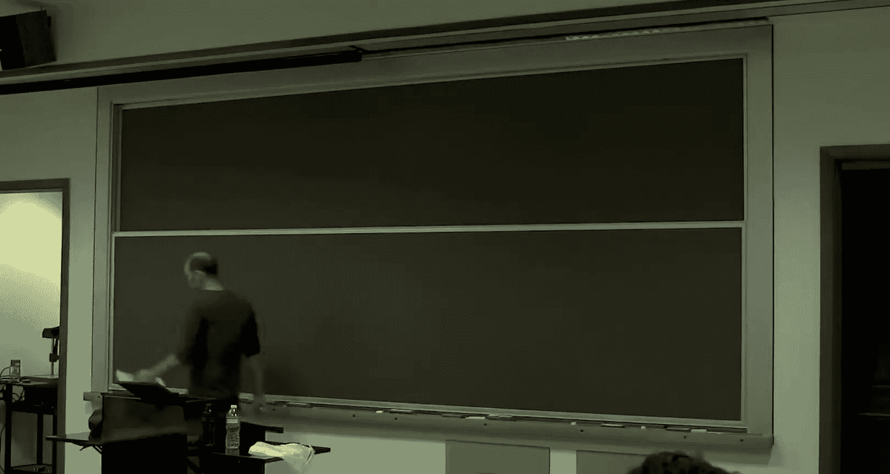

So how about more？Like， say mixed equilibrium。

In general two player games。

Or。Pure equilibriumlibria， or at least epsilon approximate pure equilibrium。

In general， routing or congestion games。

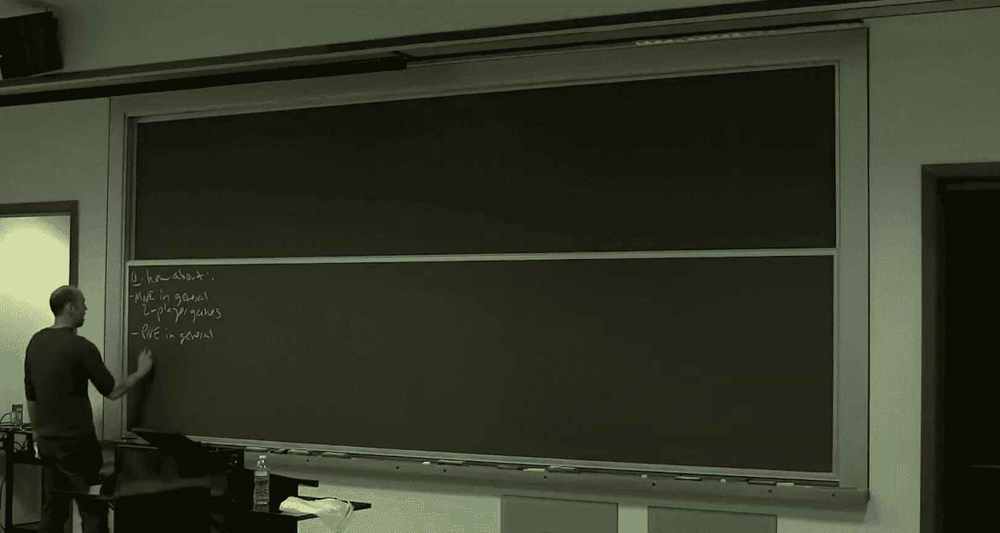

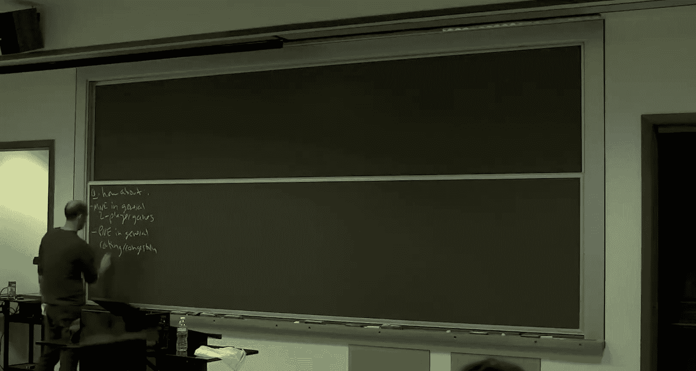

Meaning where different players can have different sources and sinks。 That's what I mean by general。

So nobody knows。Of a learning process that converges in polynomial time to approximate equilibriumria in either of these settings。

 there are no positive results for either of these two cases known like the ones I've showed you for all of the other examples。

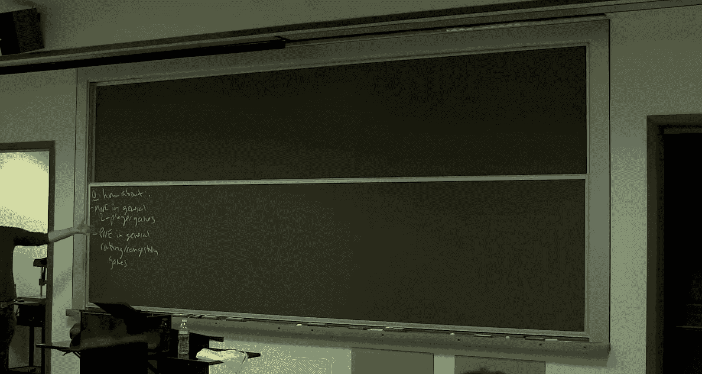

So， you know that motivates the question， you know， are we just lacking imagination。

 have we just been stupid， and there's one out there to be found。

 or is there actually some kind of obstacle， is it possible that actually there's no learning dynamics or maybe even no polynomial time algorithm for computing these？

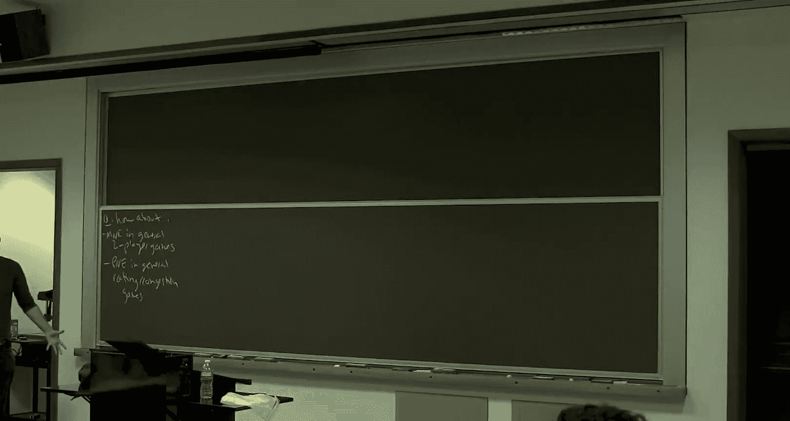

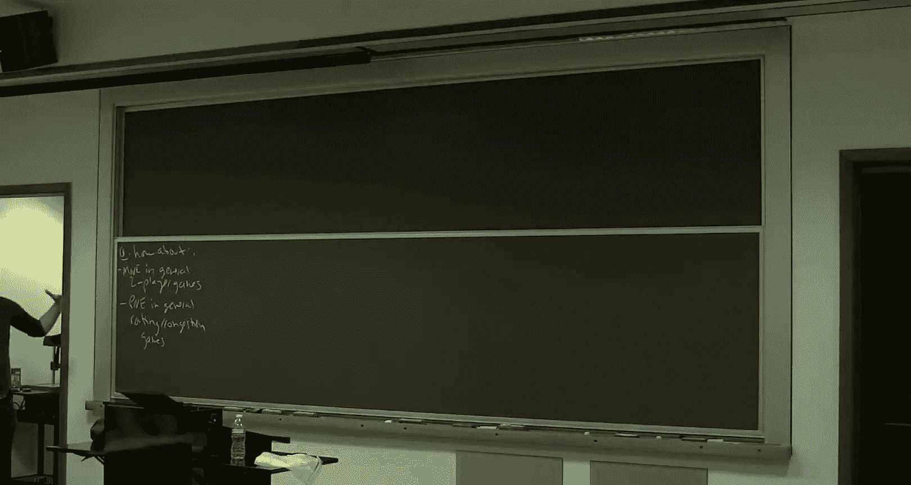

So what I want to talk about this week， this final week is how you can make sense of questions like that。

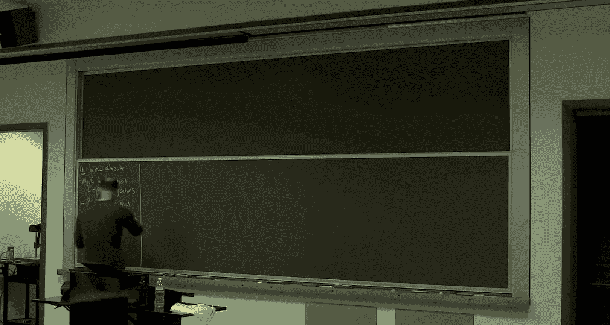

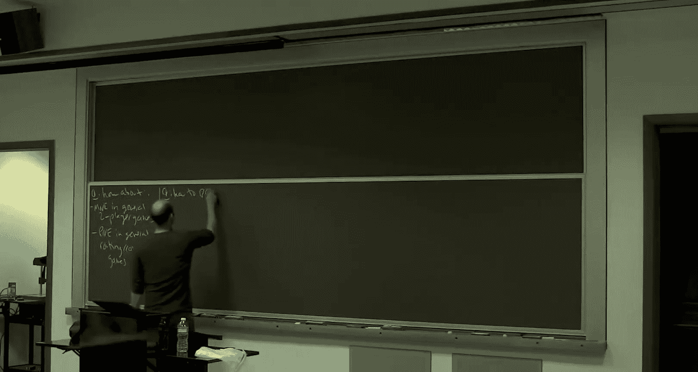

So how do we prove limitations。

On what is possible。

This is obviously an important complementary endeavor to the positive results of the last couple weeks。

So， you know， we're familiar with this sort of issue， you know， when you study。

 when you first study algorithms and you learn all these cool polynomial time algorithms like Dykster's algorithm and Cruscle's algorithm。

 you know， you learn that minimum Spanish tree is efficiently solvable。

 but then somehow no one ever teaches you a polynomial time traveling sales and problem algorithm。

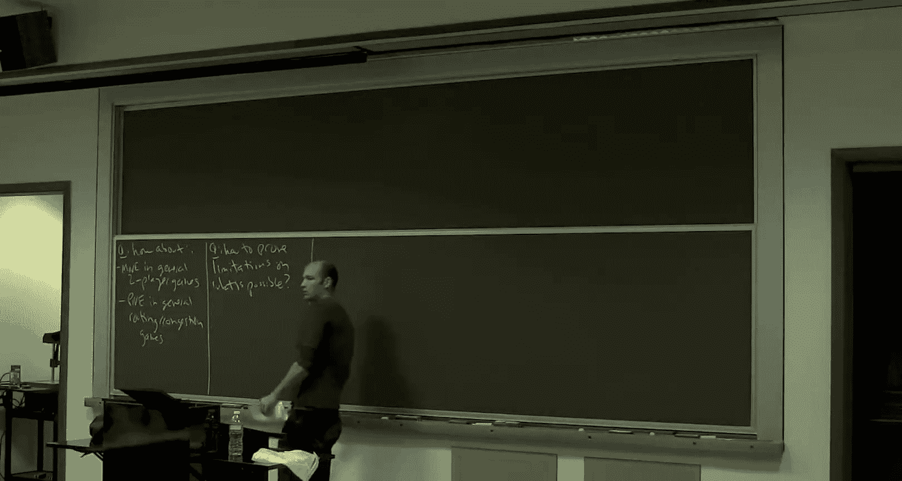

And eventually it becomes clear that nobody knows of one。

 and then you have to wonder if there is one or not。

And we don't know the answer to that question to this day， but at least we have MP completeness。

 which gives us an explanation for why we haven't found the polynomial time driving salesesman problem algorithm。

So what we want is the same thing here。We want some analog of MP completeness tailored for equilibrium computation。

 explaining why we don't have positive results in cases like this。

 mixed equilibrium for biometricx games， cur equilibrium for general congestion games。

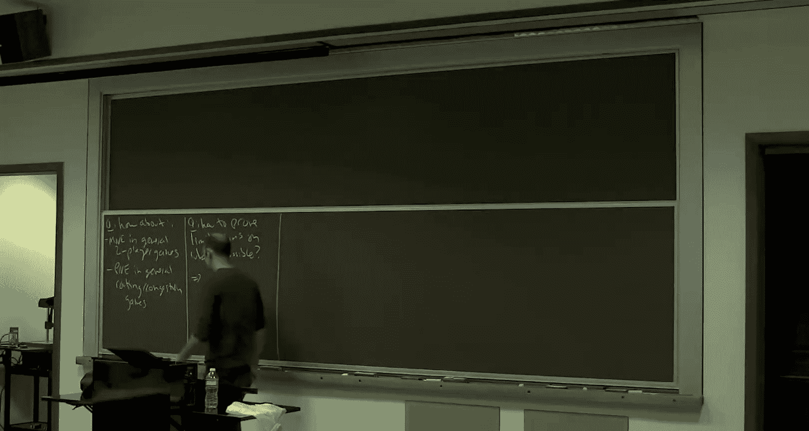

So we need analogs。Of MP completeness。

For equilibrium computation。

So that's what we're going to do next。I want to start。 So the plan is。

 I'm going to discuss this today， pure equilibrium。

 That's technically a little bit easier to start with。 And then on Wednesday。

 we'll discuss mixed equilibrium。

In bymetricx games。

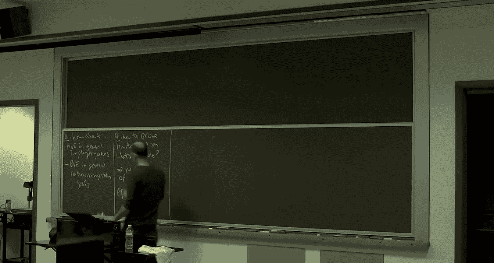

So most of this lecture is going to be what probably is going to seem like a digression。

On local search problems。So I want to talk about the complexity of local search。

 I mean just looking ahead a little bit， the connection is going to be you can think of best response dynamics as a local search looking for a pure na equilibrium or specifically for a local minimum of the Rosenthal potential function。

Anyways， the point is this theory was developed quite a while ago back in the mid-80s and the authors。

 Johnson， Papa Dimitri Yanakakius， they did not have equilibrium computation in mind。

 they had local search problems in mind， but it turns out and this became clear more like 10 years ago that this is exactly the relevant complexity theory to make sense of this question。

Is there a polyal time algorithm or learning dynamics for pure equilibrium in general congestion games。

 The answer seems to be no。 It's going to suggest the answer is no。

 and this complexity theory will explain in what sense。So again。

 I'm going to connect this back to routing games empirical empirical Lib at the end of the lecture。

 But for now， it's just going to be a discussion a complexity of local search。All right。So。

Let me just say a little bit about local search。 Hopefully you've all seen it at least in passing somewhere。

 a canonical example of a local search problem would be max cut。So in the max cut problem。

The input is an unweighted， sorry， undirected graph。It just have weights。No negative。

And the feasible solutions are just the cuts。Okay， so some of the vertices S are on one side of the cut。

And the other vertices， S bar on the right side of the cut， both S and S bar should be non empty。

So in general when the cut， you have some vertices， you have other vertices。

Some of the edges are going to have both endpoints and s。

Some of the edges will have both endpoints in its bar， and then they will be crossing edges。

Edges with one endpoint and each side。And the goal in the max cut problem。

Is to maximize the total weight of sum of the weights of the crossing edges。So。

Unlike the minimum cut problem。This is an NP hard problem。I mean。

 you could try flipping all the edge weights and computing a min cut。

 but actually all the min cut algorithms， you learned that apparently normally a time don't work for negative edge weights。

 Okay， so they're really different problems。 Maxax cut is MP hard。So。

One heuristic you can use for max cut。 among other problems is local search。And people。

 this really is a heuristic that people use quite a bit for MP hard problems， including for Max Cu。

And so the hereursistic is you start with some arbitrary solution。

 like maybe the first half of the vertices on the left， the other half on the right。

 just to get going。So you serve an arbitrary feasible solution。

And then as long as there's a local move， and I'll explain what that means in a second。

 as long as there's an improving local move， a local move that makes the solution better。

 and you just do it。Okay。And so a local move。So this is context dependent with a local move。

 but a max cut， the obvious notion of a local move is you take one vertex。

Say on the left side and you move it to the other side， always making sure both sides are not empty。

So you just switch one vertex。So for example。From S to S bar。

So that's a local move and a local move is improving if go figure。

 if the sum of the weights that edges crossing the cut becomes bigger because that's what we want。

So when you make a local move， how does the objective change exactly？Well。

 when you move it say from the left to the right from S to S bar。

 there are some edges that didn't used to get cut。 now they do。

 some edges that used and then vice versa。So。Think of V as moving from S to S bar。

So if V is getting moved， if U is an S and V is now an S bar。

 this is an edge which is now getting cut that didn't use to get cut。

So if we sum this over edges still on the left， these are the newly cut edges。

And then if we look at the vertices on the right， V is now joining all of those vertices。

 So those are edges that used to get cut。 and now they're not。 So these are the newly。Uncut edges。

And so if that difference is strictly positive， then moving the vertex increases the weight of the crossing edges。

 So that's an improving local move。 Local search just says as long as you can make a move like this。

 make one and local search then terminates with a cuts where there are no improving local moves。

 And that's a locally optimal solution。All right， so one thing。Which maybe is obvious。

 but let me let's just be clear about just because you've found a solution which is locally optimal that you can't improve of the local move does not mean in general that you found a solution which is globally optimal。

 So maybe by moving a bunch of vertices at once， you could get a strictly better cut。

So let me just give you a concrete example。So notes。Local opt does not imply global opt。好。

So just consider。A clique on four vertices。With edge weights，1 through 6。

So let's examine this cut here。the left nodes are S and the right nodes are S bar。

So the total weight of the crossing edges here is going to be 15， right，1 plus 5 plus 6 plus3。

I claim this is a locally optimal solution。 That means any local move only makes it worse。

 okay so a local move here is going to give me a cut with one vertex on one side and three vertices on the other side。

 So the cut edges are just going to be the three edges adjacent to a single vertex。

So the possibilities are this cut， which would have weight 11， this cut， which would have weight 12。

 this cut， which would have weight 11 and this cut， which would have weight 8。

And so those are all worse than 15。 So this is indeed a locally optimal solution。

But it is not a globally optimal solution。That would be putting the two top edges。

So top vertices in one side and the bottom vertices in the other。 Then we cut the edges 4，5，6。

 and 2 for a total of 17。So a local search is nothing but a heuristic。

 It's an often very useful heuristic， but it is a heuristic。And as such。

 you might expect that computing merely a locally optimal solution to a problem like Max cut。

Could be easier。 It's certainly at least as easy as computing a globally optimal solution because global optimal means local optimal。

 And once you see this gap， you think， well， maybe it's actually strictly easier to merely compute a locally optimal solution。

 And that generally is true。So let me give you a very concrete example of that。

So think about max cut。 But let's say rather than having all of these different weights。

 So it's some arbitrary graph， not necessarily a clique， some arbitrary graph。

And all the edge weights are， let's say one。So now the max cut just strives to maximize the number of cut edges。

So one fact which I hope you find easy to believe。Is that the problem still MP hard in this case？

If you really wanted to find the best solutions， it's an MP hard problem。

But finding a locally optimal solution is not hard。If all the weights are one。In fact。

 I claim if you just run local search。This algorithm here。I claim this can't run very long。

 and remember when local search terminates， it certainly terminates at a locally optimal solution。

Again， that it terminates in at most。The number of edges。Iterations。So you see why that's。True。

So in an iteration of local search and you make a move。

 what can you say about the objective function value。Goes down， good。 And if all the weights are one。

 what's the minimum amount by which it will go down。Well， yeah， goes up。 Excuse me。

 What's the minimum amount。 I wish it will go up。 It'll go up by one for sure。 Okay。

 because everything's integral。 What's the minimum possible objective function value。Z。

 what's the maximum possible objective function value？Well if it's apartpartid。

 you can cut all the edges。So the maximum number of iterations is because you're improved by one every time and the maximum is the number of edges is the number of edges。

So local search is just going to reach a locally optimal solution blazingly fast with unit weights。

 So it's definitely easier than finding a globally optimal solution。And just again。

 so to give a forward pointer， as far as equilibrium computation。

 it's the local search problem that we really are going to care about。

 not the globally optimal problem that we're going to care about， okay。

 so it's really local search we need to understand。Al right。So4 Max cut at least。

 at least for the special case where all the weights are units。

 computing a locally optimal solution is easy， how do you do it， just use local search。

So here's a fact。If we drop the condition that the weights are unit。

 if they can be arbitrary integers。So that this maximum cut value could be very large。

 exponentially large， say， in the size of the graph。

 then nobody knows how to compute a locally optimal solution。

 a locally maximum cut in polynomial time。No one knows how to do that。

And so I want to emphasize the claim here is stronger than just asserting nobody knows if local search terminates in polynomial time。

 in fact， as we'll discuss later， well， it's known that local search does not terminate in polynomial time for weighted max cut what I'm saying here is suppose I even allow you to compute a locally optimal solution any way you want。

I don't care if you use local search， okay， use the cleverest polynomial time algorithm you can come up with。

 even with the complete range of poly time algorithms。

 nobody knows how to compute a locally optimal solution to mass cut instances with general ratess。

So the plan for the rest of the lecture is I want to tell you sort of the more classic complexity theory。

 which formalizes the negative result here， the idea that the reason we don't have such an algorithm is because we suspect no algorithm exists。

 it's complete for the appropriate complexity class。

 and then I'll conclude by making the connection back to pure equilibrium of routing and congestion。

嗯。But so the next step is。All right， we're stuck on weighted max cut。

 we don't know how to compute a locally optimal solution。Can we somehow prove that there。

 it's not that we're being stupid。 It's that there doesn't exist any polynomial time algorithm。

For finding a locally optimal solution。All right， so what would that look like just as a theorem statement saying that there doesn't exist a poly time algorithm？

Well， the strongest statement obviously would just be what I just said， the unconditional results。

The strongest negative result you might prove is that you just say among all polynomal time algorithms。

 none of them work。So an unconditional impossibility result。Now。

 we don't really have any results of that form。 So in particular。

 if you could prove there was no polynomial time algorithm for finding a locally optimal max cut。

 that would separate P from NP。So that's a little ambitious。For today， at least。

So we're not going to try to prove unconditionally that there's no polynomial time algorithm for a locally optimal max cut instance。

So the next best thing then would be， well， you know， we know about MP completeness。

 We agree that MP completeness is， you know， in some sense， the standard means。

That you argue that a problem in MP is intractable。

And seems to require brute force search or something very close to it。

And it turns out MP completeness is also too strong a goal for local search problems like Max cut。

 There's a sense in which computing locally optimal solutions really is easier than NP hard problems and that'll make precise on Wednesday okay but for now I just want to point out。

 we're not going prove that there's no polynomial time algorithm that's too strong。

 We're not going to prove that it's MP complete that's also too strong。

 So instead we're going to develop an analog of NP completeness tailored for local search algorithms。

 as a way of arguing that we don't think a polynomial time local search algorithm for max cut exists。

So here's going to be the plan。I'm going to write down right now the English interpretation of the theorems we're sort of shooting for。

We're going to formulate and prove theorems that say computing。A locally optimal solution。Of Max cut。

Is as hard。As。Any other local search problem？Okay， so this is what we're shooting for。

 this is what we're shooting to formalize and prove。Again。

 the intent here is to have an analogy or a sort of analogous version of MP completeness tailored for local search problems。

 one way to interpret MP completeness is that that's a problem which is as hard as any other problem for which you can efficiently verify solutions。

 efficiently recognize solution， so this is what we're going to prove instead。

 as hard as any other local search problem。So if Max cut is sort of as hard as completely abstract。

 completely general local search， there's a sense in which we then don't expect there to be algorithms significantly better than local search itself。

 Again， remember for these problems， I want a locally optimal solution。

 I don't care how you do it if you use local search to find one great。

 if you use some other clever algorithm to find me a locally optimal solution， I'm just as happy。

Okay。So if we can formalize and prove。This idea。An interpretation is that we don't expect。

To improve much。Over。Local search。In exactly the same sense as for an NPp complete problem。

 we don't expect to improve much over brute force search。As a bonus。

 it's also going to imply once we formalize this theorem。That local search takes exponential time。

So again， as far as the analogy with NP and NP completeness。

 you can think of problems in NP as problems where you can efficiently recognize a solution。

 the problems which are solvable by brute force search， MP completeness says well。

 you can't do much better than brute force search， we're going to do the problems that are solvable by local search。

 which is in some sense a little bit more structured。

 a little bit more guided than brute force search and we're going to try to prove the hardest problems of that type where you can't beat local search。

 which is exponential time。Yeah。any other local。Like。Basically， yeah。

 that's intuition and the formal definition is coming up。So yeah， So， okay， So formalizing this。

 we have two things to formalize first is as hard as。 This is just going to be a reduction。

 So most of you should have strong intuition。 what this is going to look like。

 What we really need to be a little bit more more careful about is what is a generic local search problem。

 Okay， so that's the next definition。Okay， and so again， keep the analogy with the class N P in mind。

 So N P， you can think of as the class of problems that are generically solvable by brute force search。

So you I don't know what definition of NP you've seen there's a bunch of them。

 but one of them is there are problems that are characterized by an efficient verifier so if I show you an alleged solution。

 you can quickly check whether or not it is one like a Hamiltonian cycle in a graph if I show you one you're like yeah。

 it's a Hamiltonian cycle If I try to fool you， you can easily check that it's not a Hamiltonian cycle。

So。NP defined by efficient verifier。 that's just sort of asking。

 what is the minimal ingredients that I need to solve a problem in exponential time using brute force search。

 I need a verifier to tell me that when I try a particular solution， whether it's a solution or not。

So here to define very generically what is a local search problem。

 we need to ask what are the minimal ingredients that we need for the local search algorithm to be well defined。

 starting from an arbitrary solution， keep moving to better and better solutions until at some point you get stuck and there's no improving moves。

 So what are the minimal ingredients we need for that algorithm to be well defined。Okay。

 so rather than one polynomial time algorithm and an efficient verifier here， I'm going to use three。

ど。So a generic local search problem。Has three poly time algorithms。The first one。

 given an instance like Max cut。Okay， like a graph just tells you where to get started。

 It gives you an initial feasible solution。 So again， it's just for max cut。 Maybe it's you know。

 the first half of the vertices on the left， the second half of the vertices on the right。

 So some canonical way of getting started。So that's important for running local search。

 you need to have an initial feasible solution。Now， on local search。

 you're trying to optimize something。Like Max cut。So we want an algorithm which tells us how well we're doing。

 that for feasible solution computes for us in polynomial time。

 how the objective function value of that feasible solution。And， thirdly。

If we're at a solution which is not locally optimal， we need to know where to go next。

So this third algorithm is just going to be like an oracle which says， oh。

 this isn't locally optimal， and here you should move to this neighboring solution。

So given a feasible solution。Either reports。You're done。Or。If not。Produce it better。Neighbooring。

Solution。Let me just say better solution。Yeah。Thank you。Yes， so。By virtue of being polynomial time。

 it's sort of built in。 So an instance has some length， it has some L bits。

And so each of these algorithms， know， being polynomial time in L， the input length。

 that can only operate on strings of length and polynomial and L。

So that's going to co them and then it just says the you know the。

A basically says everything you're operating on are bit strings of some length of polynomial。

 So it's an exponential upper bound on what you might ever see。

So that is a consequence of this polynomial time constraint。や会。That's not how it's specified。

 so the input specified just as bits。Good， so given one through three。

This is enough to run the local search algorithm。 You invoke algorithm 1 to get started。

You iteratively invoke algorithm number three to generate new solutions。

 You can use algorithm number two just to verify that you're making progress with algorithm number three。

 And at some points， you'll run out of there's a finite search space that's sort of implicit in the polynomial time definition。

 and eventually you'll run out Okay so you'll halt necessarily at a locally optimal solution。

So in some sense， again， So why do we make this definition。

 We have this very concrete problem We care about max cut。And we want to say， it's hard。

And so what we're trying to do is say it's as hard as any conceivable local search problem。

 So this is our attempt at any conceivable local search problem。

 exactly in the same way that if you have a concrete problem like traveling salesman problem and you want to prove it's hard。

 the more things you can prove it's at least as hard as， the stronger the evidence of intractability。

 So we're making this as abstract as possible to have the strongest possible intractability instance for the problem evidence for the problem we actually care about。

 Max cut for now and the pure equilibrium later。And so then the goal， given this。It's just compute。

A locally optimal solution， again， an algorithm， which is correct。

 would be just run local search that's guaranteed to terminate a locally optimal solution。

 But for the purposes of the computational problem， compute a locally optimal solution by any means。

 if you have some other clever algorithm， which can just zoom right to a locally optimal solution。

 I'm totally happy to receive it。😊，So that's the complexity class， PLS。Defined by Johnson。

 Pator Miru。And yanaockius。And again， the intent was to make it as big as possible so that any complete problems for this class are as hard as possible in some sense。

😡，All right， questions about the definition of PLS。Yeah， so the the neighbor is sort of。

 the neighborhood is sort of implicit here。 So there isn't an explicit neighborhood in the description。

 I mean， in some sense。The neighborhood is just the range of that third algorithm。

So I haven't operated defined a neighborhood。Sort of， I mean。

 the definition of the neighborhood is just totally implicit in what that third algorithm happens to do。

So if it declares some solution。Locally optimal， then you can it tells you something about the neighborhood。

Right，So again， so sorry， just to connect this back back to max cut。So in the first algorithm， again。

 this just returns any old cut。 doesn't matter which。Second algorithm， this is clear。

 You just count up， just evaluate the weight of the crossing edges， clearly polynomial time。

In the special case of Max cut， the way the natural way to implement this third algorithm is simply to try all of the linear number of local moves and see if any of them improving。

 and if one is improving， then return an arbitrary such move， if none are。

 you report locally optimal。Okay，So in the concrete case of Max cut。

 that's what this algorithm looks like。 But for a generic local search problem。

 this is all we ask of it。So computing a locally optimal solution of a max cut instance is certainly a member of PLS and any local search problem you've probably come across in your career is probably a member of this PLS class。

Okay。So， good。So PLS is our definition of any other local search problem。

And that's the harder definition。 And now let's just stop the eyes and cross the T's for as hard ass。

So this will be familiar from NP completeness。So we want a notion of a PL S complete problem。

 problem as hard as anything else in P S。 so we need a notion of reduction。

And so a reduction from one PLs problem to another。

Well so we just follow our nose with this definition right we know the point of this definition is to say if we can solve L2 in polynomial time。

 then we can solve L1 in polynomial time L1 reduces to L2 Okay。

 so we can transfer tractability or interacttractability in the opposite directions。

So if you're think about that， okay， suppose I gave you as a black box， an algorithm for L2。

 you want to solve L1。So what you want to do is， first of all， you say， okay， well。

 I need an instance of L 2 to invoke my black box。 so I need some polynoal time algorithm that takes an input to L1。

 makes it an input to L 2。 so I can feed it into the black box。

And then the black box gives me an output。So it gives me a locally optimal solution for that instance of L2。

 which is not what I care about。 I care about my L problem。

 So I need a second algorithm that maps that locally optimal solution to the L2 problem back to one for the L1 problem。

That's it。Ch。So apart the only time algorithm A。That maps instances of L1。Two instances in L2。

An polygonmial time algorithm B。That map solutions。Meaning local optima。Of the L2 instance。

To a local optima。Of the original problem， I care about X。

So this one just maps inputs of L 1 to inputs of L2。

 This one maps solutions to L 2 back to solutions to L 1。And basically， by definition。

 I set up this definition so that if you give me a polynomial time algorithm for L2 and there's a reduction。

 I can combine those three algorithms to solve L1 in polynomial time。对。The input。The input， right。

 so an instance of a problem has some input length。Yeah。Okay， and then so with a reduction。

 the notion of completeness is the usual one。So a language in PLS or pub in PLS。Is PLs completes？

If every problem。AndPLS reduces to it。So all of the definitions have been concocted。

So that if you have a polynomial time algorithm for a P， L S complete problem。That is。

An algorithm which finds a polynomial time， a locally optimal solution。

 Then you have a polynomial time algorithm for every PL S problem。So in that sense。

 these are the hardest problems in PLS， you solve one of these， you get the whole class PLS。

So that should all be familiar from MP completeness。All right。Here we go。So cool definition。

You wonder if it's too cool to be true。In the sense that could there really be a single local search problem。

 especially a problem we might actually care about。

 that somehow simultaneously encodes the complexity of local search just generally。And， you know。

 we're all little bit spoiled because we're so used to MP completeness。 At this point。

 we kind of know that theories like this do exist。 If you'd never seen MP completeness before。

 this would maybe seem far fetched。 So how can you have one problem simultaneously encoding every single local search problem。

But why not， we know that3SAT or TSP or whatever simultaneously encodes all problems that you can efficiently recognize solutions。

 so why not have a parallel for local search。And it turns that you can。So the first such results。

We're in this original Johnson P Gna Caucus paper。There's also a very important follow up by Sch and Yoococs。

Which says there exists P， L S complete problems。Including many natural problems that we actually care about。

 not just contrived， complete problems。In particular。Including Max cut。With general weights， Okay。

 there's lots of others as well。 But for today's lecture， I'm just going to use max cut。

So I'm not I'm not gonna prove this fact。 I mean， in some sense at a high level。

 you know how results like this go。 So first， you need some analog of cook theorem。

 So if MP completebletetan' cooks theorem says the threeat， at least is MP complete。

 So it says it's sort of the thin end of the wedge There's some problem that might care about and seems expressive enough to encode other problems which is indeed MP complete。

 then you have an analog of say what carp did a year later， with lots of other problems。

 that threesAT reduces to。 And then those become MP complete as well。

 So Johnson Po Ynakas gave an analog of cooks theorem for a problem called circuit flip。

 So it's not a logic problem， It's a circuit problem， but the same kind of flavor。

 and it' sort of know the difficulty is polynomial and the difficulty of cooks theorem。

 So it's a little harder， but it's not not that much harder。

 but the analog of the initial carp reductions。Showing that lots of other natural problems were P less complete。

 that was done by shaing yanaoccus， including for max cut。 That's actually quite hard。

 Those are some of the more intricate reductions I've seen。 It's a very sort of impressive work。

 okay。But happily， we can just sort of stand on the shoulders of these giants and use this in our own work。

 That's the great thing about complete problems。 Once so improve the complete。

 you can just use it for your own devices。Okay， so we'll assume this from here on out。All right， so。

う。There's also an interesting corollary。Which comes out of both of these works。

Which is that even in the perhaps unlikely case。Okay， so we don't know if P equals P， O S or not。

 It would be very surprising if they were equal。 It wouldn't be。

 It wouldn't be as sort of shocking as if P equals N P， but still people believe these are different。

And but even if even in the case where P equals P， L S。

 a consequence of this work is that local search at least。 Okay。

 so the generic local search algorithm takes exponential time in all known P， L S complete problems。

So summarizing， consider a PLS complete problem， like， for example。

 max cut with general edge weights。The first statement is。Theres no polynomial time algorithm。

 local search or otherwise， that's guaranteed to find a locally optimal solution unless P equals P L S。

So for all we know， P equals P L S， and there is some very clever polynoial time algorithm that finds local optimo。

 But that's the only way it can happen。 As long as P and P S are different。

 you cannot find a locally optimal solution efficiently by whatever means。 That's statement1。

 So that's a conditional statement because it's conditional on these two being different。

 which we don't know。The second assertion is different。 It's unconditional。 It says。

 no matter what peak was P S or pnaical to P L S， the specific algorithm of local search is slow In the worst case。

 exponential time for any P S complete problem。 Okay， So those are two different points。

 an unconditional result and a conditional result。Good。

 so as far as this exponential local search time， we'll see this in action in a second。

 But the way it works is， first of all， you just prove for the analog of Cook's theorem for the circuit flip P S complete problem。

 You just prove directly that local search can take an exponential number of iterations。

 And then it turns out that's preserved in all known reductions that establish P S completeness。

 So you transfer not just the P S completeness of the source problem。

 but also the lower bound of exponential iterations on local search。 That's why that's true。😊。

All right。So that's what I wanted to say。About complexity of local search。

 So the rest of the lecture is about connecting this to pure equilibrium。

There might just P some problems。searcharch。Yes， but if that's the case。

 it is not done by local search。 It has to be done by some other kind of algorithm。Oh， right。

 good point。 So as far as I know， there is， I don't believe it's known that。U。You know。

 I don't know of any generic result， which says every Ps complete problem takes exponential time with local search。

I'm pretty sure that's not known。So basically， we only know it because it's true for the original problem。

 circuit flip， and it always gets transferred by reductions。

That's my understanding of the too of the art。 Good question。O。Alright， so let's connect this。

Back to pure equilibrium。 So let's understand how P S completeness。Gives us an explanation。

Of where our positive results stopped。For routing and congestion gains。So。

So this last part of the lecture， I'm going to phrase in terms of congestion games。

But the first order， you should just think about these as being atomic， selfish routing games。

 I mentioned congestion games and passing a while back。

And the context when I mentioned them is I said， well， you know。

 we were provingrov all these things about atomic selfish shuting。 The price of energyarch is5 hps。

 There's always a pure strategy National equilibrium， et ceteraa， et cetera。

 We had all these cool positive results。 And at one point， I remarked。And also。

 we never used the fact that it was a graph or the fact that strategies were paths。

 strategies could just be any old subsets of the edges and all the positive results would still work equally well so congestion games are just routing games or strategies or arbitrary subsets instead of necessarily paths。

 it's going to be more convenient for this lecture to work with congestion games。 But again。

 in your mind， think selfish routing games that's totally fine。Okay。

So let's just start by connecting pure equilibriumria and congestion games to this class PLS we just discussed。

So the first claim。To make sure we have all the definitions straight。

CompComputing a pureac equilibrium。And so again， there can be multiple pureiclibria in these games。

 and I don't care which one you give me。 It is going to be sort of the easiest problem about pureicallibria。

 If there's many， just give me one，s all that's your only responsibility。

So computing a pure equilibrium。Of a congestion game。If you think of that as a computational problem。

 that is in PLS。So when I talk about computational problems， I mean。

 I should tell you how the input is described。 So again， if you think about a selfish rounding game。

 then I just sort of give you the network， I give you this directed graph。

 and I need to tell you what the cost functions are So if there's K players。

 I need to tell you the value of a cost function at the integer is 1，2，3，4 all the way up to K。

 so I just give you those numbers as a list So I give you a graph and I give you the cost functions。

For a congestion game where you don't have a network。

 I just give you a list of the strategies that each of the K players is allowed to use and the cost functions。

So you're given a congestion game in that description。 and I want any pure natural equilibrium of it。

So the first claim is just that this problem is a member of the class P，L S。 Okay。

 so it's no harder than P L S。 The hardest it could be is P， L S complete。 It's inside P L S。

So for this， you just need to remember how we proved。😡。

Guaranteed existence of pure equilibrium in these games。

 And the way we proved it was using his Rosenthal potential function。So recall。

At the pure strategy Nash equilibriumria of a congestion game。Are exactly the local minimum。

Where here a local move is just a single player stretches a strategy that is local moves or unilateral deviations。

Local minima of the Rosenthal potential。Which was just some function。Okay。

 so this is a strategy profile， it says who picks which strategy？You have edges or resources。

 you just sum over all of the edges。And then on a given edge， what you do is you're just sum。

Up to the number of players that use that edge。And you just evaluate the cost function at the edge at  one。

2， three， all the way up to the number of players that use it。So we saw this。

 This is how we proved existence。 The context there is we wanted to prove there existence at least one pureyna equilibrium。

 So we showed that for this function， whenever a player is unilateral deviation。

 the change in fee is exactly the change in the deviating player cost。 Therefore。

 the global minimum was a pure National equilibrium。

 We also observed the stronger statement that actually。

 not just the global minimums of purena equilibrium。

 but any local minimum of the potential function is the national equilibrium。 And that's the enoia。😊。

Okay。Also， best response dynamics。So what is best response dynamics that just says。

 while there's a player with a unilateral deviation who can make themselves better。

But if you think about it， that's exactly the same thing as while there's a unilateral deviation that would decrease the potential function because again。

 remember when anybody changes， the decrease in their cost is exactly the decrease in fee。

 So there's an improving move with respect to fee。 if and only if someone has improving unilateral deviation。

 So best response dynamics is nothing more than local search。For the problem of minimizing fee。

So this is why competing a purena equilibrium of a congestion game is just a PLS problem。

 If you want to be more formal about it， I would have to actually specify these three algorithms。

 So algorithm one would just give an arbitrary strategy profile like every player just picks their first strategy。

 Play two algorithm two just evaluates the Rosentthhal potential function and then algorithm3 just checks for a best response by every player。

So that's membership of the National equilibrium problem in PLS。All right。

So any questions about that？So this hopefully shows we're on the right track。

 So this is what suggests that maybe P O S is the right complexity class to reason about this problem。

 And so the。Kind of really interesting result。Which is fabric happened to me you in Tawar about 10 years ago。

Is that it's not just a member of PLS， but its's PLS completes。Sure。

And so this I want to prove to you assuming that max cut is PLS complete。But again。

 before I prove it， let me just sort of remind you what are the implications。

So no polytime algorithm。For computing of purena equilibrium。Unless P equals P L S。

 So this is the conditional statement， and then the unconditional statement is best response dynamics。

In any them。Takes exponential iterations。Okay， so these are consequences of this theorem。Alright。

 so any questions for the proof。And again， as far as the big picture。

 this is explaining why our tractability results for the pure natural equilibrium case were limited to the symmetric case。

 single source， single sink， or equivalent， all players having exactly the same strategy set。

 If this is basically giving us matching negative results for congestion games because this is gonna be for asymmetric congestion games。

 They'll be peel ass complete。All right， so a proof。Well。

 we certainly don't want to improve completeness from scratch。

You just want someone like Steve Cook or like Johnson Parici on a Caucus to prove that kind of result all once。

 and then you stand on their shoulders。So we want to reduce from some problem。

I've only told you one problem。So。Given an instance of max cut for which we want to find a locally optimal solution。

 I need to produce for you a congestion game so that if all we have to do is find a peri equilibrium in that congestion game would be done。

 we can map it back to a locally optimal max cut。So。We're giving a graph。Eevduates。

And we're to construct a congestion game。So in other words， in our reduction。

 our definition of reduction， we have two polynomial time algorithms A and B。

 this construction is the polynomial time algorithm A。 It's going to map an instance of one problem。

 or instance of the other problem。So the players in the congestion game。

Well be one to one correspondence with the vertices of the graph。Jumping ahead a little bit。

 each player is just going to have two actions， two strategies。

 and so that means that the strategy profiles， the two to the n strategy profiles will be in a natural correspondence with the two to theN cut to the graph。

So the edges， if you like， or the resources of this congestion game。

 there's going to be two resources for each edge of this graph。So I'm going to call these。RCVS。

An RCE S bar。So let me tell you， this will make more sense。

 once I tell you these strategies for each player in the congestion game。So， player V。

Has two strategies。Intuitively， this player picks whether it's on the left side of the cut or on the right side of the cut。

Okayay。But formally， it has two strategies。So again。

 we think of this this player corresponds to a vertex in the given graph。

If the vertex V in the given graph G of the max code instance， if it has say seven incident edges。

Then in the congestion game， this player is going to have two strategies。

 each of which is a set of seven resources。 Okay so the resources in its strategy will correspond to incident edges back in the max cut graph。

So it's two strategies。So again， these are the incident edges to V and the max cut graph G。

This is one resource per incident edge。One of the strategies， it's the resources。

And with the superscript S。And then there's a sort of identical copies of it。 So again。

 if it has seven in and and edges， this is a strategy comprising seven resources。

 This is a strategy comprising seven different resources。It has to pick one or the other。没有。Notice。

So think about things from a resources perspective。So I claim in this congestion game。

 not a lot of things can happen。 Okay so the loads on resources are highly restricted。

So consider an edge of the original mass cut graph with endpoints U and V。

So if you think about things from a resources perspective， so some。

Resource corresponding to some edge E。There's only two players of the congestion game。

That are in a position to use this resource。So look at a resource superscriptive by edge with endpoints。

 U and V。Only the players U and V possess strategies that include this resource。So I'm a resource。

 some players can use me， some players can't use me。When I survey that landscape。

 I notice there's actually only two players that have a strategy that would impose any load on me。

 Okay， And they're the players U and V， the endpoints of my edge。

 So my load in this congestion game and every strategy profile will be either 0 or  one or 2。

 Those are the only possibilities because only two players can use me。Furthermore。

If I'm found a resource in this congestion game， I have a twin。So if I'm RCBS。

 I have a twin RCV S bar。And actually， the same things true for both of us。RightSo for both of us。

 only the players U and V can use us。And moreover， each player is going to use exactly one of us。

Okay， if a player chooses its S strategy， it's going to use the S resource。

 If it uses S bar strategy。 It's going to use the S bar resource。 Okay。

 so each of our individual loads is 0，1 or 2。 And actually sum of our loads is exactly 2。Okay。

So if I'm R E S， either I have 0， my twin has two。 I have one。 My twin has one， or I have two。

 and my twin has 0。 Those are the only possibilities。So， combined load。Of these two resources。

 RSE and its twin。R S bar E。Is always two。From the players U and V。Now。

 I haven't actually defined the cost functions yet。

 but at least now we know we don't even care about the cost functions with more than two players。So。

 cost。Of a resource in its twin。 It's gonna be 0。If it's used by one player。

And it's going to be equal to W subB， What's W subB。

 That's the weight of edge E in the given max cut instance。And we have to use those somewhere。

So that's going to be the cost of resource if it's used by the maximum number of players， namely too。

So again， if we sort of zoom in on a pair of resources， okay corresponding to Egy。

 resource and it's twin。 we have argued that their loads are either 2，0，1，1 or 0，2。 If they're 1，1。

 then both of these resources have zero cost。 If it's 2，0， one of them has cost 0。

 the other has cost W。All right， so that's the description。Of the congestion game。

Any questions about that。The interesting game is where you' that。A source and the sink and then some。

That's a routing game。Yeah。Instead of pass， they're just subsets。在。Edges。So like， okay。

 so I just they can pick between different。I basically give you a list。

 I say you're allowed to use resources one，3 and five as a group， or you can use2。

4 and  seven as a group， or you can use1，8 and10 as a group and then there's some list like that and that's exactly what you're provided is input and the problem。

Okay。Good。So that's the construction。 So we now have to do the correspondence。

 but this is the completion of the construction。 Give it a mass cut instance。

 this is the corresponding congestion gap。All right， so what's the correspondence？Well。

 what's hopefully very clear is that。There's a bijection。Between the cuts in G。

And the strategy profiles in this congestion game。So by construction。

 there's one player corresponding to each vertex， each player has a binary set of actions。

 so it can either choose S or choose S bar， and so those correspond exactly to in a cut for each vertex you choose whether it's on the left side S or the right side S bar。

So there's a correspondence between feasible solutions to the Mac cus instance and strategy profiles of the congestion game。

Moreover， and this is the trickier point。Let's think about the objective function values。

 and in some sense， it's the most natural connection you could hope for。

 But just the one thing that can be confusing is remember， in max cut， we want， we're maximizing。

 We want as many cut edges as possible。 And the congestion game in the Rosenthal potential function were minimizing。

OkaySo there has to be a minus sign somewhere in this connection。 But subject to that。

 it's sort of the most obvious transformation you could hope for。So， for the cuts。

What we care about is the cut value。I'm going to use the notation WSS bar。

 so WSS bar is just the total weight of edges that are cut this by SS bar okay with exactly one end point in S and one end point in S bar。

So if you consider a cut with some cut value， W ofSS bar。

I claim that that maps to a strategy profile。Was Rosenthal potential。Equal to。

The sum of the edge weights。Okay， so this is just some fixed constant。

 This is just the million that doesn't depend on the strategy profile minus。The cut value over here。

Okay。So the bigger the cut value。The smaller the Rosenthal potential。And that's what we want。

 because ultimately we want locally optimal solutions to correspond to locally optimal solutions。

And right， that's what we want。All right， so let's just see why is this true Okay。

 so given a cut S S bar and thinking about the corresponding strategy profile where vertices corresponding to S choose their S strategy。

 vertices corresponding to S bar choose their S bar strategy。

 why is it that the Rosenthal potential is this。Well， the way I want you to think about this。

 think of this is the number of the weights of the uncut edges。

So what I do I take the weight of all edges and I subtract the edges that are cut。So this is weight。

Of the uncut edges。Well now remember what we said。 we said。

 consider the twin resources corresponding to an edge。 The loads are either 0，2，1，1， or 2，0。

If they're one， one。That corresponds to a cut edge。

 So that corresponds to one player picking S and one player picking S bar。And in a cut edge。

 when both resources have load one， both the resource costs are 0 to the zero contribution of the rosenthal potential。

 Okay， so again， that means cut edges contribute nothing to the Rosenthal potential。

 It's back to one。 How about uncut edges。So that means either both players。

 both vertices are on the S side or both vertices are on the S bar side。

That means one of these resources is going to have cost 0， but the other will have cost W sub B。

With the two players。 And so that the contribution to the Rosenthal potential。

Of that resource with load two， well first you evaluate it with load 1， but with load 1 at zero。

 and then with load two， it's going to be WCB。So cut edges contribute nothing to the Rosenthal potential。

 uncut edges contribute the weight of that edge to the Rosenthal potential。

 So that's where we get this。So this bijection between cuts and strategy profiles basically just flips the objective function value。

 maximizing the cut value corresponds to minimizing the potential function value。

If you think about it， that means that locally optimal solutions on the left。

 so local maxa on the left correspond to local minima on the right。So。

Because I can't get away with that。So local opt of the original max cut instance correspond to。

Pure Ash equilibriumlib。Of the constructed game。And this means we're done。

Well has it done well to prove that the problem we care about was PLs complete。

 all we needed was a reduction from max cut， and I've shown you the two algorithms so algorithm A takes this graph。

 constructs this congestion game。The second poly time algorithm is to map locally optimal solutions of the target problem。

 meaning Nash equilibrium back to locally optimal solutions of the original problem。

 but there's an immediate correspondence。 So you find me a Nash equilibrium。

 I'll just read off the corresponding cut。 That's a locally maximum cut。

So that's the reduction from max cut to pure National equilibrium。Al right。

 so questions about the reduction。So this also gives you a concrete sense of how it is that lower bounds on the running time of local search just sort of carry through the kind of reductions you see between local search problems。

 So I asked you to take on faith that。For every PLS complete problem， including max cut。呃。

I ask you to take on faith if every appeal is a complete problem。including Max cut。

 local search takes exponential number of iterations in the worst case。

 and what we've seen here is in our reduction， we have just a objectiveive correspondence between trajectories of local search and the two different problems So for every trajectory of local search。

Of best response dynamics， looking for a pure equilibrium。

 there's a corresponding trajectory looking for a locally optimal solution with the max cut instance。

 since that is bounded below exponentially。 So is best response dynamics looking for a potential looking for a pure N equilibrium。

So this reduction shows。Again， piggybacking on the fact that Max cut takes exponential time by local search。

 best responsive dynamics。Takes exponential time。In the worst case。So of questions about that。

So we should have a little bit more appreciation at this point for the result of Chen and Sinclair。

 so they did make a couple of assumptions in their theorem but now we're starting to understand the sense in which they're necessary so they only focused on symmetric congestion games where all players have the same strategy set。

 but they really did show the best response dynamics。

 at least this one plus epsilon version of it converges in polynomial time。

 and we now see that for lots of problems of this form that's impossible， just can't be done。

So I'll see you on Wednesday and we'll talk about PP D and N Nash equilibrium。

