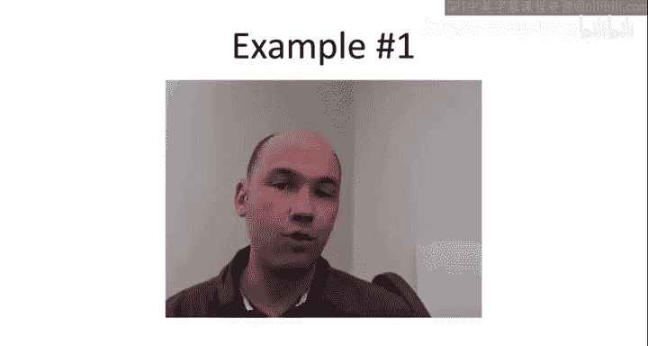

# 斯坦福大学《算法启蒙（第1册）：基础篇｜Algorithms Illuminated, Part 1： The Basics》中英字幕 - P10：-10-2   3   Basic Examples 7 min.zh_en - GPT中英字幕课程资源 - BV1vSVAzXE2r

Having sloggged through the formal definition of big o notation。

 I want to quickly turn to a couple of examples Now I want to warn you up front these are pretty basic examples they're not really going to provide us with any insight that we don't already have。

 but they serve as a sanity check that the big Onotation is doing what its intended purpose namely to suppress constant factors in lower order terms。

 obviously these simple examples will also give us some facility with the definition So the first example is going to be to prove formally the following claim。

The claim states that if T of n is some polynomial of degree K， so namely ak end to the K。Plus。

 all the way up to A1 n plus a not。For any integerK， positive integerK and any coefficients。

 AI is positive or negative。Then T of n is big O of n to the K。

 So this claim is a mathematical statement it's something we'll be able to prove as far as know what this claim is saying it's just saying big o notation really does suppress constant factors in the order terms if you have a polynomial that all you have to worry about is what is the highest power in that polynomial and that dominates its growth as the n goes to infinity So recall how one goes about showing that one function is big O of another the whole key is to find this pair of constants C and n not where C quantifies the constant multiple of the function you're trying to prove big O of and n not quantifies what you mean by for all sufficiently large n Now for this proof to keep things very simple to follow but admittedly a little mysterious I'm just going to pull these constants C and n out of a hat So I'm not going to tell you how I derive them。

 but it'll be easy to check that they work。So let's work with a constants and not equal to one。

So it's a very simple choice of a not， and then C， we're going to pick to be the sum of the absolute values of the coefficients。

So the absolute value of AK plus the absolute value of ak minus1 and so on。

 remember I didn't assume that the original polynomial had non negative coefficients。

So I claim these constants work in the sense that we'll be able to prove the assert you know establish the definition of big O notation。

 what does that mean well we need to show that for all n at least one because remember we chose n not equal to 1 T of n。

 this polynomial up here is bounded above by C times n to the K where C is the way we chose it here underlined in red。

So let's just check why this is true， so for every positive integer and at least one。

Whether we need to prove we need to prove T of n is upper bounded by something else。

 so we're going to start on the left hand side with T of n。

 and now we need a sequence of upper bounds terminating with C times end to decay K for our choice of C underlined in red。

So T of n is given is equal to this polynomial underlined in green so what happens when we replace each of the coefficients with the absolute value of that coefficient Well you take the absolute value of a number。

 either it stays the same as it was before or it flips from negative to positive now N here we know is at least one so if any coefficient flips from negative to positive then the overall number only goes up so if we apply the absolute value to each of the coefficients we get an only bigger number。

So T ofn is bounded above。By the new polynomial。Where the coefficients are the absolute values of those that we had before。

So why was that a useful step well now what we can do is we can play the same trick but with n so it's sort of annoying how right now we have these different powers of n。

 it would be much nicer if we just had a common power of n。

 so let's just replace all of these different ends by n to the K。

 the biggest power of n that shows up anywhere。So if we replace each of these lower powers of n with a higher power end to decay。

 that number only goes up， now the coefficients are all non negative。

 so the overall number only goes up。So this is bounded above by the absolute value of aK into the K。

Up to absolute value of A1 end to the K。Plus a n and the decay K。

 I'm using here that n is at least one， so higher powers of n are only bigger。

And now you'll notice this by our choice of C underlined in red。

 this is exactly equal to C times m to the K。And that's what we had to prove。

 we had to prove that T of n is the most c times end of the K。

 given our choice of C for every n at least one， and we just proved that。Of proof。

Now there remains the question of how did I know what the correct what a workable value of CNNN not were and if you yourself want to prove that something is big of something else。

 usually what you do is you reverse engineer constants that work so you would go through a proof like this with a generic value of CNN not and then you'd say well if only I choose C in this way I can push the proof through and that tells you what C should use if you look at the optional video on further examples of asymptotic notation you'll see some examples where we derive the constants by this reverse engineering method but now let's turn to a second example or really I should say a non-exle。

So what we're going to prove now is that something is not big of something else。

So I claim that for every K， at least one。End of decay K is not。Big O of n to the K minus1。And again。

 this is something you would certainly hope would be true if this was false。

 it'd be something wrong with our definition of big O notation。

 and so really this is just to get further comfort with the definition。

 how to prove something is not big of something else and to verify that indeed you don't have any collapse of distinct powers of polynomials。

 which would be a bad thing。So how would we prove that something is not big of something else？

The most frequently useful proof method is going to be by contradiction。So remember。

 proof by contradiction， you assume what you're trying to establish is actually false。

 and from that you do a sequence of logical steps culminating in something which is just patently false。

 which contradicts basic axioms of mathematics or arithmetic。So suppose in fact。

 end to the K was big of end to the K minus1， so that's assuming the opposite of what we're trying to prove。

 what would that mean？Well， we just refer to the definition of big O notation， if in fact。

 n to the K hypothetically were big O of end to the K minus1， then by a definition。

 there would be two constants。A winning strategy， if you like， CNN not。

Such that for all sufficiently large am。We have a constant multiple c times end to the K minus1 upper bounding end to the K。

So from this， we need to derive something which is patently false that will complete the proof。

And the easiest way to do that is to cancel into to the K minus1 from both sides of this inequality。

And remember， since n is at least1 and k is at least one。

 it's legitimate to cancel this n of the K minus1 from both sides。And when we do that。

 we get the assertion that n is at most some constant C。For all and at least and not。

And this now is a patently false statement， it is not the case that all positive integers are bounded above by a constant C in particular。

 C plus 1 or the integer right above that is not bigger than C so that provides the contradiction that shows that our original assumption that end to the K is big O n to the K minus1 is false and that proves the claim end to the K is not big of n to the K minus1 for every value of k so different powers of polynomials do not collapse。

 they really are distinct with respect to big O notation。

