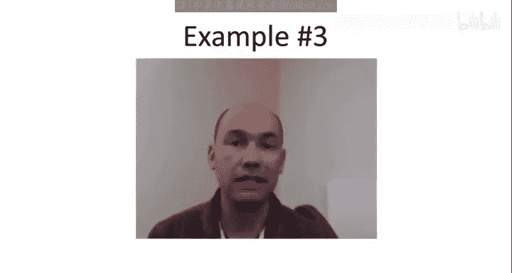
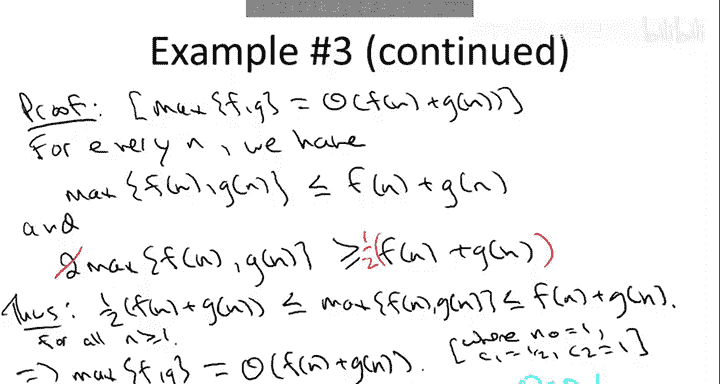

# 斯坦福大学《算法启蒙（第1册）：基础篇｜Algorithms Illuminated, Part 1： The Basics》中英字幕 - P12：-12-2   5   Additional Examples Review   Optional 8 min.zh_en - GPT中英字幕课程资源 - BV1vSVAzXE2r

This video is for those of you who want some additional practice with asymptotic notation and order to go through three additional optional examples。

 let's start with the first one。So the point of this first example is to show how to formally prove that one function is big of another so the function that I want to work with。

Is2 raised to the n plus 10。Okay， so it's the two to the in function that you're all familiar with。

 but' going to shift it by 10。And the claim is that this function is big O of 2 to the n。

 So without the 10。 So how would one prove such a claim， Well。

 let's go back to the definition of what it means for one function to be big O of another。

 What we have to prove is we need to show that there exists two constants。

Such that for all sufficiently large n， meaning n bigger than n not。Our left hand side。

 so the function2 the n plus 10 is bounded above by the constant multiple C times the function on the right hand side to the n。

Right， so for all sufficiently large N， the function is bounded above by a constant multiple of two to the n。

 So unlike the first basic example where I just pulled the two constants out of a hat。

 let's actually start the proof and see how you reverse engineer the suitable choice of these two constants。

So what a proof would look like， it would start with two to the n plus 10 on the left hand side and then there'd be a chain of inequalities terminating in the C times 2 to the n。

 so let's just go ahead and start such a proof and see what we might do。

So if we start with two to the n plus 10 on the left hand side， what would our first step look like。

 well this 10s really annoying so it would makes sense to separate it out so you could write2 to the n plus 10 is the product of two terms。

 two to the 10 and then the two to the n， also known as just 1024。Times2 to the n。

And now we're in looking in really good shape， so if you look at where we are so far and where we want to get to。

 it seems like we should be choosing our constant C to be 1，024。

So if we choose C to be 1024 and we don't have to be clever with not。

 we can just set that equal to one， then indeed star holds。So the desired inequality。

And remember to prove that one function is big over of another。

 all you got to do is come up with one pair of constants that works and we've just reversed engineered it。

 just choosing the constant C to be 1024 and not to be one works so this proves that2 to the n plus 10 is big O of 2 to the n。

Next， let's turn to another non example of a function which is not bigger than another。

And so this will look superficially similar to the previous one。

 instead of taking adding 10 in the exponent of the function 2 to the end。

 I'm going to multiply by 10 in the exponent。And the claim is if you multiply by 10 in the exponent。

 then this is not the same asymptically as2 to the n。So once again。

 usually the way you prove that one thing is not big of another is by contradiction。

So we're going to assume the contrary that2 to the 10 n is in fact big O of 2 to the n。

 what would it mean if that were true， well by the definition of big O notation。

 that would mean they are constant C and and not so that for all large n 2 to the 10 n is bounded above by c times 2 to the n。

So to complete the proof， what we have to do is go from this assumption and derive something which is obviously false。

 but that's easy to do just by canceling this two to the n term from both sides。

So if we divide both sides by2 to the n， which is a positive number since n is positive。

 what we find would be a logical consequence of our assumption would be that two raiseds to the9 n。

Is bounded above by some fixed constant C for all and at least and knots。

But this inequality of course is certainly false， the right hand side is some fixed constant。

 independent of n， the left hand side is going to infinity as n grows large。

 so there's nowhere way that the inality holds for arbitrarily large n。

So that concludes the proof by contradiction， this means our assumption was not the case。

 and indeed it is not the case that two of the tenon is big O of2 to the n。

So our third and final example is a little bit more complicated than the first two it'll give us some practice using theta notation recall that while big O is analogous to saying one function is less than or equal to another theta notation is in the spirit of saying one function is equal asymptotically to another so here's going to be the formal claim we're going to prove for every pair of functions f and G both of these functions are defined on the positive integers。

 the claim is that it doesn't matter up to a constant factors whether we take the pointwise maximum of the two functions or whether we take the pointwise sum of the two functions So let me make sure it's clear that you know what I mean by the pointwise maximum by max f and G so if you look at the two functions。

 both functions of n maybe we have F being this green function here and we have G equal to those red function then by the pointwise maximum max fg I just mean the upper envelope of these two functions so that's going to be this blue function。

So let's now turn to the proof of this claim that the pointwise maximum of two functions is theta of the sum of the two functions。

So let's recall what theta means formally， what it means is that the function on the left can be sandwiched between constant multiples of the function on the right。

 so we need to exhibit both the usual and not but also two constants。

 a small one C1 and a big one C2 so that the pointwise maximum of f and G， whatever they may be。

 is wedged in between C1 and C2 times f of n plus G of n respectively。

So to see where these constant C1 and C are going to come from。

 let's observe the following inequalities。So no matter what n is， any positive n N。

We have the following suppose we take of the larger of F of n and G event and remember now weve fixed the value of n and it's just some integer。

 you know like 23 and now F of n and G n are ourselves just numbers。

 you know maybe they're 57 and 74 or whatever。And if you take the larger of F of n and G of n。

 that's certainly no more than the sum of F of n plus G of n。

Now I'm using in this inequality that FNG are positive and that's something I've been assuming throughout the course so far here I want to be explicit about it。

 we're assuming that fNG cannot output negative numbers。

 whatever integer you feed in you get out something positive Now the functions we care about are things like the running time of algorithms so there's really no reason for us to pollute our thinking with negative numbers so we're just going always be assuming in this class positive numbers and I'm actually using it here the right hand side is the sum of two things is bigger than just either one of the constituents sumances Secondly。

 if we double the larger。Of F of n and G of n。Well， then that's going to exceed the sum。

n plus g of n right because on the right hand side we have a big number plus a small number and on the left hand side we have two copies of the big number so that's going to be something larger Now it's going to be convenient it's going to be more obvious what's going on if I divide both of these sides by2 so that the maximum of F n a G of n is at least half of F of n plus G of n that is it's at least half of the average。

And now we're pretty much home free right so what does this say。

 this says that for every possible n the maximum is wedged between suitable multiples of the sum。

 so one half f of n plus g of n is a lower bound on the maximum this is just the second inequality that we derived and by the first inequality that's bounded above by once times the sum and this holds no matter what n is any n at least1 and this is exactly what it means to prove that one function is theta of another。

 we've shown that for all n not just for in sufficiently large， but in fact for all n。

 the pointwise maximum of f and G is wedged between suitable constant multiples of their sum and again。

 just to be explicit the certifying choices of constants or n not equals one。

 the smaller constant is one half。The bigger constant equals one。And that completes the proof。

