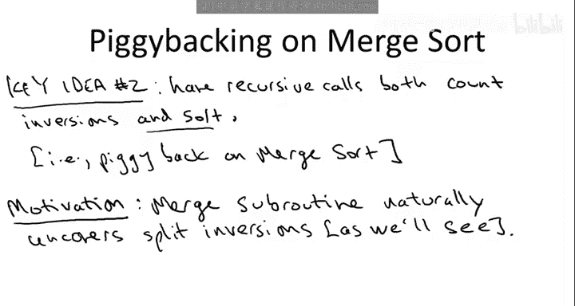
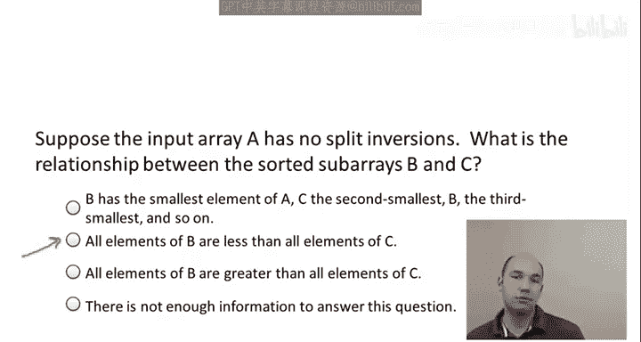
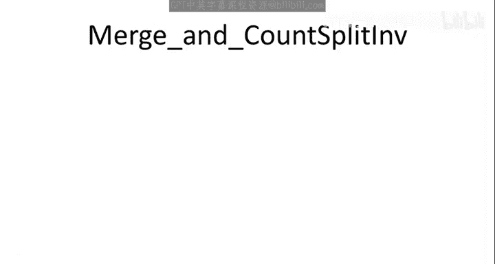
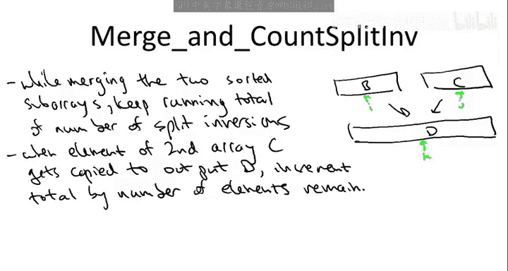

# 斯坦福大学《算法启蒙（第1册）：基础篇｜Algorithms Illuminated, Part 1： The Basics》中英字幕 - P14：-14-3   2   On log n Algorithm for Counting Inversions II 17 min.zh_en - GPT中英字幕课程资源 - BV1vSVAzXE2r

So far we've developed a divide and conquer approach to counting the number of inversions of an array。

 so we're going to split the array in two parts recursively counting versions on the left on the right。

 we've identified the key challenge as counting the number of split inversions quickly where split inversion means that the earlier indexes on the left half of the array the second indexes on the right half of the array these are precisely inversions that are going to be missed by both of our recursive calls and the crux of the problem is that there might be as many as quadratic split inversions it's somehow to get the runtime we want we need to do it in the linear time so here's the really nice idea which is going to let us do that The idea is to piggyback on merge sort。

By which I mean we're actually going to demand a bit more of our recursive calls to make the job of counting the number of split recursions easier this is analogous to when you're doing a proof by induction sometimes ranking the inductive hypothesis stronger that's what lets you push through the inductive proof so we're going to ask our recursive calls to not only count inversions in the array that they're past but also along the way to sort the array and hey why not we know sorting as fast merge trip will do it in n log n time which is the runtime we're shooting for so why not just throw that in maybe it'll help us in the combined step and as we'll see it will so what is this bias why should we demand more of our recursive calls well as we'll see in a couple slides the merge subine almost seems designed just to count the number of split inversions as we'll see as you merge two sorted subarrays you will naturally uncover all of the split inversions。

So let me just be a little bit more clear about how our previous highlevel algorithm is going to now be soupped up so that the recursive calls sort as well。

 So here's the high level algorithm we proposed before where we just recursively count inversions on the left side on the right side and then we have some currently unimplemented subroutine count split if which is responsible for counting the number of split in versions so we're just going to augment this as follows so instead of being called count now we're going to call it sort and count that's going to be the name of our algorithm the recursive calls again just invoke sort and count and so now we know each of those will not only count the number of inversions in the subarray but also return return a sorted version so out from the first one we're going to get array B back which is the sorted version of the array that we passed it and we'll get a sorted array C back from the second recursive call。

 the sorted version of the array that we passed it and now the count split in versions now in addition to counting split in versions it's responsible for merging the two sorted subars B and C。

So Council splitI will be responsible for outputting an array D。

 which is asorted version of the original input array A。

And so I should also rename our unimplemented subreoutine to reflect its now more ambitious agenda。

 so we'll call this。Merge。And count split in。Now we shouldn't be intimidated by asking our combining subgroupine to merge the two sorted subise B and C because we've already seen we know how to do that in linear time。

 so the question is just piggybacking on that work。

 can we also count the number of split inversions in an additional linear time。

 we'll see that we can， although that's certainly not obvious。

So you should again at this point have the question why arent we doing this。

 Why are we just making ourselves do more work and again。

 the hope is that the payoff is somehow panic split in versions becomes easier by asking our recursive calls to do this additional work of sorted so to develop some intuition for why that's true merging naturally uncovers the number of split inversions let's recall with the definition of just the original merge subroutine from merge sort was so here's the same pseudo code we went through several videos ago I have renamed the letters of the arrays to be consistent where the current notation so we're given two sorted subars these come back from recursive calls and calling them B and C they both have linked N over2 and responsible for producing the sorted combination of B and C so that's an output array D of linked N and again the idea is simple you just take the two sorted subars B and C。

And then you take the output array D which you're responsible for populating and using in next K you're going to traverse the output array D from left to right。

 that's what this outer for loop here does and you're going to maintain pointers I and J to the sorted subase B and C respectively and the only observation is that whatever the minimum element that you haven't copied over to D yet is it's got to be either the leftmost element of B that you haven't seen yet or the leftmost element of C that you haven't seen yet B and C by virtue of being sorted the minimum remaining has to be the next one available to either B or C so you just proceed in the obvious way you compare the two candidates for the next one to copy over。

 you look at B of I you look at C of J whichever one is smaller you copy over so the first part of the if statement is for when B contains the smaller one the second part of the else statement is for when C contains the smaller one okay so that's how merge works you go down B and C in parallel populating D in sorted order from left to right Now to get some feel for what on earth any of this。

has to do with the split inversions of an array I want you to think about an input array A that has the following property that has the property that there are no split inversions whatsoever。

 so every inversion in this input array A is going to be either a left inversion so both indices are a most N over2 or a right inversion so both indices are strictly greater than N over2 Now the question is given such an array A。

 what once you're merging at this step， what did the sorted subars B and C look like for an input array A that has no split inversions。

The correct answer is the second one。That if you have an array with no split versions。

 then everything in the first half is less than everything in the second half。

Why well consider the contra positiveitive， supposeuppose you had even one element in the first half。

 which was bigger than any element in the second half。

 that pair of elements alone would constitute a split in version Okay。

 so if you have no split in versions， then everything in the left is smaller than everything in the right half of the array Now。

 more to the point， think about the execution of the merge subroutine on an array with this property on an input array A where everything in the left half is less everything in the right half。

What is merge going to do right so remember it's always looking for whichever is smaller。

 the first element of remaining in B or the first element remaining in C and that's what it copies over Well if everything in B is less than everything in C。

 everything in B is going to get copied over into the output array D before C ever gets touched okay so merge has an unusually trivial execution on input arrays with no split in versions with zero split versions first it just goes through B and copies it over then it just concatenate C。

OkayThere's no interleaving between the two， so no split inversions means nothing get copied from C until it absolutely has to until B is exhausted。

So this suggests that perhaps copying elements over from the second subarray C has something to do with the number of split in versions in the original array。

 and that is in fact the case， so we're going to see a general pattern about copies from the second element C second array C to the output array exposing split in versions in the original input array A。

 so let's look at a more detailed example to see what that pattern is。

So let's return to the example in the previous video which is an array with six elements ordered 135。

246， so we do our recursive call in fact the left half of the array is sorted and the right half of the array is already sorted so no sorting work is going to be done and you're actually going to get zero inversions from both our recursive calls remember in this example it turns out all of the inversions are split inversions。

So now let's trace through the merge subroutine andvoked on these two sorted subars and try to spot a connection with a number of split in versions in the original six element array。

 so we initialize indices I and J to point to the first element of each of these subars so this left one is B and this right one is C and the output is D Now the first thing we do is we copy the one over from B into the output array so one goes there and we advance this index over to the three and here nothing really interesting happened there's no reason to count any split in versions and indeed the number one is not involved in any split in versions because one is smaller than all of the other elements and it's also in the first index。

Things are much more interesting when we copy over the element2 from the second array C and notice at this point we have diverged from the trivial execution that we would see with an array with no split in versions Now we're copying something over from C before we've exhausted copying B。

 So we're hoping this will expose some split in versions。

 So we copy over the two and we advance the second point are J into C and the thing to notice is this exposes two split in versions。

 the two split in versions that involve the element2 and those inversions are three comma 2 and5 comma 2。

 So why did this happen。 Well， the reason we copied2 over is because it's smaller than all the elements we haven't yet looked at in both B and C。

 So in particular，2 is smaller than the remaining elements in B the3 and the5。

 but also because B is the left array， the indices of the3 and5 have to be less than the index of this two。

 So these are inversions2 is。Further to the right in the original input array and yet it's smaller than these remaining elements in B so there are two elements remaining in B and those are the two split in versions that involve the elements2 so now let's go back to the emerging subroutine of what happens next Well next we make a copy from the first array and we sort of realize that nothing really interesting happens when we copy it from the first array at least with respect to split in versions。

Then we copy the four over and yet again we discover a split in version。

 the remaining one which is5 kind of4 again， the reason is given that four was copied over before what's left in B。

 it's got to be smaller than it but by virtue of being in the rightmost array it's also got to have a bigger index so it's got to be a split in version and now the rest of the merge subroutine executes without any real incident。

 the five gets copied over and we know copies from the left array are boring and then we copy the six over and copies from the right array are generally interesting but not if the left array is empty that doesn't involve any split in versions and you will recall from the earlier video that these were the inversions in the original right。

3，2，52 and 54， we discovered them all in an automated method by just keeping an eye out when we copy from the right array C so this is indeed a general principles so let me state the general claim so the claim is not just in this specific example when the specific execution but no matter what the input array is no matter how many split in versions there might be the split in versions that involve。

element of the second half of the array are precisely those elements remaining in the first array when that element gets copied over to the output array。

 So this is exactly the pattern that we saw in the example。

 what were so on the right array and C we had the elements 2，4 and 6。 Remember。

 every split in version has to by definition involved one element from the first half and one element from the second half。

 So the count split in versions， we can just group them according to which element of the second array that they involved。

 So that of the two，4 and 6， the two is involved in the split in versions 3，2 and 52。

 the three and the5 were exactly the elements remaining in B when we copied over2。

 the split versions involving4 is exactly the in version 5。

4 and5 is exactly the element that was remaining in B when we copied over the4。

 There's no split in version involving 6 and indeed the element B was empty when we copied the6 over into the output array D。

 So what's the general argument。 Well， it's quite simple。 Let's just zoom in and fixate on。

Particular element X that belongs to that first half of the array。

 that's amongst the first half of the elements。 And let's just examine which y's。

 So which elements of the second array， the second half of the original input array。

 are involved in split in versions with X。 So there are two cases。

 depending on whether X is copied over into the output array D before or after Y。 Now。

 if X is copied to the output before Y。 Well， then since the outputs in sorted order。

 it means x is got to be less than y。 So there's not going be any split in version。On the other hand。

 if y is copied to the output D before X， then again。

 because we populate d left to right in sorted order， that's got to mean that y is less than x。

 Now x is still hanging out in the left array， so it has less index than Y Y comes from the right array So this is indeed a split in version So putting these two together it says that the elements X of the array B that form split in versions with y are precisely those that are going to get copied to the output array after y。

 So those are exactly the number of elements remaining in B when y gets copied over。

 so that proves the general claim。So this slide was really the key insight Now that we understand exactly why counting split in versions is easy as we're merging together to sorted subars。

 it's a simple matter to just translate this into code and get a linear time implementation of a subroutine that both merges and counts the number of split in versions which then in the overall recursive algorithm will have n log n running time just as you merge sort So let's just spend a quick minute filling in those details。

 So I'm not going to write out the pseudocode I'm just going to write out what you need to augment the merge pseudocode discuss a few slides ago by in order to count split versions as you're doing the mergeing and this will follow immediately from the previous claim which indicated how split in versions relate to the number of elements remaining in the left array as you're doing the merge So the idea is the natural one as you're doing the merging according to the previous pseudocode of the two sorted subars you just keep a running total of the number of split in versions that you've encountered so you've got your sorted subarray B you've got your sorted subre C。

You're merging these into an output array D and as you traverse through D and k goes from one to N。

 you just start to count at zero and you increment it by something each time you do a copy over from either B or C so let's the increment。

 well what did we just see we saw that copies involving B don't count we're not going to look at split inversions when we copy over from B only when we look at them from C every split inversion involves exactly one element from each of B and C so it may as well count them via the elements in C and how many split inversions are involved with a given element of C。

 what's exactly how many elements of B remain when it gets copied over so that tells us how to increment this running count NFL follows is immediately from the claim on the previous slide that this implementation of this running total counts precisely the number of split inversions that the original input array A possesses and recall that the left inversions are counted by the first recursive call the right inversions are counted by the second recursive call。

 every inversion is either left or right or split it's exactly one of those three types so with a three different sub。

The two recursive ones and this one here we successfully count out all of the inversions of the original input or array So that's the correctness of the algorithm。

 What's the running time Well recall in merge sort we began by just analyzing the running time of merge and then we discuss the running time of the entire merge sort algorithm let's do the same thing here briefly So what's the running time of this subroutine for this merging and simultaneously counting the number of split versions while there's the work that we do in the merging and we already know that that's linear and then the only additional work here is incrementing this running count and that's constant time for each element of d right each time we do a copy over we do some a single addition to our running count so constant time for element of d or linear time overall So I'm being a little sloppy here it's sloppy in a very conventional way but it is a little sloppy by writing o of n plus O of n equals o of n be careful when you make statements like that so if you added o of n to itself n times it would not be o of n but if you add o of n to itself a constant number of times it is still o of n so you might as an exercise want to write out formal version。

What this means， basically there's some constant C1 so that the merge debt takes the most C1 n steps。

 there's a constant C2 so that the rest of the work is the most C2 times n steps。

 So when we add them， we get it most quantity C1 plus C2 times n steps which is still big O of n because C1 plus C2 is a constant so linear work for merge linear work for the running count So that's linear work in the subroutine overall and now by exactly the same argument we used in merge sort because we have two recursive calls on half the size and we do linear work outside of the recursive calls the overall running time is O of n login。

 So we really just piggyback on merge sort up to the constant factor a little bit to do the counting along the way but the running time remains big O of n login。

