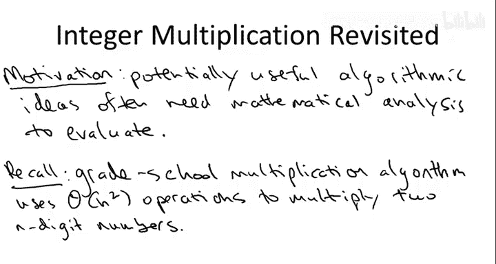
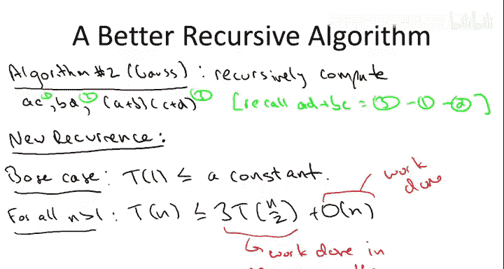

# 斯坦福大学《算法启蒙（第1册）：基础篇｜Algorithms Illuminated, Part 1： The Basics》中英字幕 - P17：-18-4   1   Motivation 8 min.zh_en - GPT中英字幕课程资源 - BV1vSVAzXE2r

In this series of videos we'll study the master method。

 which is a general mathematical tool for analyzing the running time of divide and conquer algorithms。

 we'll begin in this video motivating the method， then we'll give its formal description thatll be followed by a video working through six examples。

 finally we'll conclude with three videos that discuss proof of the master method with a particular emphasis on the conceptual interpretation of the master methods three cases。

So let me say at the outset that this lecture is a little bit more mathematical than the previous two。

 but it's certainly not just math for maths sake， will'll be rewarded for our work with this powerful tool。

 the master method， which has a lot of predictive power。

 it'll give us good advice about which divine and conquer algorithms are likely to run quickly and which ones are likely to run less quickly Indeed it's sort of a general truism that novel algorithmic ideas often require mathematical analysis to properly evaluate this lecture will be one example of that truism。

As a motivating example， consider the computational problem of multiplying2 and digit numbers。

 recall from our first set of lectures that we all learn the iterative grade school multiplication algorithm and that that requires a number of basic operations。

 additions and multiplications between single digits。

 which grows quadraically with the number of digits n。On the other hand。

 we also discussed an interesting recursive approach using the divide and conquer paradigm。

 so recall divide and conquer necessitates identifying smaller subproblems。

 so for energyteger multiplication we need to identify smaller numbers that we want to multiply。

 so we proceeded in the obvious way breaking each of the two numbers into its left half of the digits and its right half of the digits。

For convenience， I'm assuming that the number of digits n is even， but it really doesn't matter。

 Having decomposed X and Y in this way， we can now expand the product and see what we get。

So let's put a box around this expression and call it star。

So we began with the sort of obvious recursive algorithm where we just evaluate the expression star in the straightforward way。

 that is star contains four products involving N2 digit numbers， AC，AD， BCC and BD。

 so we make four recursive calls to compute them and then we complete the evaluation in the natural way。

 namely we append zeros as necessary and add up these three terms to get the final result。

The way we reason about the running time of recursive algorithms like this one is using what's called a recurrence。

 So to introduce a recurrence， let me first make some notation T of n this is going to be the quantity that we really care about。

 the quantity that we want to upper bound。 namely， this will be the worst case number of operations that this recursive algorithm requires to multiply to in digit numbers。

 This is exactly what we want to upper bound。A recurrence then is simply a way to express T of n in terms of T of smaller numbers。

 that is the running time of an algorithm in terms of the work done by its recursive calls。

So every recurrence has two ingredients， first of all it has a base case describing the running time when there's no further recursion and in this energy multiplication algorithm like in most divided and conquer algorithms。

 the base case is easy once you get down with small input in this case to one digit numbers then the running time is just constant。

 all you do is multiply two digits and return the result。

So I'm going to express that by just declaring the T of1。

 the time needed to multiply one digit numbers is bounded above by a constant。

 I'm not going to bother to specify what this constant is。

 you can think of it as one or two if you like， it's not going to matter for what's to follow。

The second ingredient in a recurrence is the important one and it's what happens in the general case when you're not in the base case and you make recursive calls。

 and all you do is write down the running time in terms of two pieces。

 first of all the work done by the recursive calls and second of all the work that's done right here now。

 work done outside of the recursive calls。So on the left- hand side of this general case we just write T of n and then we want an upper bound on T of n in terms of the work done by recursive calls and the work done outside of recursive calls and I hope it's evident what the recurrence should be in this recursive algorithm for integer multiplication as we discussed there is exactly four recursive calls and each is invoked on a pair of n over two digit numbers so that gives us four times the time needed to multiply n over two digit numbers so what do we do outside of the recursive call well we pad the result of the recursive calls with a bunch of zeros and we add them up and I'll leave it to you to verify that grade school addition in fact runs in time linear in the number of digits so putting it all together the amount of work we do outside of the recursive calls is linear that is its big O of n。

Let's move on to the second more clever recursive algorithm for integer multiplication。

 which dates back to gapPS。Gs's insight was to realize that in the expression star that we're trying to evaluate there's really only three fundamental quantities that we care about。

 the coefficients for each of the three terms in the expression。

 so this leads us to hope that perhaps we can compute these three quantities using only three recursive calls rather than four。

 and indeed we can。So what we do is we recursively compute a times C like before。And B times D。

 like before， but then we compute the product of a plus B with C plus D。And the very cute facts。

Is if we number these。Three products one， two and three that。The final quantity that we care about。

 the coefficient of the 10 to the N over2 term， namely AD D plus BC。

Is nothing more than the third product minus each of the first two。So that's the new algorithm。

 what's the new recurrence？The base case obviously is exactly the same as before。

So the question then is， how does the general case change。

 and I'll let you answer this in the following quiz。

So the correct response for this quiz is the second one。

 namely the only thing that changes with respect to the first recurrence is that the number of recursive calls drops from four down to three。

A couple of quick comments so first of all I'm being a little bit sloppy when I say there's three recursive calls each on digits each on numbers with n over two digits when you take the sums a plus B and c plus D those might well have n over2 plus one digits amongst friends let's ignore that let's just call it N over two digits in each of the recursive calls As usual the extra plus one is not going to matter in the final analysis Secondly。

 I'm ignoring exactly what the constant factor is in the linear work done outside of the recursive calls indeed it's a little bit bigger in Gauss's algorithm than it is in the naive algorithm with four recursive calls but it's only by a constant factor and that's going to be suppressed in the big O notation。

So let's look at this recurrence and compare it to two other recurrences。

 one bigger one smaller so first of all， as we noted。

 it differs from the previous recurrence of the naive recursive algorithm in having one fewer recursive call so we have no idea what the running time is of either of these two recursive algorithms but we should be confident that this one certainly can only be better that's for sure Another point of contrast is merge short so think about what the recurrence would look like for the merge short algorithm。

It would be almost identical to this one except instead of a three。

 we'd have a two right merge short makes two recursive calls each on an array of half the size and outside of the recursive calls it does linear work。

 namely for the merge subroutine we know the running time of merge sort it's N log n。

 so this algorithm gas's algorithm is going to be worse， but we don't know by how much。

So while we have a couple clues about what the running time of this algorithm might be more or less then。

 honestly we have no idea what the running time of Gauss's recursive algorithm for energyteger multiplication really is。

 it is not obvious， we currently have no intuition for it。

 we don't know what the solution to this recurrence is。

 but it will be one super special case of the general master method which we'll tackle next。

