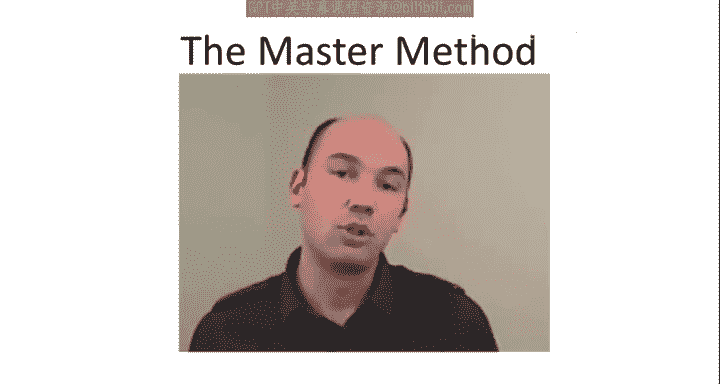
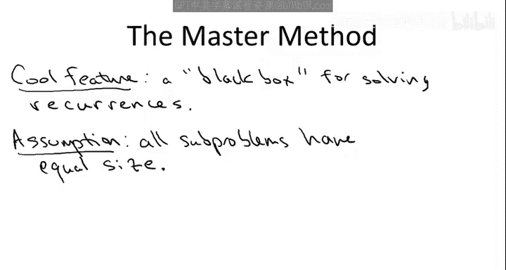
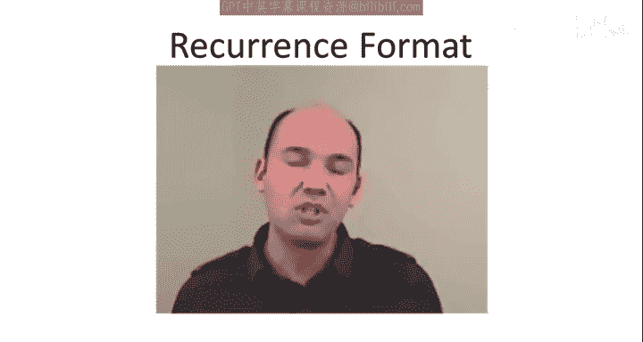
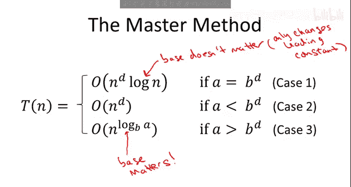

# 斯坦福大学《算法启蒙（第1册）：基础篇｜Algorithms Illuminated, Part 1： The Basics》中英字幕 - P18：-19-4   2   Formal Statement 10 min.zh_en - GPT中英字幕课程资源 - BV1vSVAzXE2r

So having motivated and hyped up the generality of the master method in its use for analyzing recursive algorithms。

 let's move on to its precise mathematical statement。

Now the master method is in some sense exactly what you want。

 it's what I'm going to call a black box for solving recurrences， basically it takes as input。

 a recurrence in a particular format， and it spits out as output， a solution to that recurrence。

 an upper bound on the running time of your recursive algorithm。

That is you just plug in a few parameters of your recursive algorithm and boom Al pops is running time Now the master method does require a few assumptions and let me be explicit about one of them right now。

 namely the master method， at least the one I'm going to give you is only going to be relevant for problems in which all of the subproble have exactly the same size so for example in merge sort there are two recursive calls and each is on exactly one half of the array so merge sort satisfies this assumption both subproblems have equal size Similarlyly in both of our integer multiplication algorithms all subproblems are on integers with and over two digits with half as many digits so those will also obey this assumption if for some reason you had a recursive algorithm that recursed on a third of the array and then on the other two-tds of the array the master method that I'm going to give you will not apply to it。

There are generalizations of the master method that I'm going to show you which can accommodate unbalanced subproblem sizes。

 but those are outside the scope of this course， this will be sufficient for almost all of the examples we're going to see one notable exception for those of you that watch the optional video on a deterministic algorithm for linear time selection。

 that will be one algorithm which has two recursive calls on different subproblem sizes。

 so to analyze that recurrence we'll have to use a different method not the master method。

Next I'm going to describe the format of the recurrences to which the master method applies。

 as I said， there are more general versions of the master method which apply to even more recurrences。

 but the one I'm going to give you is going to be reasonably simple and it will cover pretty much all the cases you're likely to ever encounter。

So recurrences have two ingredients there's the relatively unimportant but still necessary base case step and we're going to make the obvious assumption。

 which is just satisfied by every example we're ever going to see in this course。

 which is that at some point in which the input size drops to a sufficiently small amount then the recursion stops and the problem is solved sub problem is solved in constant time since this assumption is pretty much always satisfied in every problem we're going to see I'm not going to discuss it much further let's move on to the general case where there are recursive calls so we assume there recurrence is given in the following format。

The running time on an input of length n is bounded above by some number of recursive calls。

 let's call it a different recursive calls。And then each of these subproblem has exactly the same size。

 and it's one over B fraction of the original input size。

 So there's a recursive calls each on an input of size n over B。Now as usual。

 there's the case where N over B is a fraction and not an integer and as usual I'm going to be sloppy and ignore it。

 and as usual that sloppiness has no implications for the final conclusion。

 everything that we're going to discuss is true for the same reasons in the general case where N over B is not an integer。

Now outside the recursive calls， we do some extra work and let's say that it's O of n to the D for some parameter D。

So in addition to the input size n， there are three letters here which we need to be very clear on what their meaning is。

 so first of all there's a， which is the number of subproblems， the number of recursive calls。

So a could be as small as one， or it might be some larger integer。

Then there's B B is the factor by which the input size shrinks before a recursive call is applied。

B is some constant strictly greater than one， so for example。

 if you recurse on half of the original problem， then B would be equal to two。

 it better be strictly bigger than one so that eventually you stop recursion so that eventually you terminate。

Finally， there's D， which is simply the exponent in the running time of the quote unquote combined step。

 that is the amount of work which is done outside of the recursive calls。

And D could be as small as zero， which would indicate constant amount of work outside of the recurarsive calls。

One point to emphasize is that A， B and D are all constants。

 that's all they're all numbers that are independent of N。 So A。

 B and D you going to be numbers like 1，2，3， or 4。 They do not depend on the input size。And in fact。

 let me just redraw the D so that you don't confuse it with the A so again a is the number of recursive calls and D is the exponent in the running time governing the work done outside of the recursive calls Now one comment about that final term that big O of end to the D on the one hand I'm being sort of sloppy I'm not keeping track of the constant is hidden inside the big O notation I'll be explicit with that constant when we actually prove the master method but it's really not going to matter it's just going to carry through the analysis without affecting anything so you can go ahead and ignore that constant inside the big O obviously the constant and the exponent namely D is very important right so depending on what d is depends on whether that amount of time is constant linear quadratic or so on so certainly we care about the constant。

So that's the input to the master method， it is a recurrence of this form so you can think of it as a recursive algorithm which makes a recursive cause。

 each on subprobles of equal size， each of size n over B。

 plus it does end the Dwork outside of the recursive calls。

 so having set up the notation I can now precisely state the master method for you。

So given such a recurrence， we're going to get an upper bound on the running time。

 So the running time on。Inputs of size n is going to be upper bounded by one of three things。

So somewhat famously the master method has three cases， so let me tell you about each of them。

 the trigger which determines which case you're in is a comparison between two numbers， first of all。

 A recall A' is the number of recursive calls made。And B raised to the D power。

Recall B is the factor by which the input size shrinks before you recurse。

 D is the exponent in the amount of work done outside the recursive call。

 so we're going to have one case for when they're equal。

 we're going to have one case for when a is strictly smaller than B to the D。

And the third case is when a is strictly bigger than B to the D， and in the first case。

 we get a running time of big O of n to the D times log n。And again， this is D。

sameme D that was in the final term of the recurrence okay。

 the work done outside of the recursive calls， so the first case。

 the running time is is the same as the running time in the recurrence outside of the recursive calls。

 but we pick up an extra log n factor。In the second case where a is smaller than B to the D。

 the running time is merely big O of end to the D and this case might be somewhat stunning that this could ever occur because of course in the recurrence。

 what do you do you do some recursion plus you do end of the D work outside of the recursion so in the second case it actually says that the work is dominated by just what's done outside of the recursion in the outermost call。

The third case will initially seem the most mysterious when a is strictly bigger than B to the D。

 we're going to get a running time of big O of n to the log。Base B。Okay he。

again recall a is the number of recursive calls and B is the factor by which the input size shrinks before you recurse so that's the master method with its three cases let me give this to you in a cleaner slide to make sure there's no ambiguity in my handwriting。

So here's the exact same statement， the master method once again with its three cases。

 depending on how A compares to B to the D。So one thing you'll notice about this version of the master method is that it only gives upper bound so we only say that the solution to the recurrence is bigO of some function and that's because if you go back to our recurrence we use bigO rather than theta in the recurrence and this is in the spirit of the course where as algorithm designers our natural focus is on upper bounds on guarantees for the worstcase run time of an algorithm and we're not going to focus too much most of the time on proving stronger bounds in terms of theta notation now a good exercise for you to check if you really understand the proof of the master method after we go through it will be to show that if you strengthen the hypothesis and you assume the recurrence as the form T of n equals a times t of n over B plus theta of n to the D then in fact all three of these big O's in the statement of the master method become thetas and the solution becomes asymptotically exact。

So one final comment you'll notice that I'm being asymmetrically sloppy with the two logarithms that appear in these formulas。

 so let me just explain why in particular you'll notice that in case one with the logarithm I'm not specifying the base Why is that true Well it's because the logarithm with respect to any two different bases differs by a constant factor so the logarithm base E that is the natural logarithm and the logarithm base 2 for example。

 differ by only a constant factor independent of the argument。

So you can switch this logarithm to whatever constant base you like。

 it only changes the leading constant factor， which of course。

 is being suppressed in the bignotation anyways， on the other hand， in case3。

 where we have a logarithm in the exponents， once it's in the exponent we definitely care about that constant constants is the difference between say linear time and quadratic tongue so we need to keep careful track of of the logarithm base in the exponent in case3 and in that base is precisely B the factor by which the input shrinks with each recur with each recursive call So that's the precise statement of the master method and the rest of this lecture will work toward understanding the master method So first in the next video we'll look at a number of examples including resolving the running time of Gauss's recursive algorithm for integer multiplication following those several examples will prove the master method and I know now these three cases probably look super mysterious but if I do my job by the end of the analysis these three cases will seem like the most。

